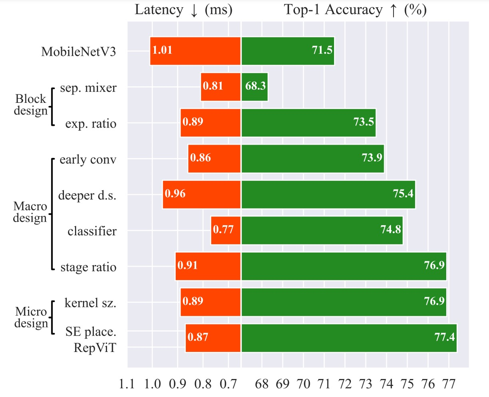
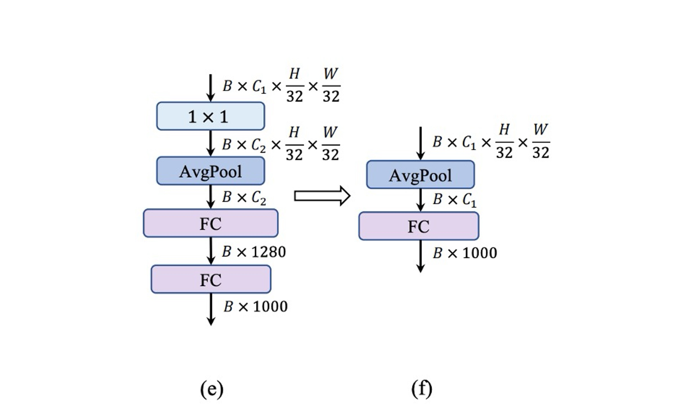
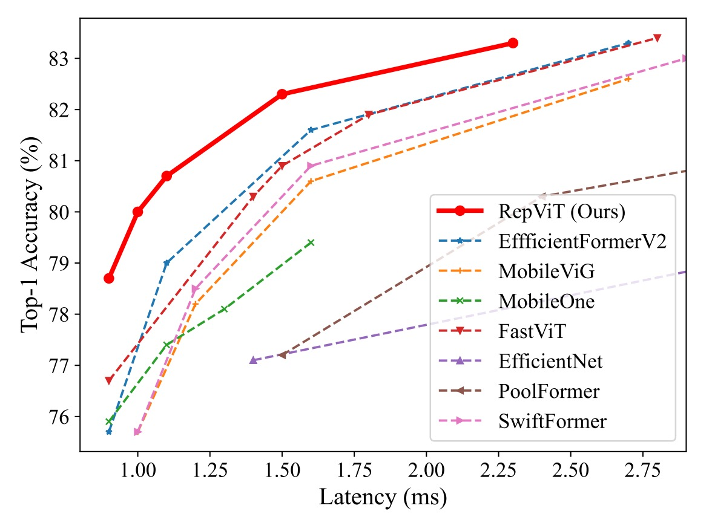
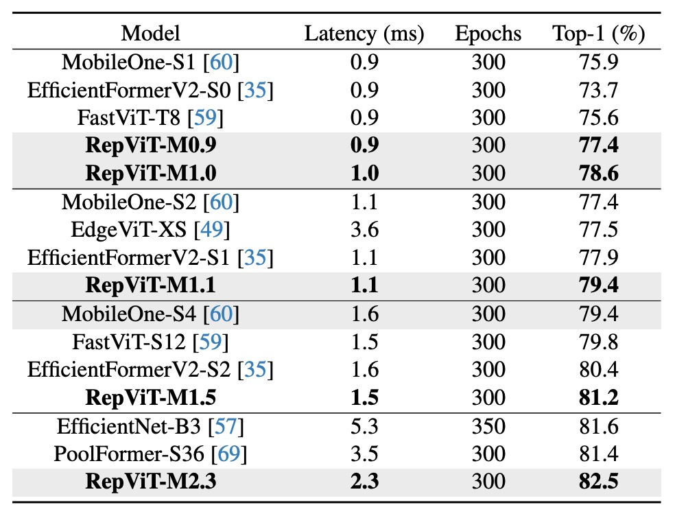

## ViT の視点から

[**RepViT: Revisiting Mobile CNN From ViT Perspective**](https://arxiv.org/abs/2307.09283)

---

再パラメータ化の研究は急速に進展しており、さまざまなモデルアーキテクチャに広がりつつあります。

本論文の目的は、MobileNet-V3 を再パラメータ化することです。これまでのいくつかの研究と異なる点は、以下の通りです：

- 今回は ViT の視点からアプローチを始めます。

## 問題の定義

軽量視覚モデルの研究は主に 2 つの派閥に分かれています：

1. **CNN ベースの研究**：ここでは MobileNet シリーズが代表的な作品で、深層可分離畳み込みを使用してパラメータ数を減らし、逆残差瓶頸構造を利用してモデルの表現能力を増強しています。
2. **ViT ベースの研究**：ここでは MobileViT、Mobileformer、FastViT などが代表的な作品で、主に MetaFormer アーキテクチャを通じてモデルの表現能力を維持しています。

:::tip
MetaFormer を見たことがない方は、以下の参考文献を参照できます：

- [**[21.11] PoolFormer: 必要なのはフレームワークだ！**](../../vision-transformers/2111-poolformer/index.md)
- [**[22.10] CAFormer: MetaFormer 使用マニュアル**](../../vision-transformers/2210-caformer/index.md)
  :::

---

これら 2 つの派閥の間には、まるで越えられない溝があるように見えるのでしょうか？

本論文の目標は、その溝を越え、MobileNet-V3 を再設計し、ViT の視点から再考することです。

## 問題の解決

### アーキテクチャの再設計

まず、すべてのパラメータ数と FLOPs の制限を取り払い、ここでの主な目標は**レイテンシ**です！

速く、もっと速く、非常に速く！

---

すべては MobileNet-V3 から始まります。最近の軽量 ViT を参考にしており、それらはほとんど DeiT のトレーニング方法を採用しています。

ここで採用されたトレーニング方法は次の通りです：

- AdamW オプティマイザーを使用
- コサイン学習率減衰を使用し、300 エポックでトレーニング
- RegNetY16GF ネットワークを使用して知識蒸留
- 画像強化方法として Mixup、RandAugment、Random Erasing を使用

したがって、すべてのモデルはこのトレーニング方法を使用しており、標準が統一されています。

:::tip
DeiT を見たことがない方は、次の参考文献を参照してください：

- [**[20.12] DeiT: 蒸留後さらに美味しく**](../../vision-transformers/2012-deit/index.md)
  :::

### 再パラメータ化構造

次に MobileNet-V3 の構造を調整します。

MetaFormer では、Transformer が成功した理由は情報交換を 2 つの部分に分けたからだと考えられます：

1. トークン間の情報交換、画像内ではこれが画像の全体的な情報交換に相当します。
2. 特徴間の情報交換、画像内ではこれが画像のチャネル情報交換に相当します。

しかし、MobileNet の構造ではこれら 2 つが結合されています。上図の左側のように：

- 最初に$1 \times 1$の畳み込みを使用、これは「チャネル」情報交換
- 次に$3 \times 3$の深層畳み込みを使用、これは「全体」情報交換
- その後$SE$層を通過、ここでは「全体とチャネル」情報交換
- 最後に$1 \times 1$の畳み込みを使用、これは「チャネル」情報交換

したがって、著者はこれらを分離し、上図右側のように変更しました：

- 最初に「全体」情報交換を行い、$3 \times 3$の深層畳み込みを使用します。また、推論速度を向上させるために、ここでは再パラメータ化構造を使用しています。
- 次に$SE$層を使用し、「全体とチャネル」情報交換を行います
- 最後に$1 \times 1$の畳み込みを使用し、「チャネル」情報交換を行います

このようにして、情報交換の「全体」と「チャネル」を分け、推論速度が 20％向上しました。

---

速度は速くなったが、精度は落ちました。

次に、その改善策を考えます。

### 膨張比率を減少させ、幅を増加

通常の ViT では、チャネルミキサーの膨張比率は通常 4 に設定されており、これにより前処理ネットワーク（FFN）モジュールの隠れた次元は入力次元の 4 倍になります。MobileNet-V3 では 6 倍にも達しています。そのため、計算資源を大きく消費し、全体的な推論時間を大幅に増加させます。

過去の研究でも、FFN 内に大量の冗長な情報が存在し、実際にはこれほど高い膨張比率は必要ないことが指摘されています。

- [**[21.04] LeViT: a Vision Transformer in ConvNet's Clothing for Faster Inference**](https://arxiv.org/abs/2104.01136)
- [**[21.04] All Tokens Matter: Token Labeling for Training Better Vision Transformers**](https://arxiv.org/abs/2104.10858)
- [**[22.12] SAViT: Structure-Aware Vision Transformer Pruning via Collaborative Optimization**](https://proceedings.neurips.cc/paper_files/paper/2022/hash/3b11c5cc84b6da2838db348b37dbd1a2-Abstract-Conference.html)
- [**[23.10] NViT: Vision Transformer Compression and Parameter Redistribution**](https://openreview.net/forum?id=LzBBxCg-xpa)

著者はここで膨張比率を 2 倍に設定し、モデルの幅を増やして表現能力を保つことに決定しました。

---

この操作を行った後、精度は元に戻り、元の MobileNet-V3 を超えて 73.5％に達しました。

### Stem 構造の調整

ViT では通常、入力画像を重ならないパッチに分割する patchify 操作を使用し、これらの簡単な Stem 構造は通常$16 \times 16$の大きなカーネルの畳み込みです。層別 ViT では同じ patchify 操作を使用しますが、$4 \times 4$の畳み込みを使用します。

それに対して、MobileNet-V3 の Stem 構造は非常に複雑で、$3 \times 3$の畳み込み、深層可分離畳み込み、逆残差瓶頸構造が含まれています。上図（a）のように。

Stem 構造は最も高い解像度で入力画像を処理するため、複雑な構造はモバイルデバイス上で深刻な速度のボトルネックとなります。MobileNet-V3 の Stem 構造は非常に少ないフィルター（わずか 16 チャンネル）を使用しているため、Stem 構造の表現能力も制限されています。

この問題を解決するために、著者は早期の畳み込み方法を採用し、2 つの$3 \times 3$畳み込みを使用し、stride を 2 に設定して計算量を削減します。同時に、フィルターのチャンネル数を増やしてモデルの表現能力を向上させます。上図（b）のように。

### ダウンサンプリング構造の調整

MobileNet-V3 では、stride2 の深層可分離畳み込みを 1 回使用してダウンサンプリングを行っています。この設計は速度の利点がありますが、十分なネットワークの深さが欠けているため、情報が失われ、モデルのパフォーマンスに悪影響を与える可能性があります。上図（c）のように。

この問題を解決するために、著者はより複雑なダウンサンプリング構造を採用しました。上図（d）のように。この構造は、stride2 の深層可分離畳み込みを使用してダウンサンプリングを実行し、チャネル次元を調整します。その後、RepViT モジュールを追加し、最後に FFN モジュールを$1 \times 1$畳み込みの後に配置し、より多くの潜在情報を保持します。

### シンプルな分類器

軽量 ViT では、分類器は通常、グローバル平均プーリングと 1 つの線形層で構成されており、この構造はモバイルデバイスで高速です。

それに対して、MobileNet-V3 の分類器は$1 \times 1$の畳み込みと追加の線形層を含んでおり、特徴をより高次元の空間に展開しています。上図（e）のように。この設計は MobileNet-V3 にとって重要ですが、モバイルデバイス上では推論時間を増加させます。

著者はここで MobileNet-V3 の設計を放棄し、代わりにシンプルなグローバル平均プーリングと 1 つの線形層で構成される最終的なアーキテクチャを採用しました。

---

この設計で速度は 0.77ms に戻り、精度もまた低下しました！

### 階段比率調整

過去の研究では、1:1:3:1 の比率が採用されており、この設計はモデルの表現力と速度のバランスを取ることができました。

- [**[19.05] On network design spaces for visual recognition**](https://arxiv.org/abs/1905.13214)
- [**[20.03] Designing network design spaces**](https://arxiv.org/abs/2003.13678)

近年の研究では、小型モデルにはより積極的な比率が有利であることが指摘されています。例えば、Conv2Former-T と Conv2Former-S はそれぞれ 1:1:4:1 と 1:1:8:1 の比率を採用しています。

- [**[22.11] Conv2Former: A Simple Transformer-Style ConvNet for Visual Recognition**](https://arxiv.org/abs/2211.11943)

著者はここで 1:1:7:1 の比率を採用し、深さを 2:2:14:2 に増加させ、より深いネットワークレイアウトを実現しました。

この操作により失われた精度が回復し、76.9% に達しました。

### カーネルサイズの選択

過去の研究では、小型ネットワークにおいて大きなカーネル（例えば $5x5$ や $7x7$）を使用することで、モデルの表現力を効果的に向上させることができました。

しかし、モバイルデバイスでは、大きなカーネルの畳み込みは加速の恩恵を受けることができず、一般的なハードウェアは大きなカーネルの畳み込みに最適化されていません。

モバイルデバイスでの推論効率を確保するために、著者はすべてのモジュールで優先的に $3x3$ の畳み込みを使用しました。

この操作は精度を損なうことなく、推論時間を 0.89 ms に短縮しました。

### Squeeze-and-Excitation の選択

過去の研究では、SE モジュールは様々なネットワークアーキテクチャに広く適用され、モデルの表現力を効果的に向上させることができます。

- **しかし、SE モジュールは非常に遅い！**

SE モジュールの利点を享受したいが、速度に影響を与えたくない場合、著者は妥協案を採用しました：

- **SE モジュールを「少しだけ」使用し、各段階の第 1、3、5... のブロックにのみ適用する。**

## 討論

### ImageNet-1K 上の性能

実験では、標準の 224×224 ピクセルの画像サイズを使用して訓練とテストを行い、異なるトレーニングエポック数（300 または 450 エポック）でモデルのパフォーマンスをテストしました。

ここでの主要な実験結果は以下の通りです：

1. **モデル性能の比較**：

   - RepViT モデルは、さまざまなサイズで優れたパフォーマンスを示し、最先端の他のモデルと比較して明らかな優位性を持っています。例えば、同じ遅延条件下で、RepViT-M0.9 は EfficientFormerV2-S0 および FastViT-T8 よりそれぞれ 3.0% および 2.0% 高い top-1 精度を達成しています。さらに、RepViT-M1.1 は EfficientFormerV2-S1 より 1.7% 高い結果を示しました。

2. **遅延と精度**：

   - RepViT-M1.0 は、iPhone 12 上で 1.0 ミリ秒の遅延で 80% 以上の top-1 精度を達成しており、これは軽量モデルの革新的な突破口です。
   - 最大のモデルである RepViT-M2.3 は、わずか 2.3 ミリ秒の遅延で 83.7% の精度を達成し、優れた性能と効率的な遅延制御を示しました。

3. **知識蒸留の影響**：

   知識蒸留を使用しない場合でも（下表参照）、RepViT モデルは異なる遅延レベルで顕著な性能向上を示しました。例えば、1.0 ミリ秒の遅延で、RepViT-M1.0 の精度は MobileOne-S1 より 2.7% 高い結果を示しました。より大きなモデルでは、RepViT-M2.3 が PoolFormer-S36 より 1.1% 高い精度を達成し、遅延は 34.3% 短縮されました（3.5 ミリ秒から 2.3 ミリ秒へ）。

   

### 消融実験 - 再パラメータ化された構造

RepViT のブロック内で再パラメータ化された構造の有効性を検証するため、著者は SR の多分岐トポロジーを削除して ImageNet-1K に対する消融研究を行いました。

上表に示すように、再パラメータ化された構造がない場合、RepViT の異なる変種は一貫して性能が低下しました。

### 消融実験 - SE 層の影響

すべての段階でブロック間で SE 層を活用する利点を検証するため、著者はすべての SE 層を削除（「w/o SE」）し、各ブロックで SE 層を適用する（「各ブロック」）という実験を行いました。

上表に示すように、ブロック間で SE 層を交互に適用すると、精度と遅延の間でより有利なトレードオフが示されました。

## 結論

このアーキテクチャは、iPhone 12 上で 1ms 以下の推論速度で、ImageNet 1K 上で 80% 以上の精度を達成した最初のアーキテクチャであり、非常に注目すべきものです。

本記事では、著者たちは軽量 CNN の効率的な設計を深く掘り下げ、軽量 ViT の革新的なアーキテクチャを組み合わせ、新しい RepViT シリーズを発表しました。

リソースが限られたモバイルデバイス向けに設計されたこの軽量 CNN モデルは、さまざまな視覚タスクで優れた性能を示しています。RepViT は、精度の面で現在の最先端の軽量 ViT および CNN を超えただけでなく、遅延の面でも優れたパフォーマンスを発揮しています。

著者たちは、RepViT が軽量モデル設計の堅実な基準となり、軽量モデルの研究と革新を促進し、この分野のさらなる発展を推進することを期待しています。

:::tip
RepViT の使用で躊躇する理由は、パラメータ数が多いことですが、実際には現在のモバイルデバイスの容量は非常に充実しています。にもかかわらず、多くの顧客がモデルのサイズに非常に敏感であるため、これがこのアーキテクチャを安易に使用できない理由です。

そのため、開発シーンでモデルのサイズに制限がない場合、精度と推論時間だけを重視するなら、RepViT は非常に優れた選択肢となるでしょう。
:::
