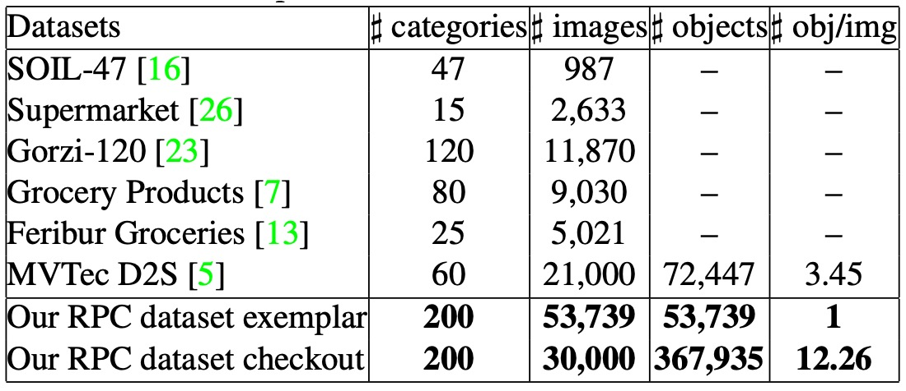
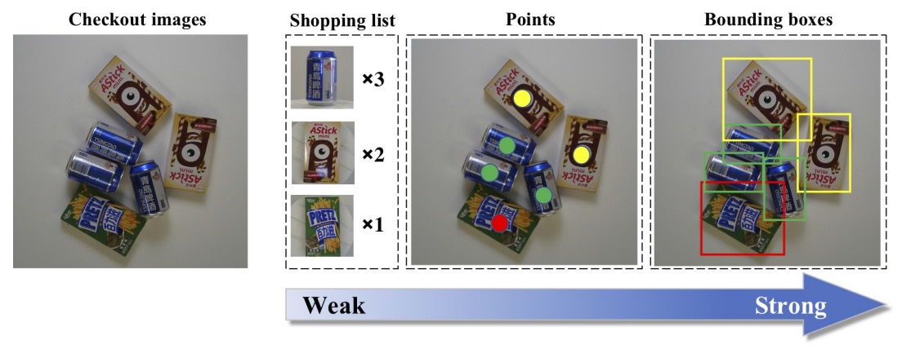
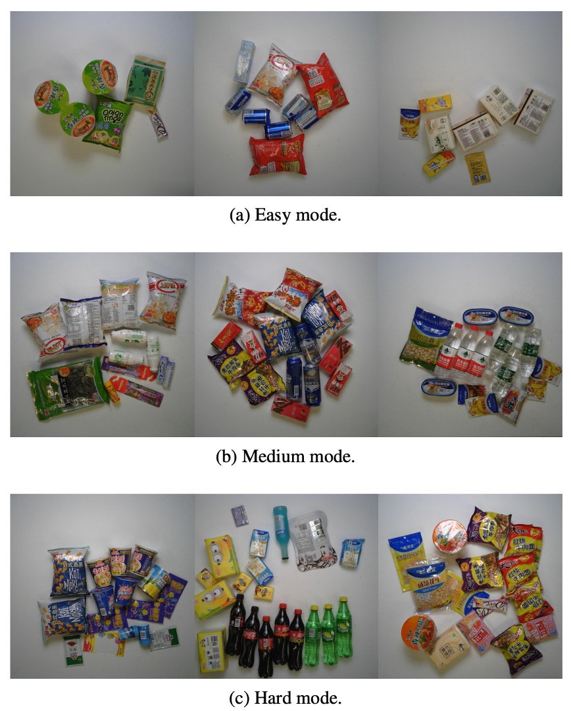

## お会計、お願いします！

[**RPC: A Large-Scale Retail Product Checkout Dataset**](https://arxiv.org/abs/1901.07249)

---

本論文は、RPC（Retail Product Checkout）と呼ばれる新しいデータセットを作成した。

多くの関連論文でこのデータセットが利用されているだけでなく、この論文を起点に文献を探すことで、最新の研究成果をより速く見つけられる。

これほど重要な節目は、見逃せないだろう。

:::info
**データセットダウンロード**：[**https://rpc-dataset.github.io/**](https://rpc-dataset.github.io/)

**ランキング**：[**RPC-Leaderboard**](https://github.com/RPC-Dataset/RPC-Leaderboard?tab=readme-ov-file)
:::

## 問題の定義

従来の小売業では、「商品の認識」に多大な人件費がかかっている。コンピュータビジョン技術の進展に伴い、自動会計（Automatic Check-Out, ACO）という応用が注目されている。その目的は、**顧客が購入した商品の画像から自動的に対応する買い物リストを生成し、手動スキャンを置き換え、効率化とコスト削減を実現すること**である。

しかしこれは単なる分類や検出タスクではなく、ACO には以下のような複数の課題が同時に存在する：

- **大規模（large-scale）**：商品カテゴリ数が膨大で、スーパーマーケットにある SKU は数千種を超えることもある；
- **細粒度（fine-grained）**：多くの商品は外観が非常に似ており、違いは小さなラベルや包装の細部にある場合が多い；
- **少数サンプル（few-shot）**：ほとんどの商品は極めて少ない訓練サンプルしか収集できない；
- **ドメインギャップ（cross-domain）**：訓練データは展示用の綺麗な単品画像であるのに対し、テストは実際の会計シーンで撮影されたもので、背景が雑多、商品が積み重なり、光量が不安定で遮蔽も激しく、明らかなドメインギャップが存在する。

これらの要素はコンピュータビジョンにおいてそれぞれ大きな難題であり、ACO の挑戦は：**これらが同時に存在する点にある！**

これまでにもいくつかのデータセットが部分的な問題に取り組んでいる：

- **SOIL-47**：照明や視点変化の影響をテスト；
- **Supermarket Produce Dataset**：果物や野菜の分類に注力；
- **Grozi-120 / Grocery Products / Freiburg Dataset**：ネット画像と店舗実景画像を収録；
- **MVTec D2S**：ピクセルレベルのセグメンテーションアノテーションを提供し、工業製品のセマンティックセグメンテーションに利用。

しかしこれらは通常カテゴリ数が限られたり、撮影環境が簡略化されすぎており、実際の会計プロセスからは遠い。単一タスクの解決に留まり、「積み重ね、多種類、遮蔽」など現実的な困難を同時に試せない。

データ量不足も学習モデルを難しくしている。従来のデータ拡張（反転、平行移動、色彩ノイズなど）は分布を多少広げるが、テスト環境のノイズやセマンティックな組み合わせを真に模倣できない。

ゆえに根本的な問いは：

> **上述のすべての課題を同時にカバーできる、十分に大規模かつ多様なデータセットを作成できるか？**

---

## データセット設計理念

<figure style={{"width": "70%"}}>

</figure>

実際の小売シーンにおいて、顧客が商品を会計台に置く際、ACO システムの理想的目標は：

> **一目で商品の種類と数量を認識し、自動的に買い物リストを作成すること**。

これを「分類」や「検出」と呼ぶよりは、むしろ「**多物体のカウントと認識の複合タスク**」に近い。

定義としては、ACO の入力は会計シーンで撮影された画像であり、任意の数量・組み合わせの商品が含まれる。一方、我々が持つ訓練データは多くの場合単品画像のみである。

:::tip
**単品画像とは？**

単品画像（原語：**single-product exemplar image**）とは、単一の商品を専用に撮影した画像のことである。これらの画像は主に EC プラットフォームや商品カタログで使用され、商品の外観や細部を明確に示すことを目的としている。
:::

真の難しさは、商品在庫リストが常に更新され、多様な組み合わせの会計画像を収集するのはほぼ不可能な点にある。したがってより現実的な方法は、これら単品データで学習し、**未経験の積み重ね状態でも、モデルに混雑した中で多物体、多種類、多数量を認識させること**である。

問題は形式的には以下のように表せる：

- 商品カテゴリ集合 $P = {p_i}$ と、テスト画像 $I_t$ が与えられる。
- 目標は、画像に現れたすべての商品 $p$ の出現回数 $\text{count}(p)$ を予測すること。
- 出現しない商品は $\text{count}(p) = 0$。

利用可能な訓練リソースは：

- 単品画像データセット $S = {(I_s, y_s)}$、各画像に対応する商品カテゴリがある；
- オプションの会計画像データセット $C = {(I_c, Y_c)}$、$Y_c$ は様々なレベルのアノテーション情報を含む可能性がある。

この設定は非常に挑戦的であり、「分類、カウント、検出、弱教師あり学習、ドメインシフト」などのタスクが交差する場として興味深い。

---

## データセット設計

上述の課題に対応して、著者は RPC（Retail Product Checkout）データセットを設計した。６つの重要な特徴がある：

1. **大規模な商品カテゴリとサンプル数**

   - 合計 **200 種の SKU** を収録し、各カテゴリ約 4 つの実物商品を含み、総数 **83,739 枚の画像** を取得。
   - そのうち 53,739 枚は単品エグザンプラー画像、30,000 枚は会計画像で、既存の公開データセットより規模が大きい。

        

        <figure style={{"width": "70%"}}>
        
        </figure>
        

        

        <figure style={{"width": "70%"}}>
        
        </figure>
        

2. **２種類の画像：単品画像と積み重ね画像**

   - 単品エグザンプラー画像：多視点から撮影された商品クリア画像で、EC サイトの商品画像を模倣；
   - 会計画像：会計台を模した環境で撮影、多数の商品を含み、視点は固定、積み重ねや実際の遮蔽を含む。

3. **リアルなシーン再現**

   - 会計画像中の商品はランダム選択・数量・配置；
   - 多数の遮蔽、回転、多物体重複を含み、実際の小売プロセスの複雑さを模擬。

4. **階層的商品カテゴリ構造**

   - 全商品は **17 の上位カテゴリ（メタカテゴリ）** に分類される（例：ボトル型、箱型、袋型など）。
   - モデルがカテゴリ間のセマンティック構造を学習しやすくし、補助的な教師信号や階層分類研究に役立つ。

5. **雑多度のアノテーション**

    

    <figure style={{"width": "60%"}}>
    
    </figure>
    

   - 会計画像中の商品の種類と数量に基づき、３段階の雑多度レベルに分類。モデルの複雑度に応じた性能の安定性分析に寄与。

6. **３段階の教師強度**

    

    <figure style={{"width": "90%"}}>
    
    </figure>
    

   - **弱教師あり**：買い物リスト（商品種類と数量のみ提供）；
   - **中間教師あり**：ポイントアノテーション（各商品の中心点とカテゴリをマーク）；
   - **強教師あり**：バウンディングボックス（各商品の位置とカテゴリを完全アノテーション）。

これらの設計により、RPC は非常に拡張性の高いベンチマークとなり、モデルの認識・カウント能力の評価にとどまらず、弱教師検出、ドメイン適応、多尺度分類など多様な研究方向へ展開可能である。

## データ構築の流れ

本データセットは合計 **200 種類の小売商品カテゴリ（SKU）** を収録し、外観や機能に基づき **17 の上位カテゴリ（meta-categories）** に分類される。食品から生活用品まで多様な形態をカバー：

> puffed food、dried fruit、dried food、instant drink、instant noodles、dessert、drink、alcohol、milk、canned food、chocolate、gum、candy、seasoner、personal hygiene、tissue、stationery。

これらのカテゴリは、瓶状、箱状、缶状、袋状など多様な外観構造を含む。

同一のメタカテゴリ内の SKU は通常外観が非常に類似しており、例えば「果汁」の場合、一文字の違いやラベルの色のみの差異もある。これは ACO タスクにおける最も難しい「細粒度認識」課題の一つである。

---

### 単品 exemplar 画像

<figure style={{"width": "90%"}}>

</figure>

各商品の多視点外観情報を取得するため、著者は自動撮影フローを設計：

- **4 台の固定視点カメラ** を使用し、上方視点（top view）、水平視点（side view）、30° および 45° 斜視点に対応；
- 商品は 360 度回転可能な **回転テーブル** に置き、9 度ごとに撮影、計 40 枚取得；
- 各カメラで 40 枚ずつ撮影 → 各 SKU あたり合計 **160 枚の視点画像** を生成；
- 商品の上下外観が異なる場合（箱型や袋型など）は、裏返して再撮影し底部特徴も補完。

最終的にこの段階で **53,739 枚の exemplar 画像** を撮影。すべて**背景が綺麗で多視点かつ単一商品**の画像であり、訓練時の source domain 画像に該当する。

<figure style={{"width": "70%"}}>

</figure>

---

### 会計画像の構築フロー

<figure style={{"width": "80%"}}>

</figure>

exemplar 画像とは異なり、会計画像は実際の会計状況を模擬するため、意図的に混乱や遮蔽を導入：

- 撮影背景は **80cm × 80cm の白板**、カメラは真上から撮影し、解像度は 1800×1800；
- 各画像内の商品種類と数量はランダムに組み合わせるが、あらかじめ定められた「雑多レベル」に基づく制御あり；
- 商品はランダムに配置され、角度も自由で、人手による整列は行わず、複数商品が積み重なった実情を再現。

遮蔽や密度の程度により、会計画像は以下の 3 段階の雑多レベルに分類される：

| 雑多レベル | 商品種類数            | 商品実例総数 | 特徴                         |
| ---------- | --------------------- | ------------ | ---------------------------- |
| Easy       | 少数（例：3–5 種）    | 総数低       | ほぼ遮蔽なし、間隔広め       |
| Medium     | 中程度（例：6–10 種） | 総数中       | 遮蔽あり、一定の密度         |
| Hard       | 多数（10 種超）       | 総数高       | 高度積み重ね＆遮蔽で識別困難 |

各雑多レベルはそれぞれ 10,000 枚の画像を収録し、合計 **30,000 枚の会計画像** となる。

## 評価指標

自動会計タスクの目的は：**1 枚の画像内にあるすべての商品種類と数量を正確に予測すること**。

これを定量化するため、RPC データセットは ACO 専用の評価指標群を提示し、単画像の正確性、数量誤差、カテゴリ階層での性能、意味的一致度を考慮している。

以下は主要な 4 つのコア指標。

### Checkout Accuracy（cAcc）

cAcc は全体の正確率を示す。

ACO システムの最終目標は**1 枚の画像内の買い物リストを完全に正しく予測すること**であるため、最も重要な指標は：

> **モデルの予測したすべての商品種類と数量が GT と完全一致した場合にのみ、その画像を「正解」と判定する。**

数式は以下：

$$
cAcc = \frac{1}{N} \sum_{i=1}^{N} \delta \left( \sum_{k=1}^{K} |P_{i,k} - GT_{i,k}|, 0 \right)
$$

- $P_{i,k}$：画像$i$のカテゴリ$k$に対するモデル予測数量；
- $GT_{i,k}$：実際の数量；
- $\delta(\cdot)$：予測が完全一致（全カテゴリ誤差ゼロ）なら 1、そうでなければ 0。

非常に厳格な指標であり、一つでも誤りがあれば不合格となる。

### Average Counting Distance（ACD）

ACD は平均数量誤差を表す。

「完全一致」を求めず、平均的な誤差回数を評価したい場合は ACD を用いる：

> **各画像でモデルが全カテゴリに対し犯した総合的誤差（L1 距離）を測る。**

数式：

$$
ACD = \frac{1}{N} \sum_{i=1}^{N} \sum_{k=1}^{K} |P_{i,k} - GT_{i,k}|
$$

この指標は数量予測の精度比較に適し、分類精度は問わず「いくつ間違えたか」を重視する。

---

### Mean Category Counting Distance（mCCD）

mCCD はカテゴリごとの誤差比率平均を示し、商品カテゴリごとの認識難易度に注目：

> **各カテゴリにおける予測誤差と実際数量の比率を算出し、全カテゴリで平均する。**

数式：

$$
mCCD = \frac{1}{K} \sum_{k=1}^{K} \frac{ \sum_{i=1}^{N} |P_{i,k} - GT_{i,k}| }{ \sum_{i=1}^{N} GT_{i,k} }
$$

この指標は特に細粒度商品など、モデルがあるカテゴリで過大評価・過小評価しやすいかを示し、カテゴリ不均衡やロングテールの予測安定性評価に有効。

---

### Mean Category IoU（mCIoU）

mCIoU は買い物リストの類似度を表す。

最後に著者は IoU（Intersection over Union）に似た指標を定義し、予測と実際の買い物リストの意味的近さを評価：

$$
mCIoU = \frac{1}{K} \sum_{k=1}^{K} \frac{ \sum_{i=1}^{N} \min(P_{i,k}, GT_{i,k}) }{ \sum_{i=1}^{N} \max(P_{i,k}, GT_{i,k}) }
$$

- 商品カテゴリの予測数と実際数が近いほど分子と分母の比率が高い；
- 予測または実際が 0 の場合、IoU は 0 に近づく。

mCIoU は**意味指向で多少の誤差を許容する指標**であり、「完全でなくとも主要部分を正しく捉えているか」の分析に適している。

## ベンチマーク実験

自動会計問題はドメインシフト、少数ショット、細粒度認識という複合的課題を含み、統一的な解法はまだ確立されていない。

RPC データセット上のベンチマークを構築するため、著者は ACO 問題を**クロスドメイン検出タスク**と見なし、4 種類の段階的ベースライン手法を提案した。いずれも exemplar 単品画像のみで訓練し、会計画像のアノテーションは利用しない。

---

### Single

exemplar のみで FPN を直接訓練する手法。

最も直感的な方法で、単品 exemplar 画像を教師データとして物体検出モデル（Feature Pyramid Network）を学習する。

だが exemplar は単一物体・無遮蔽のクリーン画像であり、テスト画像は多物体・積み重ね・遮蔽・複雑な光影のドメイン差が大きいため、ほぼ全く一般化できず、easy モードでも非常に低性能で最も弱いベースラインとなった。

---

### Syn

exemplar 商品画像を切り抜き貼り付け、合成会計画像を作成して訓練。

ドメインギャップを埋めるため、商品マスクを取得（顕著領域分割＋ CRF 後処理）し、複数商品をランダムに背景上に貼り付け、異なる clutter レベルに応じた 10 万枚の合成会計画像を生成。

これにより訓練データがテストシーンに近づき、特に easy clutter で cAcc が約 18%向上したが、medium・hard では依然として性能は限られ、合成画像だけではスタイルやノイズのドメインギャップを完全には埋められていない。

---

### Render

<figure style={{"width": "50%"}}>

</figure>

Cycle-GAN によるドメインスタイル変換を適用。

左が単純合成画像、右が Cycle-GAN 変換後のより自然で実際の会計画像に近い見た目。手順は：

- 合成画像を Cycle-GAN で翻訳し、スタイルを実際の会計画像に近づける；
- 変換後画像で FPN 検出器を訓練。

この**ドメイン変換**により汎化性能が大幅向上し、全 clutter レベルで安定した改善を示し、視覚スタイル差を埋める有効性を示した。

---

### Syn+Render

データ多様性を上げるため、render 後データと元の synthetic 画像を混合して訓練。

この混合により単独の Syn や Render よりさらに良好な性能を得られ、スタイルの一貫性（render）とサンプル多様性（syn）が互いに補完し合い、より堅牢な判別境界を学習可能と示唆。

---

### 詳細評価表

<figure style={{"width": "90%"}}>

</figure>

評価指標：

- ACO タスク指標（cAcc、ACD、mCCD、mCIoU）
- 一般的検出指標（mAP\@50、mmAP）

訓練設定：

- 入力画像は最短辺 800px にリサイズ
- 同期 SGD、2 画像/カード ×2GPU
- 最大 512RoI サンプリング
- 学習率初期 0.02、60K イテレーション後 0.002 に減衰
- 各 clutter レベルで 2000 枚を検証、8000 枚をテストセットに使用

結果：

最良の Syn+Render でも medium・hard モードで実用水準に届かず、ACO の難しさはドメインシフトだけでなく積み重ね遮蔽、細粒度認識、長尾分布によるところも大きい。

mAP は hard モードで 72.72% mmAP を達成するものの、cAcc 観点では依然不足で、**画像全体の正確な買い物リスト予測は極めて厳しい課題**。

失敗例分析では、

1. 検出漏れ
2. 密集配置による遮蔽
3. 細粒度商品の誤認識
4. 誤検出（false positives）

が主因であると指摘。

これらは今後の研究方向性として、

**弱教師あり、多視点融合、意味的整合、サンプル多様化**の重要性を示している。

:::tip
本論文では FPN を使用しているが、ResNet-50 か ResNet-101 かの明記はない。

別の DPNet 論文では比較実験に ResNet-101 を用いているため、ここでは ResNet-101 と仮定する。

参考文献：[**[19.04] Data Priming Network for Automatic Check-Out**](https://arxiv.org/abs/1904.04978)
:::

## 今後の研究方向

RPC ベースラインは cross-domain 検出視点で構築されたが、ACO 問題は単一解法に留まらず多様かつ開かれた課題である。RPC データセットの柔軟な構造とアノテーションは以下の潜在的研究を刺激する：

- **オンライン学習と動的拡張**
  実運用では商品リストが絶えず更新され、新商品追加に即応可能な**増分学習能力**が必須。全モデル再訓練なしで新規商品を迅速認識に組み込む問題は典型的な online learning 課題。ACO のドメインシフト・細粒度特性は更なる難易度を加え、新構造・戦略が求められる。

- **検出を介さないリスト予測モデル**
  バウンディングボックスや検出工程を経ず、会計画像から直接買い物リストを予測する多クラス多インスタンスの**物体カウントタスク**への問題転換。
  だが ACO は数百種の物体、極少ショット、高度に類似した外観を扱うため、従来のカウント問題とは異なる新形式のクロスクラスカウント課題である。

- **混合監督学習フレームワーク**
  RPC は list-level, point-level, bbox-level の 3 種の監督強度アノテーションを提供。これら異種アノテーションを効果的に融合し、適応性かつ抽象度の高い混合監督学習フレームワークの設計は未解決かつ高コストな実データ収集において重要。

- **他のコンピュータビジョンタスクへの応用シーン**
  RPC は自動会計向けながら、画像とアノテーション構造は下記研究にも活用可能：

  - 物体検索（object retrieval）
  - 少数ショット学習（few-shot detection）
  - 弱教師あり学習（weakly-supervised detection）
  - 完全教師あり検出（fully-supervised detection）
    特に会計画像の完全 bbox ＋ SKU ラベルは検出モデルの訓練・評価に有用で、汎用物体検出タスクの補完データセットとなる。

## 結論

本論文は 2019 年発表、我々が振り返る 2025 年時点では、

大規模視覚言語モデルが急速に発展し、画像中商品の認識・推論能力は初期的成果を示し、自動会計への応用探索も盛んとなった。

しかし現時点で実用的進展は見られず、その原因は ACO 問題に潜む細粒度認識、遮蔽処理、ドメイン安定性の課題が未解決であるためと考えられる。

これにより RPC データセットの価値は過去のマイルストーンであるだけでなく、未来の研究基盤でもあることが明示された。今後より多くの研究者がこの基盤上で革新的解法を示し、自動会計技術の実用化推進に貢献することが期待される。
