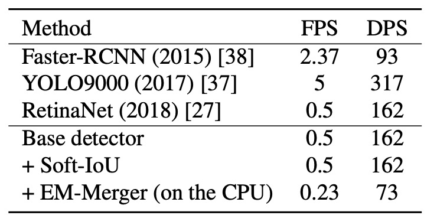
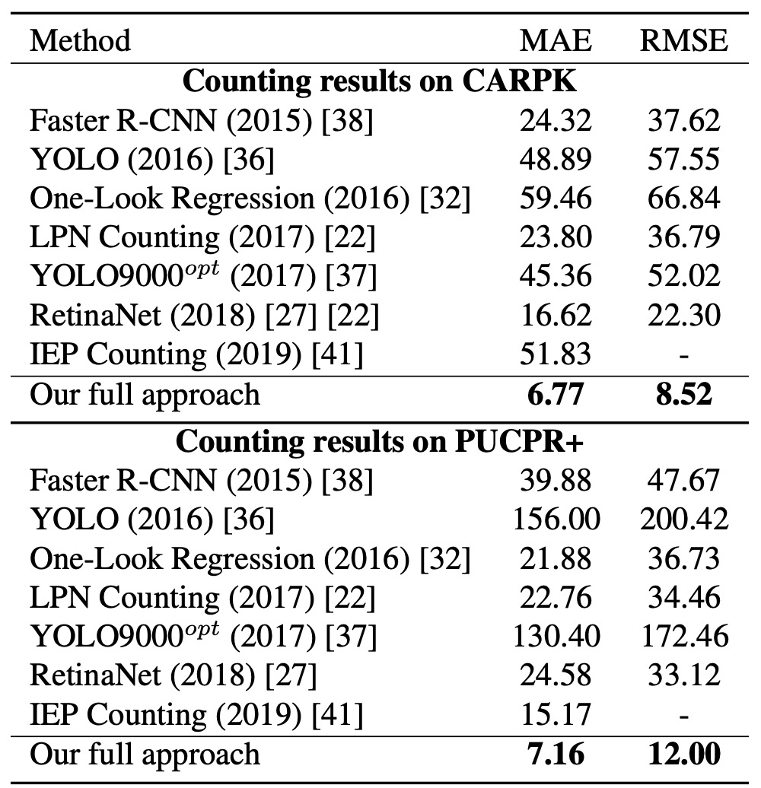

## 混雑した棚

[**Precise Detection in Densely Packed Scenes**](https://arxiv.org/pdf/1904.00853)

---

本論文は比較的初期の研究ですが、この論文が残したベンチマークは現在でも最もよく使われる小売商品検出データセットの一つです。

## 問題の定義

現在の物体検出技術は自然なシーンにおいて非常に高い精度と速度を示していますが、密集して配置され、物体同士が類似かつ隣接している状況では、主流の手法は力不足に陥ります。

このような「高密度シーン」は実際には非常に一般的で、例えば小売店舗の棚陳列、都市の交通監視映像、屋内倉庫や積み重ね環境などが該当します。

これらのシーンは通常、以下の顕著な特徴を持ちます：

1. **物体数が非常に多く、密に配置されており、互いに遮蔽し合うこともある。**
2. **外観が非常に類似しており、境界を区別するのが困難である。**

従来の物体検出手法（Faster R-CNN、YOLO、RetinaNet など）は自然なシーンで優れた性能を示しますが、多くは後処理段階で重複する検出ボックスを排除するための **NMS（Non-Maximum Suppression）** に依存しています。このハードな抑制手法は密集シーンにおいて明らかなボトルネックとなります。例えば、同一実体の物体が複数の小さなボックスに分割されたり、逆に隣接する複数物体が誤って単一物体と判定されることがあります。

過去には Mean-Shift、階層的クラスタリング、学習可能な NMS 層（GossipNet など）といった代替案も提案されていますが、多くは計算コストが高すぎるか、従来の NMS を真に置き換えるには至らず、特に高密度かつ外観が類似した物体環境での失敗例が多いです。

さらに、現在主流のデータセット（COCO、VOC、Open Images など）は主に自然シーンを収録しており、このような「密集・類似・重複」といった特殊なシーンに対する良好な基準を欠いています。人混みや車両の混雑を扱う CARPK や PUCPR+ といったデータセットでさえ、品目の密度や分類難度では実際の小売環境に及びません。

では、これらの「密集し、見た目が似て、多数存在する」シーンに対し、深層学習モデルはどのようにして各個体を正確に識別しつつ、高効率かつ安定した検出を実現できるのでしょうか？

**モデルに「自分の検出の精度を知ってもらう」方法はないでしょうか？**

本論文の著者はこう考えました。まずは Soft-IoU から始めようと。

## 解決方法

本論文の主な比較対象は RetinaNet であり、密集シーンでの性能はかなり良好ですが、改善の余地があります。著者は標準的な検出アーキテクチャに対して以下の二つの拡張を行いました：

1. **Soft-IoU 予測層の導入**：モデルに「このボックスと真実のボックスがどれだけ重なっているか」を知覚させる。
2. **EM-Merger 推論ユニットの提案**：複数の検出ボックスをガウス分布に変換し、確率的クラスタリングにより重複を解消する。

これらの設計が相乗効果を発揮し、密集シーンでより安定し重複しない検出結果を生み出します。

### 基本構造

著者は ResNet-50 をバックボーンに、3 層のアップサンプリングを持つ FPN を構築し、多尺度特徴マップを生成しています。

各 RPN は 3 つの全畳み込み出力ヘッドを備えています：

- **検出ヘッド**：バウンディングボックスの中心座標と幅・高さの回帰 $(x, y, h, w)$
- **分類ヘッド**：物体存在確信度 $c \in \[0, 1]$ の予測
- **Soft-IoU ヘッド**：そのボックスと実際の物体との重なり具合 $c_{\text{iou}}$ の予測

Soft-IoU の訓練時にノイズを減らすため、分類スコアが 0.1 未満の候補ボックスは除外されます。

### Soft-IoU

非密集シーンでは、オブジェクトネススコアと NMS の組み合わせで十分なことが多いですが、密集シーンでは複数の高信頼ボックスが異なる物体を指す場合もあり、単なる遮蔽による誤検出の可能性もあります。そこでより精密な「重複品質指標」が必要になります。

Soft-IoU はまさにこれを目的として設計され、各ボックスがグラウンドトゥルースボックスとどれだけ IoU を持つかを予測します。各検出ボックス $b_i$ に対し、最も近い注釈ボックス $\hat{b}_i$ を見つけ、

$$
\text{IoU}_i = \frac{\text{Intersection}(\hat{b}_i, b_i)}{\text{Union}(\hat{b}_i, b_i)}
$$

交差がない場合は 0 とします。

この値を教師信号として Soft-IoU 予測層を訓練し、損失関数はバイナリクロスエントロピーで定義されます：

$$
\mathcal{L}_{\text{sIoU}} = -\frac{1}{n} \sum_{i=1}^n \left[ \text{IoU}_i \log(c_{\text{iou},i}) + (1 - \text{IoU}_i) \log(1 - c_{\text{iou},i}) \right]
$$

総合損失は以下の三つの和：

$$
\mathcal{L} = \mathcal{L}_{\text{cls}} + \mathcal{L}_{\text{reg}} + \mathcal{L}_{\text{sIoU}}
$$

前者二つは一般的な分類・回帰損失です。

特徴的なのは **objectness** は「物体があるかどうか」を予測するのに対し、**Soft-IoU** は「このボックスがどれだけ正確か」を予測する点です。つまり、部分的に物体を覆うボックスでも高い objectness スコアを持つことがありますが、その Soft-IoU は低くなります。これにより両者が補完的な信号を提供します。

### EM-Merger

<figure style={{"width": "70%"}}>

</figure>

Soft-IoU により、各検出ボックスは 2 つの信頼度を持ちます：

- $c$：物体が存在する確信度
- $c_{\text{iou}}$：どれだけ正確か

しかしこれらのボックスは互いに重複し、クラスタを形成しています。

この重複する候補群からどうやって正確に各物体を見つけ出すか？

著者の解法は各検出ボックスを**2 次元ガウス分布**とみなすことです：

$$
f_i(p) = \mathcal{N}(p; \mu_i, \Sigma_i)
$$

ここで、

- 平均 $\mu_i = (x_i, y_i)$ はボックス中心座標
- 共分散行列 $\Sigma_i = \text{diag}\left[\left(\frac{h_i}{4}\right)^2, \left(\frac{w_i}{4}\right)^2\right]$ はボックスサイズを反映

これらのガウス分布は混合モデル（MoG）を形成し、

$$
f(p) = \sum_{i=1}^N \alpha_i f_i(p), \quad \alpha_i = \frac{c_{\text{iou},i}}{\sum_k c_{\text{iou},k}}
$$

各ピクセル位置 $p$ において Soft-IoU の重みで物体中心の可能性を評価します。

次に、この MoG を少数の高信頼ガウス $g_j$（$K \ll N$）に縮約し、真の物体検出結果とします。その際、以下の距離を最小化します：

$$
d(f, g) = \sum_{i=1}^N \alpha_i \min_{j=1,...,K} \text{KL}(f_i || g_j)
$$

KL はカルバック・ライブラー情報量です。

この最適化は Expectation-Maximization（EM）法で解きます：

- **E ステップ**：各検出ボックスを最も近いクラスタに割り当て（KL ダイバージェンス最小化）

  $$
  \pi(i) = \arg\min_j \text{KL}(f_i || g_j)
  $$

- **M ステップ**：各クラスタのパラメータを再推定

  $$
  \beta_j = \sum_{i \in \pi^{-1}(j)} \alpha_i
  $$

  $$
  \mu'_j = \frac{1}{\beta_j} \sum_{i \in \pi^{-1}(j)} \alpha_i \mu_i
  $$

  $$
  \Sigma'_j = \frac{1}{\beta_j} \sum_{i \in \pi^{-1}(j)} \alpha_i \left[\Sigma_i + (\mu_i - \mu'_j)(\mu_i - \mu'_j)^T\right]
  $$

この処理を収束まで繰り返します（通常 10 回以内）。

最後に各クラスタ中心に標準偏差 2 倍の楕円を描き、その内部に入る元の検出ボックス群を抽出し、その中の幅・高さの中央値を最終ボックスとします。

このようにしてシステムの推論処理は完結します：**Soft-IoU による品質予測 → MoG による空間確率表現 → EM クラスタリングで明瞭なボックス群生成 → 真の物体を誤って除外せず重複検出も回避。**

## SKU-110K データセットとベンチマーク構築

密集検出が突破口を欠いている一因は、このタスクに特化した高品質なデータセットが不足しているためである。

そこで、著者は新たに **SKU-110K** データセットを構築した。これは小売店舗の棚環境に特化し、設計動機からアノテーションの品質まで、密集シーンに必要な特性を考慮して計画されている。

データセットの画像は米国、欧州、東アジアなど数千の実店舗から収集され、数十名の撮影者が個人のスマートフォンで撮影し、画像が自然で意図的に配置されていない実際の陳列状況を表現している。

- 各元画像の解像度は最低 **5MP** で、後に **1MP JPEG** に圧縮されている；
- 撮影機器や角度に制限はなく、自然光、ぼかし、遮蔽など現実の妨害要因を保持；
- アノテーション作業は**熟練した専任者**が担当し、クラウドソーシングは用いず、精度と一貫性を高めている；
- すべての画像とアノテーションは人手による再検査を経て、明らかな誤アノテーションや誤検出を除外している。

### データセット統計と分割

SKU-110K は 3 つのサブセットを含み、同一店舗の棚画像が複数のサブセットにまたがらないように保証している：

| データセット | 画像数 | ボックス数 | 割合 |
| ------------ | -----: | ---------: | ---: |
| 訓練セット   |  8,233 |  1,210,431 |  70% |
| 検証セット   |    588 |     90,968 |   5% |
| テストセット |  2,941 |    432,312 |  25% |

MS COCO や OpenImages と比較して、1 枚あたりの物体数は 1〜3 桁増加しており、「真の高密度シーンの挑戦」となっている。

### 評価指標と基準

主要な評価基準は COCO の標準に従い、以下を含む：

- **AP@\[.50:.95]**：主要チャレンジ指標；
- **AP\@.75**：厳密な位置精度評価；
- **AR\@300**：最大 300 予測における平均リコール率；
- **PR\@0.5 (IoU=0.75)**：50%リコール時の精度ポイント。

加えて、「検出」と「カウント」タスク双方の性能を考慮し、以下の誤差指標を導入している：

- **MAE（平均絶対誤差）**

  $$
  \text{MAE} = \frac{1}{n} \sum_{i=1}^n |K_i' - t_i|
  $$

- **RMSE（平方平均二乗誤差）**

  $$
  \text{RMSE} = \sqrt{ \frac{1}{n} \sum_{i=1}^n (K_i' - t_i)^2 }
  $$

ここで $K_i'$ はモデルが予測した画像内の物体数、$t_i$ は実際のアノテーション値である。

本データセットは高密度・多カテゴリ・細かな差異・実世界の妨害を考慮して設計され、混雑シーンの厳密な評価が可能な数少ないベンチマークである。

## 議論

### 推論速度分析

<figure style={{"width": "60%"}}>

</figure>

モデルの展開可能性を検証するため、著者は同一ハードウェア（Intel i7-5930K + GTX Titan X）上で平均推論性能を測定した。指標は：

- **FPS（Frames per Second）**：1 秒あたり処理可能な画像数；
- **DPS（Detections per Second）**：1 秒あたり検出可能な物体数。

実験結果は以下の通り：

- **Base Detector（RetinaNet 同形）**：基準推論速度；
- **Soft-IoU Layer の追加**：純粋な畳み込み構造のため速度に影響なし；
- **EM-Merger**：CPU と GPU 間の頻繁なデータ転送により速度が著しく低下；

EM-Merger は現状速度が遅いものの、精度は大幅に向上しており、GPU 実装による速度改善の余地があることが示唆されている。

### 検出とカウント実験

著者は複数の比較および消融構成を設計している：

- **Monkey**：ランダムポイントを用いたシミュレーションによる下限基準；
- **Base & NMS**：基本構造＋従来の NMS；
- **Soft-IoU & NMS**：Soft-IoU スコアを NMS 基準に用いる；
- **Base & EM-Merger**：元のオブジェクトネスを保持しつつ EM クラスタリングのみ使用；
- **Full System（本論文手法）**：Soft-IoU と EM-Merger の組み合わせ。

検出結果は以下の通り：

<figure style={{"width": "70%"}}>

</figure>

- **Monkey** はほぼ無効であり、密度のみでは不十分であることを示す；
- **Faster R-CNN / YOLO9000opt** は 50 個超の物体シーンを扱うのが困難で成績不良；
- **RetinaNet** は安定した性能であり、著者の Base 構造をわずかに上回る；

本手法はすべての指標（AP\@.5–.95、AP\@.75、AR\@300）において、全ベースラインを大幅に上回る。

カウント精度については（上図の MAE と RMSE を参照）、画像ごとの予測物体数 $K_0$ と真値 $t$ を比較すると、RetinaNet は検出 AP は近いものの、NMS により**重複検出と見逃しが深刻**で、カウント誤差は本手法を大きく上回る。

これは Soft-IoU がより優れた候補評価基準を提供し、EM-Merger が密集領域の分離に有効であるため、両者の組み合わせがカウントの安定性を飛躍的に向上させていることを意味する。

以下は本手法と RetinaNet の SKU-110K テストセットにおける検出結果比較であり、本手法は重複をほぼ完全に排除し、ほぼ 1 物体につき 1 検出ボックスを実現している。

<figure style={{"width": "90%"}}>

</figure>

### CARPK と PUCPR+ での汎化実験

<figure style={{"width": "60%"}}>

</figure>

汎化能力を検証するため、著者は車両カウントデータセットである CARPK と PUCPR+ に本手法を適用した。

実験結果から、本手法は車両カウント専用ではないにもかかわらず、これら両データセットにおいて MAE および RMSE で他手法を上回る優れた性能を示した。

## 結論

本研究で提案した Soft-IoU 層と EM-Merger モジュールは、密集シーンにおける重複ボックス問題に対して具体的な工学的解決策を提供する。前者はオブジェクトネスが境界精度を測れない盲点を補い、後者は従来の NMS に代わり確率的クラスタリングを用いて位置の明瞭さと重複排除効果を高める。

SKU-110K 上で、本手法は検出とカウント両面で当時の主流モデルを上回る結果を示し、その設計の有効性を証明した。一方で、現代的視点からは以下の制約もある：

- **多カテゴリ検出に非対応**であり、複雑シーンへの直接適用は困難；
- **EM-Merger はリアルタイムシステムへの展開が難しく**、推論速度のさらなる最適化が必要；
- **意味情報の活用がなく**、細粒度の外観差異には混乱しやすい。

本手法は発表から年月を経ているが、密集物体検出分野における貴重な知見を提供し続けている。特に SKU-110K が表す極端な混雑シーンは、現在もセルフチェックアウト、スマート倉庫、交通監視など多くの現場で一般的であり、モデルの汎化性能評価に適したベンチマークとして有用である。
