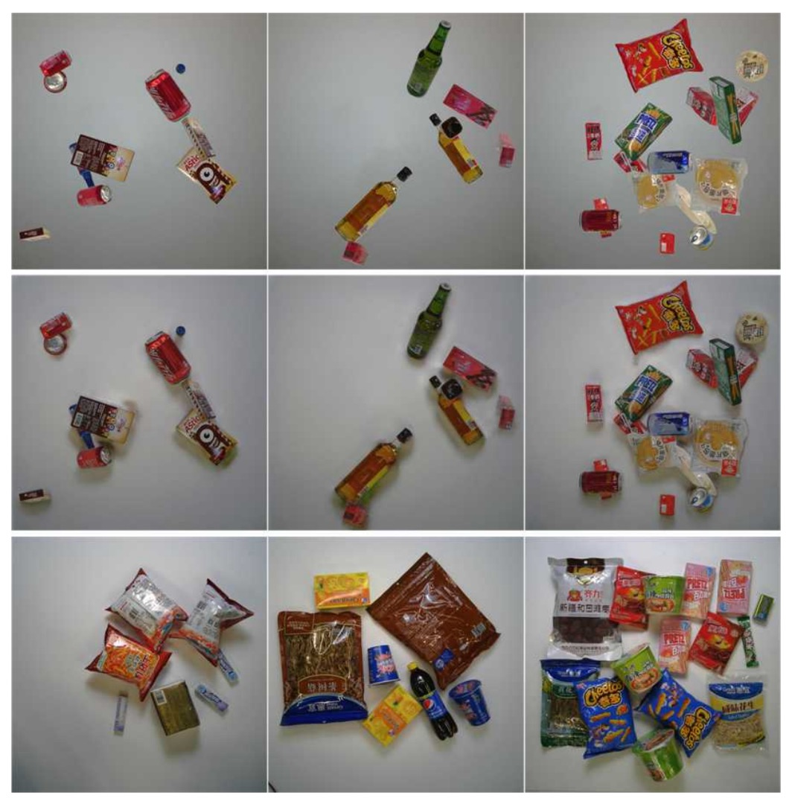
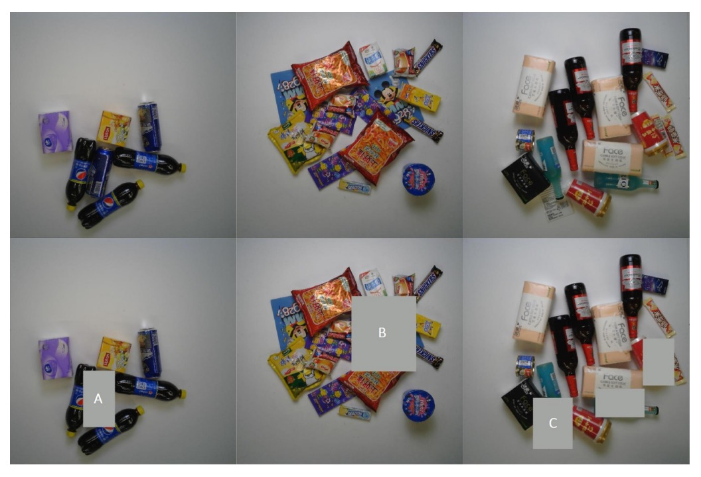

## レジ台上の蒸留

[**Iterative Knowledge Distillation for Automatic Check-Out**](https://www.researchgate.net/profile/Libo-Zhang-6/publication/346079983_Iterative_Knowledge_Distillation_for_Automatic_Check-Out/links/5fba301da6fdcc6cc65a658b/Iterative-Knowledge-Distillation-for-Automatic-Check-Out.pdf)

---

小売商品の分野はさらにいくつかの枝分かれがあり、そのうちの一つが自動チェックアウトです。

自動チェックアウトの正式名称は Automatic Check-Out（略称：ACO）であり、関連論文を見てみましょう。

## 問題の定義

小売業が徐々にデジタル化される中、顧客が購入する商品の種類と数量をシステム的に識別することは、顧客体験の向上と人件費削減の鍵となっています。しかし、ACO は典型的な物体検出タスクとは異なり、問題構造やデータ特性が一般的な物体検出とは大きく異なります。

現在最大規模の RPC データセットを例に取ると、訓練データは回転台で撮影され、各画像に単一商品が含まれ、異なる視点から撮影されており、背景はきれいで照明も安定しています。一方、テストデータは実際のレジシーンを模擬し、複数の商品がホワイトボード上に積み重ねられ、固定の俯瞰視点から撮影され、背景は乱雑で遮蔽が激しく、光の当たり方もさまざまです。

- **この「単品展示」から「積み重ねシーン」へのドメインシフトは、ACO タスクで最も頻繁に遭遇する問題です。**

ドメインシフトに加え、ACO が直面するもう一つの困難は、データラベル付けリソースの非対称性です。

実務では、モデル訓練時に利用できるのは人手でラベル付けされた画像のみであり、テスト時のシーンは訓練データよりも遥かに複雑です。たとえ RPC データセットが多層のラベルを提供していても、現実シーンのテスト画像は「ラベルなし」または「弱いラベルのみ」が多く、監督学習の拡張性を制限しています。

一部の研究は Cycle-GAN のような合成データ技術でドメインギャップを縮めようと試みていますが、効果は限定的で、訓練データ自体に品質問題が残る場合もあります。

データ分布の大きなずれ、不均衡な監督信号、高度な遮蔽と重なりのあるテストシーン。

本論文の著者は、こうした困難の中で効果的な訓練プロセスを模索しています。

---

## 解決策

<figure style={{"width": "80%"}}>

</figure>

全体のモデル訓練構成は上図のとおりです。ソースドメイン（単品画像）とターゲットドメイン（チェックアウトシーン）間の大きなギャップに対処するため、著者はまず「データ拡張」戦略を提案し、実際のシーンを模擬し、混沌に適応する練習を行います。

### データ拡張

この拡張処理は三段階に分かれます：**背景除去 → 姿勢選別 → 合成画像生成**。

1. **背景除去（Background Removal）**

   RPC データセットの訓練画像は回転台上で撮影されています。バウンディングボックスは提供されているものの、多くの背景ノイズが残っています。これらの画像をそのまま合成すると、モデルは「誤った背景」を学習してしまいます。

   そこで著者は粗から細へと段階的に処理する画像処理手法を用いて背景を除去しました：

   

   <figure style={{"width": "90%"}}>
   
   </figure>
   

   具体的手順は以下の通りです：

   - **エッジ検出**：エッジ検出器で物体輪郭を見つけ、信頼度の低い領域を除去。
   - **形態学的処理**：膨張と収縮操作でノイズを除去し、欠損部を埋める。
   - **エッジ平滑化**：中央値フィルタでギザギザをさらに除去。
   - **視覚的顕著性モデル**：最後に saliency detection ネットワーク（MSRA-B で事前学習、粗マスクで微調整）を使い、きれいな物体マスクを生成。

   こうして背景や回転台を含む元画像がきれいな商品画像に変換され、訓練サンプル生成に使われます。

---

2. **姿勢選別（Pose Pruning）**

   すべての単品姿勢がチェックアウトシーンに適しているわけではありません。例えば、ペットボトルが「下から見上げる」角度で撮影されている場合、レジ画面では非常に不自然です。

   

   <figure style={{"width": "90%"}}>
   
   </figure>
   

   合理的な姿勢を自動選択するために、著者はシンプルながら実用的な指標を設計しました：

   $$
   R_{k,v} = \frac{A_{k,v}}{\max_v A_{k,v}}
   $$

   - $A_{k,v}$：第 $k$ 種類の商品が第 $v$ 視点でのマスク面積。
   - 視点ごとのマスク面積が小さすぎる場合、その姿勢は自然な配置角度と大きく異なる → 除外。

   この閾値 θₘ を超えた姿勢のみが合成に使われます。

---

3. **チェックアウトシーン合成（Checkout Image Synthesis）**

   きれいなマスクと合理的な姿勢がそろったら、シーン合成に入ります。

   操作手順は以下の通り：

   - **複数の商品をランダムに配置**：選別済みの商品から数点選び、ランダムな角度（0–360°）とランダムな縮尺（0.4–0.7）でクリーンな背景に貼り付ける。
   - **過度の遮蔽回避**：各商品は最大 50％までしか隠れない。
   - **光影処理**：合成画像は位置的には妥当でも、実世界の光影変化が不足しているため、最後に CycleGAN 技術を用いてスタイル変換し、実際のテスト映像に近づける。

   下図は変換全体の流れです：

   

   <figure style={{"width": "90%"}}>
   
   </figure>
   

### DPSNet

前述のデータ拡張でモデルは実際のチェックアウト映像を模擬する能力を得ましたが、それだけでは実テスト画像との意味的ギャップを埋めるには不十分です。著者は **DPSNet（Dual Pyramid Scale Network）** というモデル構造を提案し、**二つの異なる視点**から共通特徴表現を学習しようと試みています：

- **物体検出（Detection）**
- **物体カウント（Counting）**

<figure style={{"width": "90%"}}>

</figure>

まず Detection View は、物体がどこにあるかを見つけることを目的としています。検出視点は (c, x, y, w, h) という形の物体ボックスを出力します。

- c：物体のクラス
- x, y：物体中心の座標
- w, h：物体の幅と高さ

これは典型的な物体検出タスクの出力で、空間的な位置と分類情報を提供します。

一方 Counting View の目的は、物体がいくつあるかを数えることです。出力は**密度マップ**で、各位置 $(i, j)$ に対しサイズ $C$ のベクトルが対応し、その場所に属する各クラスの確率密度を表現します。この出力形式は重なりや遮蔽の激しい商品シーンで特に有効です。

両視点が異なるレベルの特徴を活用できるように、DPSNet はバックボーンとして **FPN（Feature Pyramid Network）** を用い、多層次特徴マップ $P_2 \sim P_6$ を取得します。

特徴融合は以下のように行います：

- **低層特徴をアップサンプリングして高層特徴と融合**（検出用に空間的詳細を保持）
- **高層特徴をダウンサンプリングして低層特徴と融合**（カウント用に意味的強度を導入）

融合後の特徴マップは 1×1 および 3×3 の畳み込み層を通り、それぞれ検出ヘッドとカウントヘッドに入り、検出ボックスと密度マップを出力します。

---

### 逐次的知識蒸留

モデルは予測能力を備えているものの、ターゲットドメインでの安定した性能は保証されていません。

著者はテストデータセットも訓練に組み込むため、以下のような**漸進的な自己蒸留学習戦略**を設計しました：

<figure style={{"width": "90%"}}>

</figure>

全体の流れは以下の通りです：

- **一貫性チェック（Consistency Check）**

  ラベルなしのテスト画像ごとに、DPSNet は以下を実行します：

  - 検出視点 D：物体の位置とクラスを予測
  - カウント視点 C：密度マップを生成し、各クラスの総数を推定

  これら 2 つの結果の「一致」を比較します：

  - あるクラス c に対し、検出された高信頼度の物体数と密度マップ推定数が等しければ「一致」と見なす
  - これらの「一致したサンプル」を訓練データに追加し、疑似ラベルを生成

---

- **反復的蒸留（Iterative Distillation）**

  各訓練サイクルで DPSNet は以下を繰り返します：

  1. 現モデルでテストセットを予測
  2. 一貫性チェックを行い、信頼できるサンプルを選択して訓練に追加
  3. 新たな疑似ラベルで再訓練
  4. このサイクルを数回繰り返す

---

- **インスタンスレベル修正（Instance-Level Refinement）**

  蒸留を数回行った後、著者はさらに修正工程を追加しました：

  - 「画像全体が捨てられた」ケースでも、一部の物体に高い信頼度があれば、その物体ボックスは保持し、低信頼度部分のみ除去
  - この「半信頼」画像を使ってファインチューニングを実施

  下図はよくある捨てられる例を示します：

    

    <figure style={{"width": "90%"}}>
    
    </figure>
    

  各列は順に：元のレジ画像、低信頼度物体を除去した画像。A/B/C はそれぞれ、似た外観の重複物体、遮蔽された物体、非商品アイテムの代表的な誤検出例。

この「一致性 → 蒸留 → 修正」の反復で、知識がソースドメインからターゲットドメインへ浸透し、画像・インスタンス双方で漸進的に強化され、実シーンでのモデルの安定性が向上します。

### 損失関数

DPSNet が異なるドメイン情報を安定的に学習できるよう、反復訓練過程で二つの視点に対応した損失関数を設計し、合計して全体の訓練目的としました。

損失関数の概要は以下の通りです：

$$
\mathcal{L} = \sum_{i=1}^{N} \sum_{\ell} \left| \hat{\Theta}(\ell; x_i) - \Theta(\ell; x_i) \right|^2 +
$$

$$
\sum_{d} \left( \mathcal{L}_{cls}(\hat{p}_d, p_d; x_i) + \mathbf{1}(p_d > 0) \cdot \mathcal{L}_{reg}(\hat{t}_d, t_d; x_i) \right)
$$

カウント視点の目標は、クラスごとの位置での出現確率を表す密度マップ $\hat{\Theta}$ を学習することです。

- **損失タイプ**：二乗誤差（L2 Loss）
- **直感的意味**：予測密度マップが実際の分布に近ければ近いほど、モデルは各クラスの数量を正確に推定できる

密度マップの正解は、

- 各物体の中心点にガウシアンカーネルを配置し
- クラスごとに独立して加算し
- 全クラスを合成し、入力画像の 1/8 サイズ（例：100×100）の密度マップを作成

検出視点の目標は、各物体のクラスとバウンディングボックス位置を予測することです。

- **分類損失**（クロスエントロピー）：予測クラス $\hat{p}_d$ とラベルクラス $p_d$ の誤差
- **回帰損失**（Smooth L1）：真の物体（$p_d > 0$）のバウンディングボックス誤差のみ計算

条件指示関数 $\mathbf{1}(p_d > 0)$ は、

- **物体（foreground）**：クラスがあるため分類と回帰誤差の両方を計算
- **背景（background）**：回帰誤差は計算せず、誤認識の有無のみ考慮

回帰ベクトル $t_d, \hat{t}_d$ はバウンディングボックスのパラメータ（中心座標と幅・高さ）を表し、Smooth L1 は小さな誤差に対しても安定した勾配を提供し、訓練の安定性を高めます。

## 議論

### RPC データセット ベンチマーク

<figure style={{"width": "90%"}}>

</figure>

DPSNet の実験結果は上表に詳細にまとめられ、2 つのベースライン手法と比較されています。文献【1】は元のチェックアウト検出システムの論文、文献【8】は改良版 DPNet です。

各手法は 2 種類の訓練セットで試されています：CycleGAN 処理済みの Render 画像のみを使う場合と、Copy-Paste 合成画像を加えた Syn+Render 訓練セット。DPSNet はさらに Instance+Render 設定を追加し、インスタンスレベルの疑似ラベルの影響を検証しています。

主要指標である**Checkout Accuracy（cAcc）**について説明します。これは非常に実務的な評価基準です：

- **画像内のすべての商品クラスと数量が完全に正確でなければ「成功」とみなさず、誤りに極めて敏感であり、実環境での信頼性を示す。**

Render のみの訓練は CycleGAN 処理済み合成画像を用いますが、cAcc は 45.60%に留まります。スタイル変換をしても、シミュレーションと実シーン間の意味的ギャップは埋まりません。

Copy-and-Paste 合成画像を加えた Syn+Render では cAcc が 56.68%に向上し、訓練データの量と分布多様性がモデルの汎化に寄与しました。しかし、合成画像は誤った遮蔽や不自然な姿勢、背景不整合などのノイズも持ち込み、「表面的に多様だが実際は混乱を招く」可能性もあります。

DPNet は検出とカウントの二視点学習を初導入し、テストデータから信頼できる疑似ラベルを選択して訓練する試みを行いました。その結果、Render 訓練でも cAcc は 77.91%に跳ね上がり、ベースラインの壁をほぼ超えました。

Syn+Render ではさらに 80.51%を達成し、テストデータ自身が知識源となり得ることを示しました。ただし、選択機構が必須です。

DPSNet は DPNet と比べて

1. **構造面で**：ピラミッドスケール表現融合を導入し、検出とカウントが多層特徴で同期して動作。単なる積み重ねではない。
2. **訓練面で**：反復的知識蒸留を採用し、信頼できるテスト画像を段階的に選ぶだけでなく、インスタンスレベルでの除外と修正も行う。

この結果、「DPSNet (Render)」は cAcc が**86.54%**まで飛躍し、Syn+Render 版はやや低いものの差はほとんどありません。Copy-Paste 合成が必ずしも正の貢献をしないことも示唆されます。

cAcc 以外の指標でも DPSNet は総合的に優れています：

- **ACD（平均誤カウント）**：1 画像あたりの誤検出数を示し、DPSNet は他より大幅に低い。
- **mCIoU（クラス IoU 平均）**：クラス予測の精度を示し、DPNet 比で約 5%向上。
- **mmAP（IoU=0.50\~0.95 の平均精度）**：検出レベルの厳しい基準でも DPSNet が上回り、「予測があるだけでなく精度が高い」ことを示す。

これらは相補的に、DPSNet の検出とカウントの両タスクにおける協調性と精度向上を表しています。

興味深いのは、Render のみの訓練で Syn+Render より若干良い結果が出ていること（86.54% > 85.98%）。これは反復的疑似ラベル戦略がリアルなテスト場面からの信号を効果的に捉え、合成画像の寄与が相対的に小さくなった可能性を示します。

これにより、以下の問いが再考されます：

> 「本当に価値ある訓練信号は、大量のシミュレーションか、実データの理解と選別か？」

DPSNet の答えは明確に後者です。

以下は RPC データセットに基づく推論結果で、上から順に簡単、中級、難易度の高いサンプルです。

<figure style={{"width": "90%"}}>

</figure>

### 消融実験

1. **密度マップの次元設計**

<figure style={{"width": "70%"}}>

</figure>

カウント視点において、密度マップの第 3 次元 $C$ は「同時に推定するクラス数」を意味します。

著者は以下の 3 種類の設定を比較しました：

| Density Category (C) | 説明                       | cAcc   |
| -------------------- | -------------------------- | ------ |
| C = 1                | 全商品を単一クラスとみなす | 86.54% |
| C = 17               | 17 のスーパークラス使用    | 80.05% |
| C = 200              | 完全な細分類               | 77.22% |

結果は：**C が細かくなるほどモデルの収束が困難になる**ことを示しています。

これは密度マップの教師信号がクラス数増加と共に疎になるため、訓練が不安定になるためです。逆に C=1 はクラス区別はできませんが、カウントと一貫性チェックの段階でより安定しており、本研究では最終的に C=1 を採用しています。

- **特徴表現の影響**

<figure style={{"width": "90%"}}>

</figure>

上表より、ピラミッドスケール構造のみ（協同学習なし）では DPNet を下回る結果（70.08% < 70.80%）となり、構造の改善だけでは効果向上につながらないことが示唆されます。

しかし協同学習を組み合わせることで、DPSNet はベースラインを超え、cAcc が 79.35%に向上します。これはピラミッドスケール設計の潜在力が二視点の相互学習によって引き出されることを意味します。

検出（物体位置推定）とカウント（密度推定）が単独だと局所解に陥る可能性が高く、例えば正確に検出されても密度推定が誤る、またはその逆が起こり得ます。

これらを共通バックボーンで協同訓練することで、双方が互いに補正し合い、より堅牢な中間特徴表現を獲得します。その結果、cAcc は 70.80%から 79.35%へ飛躍的に向上し、協同学習の実効性が証明されました。

さらに最も顕著な向上は反復学習（iterative learning）から生まれ、79.35%から 86.54%へ大幅に伸びています。

このプロセスの核心は、モデルが外部ラベルに依存せず、自身の予測に基づく内部一貫性メカニズムから信頼できる信号を抽出し、それを用いて自己訓練を繰り返す点にあります。

## 結論

DPSNet は Pyramid-Scale 特徴表現、多視点協同学習、選択可能な知識蒸留と反復自己訓練により、ACO タスクにおける「ドメイン間分布不一致」と「ラベルデータ不足」という二大課題に段階的に対応しています。

本研究は、大量のラベルがない現実環境において、テストデータ自体が潜在的な信号源となりうることを示し、安定した疑似ラベル戦略によってそれを学習資源に変換可能であると示唆します。

また、スタイル変換よりも意味的・構造的一貫性の学習がドメイン適応でより重要であり、単一タスクでは扱いきれないシーンは多タスク設計によって補完可能です。

実装面では、カウントタスクは意味的に細分化できないものの、訓練時の補助監督信号として有用であり、全体性能向上に貢献するため、実務での導入価値があります。
