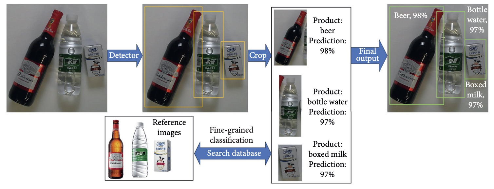
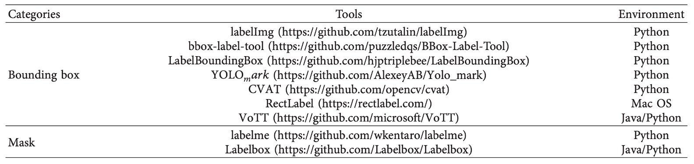
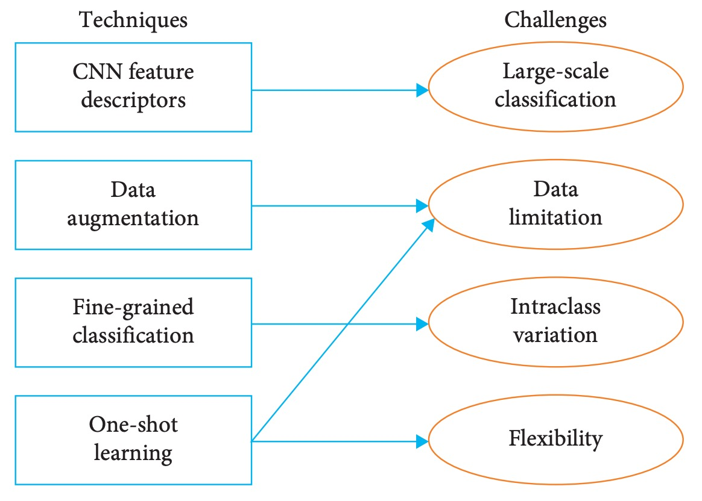
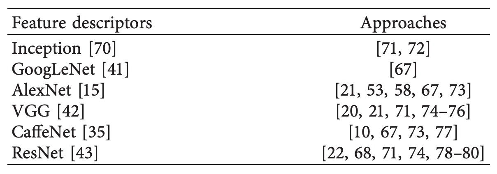
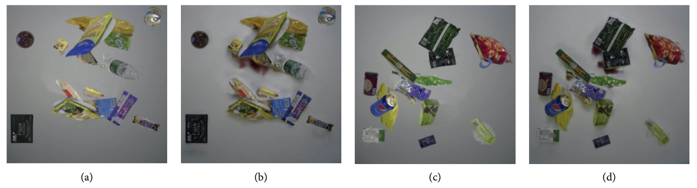
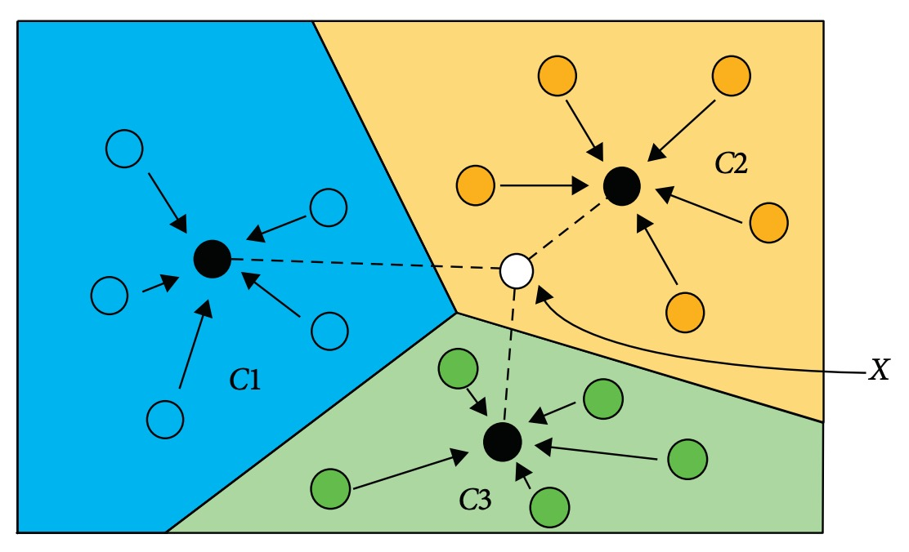
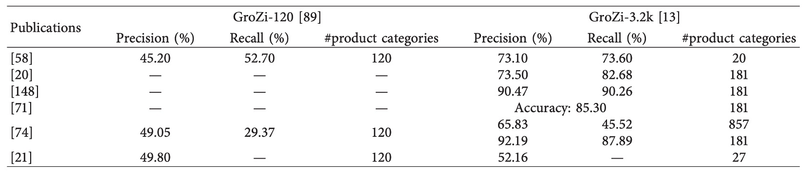

## 小売商品認識

[**Deep Learning for Retail Product Recognition: Challenges and Techniques**](https://onlinelibrary.wiley.com/doi/pdf/10.1155/2020/8875910)

---

最近、自動レジ（Automatic Check-Out, ACO）分野の参考文献を整理し直した。

まずは、いくつかのレビュー論文からこの分野の全体像を素早く理解する。

## 問題の定義

小売商品認識技術（Retail Product Recognition）の主な目的は、小売業者が効果的に商品管理を行い、顧客の購買体験を向上させることにある。これまで最も広く使われてきた技術はバーコード認識であり、商品の包装に印刷されたバーコードをスキャンすることで商品情報の自動取得を実現している。

しかし、バーコードの印刷位置は固定されておらず、実際の運用ではスキャナーに合わせるために商品を手動で回転させる必要が多く、これが処理の遅延を招いている。

Digimarc の調査によると、約 45%の顧客がバーコードのスキャンが不便だと感じている。

:::tip
Digimarc Corporation はアメリカ・オレゴン州ビーバートンに本社を置く上場企業であり、デジタル不可視ウォーターマークやシリアライズされた QR コードなどの認識技術を開発し、製品の真偽認証、サプライチェーン追跡、リサイクル分別などの応用を強化している。
:::

この状況において、RFID 技術は潜在的な代替手段とみなされる可能性がある。無線電波を用いてデータを送信するため、視線スキャンに依存せずに認識作業を行うことができ、理論的には効率の優位性を持つ。各商品に独立したタグを付け、遠距離から読み取りが可能であり、一つずつ位置合わせする必要がない。

欠点はコストが高いことである。

小売業というコスト競争の激しい業界では、商品一つにつき 1 枚の RFID タグを消費するため、積み重なるとかなりの出費となる。また、複数商品の同時認識時には、信号が遮蔽や干渉によって誤動作する可能性があり、大量販売される商品にとってはコスト管理上の課題となる。

小売産業の急速なデジタル化に伴い、企業は人工知能技術を活用して運営効率と顧客体験の向上を目指している。

Juniper Research の報告によると、世界の小売業者による AI 関連サービスへの支出は 2019 年の 36 億ドルから 2023 年には 120 億ドルに成長すると予測されており、この種の技術への高い投資意欲を示している。一方で、スーパーマーケットの陳列商品数は増加の一途をたどり、人手による管理コストも著しく上昇しており、より高い自動化レベルの認識ソリューションを模索する動機となっている。

デジタルカメラ機器の普及は大量の商品画像データの生成を促進し、コンピュータビジョン認識システムの発展における重要な基盤となっている。

商品認識タスクは画像分類と物体検出を統合した問題とみなすことができ、その核心目標は画像から自動的に商品カテゴリと位置を認識することである。この技術は以下のような多様なシーンに応用可能である：

1. **棚管理**：欠品商品を自動検出し、スタッフに補充を促す。研究によれば、棚計画の完全実施により売上が 7.8%、粗利益が 8.1%向上するとされる。
2. **セルフレジシステム**：商品画像認識を通じて会計時間を短縮し、顧客満足度を高める。SCO システムは 2014 年から 2019 年にかけて継続的に成長し、人件費削減のため広く導入されている。
3. **視覚障害者支援**：視覚障害者が商品情報（価格、ブランド、賞味期限など）を認識する手助けをし、買い物のハードルを下げ、自立性と社会参加を向上させる。

技術的には、従来の手工特徴量手法と比較して、深層学習は画像から直接特徴を自動学習でき、高い認識性能と汎化能力を持つ。また、多層構造によりより細かな意味情報を抽出でき、複雑かつ多カテゴリの商品シーンに適している。

現在、複数の研究チームが小売分野に深層学習を適用し、多様なタスクで具体的な成果を挙げている。業界においても Amazon Go や Walmart Intelligent Retail Lab などの応用例が登場している。

近年、関連研究の成果は増加傾向にあるものの、「商品認識タスクにおける深層学習」についての体系的なレビューは依然として非常に限られている。過去には小売棚商品検出に関する 2 件のサーベイ論文が発表されたが、どちらもレジのシーンを含まず、深層学習手法に特化していなかった。

本論文の著者は、CVPR、ICCV、AAAI など主要会議やジャーナルの 100 本以上の文献をレビューし、現状の技術、課題、資源を統合しようとしている。本論文がこの分野の研究者やエンジニアの入門指針となり、核心課題や既存成果の迅速な把握に役立つことを期待している。

:::tip
私たちはこうした熱意ある著者を非常に好感している。感謝してもしきれない。
:::

## 伝統的手法

商品画像認識の核は、パッケージ画像から代表的な特徴を抽出し、分類・認識タスクを完遂することである。

初期のコンピュータビジョン研究では、モジュール化された処理フローを採用し、認識システムを以下の主要ステップに分割していた：

1. **画像取得**：カメラやスマートフォン等の装置で商品画像を収集する。
2. **前処理**：入力画像に対しノイズ除去や情報簡略化を行う。画像分割、幾何変換、コントラスト強調などを含む。
3. **特徴抽出**：位置やサイズの変化に影響されない安定した特徴を画像領域から解析する。
4. **特徴分類**：抽出された特徴をベクトル空間にマッピングし、特定の分類アルゴリズムで予測を行う。
5. **認識出力**：事前学習済み分類器により商品カテゴリ結果を出力する。

この構造の中で重要なステップは「特徴抽出」であり、その精度が最終的な認識性能に直結する。深層学習普及以前は、研究者は手作りの特徴に依存して画像の視覚的特性を捉えていた。

代表的な 2 つの手法は：

- **SIFT（Scale-Invariant Feature Transform）**：1999 年に David Lowe が提案。画像ピラミッド構造を用いて多尺度領域の局所特徴を抽出し、回転・平行移動・スケール変化に不変な特徴を持つ。物体マッチングや分類タスクで広く利用された。
- **SURF（Speeded Up Robust Features）**：2006 年に SIFT を基に開発され、計算効率を最適化。リアルタイム性が求められる応用に適用された。

しかし、これらの特徴は手作りであり、開発者の経験や仮定に依存するため、画像中の全ての潜在的な重要情報を網羅できない。また、商品種別が多くパッケージデザインに大きな差異があり、撮影条件（角度、照明）が変動すると、手作り特徴は認識の安定性や拡張性を維持しにくい。これが、研究コミュニティがデータ駆動型の深層学習へ徐々に転換し、エンドツーエンドで画像から最も判別力のある特徴表現を学習する方向へ動いた背景である。

## 深層学習手法

深層学習は機械学習のサブフィールドであり、データから自動的に多層の表現を学習し、高次の意味構造を捉えることを目標とする。この手法は手作り特徴の限界を回避し、画像・音声・テキストなど高次元データに特に適している。

画像認識タスクにおいては、GPU 計算能力の向上により深層学習の優位性が拡大し、伝統的手法に取って代わり主流となった。現在、零售商品認識での応用は主に以下の二大タスクに分かれる：

1. **画像分類（Image Classification）**：入力画像を所定のカテゴリに分類。十分な訓練データがある場合、モデルの分類精度は人間の水準を超える。
2. **物体検出（Object Detection）**：分類に加え、画像中の物体位置（バウンディングボックス）を返す。モデル設計や計算効率に高い要求があり、商品認識に不可欠なモジュール。

深層学習の画像分野における突破口は畳み込みニューラルネットワーク（CNN）である。この構造は猫の視覚皮質の生理学研究に着想を得ており、LeCun らが 1988 年に初めて CNN を用いた画像分類モデルを提案し、手書き数字や小切手認識で成功した。

2010 年以降、ImageNet チャレンジの推進で CNN 構造は急速に進化し、多くの主流アーキテクチャが誕生した：

- **AlexNet (2012)**：ReLU や Dropout を導入し、従来の画像認識の限界を打破、深層学習ブームを牽引。
- **GoogLeNet (2014)**：Inception モジュール採用によりパラメータ数削減とモデルの深層化を実現。
- **VGG (2014)**：3x3 畳み込みカーネルに統一し、構造の組み合わせや再利用を容易に。
- **ResNet (2015)**：残差接続を提案し、深層化による性能劣化問題を解決、100 層以上のモデル訓練を可能に。

近年は CNN の応用を 3D 構造認識へ拡張した多視点 CNN（Multiview CNN）も研究され、多角度画像を同時入力し高精度分類を実現、立体商品認識等の高度タスクに適用されている。

まとめると、深層学習の二大推進力は「大規模データ」と「より深いネットワーク構造」であり、これらが相乗効果を生み、視覚認識モデルの進化を促進し、商品認識システムの技術的基盤を築いている。

物体検出タスクに話を戻す。

深層学習技術における物体検出の核心目標は、

> **画像から対象物のカテゴリと位置（バウンディングボックス）を自動的に識別すること。**

深層学習導入前は、スライディングウィンドウ手法が主流で、画像全体に一定サイズのウィンドウを滑らせ、区画ごとに分類判定していた。しかし、大サイズ画像や多数物体シーンでは計算量が膨大で非効率だった。

深層学習を用いた物体検出アルゴリズムは大きく二系統に分かれる：

- **Two-stage 法（領域提案優先）**
  R-CNN シリーズに代表され、第一段階で Selective Search などの領域提案アルゴリズムにより候補領域を生成し、第二段階で CNN により分類・位置回帰を行う。

  - R-CNN：各候補領域を個別に CNN 処理し精度向上も速度遅延。
  - Fast R-CNN：画像全体を CNN 処理し、特徴マップ上で ROI プーリングを行い重複計算削減。
  - Faster R-CNN：RPN（Region Proposal Network）を導入し、特徴共有で領域提案を深層学習に統合、精度と速度を両立。

- **One-stage 法（エンドツーエンド回帰）**
  領域提案段階を省略し、直接画像から物体の位置とカテゴリを回帰する。高速だが初期は精度が若干劣る。

  - YOLO（You Only Look Once）や SSD（Single Shot MultiBox Detector）が代表例であり、リアルタイム性が重要な即時会計や視覚ナビゲーションで優位。

両者は特性が異なり、Two-stage は複雑背景での安定性が高く、One-stage は遅延要件の低い環境に適する。実用では精度と速度のトレードオフを考慮し選択される。

<figure style={{"width": "90%"}}>

</figure>

商品認識タスクは技術的に物体検出の特殊ケースとみなせる。典型的な流れは上図の通り：

1. **商品検出**：物体検出モデルで複数のバウンディングボックスを生成し、商品領域を示す。
2. **領域切り出し**：予測領域ごとに単一商品画像を切り出す。
3. **画像分類**：切り出した画像を分類モデルに入力し、商品カテゴリを推定する。

近年、多数の企業が深層学習を小売分野に導入している：

- **Amazon Go（2018）**：数十台のカメラで顧客動線を取得し、CNN モデルで購買行動と商品を認識。純粋な画像認識の不足を補うため、Bluetooth や重量センサーも活用し全体精度を向上。
- **Walmart IRL（2019）**：棚のリアルタイム監視に注力し、カメラと深層学習で欠品を自動検知し補充を促す。
- **中国企業（DeepBlue Technology、Malong Technologies）**：統合型自動販売機、スマート計量システム、商品認識モジュールを提供し、商品画像分析、即時会計、分類推薦を実現。Malong の AI Fresh は特に生鮮商品向けに設計され、非構造化視覚特徴（果物や野菜の外観変異）を扱う。

現状を見ると、商用展開は始まっているものの、深層学習による商品認識技術には依然として多くの課題が残る：

- 精度と推論速度のバランス調整；
- 視覚的に類似した異商品間の誤認識；
- 多カテゴリデータの不均衡、長尾分布の顕著さ；
- 導入コストと複数デバイスの安定運用；
- 遮蔽、反射、手の干渉など実環境での非理想条件への対応困難。

これらを踏まえ、深層学習は商品認識で最も有望な手法であるものの、技術応用はさらなる実証研究と大規模現場展開により洗練・最適化される必要がある。

## 商品認識の課題

商品認識は物体検出タスクの応用変形にあたるが、実際の環境は一般的な物体検出と大きく異なり、既存モデルの直接転用が困難である。

本章では、小売商品認識が直面する 4 大課題を整理した。以下に主要な 4 つの問題を示す。

### 課題 1：クラス数の大規模化

一般的な物体検出と比較し、商品認識の最大の特徴は「**クラス数が標準データセットを大きく上回ること**」である。

中規模スーパーマーケットの在庫単位（SKU）は数千に及び、一般的なデータセットを大幅に超過する。さらに、実際の小売シーンでは 1 枚の画像に十数種の商品が含まれ、同一ブランドの異なる仕様など、クラス間の差異は非常に微細であり、検出難度は格段に高い。

また、Faster R-CNN、YOLO、SSD など主流モデルは固定クラス数を前提としており、クラス数が数千に拡大すると精度・再現率が大幅に低下する。

論文内の実験結果（下図参照）では、

<figure style={{"width": "60%"}}>

</figure>

いずれのモデルにおいても、**クラス数が 20 から 80 に増加すると全体精度が著しく低下する**。

よって商品認識では、従来の物体検出アーキテクチャに頼るだけでは、高次元分類による学習困難と推論の不安定化が避けられない。これはモデル設計のみならず、データ分布、クラス間差異表現、分類戦略設計など多面的課題を含む。

### 課題 2：データ分布のギャップ

深層学習モデルは大量の注釈付きデータを必要とするが、商品認識分野におけるデータ収集は以下の 3 点で制約がある：

1. **注釈コストの高さ**：
   バウンディングボックスやセグメンテーションの注釈は多くが手作業であり、数万枚の訓練データ生成は多大な労力と時間を要する。LabelImg や LabelMe などのツール支援があっても、スケール拡大は難しい。

2. **訓練データと実環境のドメインギャップ**：
   既存商品データは固定角度かつ単純背景（例：回転台での撮影）など理想環境で収集される。一方、テスト・実運用環境は複雑背景、変動光源、頻繁な遮蔽があるため、モデルの性能に乖離が生じる。

<figure style={{"width": "80%"}}>

</figure>

3. **データの不均衡とロングテール分布**：
   商品データセットは「少数サンプル・多数クラス」の特徴を持つ。VOC や COCO のように均衡を重視したデータセットとは対照的に、商品認識では画像数が少なくクラス数が多いため、モデル学習が困難である。

<figure style={{"width": "80%"}}>

</figure>

以上より、データ不足はモデル性能を制限するだけでなく、汎化能力の向上や新商品への迅速な転移学習も妨げる。データ不足と実務環境の分布差を系統的に解決しない限り、高度なモデル設計も実運用に耐えられない。

### 課題 3：クラス内変異

商品認識の大きな難題は、「クラス内異質性が高い製品の正確な識別」、すなわち「サブクラス認識」や「細粒度分類（fine-grained classification）」である。

この課題には以下の特徴がある：

1. **視覚差異が極めて微細**：
   同一ブランドの異なるフレーバーのクッキーや異サイズ包装は、色彩の飽和度や文字位置の微差程度で、肉眼でも識別困難な場合がある。
2. **多様な外観変異**：
   同一製品が異なる角度・拡大率で明確に外観が変わり、モデルはスケール・視点不変性を求められる。
3. **環境ノイズの大きさ**：
   照明、背景、遮蔽が識別に大きく影響し、モデルの判別境界を複雑化する。

細粒度分類は鳥種識別や車種分類など他分野で専用技術が発展しているが、多くは追加注釈（キーポイントや部位アライメント）を利用し微細差を学習する。一方、商品認識への適用は以下の点で難易度が高い：

- 商品間の視覚類似度は外形のみならず、包装構造、色彩、書体まで高度に重複する。
- 専用の細粒度商品データセットが不足し、既存データは全体カテゴリ注釈に留まり、サブクラス定義が不十分。
- 追加注釈や専門知識なしでは、モデルは効果的な区別戦略を学習しづらく、誤認率が増加する。

例として、下図 (a) は類似する 2 種の異なるフレーバー製品を示す。

<figure style={{"width": "80%"}}>

</figure>

文字色や位置の微調整が差異であり、(b) は同ブランドの異容量包装を示すが、単一画像からサイズ差を判別するのは困難である。これらは実環境で「極めて似るが同一でない」識別を要求される細かな表現力を示す。

### 課題 4：システムの柔軟性不足

小売業は商品入れ替えが激しく、新製品の継続的な投入や包装変更が頻繁である。商品画像認識システムが新製品ごとにモデルを全面再訓練するのは時間・労力の面で非効率であり、実用性を損なう。

理想的システムは以下を備えるべきである：

- **迅速な拡張性**：少数ショットやゼロショット学習により新クラスを追加可能。
- **継続学習能力**：旧クラス知識を忘れずに新製品を学習（continual / lifelong learning）。

しかし、CNN 構造は「破滅的忘却（catastrophic forgetting）」問題を抱える。新クラスで微調整すると既存クラス識別能力が著しく低下する。

下図の例では、

<figure style={{"width": "80%"}}>

</figure>

元は orange を検出可能であったが、banana クラスのみの更新後、orange 識別能力が失われている。

現状の主流は全データで再訓練する手法であり、実務における展開コストや効率面のボトルネックとなる。将来は以下特性を持つ認識モデル開発が望まれる：

- 長期記憶能力を備えること。
- クラス追加のインクリメンタルトレーニング対応。
- サンプル記憶や正則化に基づくリプレイ戦略で忘却を抑制。

商品認識システムの「柔軟性」は急変市場での実用性と寿命を決定づける要素である。

## 技術概観

本章では前節で挙げた 4 つの主要課題に対し、既存文献で提案されている対応技術を整理する。深層学習を核とした認識アーキテクチャを中心に、これと組み合わせ可能な補助的手法も合わせて紹介する。

<figure style={{"width": "60%"}}>

</figure>

この分類整理により、読者は商品認識タスクの解決手法の全体像と研究動向をより迅速に把握できる。

:::info
本稿では以降、文献番号を【xx】の形式で示し、原著論文の参考文献に対応させている。詳細を調べたい場合は該当番号をもとに原論文を参照されたい。
:::

### 畳み込みネットワークに基づく手法

小売商品分類タスクの核心的課題の一つは、大規模なクラス数の処理である。この背景のもと、CNN モデルは画像特徴抽出段階で広く用いられ、特徴記述子として識別可能な埋め込みベクトルを生成し、分類や類似度検索に利用される。

初期の SIFT や SURF といった手作り特徴は回転・スケール不変性を持つものの、意味的な階層表現を欠き、大規模クラス認識には対応困難であったため、徐々に CNN に置き換えられた。

以下に代表的な研究を示す。詳細は文献番号を参照されたい。

<figure style={{"width": "80%"}}>

</figure>

多くの手法は数百〜千クラスの商品分類を支援可能だが、中大型スーパーではクラス数がこれを大幅に上回るため、さらなる性能向上が求められる。最近では千クラス超の分類に挑戦する代表的な研究がある：

1. **Tonioni et al.【20】**：VGG をバックボーンに用い、MAC（Maximum Activations of Convolutions）特徴で全画像埋め込みを構築。3,288 クラスを扱い、Precision=57.07%、mAP=36.02%を達成。
2. **Karlinsky et al.【21】**：微調整した VGG-F（層 2–15 を固定）を採用し、3,235 クラスの認識に対応、最終的に mAP=52.16%を実現。

これらの研究から、CNN は千クラス規模まで拡張可能な潜力を持つ一方で、特に再現率や細粒度識別能力の面でまだ改善余地が大きいことが示唆される。

また、YOLO9000 は改良版 Darknet を用い 9,000 クラス同時認識可能な検出フレームワークを提案。複数データセットの合同訓練と WordTree のような意味埋め込みが鍵となっている。しかし、数百万の注釈画像を必要とし、商品データが取得困難・注釈コストが高い小売現場への適用は難しい。

まとめると、CNN は大規模クラスの商品分類に実用的な基盤を提供するものの、「クラス数爆発」へのスケーラビリティ、データ効率、認識精度向上が今後の重要課題である。

### データ拡張

深層学習は大量の訓練データに依存するが、小売商品認識では注釈付きデータの取得が時間的・経済的に困難なため、データ拡張が重要な対策となる。

代表的なデータ拡張技術は以下の 2 分類に分けられる。関連文献は表を参照。

<figure style={{"width": "70%"}}>

</figure>

- **従来型画像変換（common synthesis methods）**
- **生成モデル（generative models）**

従来のデータ合成は幾何学的・光学的変換により原画像を拡張する手法が中心である（以下図）。

<figure style={{"width": "70%"}}>

</figure>

例えば [**Albumentations**](https://github.com/albumentations-team/albumentations) は平行移動、回転、スケーリング、鏡映、ランダム遮蔽、ノイズ付加、色調補正、輝度・コントラスト調整など多彩な API を備え、商品検出タスクで広く用いられている。

しかし、これら合成手法は実際の複雑な照明変化や背景ノイズ、自然遮蔽などの条件を模擬するのが困難であるため、よりリアルなデータ生成を求めて生成モデルへ注目が移っている。

生成モデルはより高いリアリティを持つ画像合成を可能にし、主に以下 2 種の構造がある：

- **VAE（Variational Autoencoder）**
  エンコーダ・デコーダ構造で潜在空間分布を学習しサンプル生成、特徴学習や属性制御に適するが、画像変換には未だ課題が多い。
- **GAN（Generative Adversarial Networks）**
  生成器と識別器の対抗学習により視覚的に逼真なサンプルを生成し、画像間のスタイル変換や合成に強みを持つ。

関連研究は以下の通り。

<figure style={{"width": "70%"}}>

</figure>

VAE はエンコーダ・デコーダによる潜在空間学習を通じ原データに類似したサンプル生成を可能とする。商品認識分野への応用例はまだ少ないが、顔や鳥類画像生成では属性制御を実現し、Wild や CUB データセットで高い類似度を達成している【101】。また conditional VAE を用いた zero-shot 学習も標準データセットで好成績を収めている【112】。これらは多様性強化と属性制御の可能性を示し、将来的に商品認識へ展開される可能性がある。

一方、GAN は 2014 年提案以来、生成器・識別器の対抗訓練で多くの逼真画像を生み出し、多様なデータ拡張タスク（夜間車両検出【115】、半教師あり意味的ハッシュ【116】、車牌画像生成【122】など）でモデル性能を向上させている。PixelCNN と one-hot クラス符号化で特定クラス画像を生成【119】や CycleGAN によるスタイル変換・実環境シミュレーションも良好な一般化性能を示す。

商品認識領域での GAN 応用は少ないが、いくつかの研究で有効性が示されている。例えば Wei ら【7】は背景合成と CycleGAN スタイル変換でレジ環境に適合した商品画像を生成し、FPN 検出器で 96.57% mAP を達成（下図）。

続く Li ら【78】は DPNet を提案し合成データから信頼性の高い画像を抽出、チェックアウト精度を 80.51%に向上。別研究【71】も GAN とエンコーダの対抗学習を組み合わせ、商品認識用の視覚サンプルを生成した。

ただし現状の多くの手法は平坦な背景を前提とし、実際のレジ台や棚場面における複雑な背景テクスチャや商品重なり、遮蔽関係は十分に再現できていない。今後はよりリアルな商品画像生成を追求する必要がある。

将来的には画像意味制御の強化、3D モデリングや物理レンダリングエンジンの統合、ドメイン適応やクロスドメイン拡張戦略の併用により、合成データと実環境のギャップ縮小が期待される。

### 細粒度分類

細粒度分類はコンピュータビジョンにおける代表的な難題の一つで、同一上位クラス内のサブクラス（例：異なる花種、車種、動物種など）を識別することを目的とする。

商品認識分野では、商品間の高い視覚的類似性に加え、撮影のぼやけや照明変化、変形、姿勢角度、配置方法など多様なノイズ要因が存在し、より高い難易度を示す。

既存文献を踏まえると、商品細粒度認識の手法は大きく以下の 2 種類に分類される：

1. **細粒度特徴表現（Fine Feature Representation）**
2. **コンテキスト認識（Context Awareness）**

細粒度分類の核は、視覚的に類似した物体から識別的な微細特徴を抽出することである。監督信号の強度により「強監督」と「弱監督」に分けられる。

- **強監督手法（Strongly Supervised）**
  追加でバウンディングボックスや部位情報の注釈を提供し、局所領域を正確に整列させ、モデルが重要な差異に注目しやすくする。

  

  | 研究                       | 手法                                          | ポイント                         | 応用例                       |
  | -------------------------- | --------------------------------------------- | -------------------------------- | ---------------------------- |
  | Part-based R-CNN【127】    | R-CNN 構造で全体・局所特徴を抽出              | 鳥類認識データセットで SOTA 達成 | 商品認識の局所特徴融合の示唆 |
  | Pose-normalized CNN【137】 | DPM で位置検出・領域分割後特徴抽出し SVM 分類 | 精度 75.7%                       | 商品姿勢変動が顕著な場面向け |
  | DiffNet【139】             | 似た商品画像の差異を自動検出し差分ラベル生成  | 一般的な商品に注釈不要           | 商品認識で mAP95.56%達成     |

  

- **弱監督手法（Weakly Supervised）**
  追加注釈なしでモデルが局所領域を自動検出し学習。注釈コストの高い商品認識に適する。

  

  | 研究                              | 手法                                  | 概念                       | 効果                           |
  | --------------------------------- | ------------------------------------- | -------------------------- | ------------------------------ |
  | Two-Level Attention【126】        | 全体・局所注意機構で特徴抽出          | 部位注釈不要で差異領域学習 | 細粒度分類に有効               |
  | Bilinear CNN【141】               | 双分岐 CNN で領域検出と特徴分類を協調 | A が領域検出、B が特徴分類 | Caltech-UCSD 鳥類 84.1%精度    |
  | Attention Map【74】               | 注意機構で細部に焦点                  | CAPG-GP データセットで実装 | ベースラインを大きく上回る精度 |
  | Discriminative Patch + SVM【143】 | 中間層重要領域抽出し分類              | 類似商品識別に適用         | スーパーマーケット棚分類で良好 |
  | Self-Attention Module【144】      | activation map で重要位置判定         | クロスドメイン分類に効果的 | モデルの汎化能力を強化         |

  

もう一つのアプローチはコンテキスト認識である。

商品外観だけで分類困難な場合、「文脈情報」が重要な補助情報となりうる。特に棚配置規則下では、商品の相対位置が意味的関連を含むことが多い。

| 研究                                 | 手法                                           | 内容                                 | 成果                     |
| ------------------------------------ | ---------------------------------------------- | ------------------------------------ | ------------------------ |
| CRF + CNN【53】                      | CNN 特徴と隣接商品の視覚類似性を組み合わせ分類 | 隣接文脈情報を加えて商品埋め込み学習 | 精度 91%、再現率 87%     |
| SIFT + Context【64】                 | 従来特徴と配置関係のハイブリッド分類           | 文脈なし手法より 11.4%向上           | 実用的だが非深層学習手法 |
| Graph-based Consistency Check【148】 | 商品配置を部分グラフ同型問題としてモデル化     | 欠品や誤置商品検出                   | 空間的一貫性推論が強み   |

全体的にコンテキスト認識は初期段階の探索的研究にとどまり、応用例は限られる。今後 Transformer 構造や空間モデリング、グラフニューラルネットとの統合により分類性能や現場適応性の向上が期待される。

---

### 少数ショット学習

実務では商品種類が絶えず変化し、新商品追加やパッケージ改変が頻繁に起こる。毎回モデルを全面再訓練すると、時間と労力が膨大になる。

**One-Shot Learning（少数ショット学習）** はこれを解決するために提案された技術で、目標は

> **極少数（時には単一）のサンプルのみで新クラスを認識し、分類器の全面再訓練を不要とすること。**

この技術は距離学習（distance metric learning）に基づき【149】、深層モデルで画像を特徴空間に埋め込み、クエリ画像と各クラス中心点間の距離で最近傍分類を行う。

下図のように、

<figure style={{"width": "70%"}}>

</figure>

入力画像 X は、特徴距離が最も近いクラス中心（例えば C1、C2、C3）に割り当てられる。

この方法の主な特徴と潜在力は、

- **動的なクラス拡張をサポート**：新商品はサンプルを特徴ベースに加えるだけでよく、再訓練不要。
- **訓練データ必要量の大幅削減**：特にロングテールクラスやデータ不足環境に有効。
- **CNN 特徴抽出モジュールと統合可能**で、意味的埋め込みの質と分類安定性を維持。

画像分類や物体検出における応用例は以下の通り：

| タスク          | 手法                                 | ポイント                         | 効果概要                                 |
| --------------- | ------------------------------------ | -------------------------------- | ---------------------------------------- |
| 画像分類【152】 | CNN 埋め込みと色彩情報の距離学習結合 | 照明や色差による埋め込み歪み解消 | person re-ID 性能向上                    |
| 画像分類【150】 | Matching Networks                    | ImageNet で新クラスを迅速認識    | one-shot 精度が 87.6%→93.2%に向上        |
| 物体検出【155】 | R-CNN と組み合わせ動物検出           | 少数サンプル動物認識             | 極小訓練データ環境で成功                 |
| 動画分割【154】 | 単画像注釈で特定物体追跡             | CNN 埋め込みを対象に微調整       | シングルショット認識とフレーム間追跡強化 |

商品認識に応用する研究も多い：

1. **Geng et al.【74】**

   - coarse-to-fine 構造で特徴比較と one-shot 分類器を組み合わせ、再訓練不要で商品クラスを追加可能。
   - 評価データセット：GroZi-3.2k（mAP73.93%）、GP-20（65.55%）、GP181（85.79%）。

2. **Tonioni et al.【20】**

   - 類似度比較戦略でクエリ画像と商品サンプルの CNN 特徴を比較。
   - 単一サンプルで分類可能、パッケージ変更や新規クラス導入に対応。

One-shot 学習は商品認識システムに柔軟性と拡張性をもたらす有力な設計思想である。現状は CNN 特徴と距離学習の組み合わせが主流で、今後は few-shot 分類、メタラーニング、クロスドメイン適応との融合により実環境の変動対応力向上が期待される。

## 公開データセット

<figure style={{"width": "90%"}}>

</figure>

深層モデルの性能はデータ品質と規模に依存するが、商品画像の手動アノテーションは高コストとなる。

比較検証や迅速なプロトタイプ開発のため、研究コミュニティは複数の公開データセットを提供しており、用途に応じて以下に分類される：

- **棚上画像（on-shelf）**：商品が静的に棚に陳列され、補充・配置検査・案内などのシーンを模擬。
- **会計画像（checkout）**：会計視点で撮影され、商品重なり、混在、多数商品の数え上げなどの課題に対応。

### 棚上画像データセット

- **GroZi‑120**
  広く引用される初期の小売商品認識データセット。120 クラス含む。訓練画像は白背景の単品 676 枚で one-shot モデル向き。テストは 4,973 枚の実棚画像と 30 分の動画断片で、照明・角度多様。ドメイン適応性能検証に適する。

- **GroZi‑3.2k**
  クラス数とサンプル数を拡大し、80 大カテゴリを含む。訓練は 8,000 枚超のウェブ画像、テストは実店舗 5 店のスマホ撮影 680 枚と手動注釈付き。細粒度分類とドメインシフト評価に適合。

  

  <figure style={{"width": "70%"}}>
  
  </figure>
  

- **Freiburg Grocery**
  ドイツの研究チームによる 25 種日用品セット。約 5,000 枚のスマホ撮影低解像度訓練画像（256×256）、74 枚の Kinect v2 高解像度テスト画像（遮蔽・ノイズ含む）。多スケール頑健性評価に最適。

  

  <figure style={{"width": "70%"}}>
  
  </figure>
  

- **Cigarette Dataset**
  タバコ識別に特化。10 クラス。訓練 3,600 枚単品写真、テストは 40 店舗棚撮影 354 枚、約 13,000 物体注釈。外観類似かつ密集陳列のため、細粒度と遮蔽評価に適用。

  

  <figure style={{"width": "70%"}}>
  
  </figure>
  

- **Grocery Store Dataset**
  81 クラス、5,125 枚画像、18 店舗由来。アイコニック画像（ウェブ商品ページ）と実景画像を同時収録。クロスドメイン学習や検索タスクに有効。

  

  <figure style={{"width": "70%"}}>
  
  </figure>
  

- **GP181**
  GroZi‑3.2k のサブセット。訓練 183 枚、テスト 73 枚で厳密なバウンディングボックス注釈付き。小規模かつ高品質で、プロトタイプ、few-shot 学習、他データセットとの併用実験に適切。

  

  <figure style={{"width": "90%"}}>
  
  </figure>
  

### 会計画像データセット

会計シーンは画像条件が厳しく、商品重なり、視点固定、不均一な数量などの課題がある。

代表的なデータセットは以下：

- **D2S（Dataset to Shop）**
  初のインスタンスレベルマスクを含む会計データセット。21,000 枚の高解像度画像、60 クラス（瓶飲料、シリアル、果物等）。訓練は単品、テストは混在陳列、物体数 1 ～ 15、一部合成画像含む。光源、背景、角度の多様性重視で、汎化能力・精密セグメンテーション評価に適する。Mask R-CNN や RetinaNet でも IoU=0.75 で性能低下が見られ、シーンの複雑さを示す。

  

  <figure style={{"width": "70%"}}>
  
  </figure>
  

- **RPC（Retail Product Checkout）**
  現実に最も近い大規模会計画像データセット。83,739 枚画像、200 クラス、17 中カテゴリ含む。訓練は 4 台カメラで多視点単品撮影、テストは上方からの混雑会計画像。バウンディングボックス・クラス注釈とともに **Checkout Accuracy（cAcc）** を定義し、「画像内全商品が正確に認識・計数」されて初めて成功とする。基準モデル（FPN）は cAcc56.7%だが、DPNet による信頼合成サンプル抽出で 80.5%まで向上。データ拡張の質が会計タスクで鍵となる。

  

  <figure style={{"width": "70%"}}>
  
  </figure>
  

### 実務上の推奨

- **商品検索、細粒度分類、ドメイン適応**には GroZi‑3.2k、Grocery Store、GP181 が適切。
- **遮蔽環境での検出・分割**には Cigarette や Freiburg Grocery が推奨。
- **会計タスクと正確な計数評価**には RPC が最良のベンチマーク。遮蔽やセグメンテーション検証は D2S が理想的。
- 多くのデータセットは理想背景と実景画像の両方を含み、データ拡張、スタイル変換、クロスドメイン学習のテストに活用可能。

今後はより大規模で多様な背景や時期を跨ぐベンチマークの整備が望まれ、研究者はアノテーションツール共創や半自動アノテーション技術開発によりデータ取得・保守コストの軽減を目指すべきである。

## 今後の研究方向

著者が本分野のさらなる発展に重要と考える以下 6 つの研究テーマ：

1. **深層ニューラルネットワークによる商品画像生成**

   現存最大の公開データセットは 200 クラスのみで、実際のスーパーにおける数千 SKU の需要を大きく下回る。加えて包装デザインの頻繁な更新により包括的な画像収集は困難である。DCGAN や CycleGAN などの生成モデルはリアルな合成画像生成能力を実証しており、貨架視点や遮蔽構造、光影変化を模擬可能な生成器の開発は訓練データの多様性と適応力を大幅に高める可能性がある。

2. **グラフニューラルネットワークを用いた棚配置検査**

   商品配置は空間構造や文脈規則を持ち、従来の畳み込みネットワークでは物体間の非ユークリッド関係を捉えにくい。GNN はノード（商品）間の隣接関係や類似性をグラフ構造としてモデル化可能で、推薦システムや知識グラフ構築に応用されている。プラノグラム課題では、観測棚グラフと理想棚グラフの差異学習を通じ、欠品や誤配置検知を支援する。

3. **転移学習を活用したクロスチャネル認識**

   多くの物体検出モデルは訓練・テストデータ分布の一致を仮定するが、実際の店舗間では照明・背景・陳列スタイルが大きく異なり再学習が必要となる。転移学習（例：ImageNet 事前学習モデル利用）により新環境への迅速適応が可能であり、無監督ドメイン適応や few-shot ファインチューニングの研究も進む。

4. **パッケージ文字情報と画像のマルチモーダル特徴学習**

   細粒度商品は外観類似でも、味や容量を示すラベル文字が重要な識別情報となる。人間の購買判断も包装文字に依存することが多いため、画像特徴と OCR で抽出した文字情報の統合学習は視覚情報の不足を補完する。将来的には BLIP や CLIP のような Vision-Language モデルによるマルチモーダル事前学習の活用も期待される。

5. **増分学習を支援するモデル更新機構**

   深層モデルは新クラス追加時に既存知識を忘れる「破滅的忘却」問題を抱える。増分学習により再訓練不要で新商品を導入可能となる。既存研究は旧モデルで履歴知識維持、新モデルで新クラス学習、双方を特徴整合や知識蒸留で融合する二重ネット構造を提案し、実用展開に有効な方向性を示す。

6. **回帰型検出モデルの高速性と精度向上**

   YOLO や SSD など回帰型検出モデルはリアルタイム性に優れ、エッジデバイスやセルフチェックアウトに適する一方、Faster R-CNN など二段階モデルに比べて精度が劣る。今後は推論速度を損なわずに位置検出や分類性能を高める研究（例：anchor-free 構造、軽量注意機構など）が求められる。

## 結論

本レビューは近年の深層学習を用いた小売商品認識の主要発展を、タスクの本質と応用課題に即して体系的に整理・分析した。4 つの技術的課題、

1. **大規模クラス分類**
2. **訓練データ不足**
3. **類内高類似商品の細粒度識別**
4. **システムの柔軟性と迅速な更新**

に対する先行研究を幅広く紹介し、代表的データセットや評価基準も交え、研究者が効率よく分野の技術座標を把握し、潜在的な突破口に注力できるよう支援する。

商品多様化と複雑化する小売現場に対応するため、今後はモデル設計とシステム実装戦略をさらに深化させ、より高次の実環境適用を目指すことが期待される。
