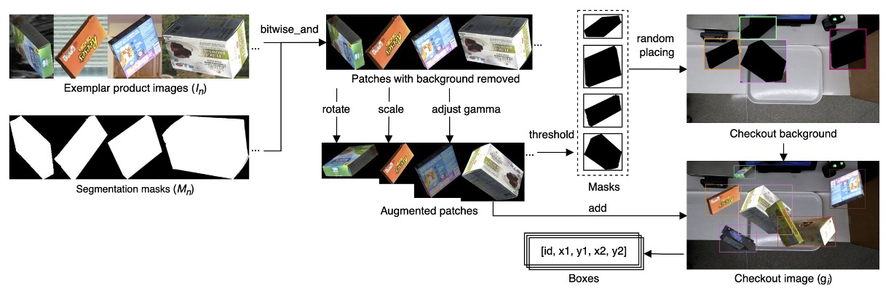
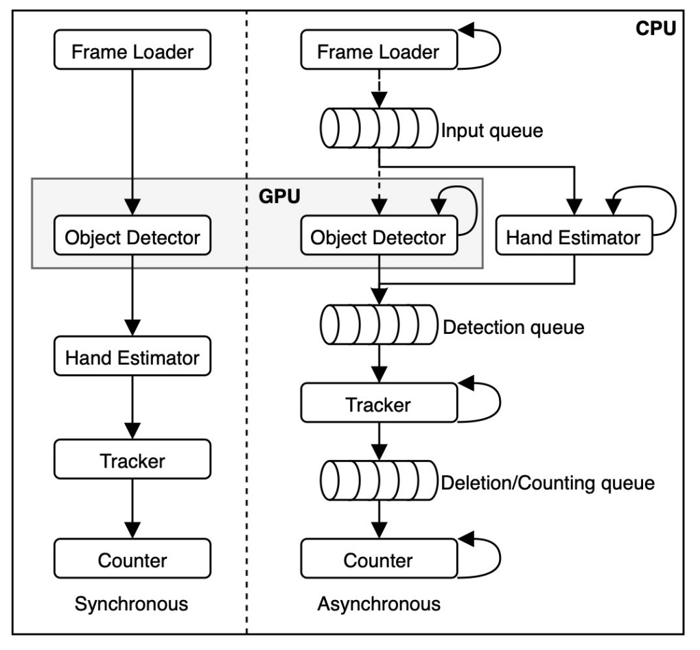
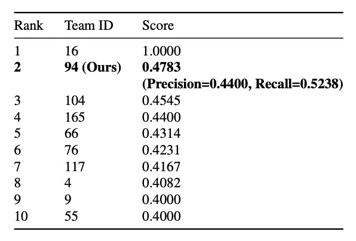

## 見下ろすハンター

[**DeepACO: A Robust Deep Learning-based Automatic Checkout System**](https://openaccess.thecvf.com/content/CVPR2022W/AICity/papers/Pham_DeepACO_A_Robust_Deep_Learning-Based_Automatic_Checkout_System_CVPRW_2022_paper.pdf)

---

これは CVPR ワークショップの論文です。一緒に見てみましょう。

## 問題の定義

近年、小売業は人工知能とコンピュータビジョン技術を通じて深い変革を迎えています。その中で自動レジ（Automatic Checkout, ACO）は最も変革的な応用シーンの一つとされています。

理想的な ACO システムは、顧客が商品をレジ台に置いた瞬間に、

> **すべての商品をリアルタイムで識別し、正確な購入リストを出力、全行程で人為的な介入は不要！**

そんなことが可能でしょうか？

現実には、このようなシステムを構築するためには無数の課題に直面します：

- **商品の遮蔽や動的なブレ**；
- **非常に似通った商品の外観**；
- **誤検出や誤分類がもたらす実質的コスト**；
- **商品種類が膨大かつ頻繁に入れ替わり、実際のシーンを反映した訓練画像の収集が困難**。

従来の背景差分、SIFT、HOG 特徴量と SVM やランダムフォレストといった分類器は、遮蔽や照明変化などのノイズに対処しきれず、精度が限られていました。

深層学習時代に入り、Faster R-CNN、SSD、YOLO などのモデルを用いて大きな突破はありましたが、実際の運用では依然として多くの難問が残ります：

- 単一画像の検出精度が動画全体の正確な商品カウントを意味しない；
- 安定性と一貫性を高めるには、多物体追跡（Multi-Object Tracking, MOT）技術の導入が必須；

しかし MOT 自体も大量の計算コスト、リアルタイム性能、ID 維持の困難さという課題を抱えており、特にオンラインの tracking-by-detection モードでは顕著です。

一方で、ACO タスクのデータ要求は一般的な検出タスクとは異なり、「多物体同時映り込み」「深い遮蔽」「視点・照明変化の激しい」実世界のシーンに強く依存します。既存のデータセットは例えば：

- **RPC**：8 万枚の静止画・レジシーン画像、200 種類の商品；
- **RP2K**：2,000 種類以上の商品、35 万枚の実撮画像、細粒度分類に特化；
- **AI City Challenge Checkout**：3D スキャンから生成された合成データで、実際の陳列や光の変化を模擬、合計 116,500 枚の画像。

それでも、これらのデータセットは実際の小売現場で絶えず変化する商品の全貌を完全にカバーできていません。

このような**高い遮蔽率、高い混雑度、高頻度の更新**という極限の応用シーンに対して、**安定して追跡し正確にカウントできるフルフローの ACO システム**を作ることは可能でしょうか？

本論文の著者はこの問題を解決しようとしています。

## 解決策

### データ合成

仕事をうまく進めるには、まず道具を整えるべし。

つまり、訓練データの問題を最初に解決する必要があります。

自動レジシステム（ACO）における核心能力は、

> **任意の商品組み合わせにおける各商品の種類と数量を正確に予測すること**。

しかし、実際のレジ映像のみを用いて訓練を行うと、膨大なデータ量と維持コストの問題が発生します。商品カテゴリが多く、更新頻度も高いため、あらゆる組み合わせや遮蔽状況を網羅することはほぼ不可能です。

そこで著者は、より実務的な戦略を採用しました：**制御された環境での単一商品スキャン画像を、合成技術によりリアルなレジ映像に変換し、モデル訓練に利用する。**

具体的な流れは以下の図の通りです。

<figure style={{"width": "90%"}}>

</figure>

各商品について「単一サンプル」データセット $S = {(I_s, M_s, y_s)}$ を収集します。ここで、

- $I_s$：商品の画像；
- $M_s$：対応するバイナリマスク；
- $y_s$：商品カテゴリ ID。

本研究では 2022 AI City Challenge Track 4 で提供された `Saic` データセットを使用し、

- 合計 **116,500 枚の画像**；
- **116 カテゴリの商品**；
- すべての商品は 3D スキャンによる取得。

これらの exemplar を用いて、多数の合成レジシーン画像 $\mathcal{G} = {g_i}$ を生成します。生成過程は以下の通り：

$$
g_i = p(N, a, s, g, c)
$$

パラメータの意味は、

- $N = {(I_n, M_n, y_n)} \subset Saic$：ランダムに選ばれた$n$個の exemplar；
- $(a, s, g)$：各 exemplar に対して適用される回転角度、拡大縮小率、ガンマ補正などの増強パラメータ；
- $c$：遮蔽度（clutter ratio）で、合成時の物体重なりの最大 IoU を制御。

フルプロセスは以下：

1. 各 exemplar に対し、$M_n$を用いて背景をビット演算で除去；
2. ランダムなデータ増強（回転、拡大縮小、明るさ調整）を適用；
3. 逆閾値処理でマスク生成；
4. 実際のレジ映像の背景画像にランダムに商品を貼り付け；
5. $c$で設定した IoU 閾値を超えないように遮蔽を制御し、過度な重なりを回避。

この流れにより、多角度・遮蔽・複雑な背景の多様なレジシーンを高速に大量生成可能です。

以下の図は、遮蔽度の異なる三例の合成結果を示し、本生成方法の柔軟性とリアルさを証明し、ACO モデルの訓練に有効であることを示しています。

<figure style={{"width": "90%"}}>

<figcaption>左から順に、低・中・高遮蔽度の合成結果。</figcaption>
</figure>

### モデル構成

<figure style={{"width": "90%"}}>

</figure>

DeepACO の全体設計は上図の通りで、3 つの主要コンポーネントで構成されています：

1. **検出器（Detector）**
2. **追跡器（Tracker）**
3. **カウンター（Counter）**

さらに、2022 AI City Challenge Track 4 の特殊要件を満たすため、手部推定モジュール（Hand Estimator）を統合し、顧客の操作中の商品判別能力を強化しています。

### 商品検出

DeepACO は柔軟な検出フレームワークを採用し、複数の物体検出モデル（ホットプラグ対応）をサポート、**バッチ入力/出力フォーマット**を満たせば良い仕様です：

- 入力：RGB 映像シーケンス $I = {I_i | t \leq i \leq t + B} \in \mathbb{R}^{B \times C \times H \times W}$；
- 出力：検出結果 $D = {D_i \in \mathbb{R}^{P \times F}}$、ただし $F = \[x_1, y_1, x_2, y_2, \text{cls}, \text{conf}]$。

本研究ではベースラインに**Scaled-YOLOv4-P5**を選択し、以下の特徴を持ちます：

- YOLOv4 アーキテクチャを踏襲し、CSPNet 設計を融合；
- MS-COCO で最大 **55.5% mAP**を達成する複数スケールモデル（P5, P6, P7）をサポート；
- クラウド GPU や低消費電力デバイスへ展開可能で高い拡張性。

訓練データは前節で生成した 15,642 枚の合成画像で、8:2 の割合で訓練・検証に分け、MS-COCO 事前学習モデルをファインチューニング。

訓練設定は以下の通り：

- データ増強：基本は回転・平行移動・切り出し、上級で RandAugmentation・Mosaic を適用；
- オプティマイザ：SGD、50 エポック訓練し、検証セットで最良の重みを選択。

合成と訓練時の両段階で増強を行う「二重増強」効果により、過学習回避とスケール・遮蔽への適応力向上に寄与しています。

### 手部推定

<figure style={{"width": "80%"}}>

</figure>

コンペティションの要件を満たすために、DeepACO は特に「顧客の手に持たれた商品」を認識する手部感知モジュールを導入し、検出精度と意味理解能力を向上させています。このモジュールは Google の MediaPipe フレームワークを採用し、上図のように二段階処理で構成されています。

1. **Palm Detection（掌検出）**
   SSD アーキテクチャを用いて画像全体から掌を検出します。柔軟な手の推定よりも、掌は剛性が高く遮蔽が少なく扱いやすいため、固定の正方形アンカーポイントでアンカー数を 3 ～ 5 倍削減できます。

2. **Hand Landmark（手部キーポイント回帰）**
   検出された掌領域内で 21 点の手部キーポイントを推定し、高精度な 3D キーポイント情報を生成します。自己遮蔽や部分遮蔽に強く、前フレームの位置から次フレーム領域を予測可能です。

このモジュールは検出器と並行して動作し、双方の結果をクロスチェックすることで、**手に持たれていない商品の誤検出を効果的に除去**します。必要に応じてユーザーがこのモジュールを無効化し、システムの柔軟性を保つことも可能です。

### 多物体追跡

映像内で安定した認識を行うために、追跡（Tracking）は不可欠なステップです。

DeepACO はオンライン多目標追跡器として SORT（Simple Online and Realtime Tracking）を採用し、各物体に一意の ID を付与し、ROI（関心領域）内の移動を追跡して、商品を重複なく一度だけ認識・計数します。

- **SORT：軽量な追跡ソリューション**

  本システムのカメラは俯瞰の固定角度で撮影され（商品移動面が安定し遮蔽も管理可能）、計算効率が高くメモリ消費の少ない SORT を選択しました。より重い DeepSORT より実務展開に適しています。

  SORT の主要処理は以下：

  - **カルマンフィルター**による動き予測；
  - **ハンガリアンアルゴリズム**で検出結果と既存追跡物のマッチング；
  - マッチングコストは**IoU 距離**で評価し、閾値は IoU ≥ 0.3。

  各追跡対象の状態ベクトルは $(u, v, s, r, \dot{u}, \dot{v}, \dot{s})$ で、

  - $(u, v)$：物体中心位置；
  - $s$：バウンディングボックス面積；
  - $r$：アスペクト比；
  - $(\dot{u}, \dot{v}, \dot{s})$：対応する速度成分。

  カルマンフィルターの線形運動モデルにより、DeepACO は各フレームの位置を予測し ID を安定して維持します。

- **状態管理と計数ロジック**

  

  <figure style={{"width": "60%"}}>
  
  </figure>
  

  DeepACO は元の SORT 構造に**追跡状態機構**を拡張し、追跡物の状態を時間経過で変化させます。ROI 進入から計数完了までの状態遷移ロジックは上図の通りです。

  最も重要な遷移は「**Counting → Counted**」判定で、これは物体が手に持たれた商品（hand-handled）の場合にのみ統計に含まれます。判定方法は、

  - 手部推定モジュールの 21 キーポイントを参照；
  - キーポイントのいずれかが物体のバウンディングボックス内にあるか確認；
  - **レイキャスティングアルゴリズム**を用いてポイントが多角形内にあるか判断。

  条件を満たせば物体は「Counting」から「Counted」へ状態遷移し、次の統計処理へ進みます。

### 商品計数

AI City Challenge の評価基準を満たすため、DeepACO は簡潔かつ効果的な計数モジュールを設計しました。

各物体は ROI 進入時から状態が監視され、

- 初めて**完全に ROI 内に入った際に「Confirmed」状態とし、該当フレーム番号を記録**；
- その後「Counted」状態となった時点で、

$$
\text{Timestamp} = \frac{\text{frame index}}{60}
$$

（FPS=60 換算）を最終計数時点とします。この計数方式は正確性と即時性を両立し、重複や抜けを防止します。

## 議論

DeepACO の有用性と性能を検証するため、2022 AI City Challenge Track 4 のテストセットを用いて、精度、遅延性能、実装構成の三面から評価しました。

システムは以下の環境で構築・テストされました：

- CPU：Intel Core i7-7700
- GPU：NVIDIA GeForce RTX 3090 24GB
- RAM：32GB

開発プラットフォームは **OpenCV、PyTorch、MediaPipe** で、以下の二つの処理パイプラインを実装：

<figure style={{"width": "60%"}}>

</figure>

- **同期パイプライン（Synchronous）**：各モジュールが順次処理；
- **非同期パイプライン（Asynchronous）**：各モジュールを独立スレッド（CPU 4 スレッド＋ GPU 1 スレッド）で処理し、キューで中間結果を管理、モジュール間の待機を軽減。

最終版は非同期方式を採用し、特に多商品同時出現時の処理性能が大幅に向上しました。

### テストデータと評価指標

本研究は AI City Challenge の 5 本のテスト映像を用い、固定俯瞰カメラで顧客の自然なレジ操作を模擬しています。

評価指標は**F1 スコア**で、定義は以下：

$$
F_1 = \frac{TP}{TP + 0.5 \times (FP + FN)}
$$

- **TP（True Positive）**：正しく認識した商品

  - 条件：カテゴリ正確、ROI 内に存在し、トレイ上で正しいタイミングで認識。

- **FP（False Positive）**：誤って正解と判定した認識；
- **FN（False Negative）**：認識漏れした実際の商品。

この指標は精度と再現率のバランスを取り、ACO システムの実用性能を包括的に評価します。

### 定量結果

<figure style={{"width": "60%"}}>

</figure>

最終結果で、DeepACO は**F1=0.4745**で 2 位を獲得し、高い競争力を示しました。

ただし**Recall は 0.5238 に留まり**、約半数の商品しか正しく認識できていません。原因としては、顧客の操作が自然でなかったり、効果的な「スキャン」と見なされず、計数タイミングのズレによる不整合が考えられます。

それでも複雑な現場に適用可能な可能性を示し、DeepACO アーキテクチャの実現性を検証しました。

精度以外に、**リアルタイム処理性能**も本システム設計の重要項目です。

以下条件で性能テストを行いました：

- GPU：NVIDIA RTX 3090、RTX A6000；
- モデル：Scaled-YOLOv4-P5 / P7；
- 解像度：448×448、バッチサイズ 16、キューサイズ 1。

結果、**非同期パイプラインは平均約 10FPS 向上**し、キューサイズ 1 でも待機時間を大幅削減。実用的なリアルタイム処理が可能で、実際のレジシステムに適用できます。

## 結論

本論文は、複数モデルを組み合わせ可能なプラガブルな検出・追跡パイプラインを提案し、手部感知モジュールで実物操作時の認識精度を高めました。さらに、多様な合成データ生成パイプラインにより、実データ不足を補いました。

2022 AI City Challenge Track 4 にて、DeepACO は F1 スコア 0.4783 で 2 位を獲得し、精度とリアルタイム性の良好なバランスを示し、平均 30FPS の実用性を持ちます。

自動レジや小売視覚応用に取り組む技術者にとって、非常に参考になるケーススタディと言えます。

:::info
この論文を読み終えた読者は、きっと疑問を感じることでしょう。

え？感じない？ちゃんと読んでないんじゃない？💢

あのベンチマーク表をもう一度見てみてください。1 位の F1 スコアはなんと **1.0** です！
こんな複雑なシーンでスコア 1.0 を達成するとは、すべての予測が完璧で、ミスが一切ないということで、まさに神業とも言えます。

しかし実は、この 1.0 というスコアは「公開テストセット Test A」のものであり、そのチームは最終的に失格になっています。

関連リンクはこちらです：

- [**2022 AI CITY CHALLENGE Track 4**](https://www.aicitychallenge.org/2022-challenge-winners/)

AI City Challenge のルールでは、最終評価（隠されたテストセット Test B ＋ 実行効率評価）を無事に完了し、コードや論文を公開したチームのみが最終ランキングにカウントされます。
公開リーダーボードで満点を取ったチーム（Team 16）は、再現コードを提出しておらず、オープンソース規約にも合致しなかったため、公式に除外されました。

実際のスコアは以下の通りです：

- Public Leaderboard：DeepACO の F1 は約 0.478 で暫定 2 位。
- Final Leaderboard：

  - 1 位の Team 55 は論文を提出せず、失格に。
  - 2 位の Team 9 は F1=0.0105 で 2 位に。

    - [**[22.07] Improving Domain Generalization by Learning without Forgetting: Application in Retail Checkout**](https://arxiv.org/pdf/2207.05422)

  - DeepACO（Team 94）は F1=0.0047 で 5 位。

最終ランキングのスコアはほぼ参考になりません。全チームのスコアが 0.0x にまで落ち込んでいます。

その理由は、最終ステージでデータドメインが大きく変わったからです。カメラの設置位置、商品の組み合わせ、照明条件が大幅に変わり、モデルに十分な汎化能力がなければ即座に大失敗となります。
また、効率性も評価の重要な要素で、処理速度が遅ければスコアは下がります。

したがって、大会の結果を見るときは、「公開リーダーボード」と「最終リーダーボード」をしっかり見分けることが重要です。

意味が全然違いますからね！
:::
