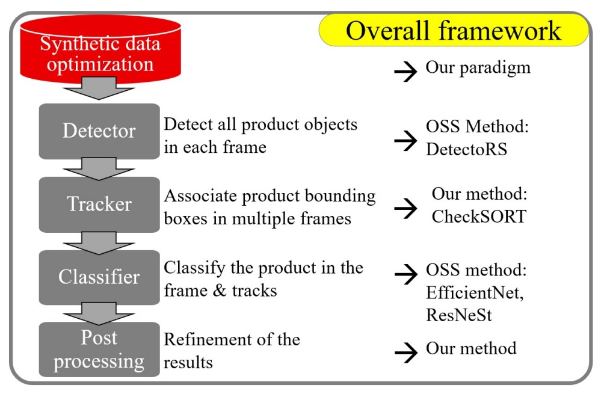
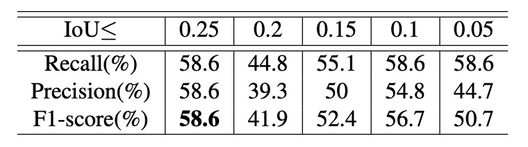

## 堅固な軌跡

[**CheckSORT: Refined Synthetic Data Combination and Optimized SORT for Automatic Retail Checkout**](https://openaccess.thecvf.com/content/CVPR2023W/AICity/papers/Shi_CheckSORT_Refined_Synthetic_Data_Combination_and_Optimized_SORT_for_Automatic_CVPRW_2023_paper.pdf)

---

つい最近、2022 AI CITY CHALLENGE Track 4 の DeepACO システムを見たのを覚えていますか？

今回は、2023 AI CITY CHALLENGE のチャンピオン論文を見ていきます。

## 問題の定義

セルフレジは小売業界の標準となりつつあり、無人店舗から従来の店舗のデジタルトランスフォーメーションまで、画像認識システムを通じて、**ユーザーの操作を妨げずに、迅速かつ正確に商品と数量を識別する**ことが求められています。

このタスクは、コンピュータビジョン分野で一般的に「多クラス商品検出、分類、カウント」を組み合わせたマルチモジュールシステムとして形式化されます。

一見すると、既存の物体検出、追跡、分類技術を組み合わせるだけのように見えますが、実際に取り組むと多くの問題に直面します。

完全な映像ベースの自動レジシステムは、少なくとも以下の 5 つのモジュールを含みます：

<figure style={{"width": "60%"}}>

</figure>

1. **前処理**：クリーンな合成データから実写に近いトレーニングサンプルをどう生成するか？
2. **物体検出**：商品と手の位置をどう特定し、マスクを取得して後続処理に活かすか？
3. **物体追跡**：短時間かつ重複する可能性のある商品軌跡をどう追跡するか？
4. **商品分類**：認識率をどう向上させ、視点・遮蔽・照明変化に適応させるか？
5. **後処理**：複数フレームの一時的結果から最終的なレジ商品リストをどう統合するか？

著者は、各パートが慎重に設計されて初めて、実用的な要求を満たせると考えています。

## 問題の解決

自動レジの課題で最も難しいのは、代表的なトレーニングデータの取得であり、これは現場撮影に加え、人手によるフレーム単位のアノテーションが必要です。

そこで著者はまず**合成データの最適化**に着手し、制御可能なデータ合成プロセスを提案し、多様な合成画像を大量に生成しました。

### 合成データ最適化

具体的には、参加者は各商品について純粋な合成画像とマスクを受け取り、自ら背景を生成し、合成してトレーニング用画像を作成します。

このプロセスは単純に見えますが、今回の大会結果からも明らかなように、勝敗を分ける重要な鍵となりました。

商品と背景の合成方法がモデル性能の上限を決定づけるからです。合成画像のリアリティと多様性を高めるため、著者は以下の 3 つのハイパーパラメータを軸にした制御可能な合成プロセスを設計しました：

- **商品数（number of products）**
- **遮蔽度（occlusion / IoU）**
- **スケーリング比率（scaling size）**

これらは相互に影響します。商品数を増やすと遮蔽が増え、縮小しすぎると画像が劣化します。

そのため、ユーザーは以下のようにパラメータ範囲を設定可能です：

- 商品数：1 ～ 6 個
- 遮蔽上限：IoU ≤ 0.3
- スケール比率：0.15 ～ 0.5

これらの組み合わせにより、多様で大量の合成データが生成されます。

アブレーション実験の結果は以下の通りです：

- **遮蔽を 0.5 以下または遮蔽なしに制御する**ことで最良の結果を得た
- **商品スケールは 0.5 付近が最も安定した精度を示した**

さらに、異なる背景ソースの影響も比較しました。

公式ルールでは外部データの使用は禁止されていますが、著者は制限内で**実写背景画像を用いて商品を合成する**手法を実装し、多くの状況で**合成背景よりも実写背景の方が有効**であることを確認しました。

これにより業界の常識も証明されました：

> **合成データはあくまで次善策であり、実データが利用できるなら常にそちらが価値が高い。**

データ活用戦略として、これらの合成データは以下 2 つのモデル訓練に用いられます：

1. **商品検出（Detection）**：COCO で事前学習した **DetectoRS** モデルをファインチューニング。検出とセグメンテーション両方の能力を持ち、商品と手の遮蔽を同時に認識可能。
2. **商品分類（Classification）**：合成データから背景バリエーションの多い商品画像を抽出し、分類モデルを訓練。

### モデルアーキテクチャ

CheckSORT は DeepSORT と StrongSORT の設計を踏襲しており、関連論文は以下をご参照ください：

- [**[17.03] Simple Online and Realtime Tracking with a Deep Association Metric**](https://arxiv.org/abs/1703.07402)
- [**[22.06] StrongSORT: Make DeepSORT Great Again**](https://arxiv.org/abs/2202.13514)

著者は追跡ロジックに以下 2 つの重要な改良を導入しました：

1. **分解型カルマンフィルター（Decomposed Kalman Filter）**
2. **動的特徴系列管理（Dynamic EMA Tracklet Gallery）**

### SORT アルゴリズムの概要

従来の SORT / DeepSORT / StrongSORT は、「Tracking-by-detection」の二段階方式を採用しており、入力は各フレームの物体検出結果、出力は対応する商品軌跡です。

トラッカー内部では各バウンディングボックスを一つの軌跡（tracklet）として初期化し、**カルマンフィルター**により将来位置を予測します。軌跡はマッチング状況に応じて以下の 3 状態を持ちます：

- `tentative`：新規に生成された軌跡
- `confirmed`：複数フレーム連続で正しくマッチした軌跡
- `deleted`：長時間マッチしないため削除された軌跡

各フレームの処理手順は以下の通りです：

1. **予測**：現在の全 confirmed 軌跡に対して、バウンディングボックスの新位置を予測する。
2. **マッチング**：すべての検出ボックスと軌跡間の距離行列を計算し、ハンガリーアルゴリズムで関連付けを行う。
3. **更新**：マッチ結果に基づき、各軌跡のカルマン状態と内部記述子を更新する。

### 解耦カルマンフィルター

従来のカルマンフィルターはバウンディングボックス状態ベクトルを以下のように表現します：

$$
\mathbf{x} = [x, y, a, h, \dot{x}, \dot{y}, \dot{a}, \dot{h}]
$$

ここで、

- $(x, y)$：中心座標
- $a$：アスペクト比（aspect ratio）
- $h$：高さ
- “$\dot{\ }$” は時間微分（変化率）を表します。

問題は、**中心位置の動き$(x, y)$と外観変形$(a, h)$の運動パターンが大きく異なる**点にあります。以下の図のように、

<figure style={{"width": "90%"}}>

</figure>

- **オレンジ曲線**は商品移動時の$(x, y)$の安定した連続的変化を示す。
- **赤色曲線**は商品が回転した際に$(a, h)$が激しく変動する様子を示す。

この課題に対し、著者は解耦カルマンフィルター（Decomposed Kalman Filter, DKF）を提案し、状態を以下の 2 つの独立したカルマンフィルターで処理します：

- **位置ベクトル**：

  $$
  \mathbf{p} = [x, y, \dot{x}, \dot{y}]
  $$

- **形状ベクトル**：

  $$
  \mathbf{b} = [a, h, \dot{a}, \dot{h}]
  $$

両者は共通の遷移行列 $A$ と観測行列 $H$ を持ちます：

$$
A =
\begin{bmatrix}
1 & 0 & 1 & 0 \\
0 & 1 & 0 & 1 \\
0 & 0 & 1 & 0 \\
0 & 0 & 0 & 1
\end{bmatrix}, \quad
H =
\begin{bmatrix}
1 & 0 & 0 & 0 \\
0 & 1 & 0 & 0
\end{bmatrix}
$$

さらに、**距離行列**構築のため、位置と形状のマハラノビス距離をそれぞれ計算します：

- **位置距離**：

  $$
  d^{(p)}(i,j) = (\mathbf{p}_j - \hat{\mathbf{p}}_i)^\top P_i^{-1} (\mathbf{p}_j - \hat{\mathbf{p}}_i)
  $$

- **形状距離**：

  $$
  d^{(b)}(i,j) = (\mathbf{b}_j - \hat{\mathbf{b}}_i)^\top B_i^{-1} (\mathbf{b}_j - \hat{\mathbf{b}}_i)
  $$

### 動的特徴系列

DeepSORT 以降、軌跡マッチングは位置情報だけでなく外観特徴も統合しています。

CheckSORT では改良として、

- **StrongSORT**は EMA で平滑化した固定長特徴ベクトルを使用するのに対し、
- **CheckSORT**は**動的かつ非連続な特徴プール**を採用し、新規特徴が既存特徴と十分に異なる場合のみ追加することで重複を避けます。

具体的には、

- 各軌跡 $i$ は特徴セット（gallery）を持ち、

  $$
  E_i = \{e^t_i\}, \quad t = 1 \ldots L
  $$

- 新特徴 $e^T_i$ が既存の $E_i$ と十分に異なる場合のみ追加される。

外観距離は次のように定義されます：

$$
d^{(a)}(i,j) = \min \{ 1 - e^T_i \cdot e^t_j \mid e^t_j \in E_j \}
$$

最終的なコスト行列は、位置・形状・外観の 3 つの距離を重み付けして統合されます：

$$
c(i,j) = \lambda_p \cdot d^{(p)}(i,j) + \lambda_b \cdot d^{(b)}(i,j) + \lambda_a \cdot d^{(a)}(i,j)
$$

これによりハンガリーアルゴリズムは、位置・形状・外観の総合的情報に基づき最適なマッチングを実現します。

### 後処理の最適化

前述のマッチング結果は高品質ですが、CheckSORT は最後に「軌跡補正」を行い、以下の 3 種類の誤りを処理します：

1. 軌跡が短すぎるか背景クラスの場合 → **削除**
2. 軌跡の中断が 0.5 秒以上ある場合 → **分割**
3. 同一クラスで時間差が 3 秒未満の複数軌跡 → **統合**

ただし、この後処理は経験則的なもので、論文の主要貢献ではありません。

以下の図は後処理前後の認識差異を示しています：

<figure style={{"width": "60%"}}>

</figure>

## 討論

著者は、**AI CITY CHALLENGE 2023** の第 4 トラックのタスクが前年と若干異なることを発見しました。2023 年のタスクでは、動画内で商品が「初めて出現したフレーム」を予測することが求められ、一方 2022 年は単に「出現した秒数」を予測すればよかったのです。

著者は 2023 年のテストセットで直接アルゴリズムを検証したかったものの、グラウンドトゥルースが提供されていないため、代わりに _TestA 2022_ と _TestA 2023_ の商品出現時間（秒単位）を手動でアノテーションし、評価基準としました。

評価方法は 2022 年のルールを踏襲し、**F1 スコア**を基準とし、

- **TP（True Positive）**：対象領域内で正しく物体を識別できたもの
- **FN（False Negative）**：正しく識別できなかったアノテーション物体

として扱います。

大会では**116,500 枚の合成画像**と、**116 種類の 3D 商品モデル**が提供されました。

### 合成データの影響

<figure style={{"width": "60%"}}>

<figcaption>異なるIoU条件下での CheckSORT の _TestA 2022_ における性能</figcaption>
</figure>

<figure style={{"width": "60%"}}>

<figcaption>異なるIoU条件下での CheckSORT の _TestA 2023_ における性能</figcaption>
</figure>

著者は制御変数実験を設計し、2 つのハイパーパラメータの性能への影響を調査しました。ひとつは **IoU 上限**、もうひとつは **スケール比率の範囲**です。スケールを 0.15 ～ 0.5 に固定し、異なる IoU 上限下での認識性能を観察した結果は上記の通りです。

実験より、**IoU 上限が大きいほど全体の性能は向上**しました。これは、訓練データ中で商品同士の遮蔽が増えるほど、モデルが複雑なシーンにおける多物体認識・追跡能力を向上させることを示しています。

次に IoU 上限を 0.1 に固定し、異なるスケール範囲の性能影響を調査しました。結果は以下の通りです。

<figure style={{"width": "60%"}}>

<figcaption>異なるスケール範囲下での CheckSORT の _TestA 2022_ における性能</figcaption>
</figure>

<figure style={{"width": "60%"}}>

<figcaption>異なるスケール範囲下での CheckSORT の _TestA 2023_ における性能</figcaption>
</figure>

結果から、**スケールが約 0.55 付近で最高の性能を示す**ことがわかりました。

- スケールが大きすぎるとサンプル数が不足し、
- 小さすぎると実環境と乖離し、汎化性能に悪影響を与えます。

### 合成背景と実写背景の比較

前述の最適パラメータ組み合わせを基に、背景スタイルがモデル性能に与える影響をさらに評価しました。

「合成背景」と「実写背景」の 2 種類の設定で、_TestA 2022_ と _2023_ のデータセットで検証した結果は以下です。

<figure style={{"width": "60%"}}>

<figcaption>IoU ≤ 0.5、スケール範囲 0.4～0.8 の条件下での性能比較</figcaption>
</figure>

<figure style={{"width": "60%"}}>

<figcaption>IoU ≤ 0.5、スケール範囲 0.3～0.75 の条件下での性能比較</figcaption>
</figure>

著者は、**どのテストセット・パラメータ設定においても実写背景の方が認識性能を向上させる**と指摘しており、特に「IoU ≤ 0.5、スケール範囲 0.4 ～ 0.8」の条件では約 **8% の性能向上**が確認されました。

### CheckSORT の性能分析

<figure style={{"width": "60%"}}>

<figcaption>IoU ≤ 0.5、スケール範囲 0.3～0.75 の条件下での追跡器比較</figcaption>
</figure>

<figure style={{"width": "60%"}}>

<figcaption>IoU ≤ 0.5、スケール範囲 0.4～0.8 の条件下での追跡器比較</figcaption>
</figure>

最後に、著者は 3 つのトラッカー、**DeepSORT**、**StrongSORT**、そして提案する**CheckSORT**を異なる条件下で比較しました。

結果は、**CheckSORT がすべての設定で他手法を上回り、安定性と汎化能力に優れる**ことを示しています。

現時点での公開ランキングでは、CheckSORT は公式 TestA 評価で **第 5 位** に位置しています。

<figure style={{"width": "60%"}}>

</figure>

## 結論

結果はすでに周知の通りです。

**CheckSORT は 2023 AI CITY CHALLENGE Track 4 の優勝チームとなりました。**

この成果は、自動レジタスクにおける最大の課題が単に追跡や認識の精度向上ではなく、**トレーニングデータと実際のテスト環境間のドメインギャップの縮小**にあることを強調しています。現実世界では、照明変化、遮蔽、商品配置角度などの複雑な要素が絡み、モデルの汎化性能に大きな挑戦をもたらします。

本論文はこの核心的課題に取り組み、以下 2 点の解決策を提示しました：

- ひとつは、IoU 上限とスケールパラメータを調整した**合成データ最適化プロセス**を設計し、代表的なトレーニングサンプルを多数生成したこと；
- もうひとつは、商品レジシーンに特化してフィルタ層で位置と形状情報を解耦し、回転・翻転・遮蔽状態でも追跡が安定する仕組みを提案したこと。

これらの改善は複雑な状況下での認識率を向上させるだけでなく、自動レジシステムの実運用基盤をより堅固なものにしました。

:::info
ご興味のある読者は、以下のリンクからご覧いただけます：

- [**AI City Challenge 2023 Track 4 リーダーボード**](https://www.aicitychallenge.org/2023-challenge-winners/)

  
  :::
