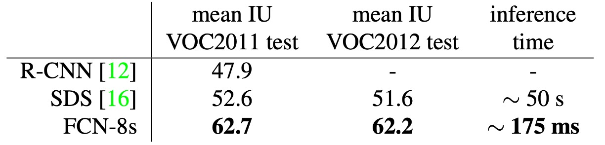
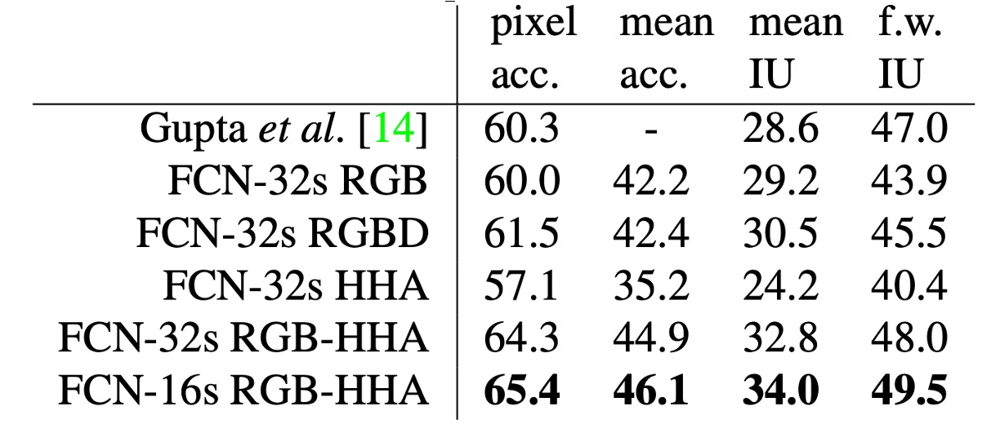
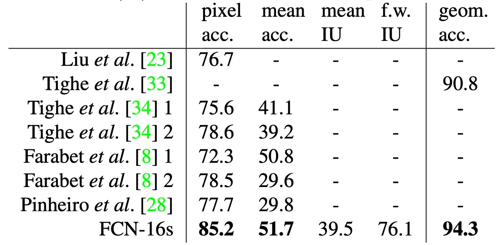

# [14.11] FCN

## 全畳み込みネットワーク

[**Fully Convolutional Networks for Semantic Segmentation**](https://arxiv.org/abs/1411.4038)

---

このようなクラシックな論文を読まないわけがありませんね！

## 問題の定義

画像分割の問題はすでに何年も進展しています。

畳み込みネットワークの台頭に伴い、ますます多くのアプリケーションが画像分割の問題を解決するために畳み込みネットワークを使用しています。従来の手法では、システム全体をいくつかの部分に分割し、全体のプロセスが一貫していない上、膨大な手作業での設計が必要でした。

そこで著者は、全畳み込みネットワークという概念を提案しました。この概念により、画像分割の問題に直接畳み込みネットワークを適用できるようになり、他の処理を経ることなく解決できます。

## 問題の解決

### モデルアーキテクチャ

現在の主流のアーキテクチャは、AlenNet、VGG16、GoogLeNet であり、これらは分類問題に適用されています。

これらのアーキテクチャを画像分割問題に適用するために、著者はそれらの最後の「全結合層」を修正し、全結合層を畳み込み層に変更しました。上の図に示すように。

元々の「全結合層」を使用する場合、入力画像のサイズは制限されます。畳み込み層は任意のサイズの画像を処理できますが、全結合層はそうではありません。そのため、著者は全結合層を畳み込み層に変更しました。これにより、任意のサイズの画像をネットワークに直接入力でき、他の処理を経ることなく処理が可能になります。

処理方法は非常に簡単です。例えば、元の全結合層のサイズが $4096$ の場合、この全結合層を $1 \times 1 \times 4096$ の畳み込み層に変更できます。もし $1 \times 1$ のサイズが小さいと感じる場合、著者が論文で使用したのは $10 \times 10$ の畳み込みカーネルです。

出力後、元の画像サイズに合わせるために、著者はアップサンプリングを使用して出力サイズを元の画像のサイズに拡大しました。拡大過程で、出力チャネル数も調整しています。

この論文では、最終的な出力チャネル数は $21$ です。これは、著者が PASCAL VOC 2011 データセットを使用しているためで、このデータセットには $20$ クラスと背景があり、合計で $21$ クラスとなっています。

### アップサンプリング

論文中で著者は、Shift-and-stitch という技法を紹介しており、この技法は補間を使用せずに粗い出力から密な予測を得る方法です。この技法は OverFeat によって最初に導入されました。

- [**[13.12] Overfeat: Integrated recognition, localization and detection using convolutional networks**](https://arxiv.org/abs/1312.6229)

出力が $f$ 倍ダウンサンプリングされた場合、入力は $x$ ピクセル右に、$y$ ピクセル下にシフトし、各組み合わせ $ (x, y) \in \{0, \dots, f-1\} \times \{0, \dots, f-1\} $ に対して処理が行われます。これらの $f^2$ 組の入力は畳み込みネットワークによって処理され、出力は交差して配置され、予測結果がその受信ドメインの中心ピクセル位置に対応します。

著者は Shift-and-stitch の初期実験を行いましたが、最終的には「逆畳み込み」アップサンプリングによる学習方法を選択しました。なぜなら、この方法の方が効率的であり、後述のスキップ層統合技術と組み合わせるとさらに効果的だからです。

完全なネットワークアーキテクチャは次の図に示されています。

### マルチスケール融合

最も深い層、最も低い解像度の特徴だけを使用する場合、元の画像サイズに戻すと結果が非常に粗くなります。この問題を解決するために、著者はマルチスケール融合の方法を提案しました。

上の図のように、著者は異なる解像度の特徴マップを取り出しました。最小の特徴マップは $1/32$、最大の特徴マップは $1/8$ です。融合過程では、$1/32$ の特徴マップを $1/16$ に拡大し、次にそれを $1/16$ の特徴マップと加算し、さらに結果を $1/8$ に拡大して $1/8$ の特徴マップと加算します。最後に、元の画像のサイズに拡大します。

この技法は著者によって「スキップ層」と呼ばれ、こうすることでモデルはより良い結果を得ることができます。次の図のように：

最左の画像は、$1/32$ の特徴マップを直接元画像サイズに拡大した結果です。中央はマルチスケール融合を使用した結果です。$1/16$ と $1/8$ の特徴マップを元画像と加算した結果、中央の画像はより滑らかで、詳細な情報が含まれているのがわかります。

:::tip
おや！これって FPN じゃないですか！まさに時代を先取りした論文ですね！
:::

### 訓練データセットと戦略

著者は PASCAL VOC 2011 セグメンテーションチャレンジを使用して訓練と検証を行い、各ピクセルに対して多項式ロジスティック損失を用いて訓練を行い、平均交並比（mean IoU）を評価指標として使用しました。すべてのモデルは Caffe フレームワークを使用し、単一の NVIDIA Tesla K40c 上で訓練およびテストが行われました。

1. **学習率**：モデルはモーメンタム付き確率的勾配降下法（SGD）を使用して訓練され、モーメンタムは 0.9、重みの減衰は $5 \times 10^{-4}$ または $2 \times 10^{-4}$ に設定されています。学習率は $10^{-3}$、$10^{-4}$、$5 \times 10^{-5}$ に固定されています（それぞれ FCN-AlexNet、FCN-VGG16、FCN-GoogLeNet に対応）。これらの値は線形探索によって決定されました。分類用の畳み込み層のパラメータはランダムに初期化され、ドロップアウト（元の分類ネットワークと同様）も使用されましたが、ランダム初期化は性能や収束速度には効果がないことがわかりました。

2. **訓練データ**：各画像を規則的な重複区画に分割し、ランダムサンプリングと比較して、サンプリングが収束速度に与える影響はわずかであることが判明しましたが、全画像で訓練する方が時間的に効率的であったため、全画像で訓練することにしました。
3. **クラスバランス**：全畳み込み訓練では、加重やサンプリングでクラスバランスを取ることができます。ラベルに若干の不均衡（約 3/4 が背景）があるものの、結果としてクラスバランスを取る必要はないことが示されました。
4. **密な予測**：出力はネットワーク内の逆畳み込みによって密に予測され、最終的な層の逆畳み込みフィルターは双線形補間で固定され、中間層の上採サンプリングは双線形補間で初期化され、その後学習されます。shift-and-stitch 技法やフィルターの疎化に関する等価手法は使用されていません。
5. **データ拡張**：ランダムに画像を左右反転および最大 32 ピクセルの範囲で平行移動させるデータ拡張を試みましたが、顕著な改善は見られませんでした。
6. **追加の訓練データ**：PASCAL VOC 2011 訓練セットの 1112 枚の画像で初期訓練を行い、その後、Hariharan らによって注釈が付けられた 8498 枚の PASCAL 画像データを追加し、FCN-VGG16 の検証スコアを 3.4 ポイント向上させ、平均 IoU を 59.4 に達しました。

### 評価指標

論文では、語義分割とシーン解析における一般的な評価指標として、ピクセル精度と区域交並比（IoU）の変種を報告しています。

計算式は次の通りです：

- **ピクセル精度（Pixel Accuracy）**：

  $$
  \sum_i \frac{n_{ii}}{\sum_i t_i}
  $$

  $n_{ii}$ は第 $i$ 類においてモデルが正しく予測したピクセル数（すなわち、実際にクラス $i$ であり予測もクラス $i$ のピクセル数）を示し、$\sum_i t_i$ は画像内の全てのピクセル数を示します。

  ピクセル精度は最も基本的な評価指標で、モデルが画像全体でどれだけ正確に予測したかを直接示します。しかし、データセット内で特定のクラス（背景など）が多くのピクセルを占める場合、この指標は小さな物体の予測ミスを隠してしまうことがあります。

  ***

- **平均精度（Mean Accuracy）**：

  $$
  \frac{1}{n_{cl}} \sum_i \frac{n_{ii}}{t_i}
  $$

  $t_i$ は実際にクラス $i$ であるピクセル数、$n_{ii}$ はモデルが正しくクラス $i$ と予測したピクセル数です。

  平均精度は各クラスの予測精度を考慮し、それらの精度の平均を取ります。この利点は、クラスごとに少ないピクセル数であっても、その予測精度を公平に評価できることです。この指標はクラス不均衡問題の影響が小さく、各クラスにおけるモデルの一貫性を反映します。

  ***

- **平均交並比（Mean IoU）**：

  $$
   \frac{1}{n_{cl}} \sum_i \frac{n_{ii}}{t_i + \sum_j n_{ji} - n_{ii}}
  $$

  分子部分 $n_{ii}$ は正確に予測されたピクセル数、分母部分 $t_i + \sum_j n_{ji} - n_{ii}$ はそのクラスの予測と実際の結果の結合（正しい予測ピクセル数と誤った予測ピクセル数を含む）を示します。

  平均交並比は分類予測の効果を測る指標で、各クラスの予測の正確さと誤りの程度を考慮します。この指標は各クラスの交並比を計算し、全クラスの平均値を取ることでモデルの全体的なパフォーマンスを反映します。ピクセル精度と比べて、Mean IoU はクラス間の不均衡に対してよりバランスの取れた指標で、小物体や大物体の予測においても一定の区別を持たせます。

  ***

- **加重交並比（Frequency Weighted IoU）**：

  $$
  \frac{1}{\sum_k t_k} \sum_i \frac{t_i n_{ii}}{t_i + \sum_j n_{ji} - n_{ii}}
  $$

  加重交並比はクラスの出現頻度を考慮し、各クラスの総ピクセル数 $t_i$ を重みとして、各クラスの交並比を加重平均します。この式の分母 $\sum_k t_k$ は全てのピクセルの総数であり、各項 $t_i n_{ii}$ はそのクラスの正しい予測数とそのクラスのピクセル総数を掛け合わせたものです。これにより、ピクセルが多いクラス（背景など）を強調することができます。

  加重交並比は、語義分割評価の際、各クラスの予測精度を考慮するだけでなく、クラスが全体データセット内で占める割合も加味しています。これはクラス不均衡問題に役立ち、ピクセル数が多いクラス（背景など）が最終的な結果に大きな影響を与えるようになります。この指標は実際の応用シーンでは、一般的なクラスのパフォーマンスに敏感です。

## 討論

### PASCAL VOC 結果

上表は FCN-8s が PASCAL VOC 2011 および 2012 のテストセットでどのように機能したかを示し、以前の最良のシステム SDS や有名な R-CNN と比較しています。

平均交並比で、私たちの結果は以前の最良結果を 20% 向上させました。推論時間も大幅に短縮され、畳み込みネットワーク部分だけの計算速度は 114 倍速く、全体の推論時間は 286 倍速くなりました。

### NYUDv2 結果

著者は最初に RGB 画像で未修正の粗いモデル（FCN-32s）を訓練し、その後深度情報を追加してモデルを四チャンネルの RGB-D 入力（early fusion）に拡張しましたが、改善効果は限定的でした。

Gupta らの研究に基づき、著者は HHA 深度エンコードを使用し、RGB と HHA の「後期融合」（late fusion）を行い、最終的に 16 ステップのバージョンにアップグレードしました。

:::tip
NYUDv2 データセットには 1449 枚の RGB-D 画像が含まれており、各画像にはピクセル単位でのアノテーションがあり、40 のクラスに基づいた語義分割タスクが組み込まれています。
:::

### SIFT Flow 結果

著者は双頭の FCN-16s モデルを訓練し、語義および幾何学的ラベルの両方を予測しました。このモデルは、それぞれのモデルを別々に訓練した場合と同等のパフォーマンスを示し、学習および推論速度もほぼ同じです。

上表は標準的なデータ分割（2488 枚の訓練画像と 200 枚のテスト画像）での結果を示し、両方のタスクで最新の最良のパフォーマンスを達成しました。

:::tip
SIFT Flow データセットには 2,688 枚の画像が含まれており、33 の語義クラス（「橋」、「山」、「太陽」など）と、三つの幾何学的クラス（「水平」、「垂直」、「空」）があります。
:::

## 結論

FCN の提案は画期的な貢献であり、畳み込みネットワークの利点を語義分割タスクに十分に拡張し、その後の多くの画像分割技術の基盤を築きました。跳躍接続技術と全畳み込みアーキテクチャの革新により、語義分割はエンドツーエンドのタスクとして実現可能となりました。

FCN は出力精度、リソース消費、そして多尺度特徴の融合において改善の余地はありますが、その考え方と技術は今後の画像分割研究にとって重要な指導的意義を持っています。
