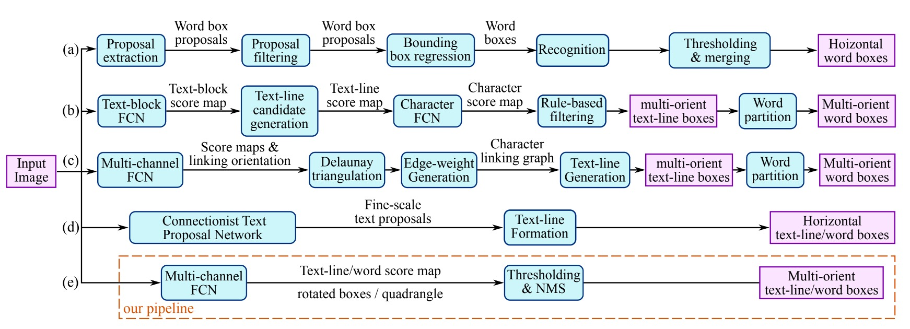
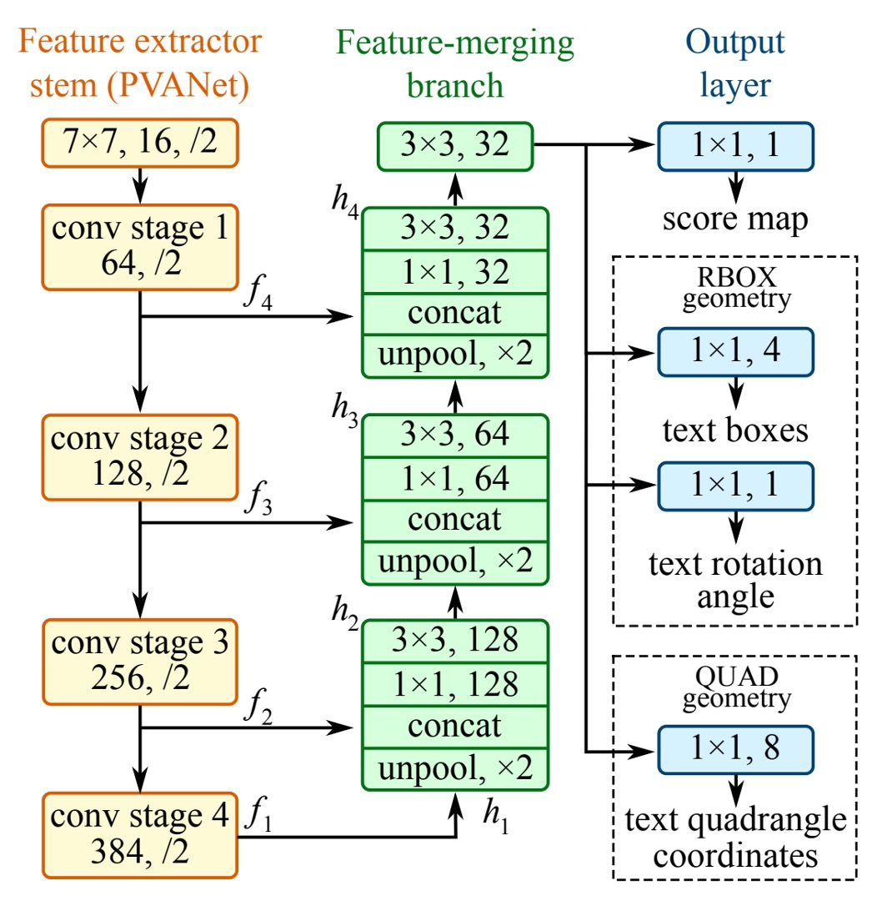
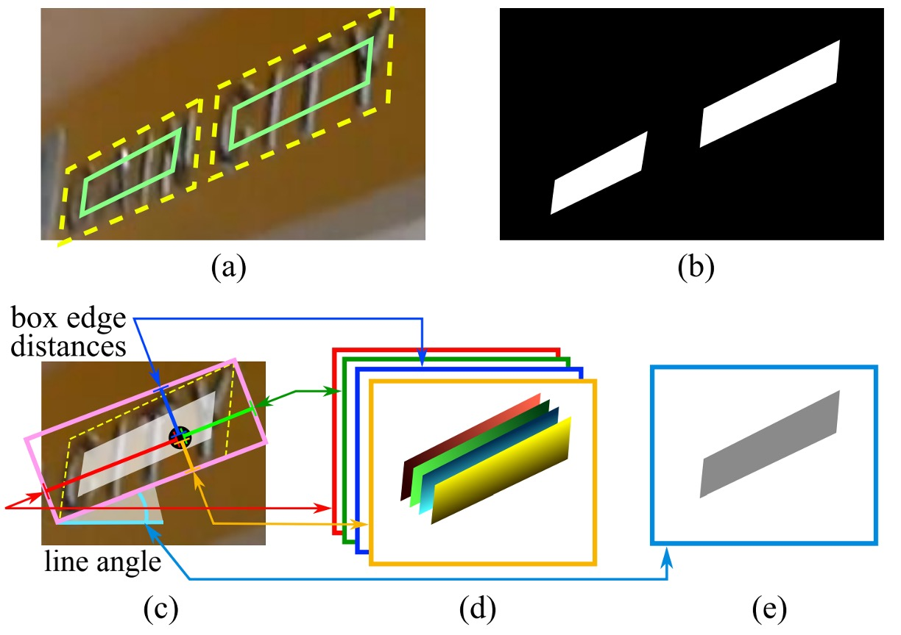
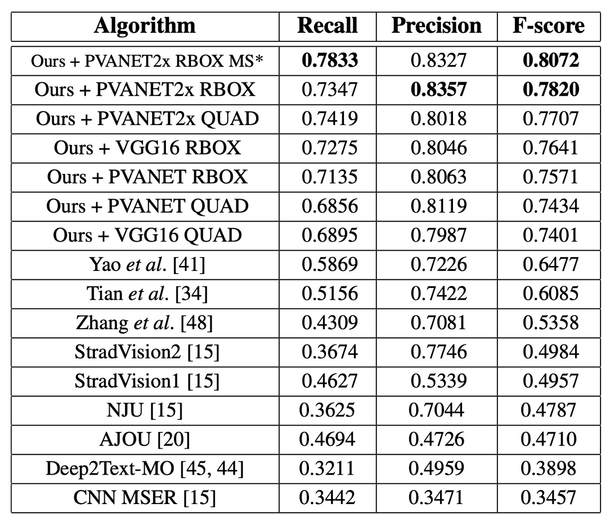
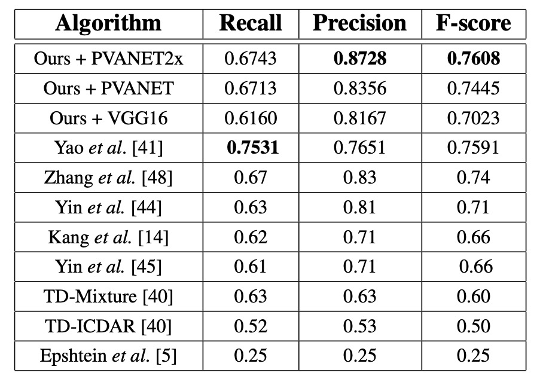

## 東の日の出

[**EAST: An Efficient and Accurate Scene Text Detector**](https://arxiv.org/abs/1704.03155)

---

全畳み込みネットワーク（FCN）が流行し始めた後、密な予測手法が文字サイズの大きな変化の問題を解決しました。その後、マルチスケール特徴融合の概念が正式に人々の視野に入ってきました。U-Net 論文では、異なる層の特徴を結合して融合し、物体検出の精度を向上させる方法を提案しました。

問題を解決するためのツールが整ったので、研究者たちはそのツールを使う場所を探し始めました。

文字検出分野も当然この流れに乗りました。

## 問題の定義

著者は過去の文献で使用された文字検出手法を整理しています。上の図に示すように、多くの手法は 2 つ以上のステップを必要とします。例えば、文字領域特徴計算、方向計算、領域統合などです。また、手動で設計された特徴に依存する手法もあり、筆画幅や最大安定極値領域などを基にしています。

しかし、著者はこれらの手法が嫌いです。なぜなら、これらの手法は非常に多くのステップを必要とし、使いにくいからです！

著者の目標は、シンプルで効率的な方法を提案することです。

## 問題の解決

文字領域のサイズは大きく変動するため、大きな文字領域の存在を確認するには神経ネットワークの後期特徴が必要であり、小さな文字領域の精確な幾何学的形状を予測するには初期の低レベル情報が必要です。したがって、モデルはマルチスケール特徴を融合する必要があります。

### モデルアーキテクチャ

上の図の最左の黄色いブロックは、私たちがよく知っているバックボーンネットワークで、自由に変更できます。論文では、著者は VGG16 をバックボーンネットワークとして使用しています。

緑のブロックは特徴ピラミッドネットワークで、著者は U-Net を特徴ピラミッドネットワークとして使用しましたが、元の U-Net 構造をそのまま使用するのではなく、いくつかの修正を加えています。

ここでは U-Net の詳細については述べませんが、興味のある読者は以下を参照できます：

- [**[15.05] U-Net: 融合の序章**](../../feature-fusion/1505-unet/index.md)

最後は検出ヘッドの設計です。

著者は U-Net ネットワークの「最大解像度」の特徴マップを用いて予測を行い、これを三つの部分に分けました：

1. **RBOX**：4 つの軸に整列した境界ボックスと 1 つの回転角度から成り、合計で 5 つのチャネルを出力します。4 つのチャネルは、それぞれ矩形の上、下、左、右の 4 つの辺までのピクセル位置の距離を表します。
2. **QUAD**：4 つの点から成り、合計で 8 つのチャネルを出力します。四辺形の 4 つの角の頂点からピクセル位置への座標オフセットを表します。$\Delta x$ と $\Delta y$ を区別する必要があるため、8 つのチャネルを出力します。
3. **SCORE**：文字のスコアを出力し、文字領域であるかどうかを判定します。1 つのチャネルを出力します。

出力の概念図は以下の通りです：

### ラベル生成

1. **四辺形のスコアマップ生成**

   幾何形状が四辺形の場合、スコアマップ内の四辺形の正規領域は元の四辺形を縮小したバージョンとして設計されます。図（a）のように、四辺形 $Q = \{p_i | i ∈ \{1, 2, 3, 4\} \}$ において、$p_i = \{x_i, y_i\}$ は時計回りに並べられた頂点です。

   四辺形を縮小する手順は以下の通りです：

   1. 最初に各頂点 $p*i$ の参照長さ $r_i$ を計算します。式は以下の通りです：

      $$
      r_i = \min(D(p_i, p_{(i \mod 4)+1}), D(p_i, p_{((i+2) \mod 4)+1}))
      $$

      ここで $D(p_i, p_j)$ は頂点間の L2 距離です。

   2. 四辺形の長い辺 2 本を縮小し、その後短い辺を縮小します。
   3. 対辺に対して、長さの平均を比較し、「長い」辺のペアを判断します。
   4. 各辺 $p_i$ と $p_{(i \mod\ 4)+1}$ の縮小方法は、両端点を辺内側に移動させ、それぞれ $0.3r_i$ と $0.3r_{(i \mod 4)+1}$ だけ移動させます。

2. **幾何マップ生成**

   幾何マップは RBOX または QUAD です。RBOX の生成過程は図（c-e）に示されています。

   四辺形（QUAD）スタイルでラベル付けされたデータセット（例えば ICDAR 2015）に対して、著者は最小面積の回転矩形を生成してその領域を覆います。正のスコアを持つ各ピクセルに対して、そのピクセルがテキストボックスの 4 つの辺からの距離を計算し、これを RBOX の 4 つのチャネルに配置します。

   QUAD の別の Mask ラベルでは、正のスコアを持つ各ピクセルに対して、そのピクセルが四辺形の 4 つの頂点への座標オフセットを表す 8 チャネル幾何マップの値が設定されます。

### 損失関数

総損失関数は次のように表されます：

$$
L = L_s + λ_g L_g
$$

ここで、$L_s$ はスコアマップの損失、$L_g$ は幾何マップの損失、$λ_g$ は両者の重みを調整するために使用されます。

実験では、$λ_g = 1$ に設定されています。

- **スコアマップの損失**

  多くの先進的な検出手法は、クラスバランスサンプリングと難易度の高い負のサンプルを掘り起こす手法を使用して、ターゲット物体の不均衡な分布問題を解決しています。これらの技術は性能を向上させることができますが、微分できないプロセスやパラメータ調整の負担を増加させます。訓練プロセスを簡素化するために、著者はクラスバランス交差エントロピーを使用しました：

  $$
  L_s = \text{balanced-xent}( \hat{Y}, Y^* )
  $$

  $$
  = -β Y^* \log \hat{Y} - (1 - β)(1 - Y^*) \log(1 - \hat{Y})
  $$

  ここで、$\hat{Y}$ は予測されたスコアマップ、$Y^*$ は実際のラベル、$β$ は正と負のサンプルのバランス因子です：

  $$
  β = 1 - \frac{\sum_{y^* \in Y^*} y^*}{|Y^*|}
  $$

  このバランス交差エントロピーは、Yao らによって初めてテキスト検出に使用され、実際のアプリケーションで良好な結果を示しています。

  - [**[16.06] Scene Text Detection via Holistic, Multi-Channel Prediction**](https://arxiv.org/abs/1606.09002)

- **RBOX 損失**

  テキスト検出の一つの課題は、自然のシーンにおけるテキストサイズの大きな違いです。直接的に $L_1$ や $L_2$ 損失を使用すると、大きなテキスト領域の損失が過大になってしまいます。大小のテキスト領域の両方に対して正確な幾何学的予測を行うためには、損失関数はスケール不変性を持つべきです。

  したがって、RBOX の AABB 部分に対して、著者は IoU 損失を使用しています：

  $$
  L_{\text{AABB}} = -\log \text{IoU}( \hat{R}, R^* ) = -\log \frac{| \hat{R} \cap R^* |}{| \hat{R} \cup R^* |}
  $$

  ここで、$\hat{R}$ は予測された AABB 幾何学、$R^*$ は実際の値です。

  回転角度の損失は次のように計算されます：

  $$
  L_{\theta}( \hat{\theta}, \theta^* ) = 1 - \cos( \hat{\theta} - \theta^* )
  $$

  幾何学的な損失の総和は、AABB と角度の損失の加重和です：

  $$
  L_g = L_{\text{AABB}} + λ_{\theta} L_{\theta}
  $$

  ここで、$λ_{\theta}$ は実験で 10 に設定されています。

- **QUAD 損失**

  QUAD に関して、著者は Smooth L1 損失を基にし、単語の四辺形に対して正規化項を加えています。この正規化項は通常、ある方向で長くなります。

  すべての四辺形の座標の順序付き集合は次のように表されます：

  $$
  C_Q = \{x_1, y_1, x_2, y_2, ..., x_4, y_4\}
  $$

  損失関数は次のように表されます：

  $$
  L_g = L_{\text{QUAD}}( \hat{Q}, Q^* )
  $$

  $$
  = \min_{Q' \in P_{Q^*}} \sum_{c_i \in C_Q, c'_i \in C_{Q'}} \frac{\text{smooth L1}( c_i - c'_i )}{8 \times N_{Q^*}}
  $$

  ここで、正規化項 $N_{Q^*}$ は四辺形の最短辺の長さです：

  $$
  N_{Q^*} = \min_{i=1}^{4} D( p_i, p_{(i \mod 4)+1} )
  $$

  $P_Q$ はすべての頂点の順列を示します。公開データセットでは、四辺形のラベル順序が一致しないためです。

### 訓練戦略

ネットワークは ADAM オプティマイザーを使用してエンド・ツー・エンドの訓練を行います。学習を加速するために、画像から均等に 512x512 の切り出し領域を抽出し、バッチサイズ 24 の小さなバッチを構成します。ADAM の学習率は $1 \times 10^{-3}$ から開始し、27300 バッチごとに元の十分の一に減少し、最終的には $1 \times 10^{-5}$ になります。

**訓練は、性能が向上しなくなるまで継続されます。**

:::tip
これは、トレーニングが完了するまでひたすら続ける戦略です。
:::

### 局所感知型 NMS

閾値フィルタリング後、残った幾何学的形状は NMS を使用して統合する必要があります。

従来の NMS アルゴリズムの時間計算量は $O(n^2)$ であり、ここで $n$ は候補となる幾何学的形状の数です。密な予測の状況では、この計算量は受け入れられません。なぜなら、この場合、何千もの幾何学的形状を処理する必要があるからです。

---

近くのピクセルの幾何学的形状は通常、強い相関があると仮定して、著者は「行単位での統合」という手法を提案しました。

同一行にある幾何学的形状について、現在の幾何学的形状と前に統合された幾何学的形状を逐次的に統合します。この改善方法は、最良の場合での計算時間の計算量は $O(n)$ となります。最悪の場合では従来の NMS と同じですが、局所性の仮定が成り立つ限り、実際の運用ではアルゴリズムの速度が要件を満たすことができます。

具体的な手順は以下の通りです：

- [**LA-NMS 実装コード**](https://github.com/foamliu/EAST/blob/master/lanms/lanms.h)

従来の NMS と異なり、ここでは「選択」された幾何学的形状ではなく、「加重平均」によって幾何学的形状が統合されます。これは実際には投票メカニズムの役割を果たします。しかし、理解しやすさのために、著者はここでも「NMS」という用語を機能説明として使用しています。なぜなら、その核心機能は依然として、冗長な幾何学的形状の統合と抑制にあります。

関数 `WEIGHTEDMERGE(g, p)` では、2 つの多角形 $g$ と $p$ の頂点座標が、それぞれのスコアに基づいて**加重平均**されます。統合された多角形を $a$ とすると、各頂点の座標 $a_i$ は、2 つの元の多角形の頂点座標 $g_i$ と $p_i$ を、それぞれのスコアに基づいて加重して計算されます。式は以下の通りです：

$$
a_i = V(g)g_i + V(p)p_i
$$

ここで：

- $V(g)$ と $V(p)$ は、それぞれ多角形 $g$ と $p$ のスコアです。
- $g_i$ と $p_i$ は、2 つの多角形の $i$ 番目の頂点の座標です。
- $a_i$ は統合後の多角形 $a$ の $i$ 番目の頂点の座標です。

統合後の多角形 $a$ の総スコア $V(a)$ は、2 つの元の多角形のスコアの総和です：

$$
V(a) = V(g) + V(p)
$$

### ベンチマークデータセット

提案されたアルゴリズムと既存の手法を比較するために、著者は以下の 3 つの公開ベンチマークデータセットで実験を行いました：ICDAR2015、COCO-Text、MSRA-TD500。

- **ICDAR 2015**

  ICDAR 2015 は文字検出において広く使用されるデータセットで、1500 枚の画像が含まれており、そのうち 1000 枚が訓練用、残りがテスト用に使用されます。文字領域は四辺形の 4 つの頂点でアノテーションされています。

- **COCO-Text**

  現在、最も大きなテキスト検出データセットで、63,686 枚の画像が含まれ、そのうち 43,686 枚が訓練用、20,000 枚がテスト用に使用されます。テキスト領域は軸に整列した境界ボックス（AABB）でアノテーションされています。これは RBOX の特例です。このデータセットでは、角度 $$θ$$ は 0 に設定され、ICDAR 2015 と同様のデータ処理とテスト方法が使用されます。

- **MSRA-TD500**

  これは多言語、任意の方向、長いテキスト行に対応するデータセットです。300 枚の訓練画像と 200 枚のテスト画像が含まれ、テキスト行は行単位でアノテーションされています。訓練セットが小さいため、実験では HUST-TR400 データセットの画像も訓練データとして使用されました。

## 討論

### ICDAR 2015

単一スケールでの F-score は 0.7820 で、マルチスケールテスト後には 0.8072 に達し、過去の最良手法（0.8072 vs. 0.6477）を大きく上回りました。QUAD 出力を使用した場合、文献[41]の最良手法より 0.0924 高く、RBOX 出力の場合は 0.116 高くなりました。

### COCO-Text

すべての設定で、本論文の方法が最良の結果を示し、F-score は 0.0614 向上し、Recall は 0.053 向上しました。

### MSRA-TD500

PVANET2x を使用した場合、F-score は 0.7608 で、過去の最先端システムより 0.0208 高く、精度は 0.0428 向上しました。VGG16 は性能が劣り（F-score 0.7023 vs. PVANET2x の 0.7608）、MSRA-TD500 の評価要求が文レベルの予測であるため、VGG16 の受容野が小さいことが原因です。

### 可視化結果

## 結論

本論文では、シンプルで効率的なテキスト検出フレームワークを設計し、単一の神経ネットワークを通じて画像全体から文字領域の検出と精確な幾何学的予測を行えるようにしました。この方法は複雑な多段階処理を回避し、モデルを軽量化し、実装を容易にしています。

本研究では訓練方法に関する議論が少なく、最終的な結果においてどのコンポーネントが鍵を握っているのかは明示されていませんが、実験結果から見て、この方法は 3 つのベンチマークデータセットで最良の結果を出し、テキスト検出分野における優越性を証明しています。
