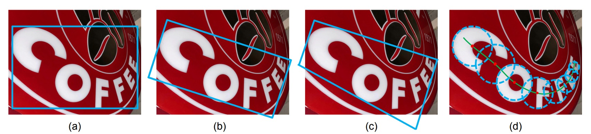
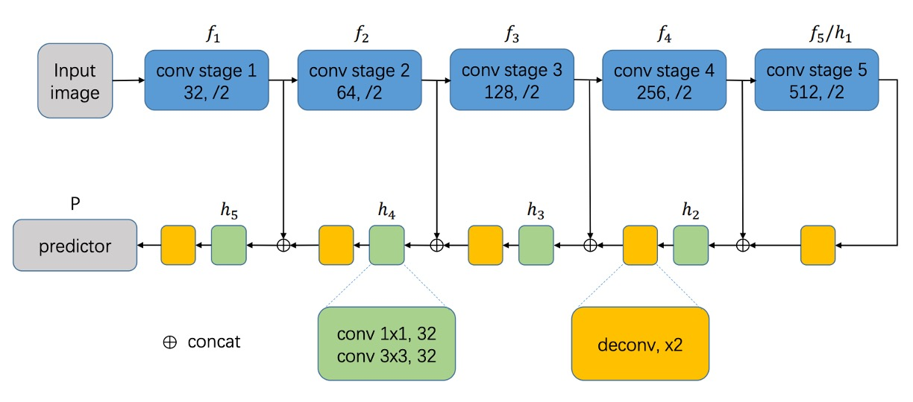
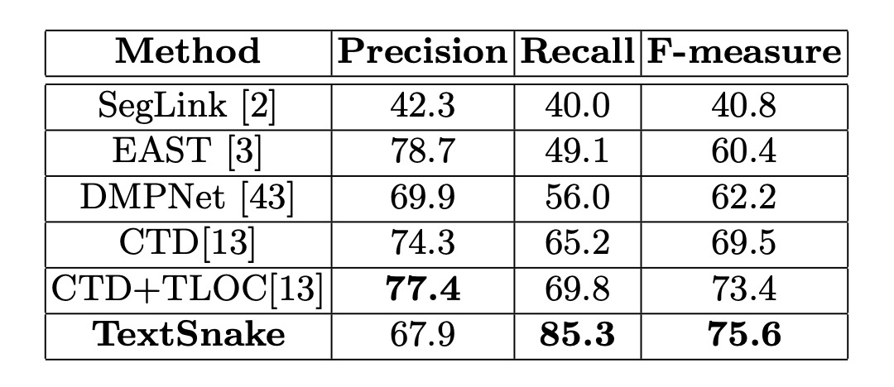
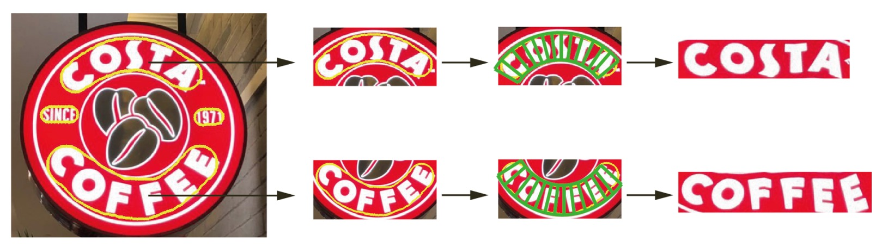

## テキストスネーク

[**TextSnake: A Flexible Representation for Detecting Text of Arbitrary Shapes**](https://arxiv.org/abs/1807.01544)

---

私たちはこの論文が非常に興味深いと感じましたので、一緒に見ていきましょう！

## 問題の定義

文字の形状は様々で、非常に多様です。

しかし、ほとんどの既存の文字検出手法には強い仮定があり、文字のインスタンスは大まかに線形の形状を持っていると仮定し、それを表現するために比較的単純な表現方法（軸に揃えた矩形、回転矩形、または四辺形など）を採用しています。これらの手法は標準的なベンチマークでは進展を遂げていますが、規則的でない形状の文字インスタンス（例えば曲がった文字）の処理には不十分な場合があります。しかし、どの表現方法でも文字の形状をうまく適合させることはできません。

この問題を解決するために、著者は大胆にも円盤型の文字検出方法を提案しています。この表現方法では、文字を一連の順序付きで重なり合った円盤で表現し、各円盤は文字領域の中心軸上にあり、可変の半径と方向に関連付けられています。その形状が蛇のようであるため、**TextSnake**という名前が付けられています。

## 問題の解決

### 表現方法

TextSnake は、文字を一連の重なり合った円盤で表現します。これらの円盤は、回転、スケーリング、曲がりなどの変化に柔軟に対応できます。各円盤は文字の中心線上にあり、半径や方向などの幾何学的属性を持ち、文字の回転、スケーリング、曲がりに適応します。文字の例$t$は複数の文字から構成され、順序付けられた円盤のシーケンス$S(t)$として見ることができます：

$$
S(t) = \{D_0, D_1, \cdots, D_i, \cdots, D_n\}
$$

ここで$D_i$は i 番目の円盤を示し、円盤は全部で$n$個あります。各円盤$D$は幾何学的な属性$D = (c, r, \theta)$を持ち、ここで$c$は円盤の中心、$r$は円盤の半径、$\theta$は円盤の方向です。

円盤の半径$r$は文字の幅の半分として定義され、方向$\theta$は中心$c$の近くの中心線における接線方向です。文字領域$t$は、シーケンス$S(t)$に含まれるすべての円盤の和集合を計算することによって再構築できます。

:::tip
**特に注意**：これらの円盤は具体的な文字キャラクターに対応するわけではありませんが、これらの幾何学的属性を用いて不規則な形状の文字を補正し、矩形や直線の画像領域に変換することで、文字認識器が処理しやすくなります。
:::

### モデルアーキテクチャ

モデル設計の部分は、最初は標準的な操作です。

まず、バックボーンネットワークを選択する必要があります。ここでは VGG16 や ResNet などを選ぶことができます。その後、特徴融合の技術を組み合わせ、著者は U-Net アーキテクチャの融合概念を使用し、異なるスケールの特徴マップを融合します。

全体的に、FCN の方式を踏襲し、エンドツーエンドのピクセル予測を行い、Linear 層を配置せず、直接ピクセルレベルの予測結果を出力します。

:::tip
完全に U-Net 通りにするわけではなく、少し変更がありますが、基本的な方向性は同じで、上に結合して融合します。
:::

---

次に予測ヘッドの設計です。

ここでは U-Net の最大解像度の特徴を使用し、文字のいくつかの幾何学的属性を直接予測します：

1. **TCL（Text Center Line）**：文字の中心線、文字領域かどうかを区別し、2 チャンネル。
2. **TR（Text Region）**：文字領域、文字の範囲を区別し、2 チャンネル。
3. **Radius**：円盤の半径、文字の幅を示し、1 チャンネル。
4. **cos($\theta$) と sin($\theta$)**：円盤の方向、文字の回転を示し、それぞれ 1 チャンネルで、合計 2 チャンネル。

したがって、出力は合計 7 つのチャンネルとなり、これらの属性を使って文字の形状を表現します。TCL と TR を掛け合わせることで文字のコア領域を得ることができ、各文字インスタンスを区別することができます。

### テキストスネーク推論

著者は「ステップアルゴリズム」（striding algorithm）を提案し、文字の形状とパスを正確に予測します。

上の図に示すように、まずランダムに 1 つのピクセルを選び、これを**集中化**（Centralizing）します。その後、2 つの反対方向に検索を行い、**ステップ**（Striding）と集中化を繰り返し、文字の両端に到達するまで続けます。

このプロセスにより、文字インスタンスの両端を表す 2 つの順序付きの点リストが生成され、最終的にこれらのリストを結合して中心軸リストを作成し、文字の形状を正確に記述します。

---

これら 3 つの主要な動作の詳細は次のようになります：

- **Act(a) 集中化（Centralizing）**：

  上の図に示すように、TCL 上の 1 つの点が与えられると、接線と法線を描くことができます（破線は接線、実線は法線）。幾何学的な図を利用して、法線と TCL 領域の交点を見つけ、その交点の中点が**集中点**となります。

- **Act(b) ステップ（Striding）**：

  アルゴリズムは次の点へステップして検索を行い、幾何学的な図を使って各ステップの変位を計算します：

  $$\left( \frac{1}{2}r \cos\theta, \frac{1}{2}r \sin\theta \right)$$ と $$\left( -\frac{1}{2}r \cos\theta, -\frac{1}{2}r \sin\theta \right)$$

  次のステップが TCL 領域を越えた場合、ステップの長さを徐々に減らし、TCL 領域内に戻るか、文字の端に到達するまで続けます。

- **Act(c) スライディング（Sliding）**：

  アルゴリズムは中心軸に沿って反復処理を行い、中心軸に沿って円を描きます。円の半径は幾何学的な図から$r$を取得します。円が覆う領域が予測される文字インスタンスとなります。

著者は幾何学的な図と、文字のパスを正確に記述する TCL を利用することで、文字を検出するだけでなく、その形状とパスも予測します。ステップアルゴリズムは関連するすべてのピクセルを遍歴する非効率な処理を避け、モデルの効率と精度を向上させました。この推論プロセスは、幾何学的特徴とステップ検索を組み合わせ、文字検出と形状再構築の問題をうまく処理しています。

### アノテーション生成方法

文字インスタンスが「蛇形」であると仮定します。つまり、複数の経路に分岐しない文字です。蛇形の文字インスタンスでは、頭と尾の 2 つの辺は平行ですが、方向が逆です。

頂点$\{v_0, v_1, v_2, \dots, v_n\}$から構成される文字インスタンスが与えられ、時計回りまたは反時計回りに並べられます。

各辺$e_{i,i+1}$に対して、次のような尺度を定義します：$$M(e_{i,i+1}) = \cos\langle e_{i+1,i+2}, e_{i-1,i}\rangle$$、2 つの$M$値が最も近い$-1$となる辺が頭と尾の辺と見なされます。例えば、上の図の AH と DE です。

:::tip
2 つの辺の角度を計算するには、内積を用いて計算できます。内積の値域は$[-1, 1]$であり、2 つの辺が平行な場合、内積は 1、垂直な場合は 0、反対の場合は-1 です。
:::

頭と尾の辺に沿って、同じ数のアンカーポイント（anchor points）を均等にサンプリングします。上の図の ABC と HGF のように。TCL 点は対応するアンカーポイントの中点です。TCL の両端は$\frac{1}{2} r_{end}$ピクセル短縮され、TCL が TR 内に収まるようにします。これにより、ネットワークが隣接する文字インスタンスを分離できるようになります。ここで、$r_{end}$は TCL の端点の半径です。TCL が単一の点線としてノイズの影響を受けるのを避けるために、TCL 領域は$\frac{1}{5} r$だけ拡張されます。

各 TCL 点について：

1. $ r $はその点と対応する辺との距離として計算されます。
2. $ \theta $は近傍内で直線をフィッティングすることで、TCL 点の方向を計算します。

非 TCL ピクセルについては、その対応する幾何学的属性を 0 に設定して処理します。

### 損失関数

モデルの総損失関数は次のように定義されます：

$$
L = L_{\text{cls}} + L_{\text{reg}}
$$

ここで、$L_{\text{cls}}$は分類損失、$L_{\text{reg}}$は回帰損失を示します。

- **分類損失（$L_{\text{cls}}$）**：

  $L_{\text{cls}}$には TR（文字領域）と TCL（文字中心線）の分類損失が含まれます：

  $$
  L_{\text{cls}} = \lambda_1 L_{\text{tr}} + \lambda_2 L_{\text{tcl}}
  $$

  ここで、$L_{\text{tr}}$と$L_{\text{tcl}}$はそれぞれ TR と TCL の交差エントロピー損失です。

  モデルの効果を高めるために、TR 損失には「**オンライン困難負サンプル挿入**」（Online Hard Negative Mining）を採用し、負サンプルと正サンプルの比率は最大 3:1 に保たれます。TCL 損失については、TR 領域内のピクセルのみを考慮し、サンプルバランス法は使用しません。

- **回帰損失（$L_{\text{reg}}$）**：

  回帰損失は$r$（半径）、$\cos\theta$、および$\sin\theta$に関する回帰損失を含みます：

  $$
  L_{\text{reg}} = \lambda_3 L_r + \lambda_4 L_{\sin} + \lambda_5 L_{\cos}
  $$

  回帰損失は Smoothed-L1 損失を使用して計算します：

  $$
  \begin{pmatrix}
  L_r \\
  L_{\cos} \\
  L_{\sin}
  \end{pmatrix} = \text{SmoothedL1} \begin{pmatrix}
  \frac{\hat{r} - r}{r} \\
  \hat{\cos\theta} - \cos\theta \\
  \hat{\sin\theta} - \sin\theta
  \end{pmatrix}
  $$

  ここで、$\hat{r_b}$、$\hat{\cos\theta}$、および$\hat{\sin\theta}$は予測値で、$r$、$\cos\theta$、および$\sin\theta$は対応する実際の値です。

損失関数の重み定数$\lambda_1, \lambda_2, \lambda_3, \lambda_4, \lambda_5$は実験で全て 1 に設定されています。

### 訓練データセット

- **SynthText**

  このデータセットはモデルの事前学習に使用されます。合成された約 80 万枚の画像が含まれており、これらの画像は自然なシーンとランダムなフォント、サイズ、色、方向の文字が混在しています。非常に高い現実感を持っています。

- **CTW1500**

  CTW1500 は長い曲線文字検出のための挑戦的なデータセットで、Yuliang らによって構築されました。このデータセットは 1000 枚の訓練画像と 500 枚のテスト画像を含んでいます。伝統的な文字データセット（ICDAR 2015、ICDAR 2017 MLT など）とは異なり、CTW1500 の文字インスタンスは 14 個の点で構成された多角形で、任意の曲線文字の形状を記述できます。

- **Total-Text**

  Total-Text は新しく公開された曲線文字検出データセットで、水平、複数方向、および曲線文字インスタンスが含まれています。このベンチマークデータセットには 1255 枚の訓練画像と 300 枚のテスト画像があります。

- **ICDAR 2015**

  ICDAR 2015 は文字検出で広く使用されているデータセットで、1500 枚の画像が含まれ、そのうち 1000 枚が訓練用、残りがテスト用です。文字領域は 4 つの頂点を持つ四辺形でアノテーションされています。

- **MSRA-TD500**

  これは多言語、任意の方向、長い文字行のデータセットです。300 枚の訓練画像と 200 枚のテスト画像が含まれており、文字行は行レベルでアノテーションされています。訓練セットが小さいため、実験では HUST-TR400 データセットの画像を訓練データとして追加しました。

## 討論

### 曲線文字実験結果

<figure>

<figcaption>Total-Text 実験結果</figcaption>
</figure>

<figure>

<figcaption>CTW1500 実験結果</figcaption>
</figure>

---

これら 2 つのデータセットで、微調整したモデルは約 5000 回のイテレーション後に停止しました。Total-Text では、閾値$T_{\text{tr}}$と$T_{\text{tcl}}$はそれぞれ 0.4 と 0.6 に設定され、CTW1500 ではそれぞれ 0.4 と 0.5 に設定されました。

テストでは、Total-Text のすべての画像は 512 × 512 サイズにリサイズされ、CTW1500 の画像はサイズが小さいため（最大 400 × 600）リサイズされませんでした。

Total-Text では、この方法が精度、再現率、F 値でそれぞれ 82.7%、74.5%、78.4%を達成し、EAST や SegLink の方法を大幅に上回りました。

CTW1500 では、精度 67.9%、再現率 85.3%、F 値 75.6%を達成し、CTD+TLOC 方法より 2.2%高い（75.6%対 73.4%）結果を示しました。

これらの結果は、この方法が自然シーンの曲線文字に効果的に対応できることを証明しています。

### ICDAR2015 実験結果

微調整したモデルは、ICDAR 2015 で約 30000 回のイテレーション後に停止しました。

テストでは、すべての画像が 1280 × 768 サイズにリサイズされ、閾値$T_{\text{tr}}$と$T_{\text{tcl}}$はそれぞれ 0.4 と 0.9 に設定されました。ICDAR 2015 には未ラベルの小さな文字が多く含まれているため、予測された矩形の短辺が 10 ピクセル未満、または面積が 300 未満の場合は除外されます。

ICDAR 2015 での結果は、この方法が単一スケールテストのみで他の競争相手を上回ることを示し、TextSnake が多方向の文字検出における汎用性を示しています。

### MSRA-TD500 実験結果

微調整したモデルは MSRA-TD500 で約 10000 回のイテレーション後に停止しました。

テストでは、すべての画像が 1280 × 768 サイズにリサイズされ、閾値$T_{\text{tr}}$と$T_{\text{tcl}}$はそれぞれ 0.4 と 0.6 に設定されました。

この方法の F 値は 78.3%に達し、他の方法より優れています。XT、CTW1500、ICDAR 2015、MSRA-TD500 におけるパフォーマンスはすべて他の競争方法を上回り、曲線文字、多方向文字、長い直線文字行の処理能力を示しています。

:::tip
良い結果が出ましたが、少し遅いです。
:::

### 可視化結果

## 結論

従来の方法では、曲線文字を処理する際に文字の幾何学的詳細が失われ、文字認識の精度が低下することが多いです。

TextSnake の主な貢献は、不規則な形状の文字を位置付けることにあります。柔軟性と幾何学的な記述能力は、後続の文字認識のためのより正確な基盤を提供します。正確な曲線追跡と中心線の位置付けを通じて、より規則的な文字領域を生成することができ、自然シーンでのエンドツーエンドの文字認識に大いに役立ちます。

論文中では、TextSnake に基づいたフラット化結果も示されています：

今後の研究の方向性は、エンドツーエンドの文字検出と認識システムの開発に焦点を当てる予定です。これは TextSnake の自然な発展です。

このモデルと強力な文字認識アルゴリズムを組み合わせることができれば、より多くのタイプのシーン文字に対応でき、さらに認識精度と効率を向上させることができます。
