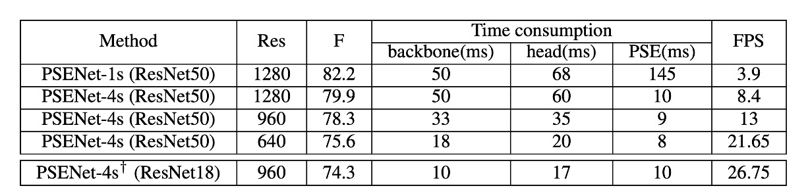

# [19.03] PSENet

## 逐步拡張戦略

[**Shape Robust Text Detection with Progressive Scale Expansion Network**](https://arxiv.org/abs/1903.12473)

---

畳み込みネットワークの発展と成熟に伴い、さまざまな応用が増えています。

その中でも、文字検出は非常に重要な応用分野であり、多くのアプリケーションの基盤となっています。例えば、OCR（光学式文字認識）、自動運転、画像検索などです。しかし、文字の形状やサイズの変化が大きいため、汎用的な文字検出モデルを設計することは挑戦的な問題となっています。

## 問題の定義

初期の発展では、物体検出技術が研究者の主要な関心事でした。そのため、文字検出の分野でも、ほとんどの研究は物体検出技術を基に行われてきました。

しかし、物体検出の手法は文字検出において多くの課題に直面しています。主な要因は以下の通りです：

1. **文字形状の大きな変化**

   文字のサイズ変化は大きいですが、これは問題ではありません。物体検出では、異なるスケールの特徴を使用し、異なるスケールの物体を検出することが一般的な手法です。問題は文字の形状が非常に大きく変化することです。

   例えば、ある文字の場合、検出ボックスは四角形かもしれませんが、文字が増えると検出ボックスはますます長くなり、縦横比も大きくなります。この特性は特にアンカーポイントベースの方法で問題になります。

   基本的な知識に基づいて、モデルに参照させるためのいくつかの縦横比を定義していますが、文字の形状変化が大きすぎて、無限にアンカーポイントを増やすべきなのでしょうか？

2. **矩形ボックスが適合しない**

   上の図 (b) のように、文字は縦横比が大きく変化するだけでなく、形状が通常規則的ではなく、例えば街角の看板や道路の横断幕など、曲がったり不規則だったりします。矩形ボックスではこれらの形状に適切にフィットしません。

   検出は通常、後続の分類のために行われますが、形状が適切にフィットしない場合、検出自体が意味を失ってしまいます。

3. **ピクセル分割の難しさ**

   では、分割ベースの手法を使うという手はどうでしょうか？

   上の図 (c) に示すように、分割ベースの手法には明らかな欠点があります：隣接する文字や重なり合う文字を分割することができません。これは、分割ベースの手法が通常ピクセルベースであり、文字間の間隔が非常に小さいため、この方法では文字間の境界を区別することが難しいからです。

   境界が区別できないということは、検出が失敗することを意味し、これは明らかに受け入れられません。

これらの課題を解決するために、本論文の著者は分割のアイデアを基に新しいアプローチを提案しています。文字のコアを見つけ、そこから徐々に拡張して文字の境界を見つけるという方法です。このアプローチでどのように改善できるでしょうか？

## 解決問題

### モデルアーキテクチャ

モデルのアーキテクチャは非常にシンプルで、上図の左側は一般的なバックボーン + ネックの FPN（Feature Pyramid Network）アーキテクチャです。

多尺度の特徴マップを得た後、これらをすべて連結し、予測ヘッドを通して一連の文字領域を予測します。上図をよく見ると、$S_1$は最小の文字領域、$S_2$は$S_1$の拡張、$S_3$は$S_2$の拡張、というように、$S_n$まで続きます。

これらの監視データはデータセットのラベルから生成され、生成方法は次の図のように行われます：

青色の枠で囲まれた多角形は元の文字インスタンスを表し、これは最大のセグメンテーションラベルマスクに対応します。Vatti 裁断アルゴリズムを用いて、元の多角形を順次縮小し、異なるスケールの多角形$p_i$を得て、各縮小された多角形を二値マスクに変換して、セグメンテーションラベルの ground truth として使用します。

与えられたスケール縮小率$r_i$に基づき、縮小されたマージン$d_i$は以下の式で計算できます：

$$
d_i = \frac{Area(p_n) \times (1 - r_i^2)}{Perimeter(p_n)}
$$

ここで、$Area(\cdot)$は多角形の面積を計算する関数、$Perimeter(\cdot)$は多角形の周囲長を計算する関数です。

スケール縮小率$r_i$は次のように定義されます：

$$
r_i = 1 - \frac{(1 - m) \times (n - i)}{n - 1}
$$

ここで、$m$は最小スケール縮小率で、$(0, 1]$の範囲にあり、スケール縮小率$r_1, r_2, ..., r_n$は二つの超パラメータ$n$と$m$によって決定され、$m$から線形に 1 まで増加します。

この方法で生成された最終的な ground truth ラベルは、PSENet の異なるスケールのセグメンテーション結果に対応し、モデルが多尺度で文字インスタンスのセグメンテーションを学習できるようにします。

### 階層式拡張

著者は文字形状の大きな変化に対応するため、階層式拡張法を提案しました。

この方法のコア概念は、幅優先探索アルゴリズム（Breadth-First Search, BFS）に基づいており、目的は、検出された文字インスタンスのコア（最小コア）を段階的に拡張することです。

- **初期段階**：上図のように、最小コアマップ（$S_1$）を元に、4 つの異なる連結コンポーネントを識別し、それぞれ$c_1$、$c_2$、$c_3$、$c_4$としてラベルを付けます。
- **拡張段階**：最小コアを$S_2$に拡張し、次に$S_3$に拡張し、最終的に得られた連結コンポーネントを文字インスタンスの最終予測結果とします。

BFS を使用して、複数のコアピクセルから始め、隣接する文字ピクセルを段階的に統合します。拡張過程では、ピクセルの衝突が発生する可能性がありますが、その場合は「先来先合併」（つまり、1 つのピクセルは 1 つのコアにしか統合されない）という方法で処理されます。拡張は漸進的であるため、これらの境界衝突は最終的な検出結果やパフォーマンスに影響を与えることはありません。

このアルゴリズムを実装するために、論文中で提供されている参考アルゴリズムは次の通りです：

- **入力**: コアブロック集合$C$、セグメンテーション結果$S_i$
- **出力**: 拡張後のコアブロック$E$
- **主な手順**:
  1. 空の集合$T$、$P$、キュー$Q$を初期化します。
  2. 各コアブロック$c_i$のすべての要素を$T$と$P$に追加し、$c_i$をキュー$Q$に追加します。
  3. $Q$の各要素を取り出し、その隣接ピクセルをチェックします。条件を満たす場合、その隣接ピクセルを$T$、$P$に追加し、拡張を続けます。
  4. 拡張結果をラベルごとにグループ化し、最終的な拡張コアブロック$E$を得ます。

### 損失関数

PSENet の損失関数は次のように定義されます：

$$
L = \lambda L_c + (1 - \lambda)L_s
$$

ここで、$L_c$は完全な文字インスタンスの損失、$L_s$は縮小された文字インスタンスの損失を表し、$\lambda$はこれら二つの重要度を調整するパラメータです。

文字インスタンスは自然画像では通常非常に小さな領域を占めるため、二値交差エントロピー（binary cross entropy）を使用すると、ネットワークの予測が文字以外の領域に偏る可能性があります。

これを解決するために、著者は Dice 係数を用いて損失を評価します。その公式は次の通りです：

$$
D(S_i, G_i) = \frac{2 \sum_{x,y}(S_{i,x,y} \times G_{i,x,y})}{\sum_{x,y} S_{i,x,y}^2 + \sum_{x,y} G_{i,x,y}^2}
$$

ここで、$S_{i,x,y}$と$G_{i,x,y}$はそれぞれ、分割結果とラベル画像中のピクセル$(x, y)$の値を示します。

訓練過程では、文字の筆跡に似た画像パターン（例えばフェンスや格子）を区別するため、オンライン困難負サンプル挿入（OHEM）技術を使用して$L_c$を強化します。

OHEM によって提供された訓練マスク$M$を考慮すると、$L_c$の式は次のようになります：

$$
L_c = 1 - D(S_n \cdot M, G_n \cdot M)
$$

縮小された文字インスタンスは完全な文字領域に囲まれているため、$L_s$の計算では「非文字領域」のピクセルを無視して、冗長性を避けます。

$L_s$の式は次の通りです：

$$
L_s = 1 - \frac{\sum_{i=1}^{n-1} D(S_i \cdot W, G_i \cdot W)}{n - 1}
$$

ここで、$W$は非文字領域を無視するためのマスクで、定義は次の通りです：

$$
W_{x,y} =
\begin{cases}
1, & \text{もし} S_{n,x,y} \geq 0.5; \\
0, & \text{それ以外の場合}.
\end{cases}
$$

### 訓練データ

- **CTW1500**

  CTW1500 は長い曲線文字検出のためのチャレンジングなデータセットで、Yuliang らによって構築されました。このデータセットは 1000 枚の訓練画像と 500 枚のテスト画像を含み、従来の文字データセット（ICDAR 2015、ICDAR 2017 MLT など）とは異なり、CTW1500 の文字インスタンスは 14 個の点で構成された多角形で、任意の曲線文字の形状を表現します。

- **Total-Text**

  Total-Text は新しく公開された曲線文字検出のデータセットで、水平、複数方向、曲線文字のインスタンスを含みます。このベンチマークデータセットは 1255 枚の訓練画像と 300 枚のテスト画像を含みます。

- **ICDAR 2015**

  ICDAR 2015 は文字検出でよく使用されるデータセットで、1500 枚の画像を含み、うち 1000 枚が訓練用、残りがテスト用です。文字領域は四つの頂点を持つ四辺形でアノテーションされています。

- **ICDAR 2017 MLT**

  IC17-MLT は大規模な多言語文字データセットで、7200 枚の訓練画像、1800 枚の検証画像、9000 枚のテスト画像を含み、9 種類の言語からなる完全なシーン画像が含まれています。

### 訓練戦略

ImageNet で事前訓練された ResNet をバックボーンネットワークとして使用し、確率的勾配降下法（SGD）で最適化を行います。

IC17-MLT データセットの訓練方法は他のデータセットと異なります：

IC17-MLT の訓練では、追加のデータ（例えば SynthText）は使用していません。モデルの訓練時のバッチサイズは 16 で、4 台の GPU を使って 180K 回のイテレーションを行います。初期学習率は$1 \times 10^{-3}$に設定し、60K 回および 120K 回のイテレーション後に学習率を元の十分の一に減らします。

---

IC17-MLT 以外のデータセットの訓練戦略は次の通りです：

バッチサイズは 16 に設定し、4 台の GPU を使用して 36K 回のイテレーションを行います。初期学習率は$1 \times 10^{-3}$に設定し、12K 回および 24K 回のイテレーション後に学習率を十分の一に減らします。

その後、IC17-MLT データセットでモデルを微調整し、訓練回数は 24K、初期学習率は$1 \times 10^{-4}$に設定し、12K 回で学習率を十分の一に減らします。

:::tip
論文には他のデータセットで使用した事前訓練データセットについて記載されていませんが、おそらく SynthText を使用していると推測されます。
:::

- **最適化とパラメータ設定**

  - 重み減衰値は$5 \times 10^{-4}$、ネステロフモメンタムは 0.99、ダンピングは使用しません。
  - 訓練中、すべてのデータセットにおいて「DO NOT CARE」のぼやけた文字領域は無視されます。
  - 損失関数のバランスパラメータ$\lambda$は 0.7 に設定し、OHEM の負の正のサンプル比率は 3 に設定されます。

- **データ拡張戦略**

  - 画像はランダムなスケールで[0.5, 1.0, 2.0, 3.0]の範囲で縮小されます。
  - 画像はランダムに水平方向に反転および ±10 度の範囲で回転されます。
  - 変換後の画像からランダムに$640 \times 640$のサンプルをクロップします。

- **結果生成**

  - 四辺形文字データセットの場合、最小面積の矩形を計算して境界ボックスを抽出します。
  - 曲線文字データセットの場合、PSE の出力を使用して最終的な結果を生成します。

## 討論

### 各組件設計の影響

1. **コアブロック (Kernel) は最終結果として使用できるか？**

   答えはできません。

   コアブロックの目的は、テキストインスタンスを大まかに位置付け、隣接するテキストインスタンスを区別することです。しかし、最小スケールのコアブロックでは、テキスト領域全体をカバーすることができず、これがテキスト検出と認識に悪影響を及ぼします。上の図 (a) に示すように、最小スケールのコアブロックのみを最終結果として使用した場合、ICDAR 2015 と CTW1500 データセットでの F-measure のパフォーマンスは非常に悪化します。

2. **最小コアスケールの影響**

   著者はコアの数 $n = 2$ を設定し、最小コアスケール $m$ を 1 から 0.1 に変化させ、その性能への影響を調べました。

   上の図 (a) から分かるように、$m$ が大きすぎたり小さすぎたりすると、テストセットでの F-measure が低下します。$m = 1$ の場合、テキスト分割マップのみを最終結果として使用し、進行的スケール拡張アルゴリズム（PSE）を使用しません。結果として、PSE がないベースラインのパフォーマンスは良好ではなく、ネットワークは隣接するテキストインスタンスを区別できません。

   $m$ が大きすぎると、PSENet は近接するテキストインスタンスを分離することが難しくなります。一方、$m$ が小さすぎると、PSENet はしばしばテキスト行全体を誤って異なる部分に分割し、訓練の収束が難しくなります。

3. **コア数の影響**

   著者は最小スケール $m$ を一定に保ち、異なるコア数 $n$ の PSENet を訓練してその影響を調べました。ICDAR 2015 データセットでの $m = 0.4$ と CTW1500 データセットでの $m = 0.6$ を設定し、$n$ を 2 から 10 に増加させました。

   結果は上の図 (b) に示されており、$n$ の増加に伴い、テストセットでの F-measure は徐々に上昇し、$n \geq 5$ のときに安定します。複数のコアの利点は、隣接しているときに、サイズが異なる 2 つのテキストインスタンスを正確に再構築できる点にあります。

### 曲線テキスト実験結果

曲線テキストの検出能力をテストするために、著者たちは Total-Text データセットで PSENet を評価しました。この 2 つのデータセットは主に曲線テキストを含んでいます。

テスト段階では、画像の長辺を 1280 にスケールし、ResNet50 のみをバックボーンネットワークとして使用しました。

- **CTW1500**

  

  PSENet は CTW1500 で全ての対照手法を上回り、外部データを使用していないにもかかわらず、PSENet の F-measure は 82.2% に達し、CTD+TLOC より 8.8% 高く、TextSnake より 6.6% 高くなっています。

- **Total-Text**

  

  Total-Text で、PSENet の精度（84.02%）、再現率（77.96%）、および F-measure（80.87%）は既存の方法を上回り、F-measure は 2.47% 以上向上しました。特に、PSENet は Total-Text での基準方法に比べて F-measure が 40%以上高くなっています。

---

著者はまた、いくつかの挑戦的な結果を示し、現行の CTD+TLOC 方法との視覚的比較を行いました。以下の図の通りです：

### ICDAR2015 実験結果

著者は ICDAR 2015 (IC15) データセットで PSENet を評価し、その方向テキスト検出能力をテストしました。ここでは、PSENet のバックボーンネットワークとして ResNet50 のみを使用しています。推論中には、入力画像の長辺を 2240 にスケールしました。

単一スケール設定では、PSENet の F-measure は 85.69% に達し、既存の最良結果を 3%以上上回りました。

### 速度分析

著者は CTW1500 のテストセットで実験を行い、すべてのテスト画像を評価して平均速度を計算しました。入力画像の長辺を [1280, 960, 640] にスケールして速度をテストしました。すべての結果は PyTorch と 1 枚の 1080Ti GPU を使用してテストされました。

速度と精度のバランスを取るために、ResNet50 と ResNet18 をバックボーンネットワークとして使用しました。

- 出力特徴マップのサイズが入力画像の 1/1 の場合、PSENet は最良のパフォーマンスを得られますが、特徴マップが大きいため、PSE 階段の時間消費は総推論時間の半分を超えました。
- 出力特徴マップのサイズが入力画像の 1/4 の場合、PSENet の FPS は 3.9 から 8.4 に増加しましたが、パフォーマンスは 82.2% から 79.9% にわずかに低下しました（表 2 を参照）。この時、PSE 階段の時間消費は総推論時間の十分の一未満となります。
- 入力画像の長辺を 640 にスケールすると、FPS はさらに 22 に向上し、検出器のパフォーマンスは 75.6% のままで維持されました。

ResNet18 をバックボーンネットワークとして使用した場合、PSENet の速度はほぼリアルタイム処理レベル（27 FPS）に達し、パフォーマンスは依然として競争力があります。

## 結論

PSENet の核心的なアイデアは、逐次拡張を通じて不規則形状のシーンテキストの問題を解決することです。しかし、最終的には、テキスト領域を確定するために一定の後処理が必要であり、これが実際のアプリケーションでは計算量と複雑性を増加させます。

また、逐次拡張戦略は初期段階で認識されたテキストのコア領域に依存しています。もしコア領域の検出に誤りがあると、その後の拡張ステップが影響を受け、最終的な検出結果に影響を与えます。

結論として、PSENet は精度と速度の良いバランスを達成しており、さまざまな実際のアプリケーションシーンに適しています。意味的分割や物体検出に基づく他の手法と比較して、PSENet はシーン内で検出が難しいテキストを処理するための新しいアプローチを提供し、テキスト検出分野において大きな前進を遂げました。
