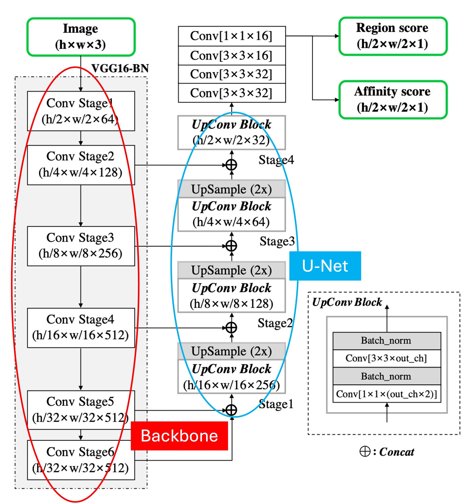
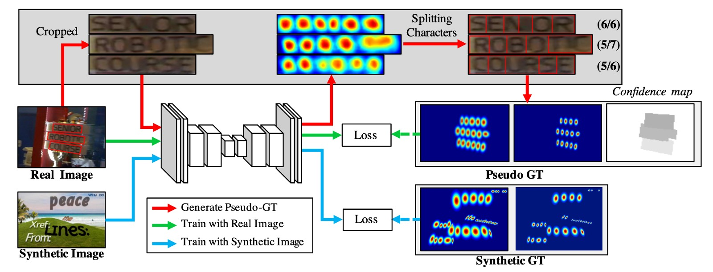

## ワードクラフト

[**Character Region Awareness for Text Detection**](https://arxiv.org/abs/1904.01941)

---

今日は有名なテキスト検出論文、CRAFT を見ていきます。

他のテキスト検出論文と異なる点は、これは「文字」単位でのテキスト検出手法であることです。

## 問題の定義

「文字」単位でのテキスト検出を行っている研究はあまり多くありません。その主な理由は、データが不足しているからです。

その後、「Wordsup」という論文が登場しました。この論文では、弱教師ありフレームワークを使用して文字単位のテキスト検出器を訓練しましたが、文字を定位するために矩形アンカーポイントを使用しました。

- [**[17.08] Wordsup: Exploiting word annotations for character based text detection**](https://arxiv.org/abs/1708.06720)

著者はこの方法が十分に正確でないと考え、これを基に CRAFT を提案しました。

## 解決問題

### モデルアーキテクチャ

モデルの基本アーキテクチャについては、特に言うことはなく、Backbone + Neck の構造です。

上の図のように、少し注釈を加えました。赤い枠で囲まれた部分は Backbone で、ここでは VGG16 を使用しています。青い枠で囲まれた部分は Neck で、ここでは U-Net 形式を採用しており、特徴融合の形式には Add ではなく Concat を使用しています。

:::tip
上位での融合段階で、加算を使用すれば FPN-like の構造になり、Concat を使用すれば U-Net-like の構造になります。
:::

少し異なる点は、ここでの Backbone が Stage 6 まで実行されていることです。おそらく著者はモデルの受容野を増やすためにこのようにしているのでしょうが、私たちの経験では、テキストのような小さな物体では、主に予測を担当するのは浅い特徴マップなので、Stage 6 はデータセット内の巨大な文字に対応するために使われる可能性があります。

最後に予測ヘッドの構造ですが、ここでは最高解像度の出力特徴マップを使い、2 つのチャネルのスコアマップ（それぞれ、領域スコアと連結スコア）を予測します。

では、領域スコアと連結スコアとは何でしょうか？

これは次に説明しますので、続きをご覧ください。

### ラベル生成

予測ヘッドについて説明する前に、ラベル生成について先に説明します。

著者はまず、文字単位のアノテーションが付けられたデータセットを選び、これらのラベルは通常、マスクまたは文字ボックスで表されます。

各トレーニング画像に対して、著者は文字単位の境界ボックスを生成するために以下のものを使用しました：

1. **領域スコア（region score）**：指定されたピクセルが文字の中心である確率を表します。
2. **連結スコア（affinity score）**：隣接する文字間の中心である確率を表します。

二値分割ラベルマップとは異なり、著者は「ガウスヒートマップ」を使用して文字の中心である確率をエンコードしています。ガウス分布値の計算は、特に透視変形を持つ文字の境界ボックスに対しては非常に複雑です。効率を向上させるために、著者は以下の手順で実際のラベルを生成します：

1. **二次元等方ガウス図**を準備します。
2. 各文字ボックスに対して、ガウス図領域と**透視変換**を計算します。
3. 文字ボックス領域と対応するように**ガウス図を歪ませます**。

連結スコアの生成は、隣接する文字ボックスの対角線を使って上三角形と下三角形に分け、それぞれの三角形の中心をボックスの頂点として連結ボックスを生成します。

:::tip
このようなヒートマップ表現は、ポーズ推定などのアプリケーションでよく使われます。なぜなら、非剛性の境界を処理する際に高い柔軟性を持つからです。
:::

### 弱教師あり学習

次に、トレーニングデータの不足を解決するため、著者は語単位のアノテーションに基づいて弱教師ありで文字ボックスを生成します。

上の図に示されたプロセスに従って、まずは青い線の流れを見ると、これは「文字」単位のアノテーションがつけられたトレーニング画像で、トレーニングプロセスはこれらの画像をモデルに投げ込んで損失を計算するという最も簡単なものです。

次にラベルがない他の画像が 2 つの部分に分けられます。上の図でいう緑の線と赤の線です。

緑の線は画像をモデルに投入し、領域スコアを出力しますが、問題はラベルがないことです。そこで赤い線の部分で、著者は語単位のアノテーションを基に画像から単語画像を切り出し、それをモデルに入力して領域スコアを予測させます。

このようにして：

そして、**ウォーターシェッドアルゴリズム**を使用して文字領域を分割し、文字単位の境界ボックスを生成します。最後に、座標を元の画像に変換し、文字単位のラベルが得られます。以下の図のように：

ラベルデータを取得した後、あとは通常の損失計算のプロセスに戻ります。

---

各語単位のトレーニングサンプル $w$ に対して、信頼スコア $s_{conf}(w)$ は以下のように定義されます：

$$
s_{conf}(w) = \frac{l(w) - \min(l(w), |l(w) - l_c(w)|)}{l(w)}
$$

ここで、$l(w)$ は単語の長さ、$l_c(w)$ は予測された文字の長さです。

ピクセルベースの信頼マップ $S_c(p)$ は以下のように定義されます：

$$
S_c(p) = \begin{cases}
s_{conf}(w), & p \in R(w) \\
1, & \text{その他の場合}
\end{cases}
$$

トレーニング目標関数 $L$ は以下のように定義されます：

$$
L = \sum_p S_c(p) \cdot \left( \|S_r(p) - S^*_r(p)\|^2_2 + \|S_a(p) - S^*_a(p)\|^2_2 \right)
$$

ここで、$S^*_r(p)$ と $S^*_a(p)$ はそれぞれ真の領域スコアと連結マップ、$S_r(p)$ と $S_a(p)$ は予測された領域スコアと連結スコアを表します。

トレーニングが進むにつれて、モデルは文字をより正確に予測できるようになり、信頼スコア $$s_{conf}(w)$$ は次第に向上します。トレーニング初期段階では、自然画像内の未知のテキストに対して領域スコアは比較的低くなります。

---

では、信頼スコアが 0.5 未満の場合はどうすればよいでしょうか？

著者は論文内で以下のように設定しています：**予測された文字の境界ボックスは無視します。なぜなら、それらがモデルの訓練に悪影響を与えるからです！**

そのような場合、著者は文字の幅を定数と仮定し、単語領域を均等に文字単位で予測に分割します。この方法は正確でない文字の境界ボックスを生成する可能性がありますが、モデルが未見のテキストの外観を学習するのに役立ちます。

### 語単位の境界ボックス

推論段階での最終出力は、単語ボックス（word boxes）、文字ボックス（character boxes）、または多角形（polygons）など、複数の形式で生成できます。ICDAR のようなデータセットでは、評価基準は単語単位の交差比（IoU）です。

以下では、予測された領域スコア $S_r$ と連結スコア $S_a$ を基に、単語単位の境界ボックス（QuadBox）を生成する簡単かつ効果的な後処理手順について説明します。

最初に、全画像を覆う二値画像 $M$ を初期化し、すべてのピクセルを 0 に設定します。

もし

$$
S_r(p) > \tau_r
$$

または

$$
S_a(p) > \tau_a
$$

であれば、$M(p)$ を 1 に設定します。ここで、$\tau_r$ は領域閾値、$\tau_a$ は連結閾値です。

次に、$M$ に対して**連結成分ラベリング**（Connected Component Labeling, CCL）を実行します。最後に、各ラベルに対応する連結成分を囲む最小回転矩形を見つけて、QuadBox を得ます。これには OpenCV の `connectedComponents` と `minAreaRect` 関数を使用できます。

:::tip
CRAFT モデルは、非極大抑制（NMS）などの後処理手法を必要としません。連結成分ラベリング（CCL）がすでに単語領域を分割しているため、単語の境界ボックスはこれらの領域を囲む単一の矩形で簡単に定義できます。
:::

### 曲線テキストの多角形

曲線テキストを効果的に処理するために、文字領域全体を囲む多角形を生成する方法を以下に示します。

1. 文字領域のスキャン方向に沿った局所的な極大線を見つけ、それを接続して図の黄色い中心を形成します。
2. 最終的な多角形が不均等にならないように、すべての局所的な極大線の長さを等しい最大長に設定します。
3. 局所的な極大線を中心線に垂直に回転させ、文字の傾き角度を反映させます（赤い矢印で示されています）。これらの局所的な極大線の端点が多角形の制御点候補になります。
4. 最後に、最外側の二つの傾いた局所的極大線を中心線に沿って外向きに移動させ、テキスト領域を完全に覆い、最終的な制御点（緑の点）を形成します。

### 訓練データセット

- **SynthText**

  このデータセットはモデルの事前訓練に使用されます。大規模なデータセットで、約 80 万枚の合成画像を含んでいます。これらの画像は自然なシーンと、ランダムなフォント、サイズ、色、方向で書かれたテキストが混ざり合ったもので、非常に現実的です。

- **CTW1500**

  CTW1500 は長曲線テキスト検出用の挑戦的なデータセットで、Yuliang らによって構築されました。このデータセットには 1000 枚の訓練画像と 500 枚のテスト画像が含まれています。従来のテキストデータセット（例えば ICDAR 2015 や ICDAR 2017 MLT）とは異なり、CTW1500 のテキストインスタンスは 14 点の多角形でアノテーションされており、任意の曲線テキストの形状を表現できます。

- **Total-Text**

  Total-Text は新しく公開された曲線テキスト検出データセットで、水平、多方向、曲線テキストインスタンスを含んでいます。この基準データセットには 1255 枚の訓練画像と 300 枚のテスト画像が含まれています。

- **ICDAR 2013**

  ICDAR 2013 は読み取りコンテスト期間中に公開されたもので、シーンテキスト検出に焦点を当てています。高解像度画像で構成され、229 枚が訓練用、233 枚がテスト用として提供されており、英語のテキストが含まれています。アノテーションは文字単位の矩形ボックスで行われています。

- **ICDAR 2015**

  ICDAR 2015 はテキスト検出において広く使用されるデータセットで、1500 枚の画像が含まれています。そのうち 1000 枚が訓練用で、残りはテスト用として使用されます。テキスト領域は四点の四角形でアノテーションされています。

- **MSRA-TD500**

  これは多言語、任意方向、長いテキスト行に対応するデータセットです。300 枚の訓練画像と 200 枚のテスト画像が含まれており、テキスト行は行単位でアノテーションされています。訓練セットが小さいため、実験では HUST-TR400 データセットの画像も訓練データとして使用されています。

- **ICDAR 2017 MLT**

  IC17-MLT は大規模な多言語テキストデータセットで、7200 枚の訓練画像、1800 枚の検証画像、9000 枚のテスト画像が含まれています。このデータセットは 9 言語の完全なシーン画像で構成されています。

### 訓練戦略

1. **SynthText** データセットを使用して初期訓練を行い、50,000 回のイテレーションを実行します。
2. 各基準データセットを使用してモデルを微調整します。これらのデータセット内で「DO NOT CARE」とマークされたテキスト領域は、$s_{conf}(w)$ を 0 に設定することで無視されます。
3. 訓練プロセスには **ADAM** オプティマイザーを使用します。
4. 微調整プロセスでは、**SynthText** データセットを 1:5 の比率で混合使用し、文字領域が十分に分離されるようにします。
5. **Online Hard Negative Mining** を採用し、比率は 1:3 です。
6. 基本的なデータ増強技術（切り抜き、回転、色の変化）も適用されます。

---

弱教師あり学習の部分では、2 種類のデータが必要です：四角形アノテーションと単語長さ。

これらの条件を満たすデータセットには **IC13**、**IC15**、および **IC17** が含まれます。

その他のデータセットである **MSRA-TD500**、**TotalText**、**CTW-1500** は条件に合致しません：

- MSRA-TD500 は書き起こしを提供していません。
- TotalText と CTW-1500 は多角形アノテーションのみを提供しています。

---

**CRAFT** は **ICDAR** データセットでのみ訓練され、他のデータセットでは追加の微調整なしでテストされます。

著者は 2 つのモデルを訓練しました。最初のモデルは **IC15** でのみ訓練され、IC15 データセットの評価に使用されます。2 番目のモデルは **IC13** と **IC17** で訓練され、残りの 5 つのデータセットで評価されます。微調整のイテレーション数は 25,000 回に設定され、追加の画像での訓練は行われませんでした。

## 討論

### 他の方法との比較

上の表には、**ICDAR** と **MSRA-TD500** データセットにおける各手法の **h-mean** スコアが示されています。エンドツーエンドの方法と公平に比較するため、ここでは検出のみを行った結果を含んでおり、これらのデータは元の論文からのものです。

**CRAFT** はすべてのデータセットで**最先端のパフォーマンス**を達成し、**IC13** データセットでは **8.6 FPS** の速度で動作しています。このパフォーマンスは、シンプルで効果的な後処理ステップのおかげです。

**MSRA-TD500** データセットのアノテーションは行単位で行われており、アノテーションボックスには単語間のスペースも含まれています。そのため、後処理ステップで単語ボックスを統合しています。具体的には、あるボックスの右側が別のボックスの左側に十分近い場合、これらのボックスは統合されます。**TD500** の訓練セットでは微調整が行われていないにもかかわらず、**CRAFT** はこのデータセットでも他のすべての方法を上回っています。

### 可視化

## 結論

この論文から学べることは主に二つです：

1. **弱教師あり学習**：これはデータ不足の問題を解決するための優れた方法ですが、モデルの信頼性を高めるためにはいくつかの特定のテクニックが必要です。論文では信頼スコアの設計を通じて、モデルの予測精度を効果的に評価し、不正確なアノテーションが訓練に悪影響を与えないようにしています。これは、実際のシーンで限られたアノテーションデータを処理するのに特に効果的です。

2. **効果的な後処理戦略**：テキスト検出タスクにおいて、シンプルで効率的な後処理手順がモデルのパフォーマンスを大幅に向上させることが分かります。CRAFT の後処理手法である連結成分ラベリング（CCL）や回転矩形の使用は、非極大抑制（NMS）などの複雑な後処理手法への依存を減らし、曲線テキスト生成の過程で効果的に曲線テキストを処理することができます。

:::tip
実務での使用経験から言うと、CRAFT の速度は速くはありませんが、許容範囲内です。ただし、プライベートデータセットへの適用は難しく、特定のアノテーションデータと訓練方法が必要なため、特に注意が必要です。また、訓練用コードが公開されていないため、一般のユーザーにとっては障壁となります。
:::
