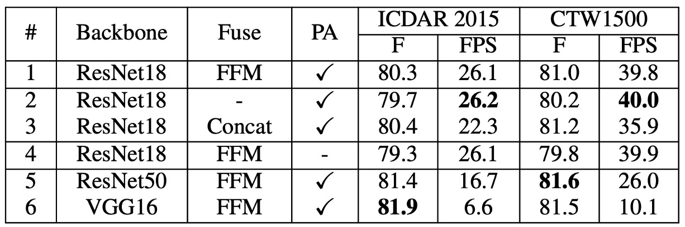
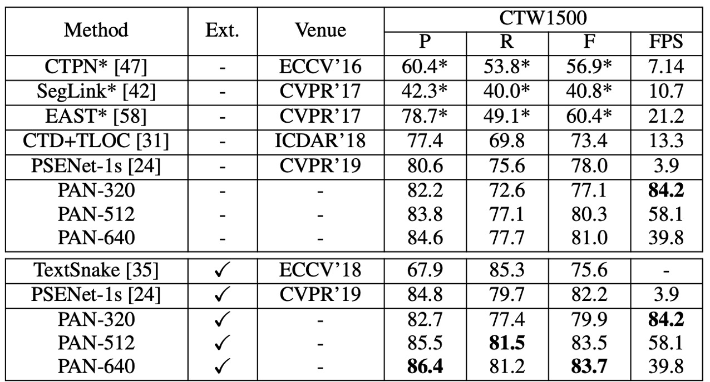
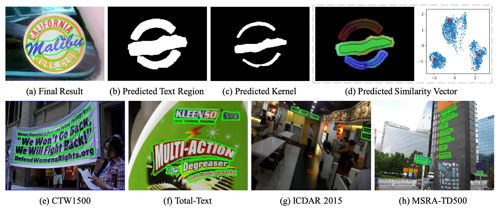

# [19.08] PAN

## ピクセル集約戦略

[**Efficient and Accurate Arbitrary-Shaped Text Detection with Pixel Aggregation Network**](https://arxiv.org/abs/1908.05900)

---

著者は最近 PSENet を発表し、その勢いを利用して、すぐに PAN を発表しました。

- [**[19.03] PSENet: 逐次拡張戦略**](../1903-psenet/index.md)

## 問題の定義

今回は目標が非常にシンプルです。それは、以前のモデルアーキテクチャが遅すぎると感じたことです。

ResNet50 と VGG16 を変更し、ResNet18 に変更！

FPN も変更し、深層可分離畳み込みに変更！

とにかく、軽量化できる部分はすべて軽量化しました。

## 解決方法

### モデルアーキテクチャ

上の図は PAN のモデルアーキテクチャで、全体的に PSENet と似た構造ですが、速度向上のためにいくつかの改良戦略が提案されています。

最初に行われたのは、特徴ピラミッドネットワーク（FPN）のパラメータ量を削減することですが、削減後は特徴の表現能力が低下します。そのため、新しい融合戦略が提案されています。

論文では多くの略語が使われており、時には混乱するかもしれませんが、まずは以下の略語を覚えておきましょう：

- FPEM: Feature Pyramid Enhancement Module（特徴ピラミッド強化モジュール）
- FFM: Feature Fusion Module（特徴融合モジュール）

次に、これらについて順番に見ていきましょう。

### FPEM

このアーキテクチャは FPN をベースにしており、畳み込み層を変更して、元の畳み込みを深層可分離畳み込みに置き換えています。これにより、パラメータ量が削減され、速度が向上します。

論文では、このモジュールは多層スタックできることが強調されており、スタックすることで特徴の表現能力を向上させ、軽量なバックボーンネットワークの不足を補うことができます。

:::tip
多層特徴融合モジュールをスタックする手法は、2019 年の他の論文でも広く取り上げられています。例えば、NAS-FPN や BiFPN などです。
:::

### FFM

FPEM を何層もスタックすると、多くの特徴マップが得られます。

例えば、論文では 1 層の FPEM が 4 つのスケールの特徴マップを得ることになり、各スケールの出力チャンネル数は 128 で、4 つのスケールの特徴マップで合計 512 チャンネルになります。もしこれをさらに N 層スタックすると、最終的には 512N チャンネルの特徴マップが得られます。このような特徴マップは後処理にとって非常に重くなります。

著者はここで、各 FPEM 層の出力特徴マップを加算する方法を採用しています。上の図に示すように、何層スタックしても、最終的には $4 \times 128$ のチャンネル数しか得られないということです。

### ピクセル集約戦略

Backbone と Neck 部分が完了した後、最後は予測ヘッドの部分です。

ピクセル集約の目的は、テキスト領域のピクセルを対応するカーネルに正しく結び付けることによって、完全なテキストインスタンスを再構築することです。この方法はクラスタリングの概念を取り入れ、テキストインスタンスをクラスタとして扱い、カーネルをクラスタの中心とし、テキスト領域のピクセルをクラスタリングされるサンプルとして扱います。

トレーニング中、ピクセル集約は集約損失（Aggregation Loss）を計算してテキストピクセルをカーネルに近づけ、同時に区別損失（Discrimination Loss）によって異なるカーネル間の区別を保ちます。

- **(1) 集約損失 $L_{\text{agg}}$**

  - 集約損失 $L_{\text{agg}}$ の目的は、同じテキストインスタンスのピクセルとそのカーネルとの距離をできるだけ小さくすることです。
  - 各テキストインスタンス $T_i$ に対して、損失関数は以下のように定義されます：

  $$
  L_{\text{agg}} = \frac{1}{N} \sum_{i=1}^{N} \frac{1}{|T_i|} \sum_{p \in T_i} \ln(D(p, K_i) + 1),
  $$

  ここで、$N$ はテキストインスタンスの総数、$T_i$ は第 $i$ のテキストインスタンス、$K_i$ はそのカーネル、$p$ はテキストインスタンス内のピクセルです。

  - 距離関数 $D(p, K_i)$ は以下のように定義されます：

  $$
  D(p, K_i) = \max \left( \|F(p) - G(K_i)\| - \delta_{\text{agg}}, 0 \right)^2,
  $$

  ここで、$F(p)$ はピクセル $p$ の類似度ベクトル、$G(K_i)$ はカーネル $K_i$ の類似度ベクトルで、次のように定義されます：

  $$
  G(K_i) = \frac{\sum_{q \in K_i} F(q)}{|K_i|},
  $$

  $\delta_{\text{agg}}$ は実験的に設定された定数で、0.5 に設定されています。これは、分類が容易なサンプルをフィルタリングするためのものです。

- **(2) 区別損失 $L_{\text{dis}}$**

  - 区別損失 $L_{\text{dis}}$ の目的は、異なるテキストインスタンスのカーネル間に十分な距離を保つことです。
  - 区別損失の定義は以下の通りです：

  $$
  L_{\text{dis}} = \frac{1}{N(N - 1)} \sum_{i=1}^{N} \sum_{\substack{j=1 \\ j \neq i}}^{N} \ln(D(K_i, K_j) + 1),
  $$

  ここで、$D(K_i, K_j)$ はカーネル $K_i$ と $K_j$ の間の距離で、次のように定義されます：

  $$
  D(K_i, K_j) = \max \left( \delta_{\text{dis}} - \|G(K_i) - G(K_j)\|, 0 \right)^2,
  $$

  $\delta_{\text{dis}}$ は実験的に設定された定数で、3 に設定されています。これにより、異なるカーネル間の距離が $\delta_{\text{dis}}$ 未満になることはありません。

---

推論段階では、予測された類似度ベクトルを基にテキスト領域のピクセルを対応するカーネルに統合します。

具体的な手順は以下の通りです：

1. **カーネルの連結成分を見つける**：カーネルのセグメンテーション結果において、連結成分を見つけ、各連結成分は一つのカーネルを表します。
2. **隣接するテキストピクセルを統合する**：各カーネル $K_i$ に対して、4 方向連結方式でその隣接テキストピクセル $p$ を条件付きで統合します。ピクセル $p$ とカーネル $K_i$ の類似度ベクトルのユークリッド距離が閾値 $d$ より小さい場合、統合を行います。
3. **統合手順を繰り返す**：第 2 ステップを繰り返し、条件を満たす隣接ピクセルがなくなるまで統合を続けます。

この方法は集約損失と区別損失を利用してカーネルとテキストピクセルの正しい統合を導き、最終的に完全なテキストインスタンスを再構築します。

### 損失関数

損失関数の全体的な形式は次の通りです：

$$
L = L_{\text{tex}} + \alpha L_{\text{ker}} + \beta (L_{\text{agg}} + L_{\text{dis}}),
$$

ここで：

- $L_{\text{tex}}$ はテキスト領域の損失を示します。
- $L_{\text{ker}}$ はカーネル領域の損失を示します。
- $L_{\text{agg}}$ と $L_{\text{dis}}$ はそれぞれ集約損失と区別損失です。
- パラメータ $\alpha$ と $\beta$ はこれらの損失の重要性をバランスさせるために使用され、すべての実験で $\alpha = 0.5$ と $\beta = 0.25$ に設定されています。

テキストピクセルと非テキストピクセルの数が非常に不均衡であるため、過去の文献を参照し、テキスト領域 $P_{\text{tex}}$ とカーネル領域 $P_{\text{ker}}$ のセグメンテーション結果を監視するために Dice Loss を使用しています。

カーネル領域の真のラベル $G_{\text{ker}}$ は、元の真のラベルポリゴンを縮小することによって得られ、この縮小処理は PSENet の方法を参考にし、ポリゴンを比率 $r$ で縮小します。

$L_{\text{tex}}$ を計算する際には、オンライン困難サンプル挖掘 (Online Hard Example Mining, OHEM) 方法を使用して、簡単な非テキストピクセルを無視します。$L_{\text{ker}}$、$L_{\text{agg}}$、および $L_{\text{dis}}$ を計算する際には、真のラベル内のテキストピクセルのみを考慮します。

$\alpha$ と $\beta$ はテキスト領域損失、カーネル領域損失、集約損失、区別損失間の重要性の重みを制御し、実験により $\alpha = 0.5$ と $\beta = 0.25$ に設定され、異なる損失項間の相対的な影響をバランスさせています。

### 訓練データセット

- **SynthText**

  このデータセットはモデルの事前訓練に使用されます。大規模なデータセットで、約 80 万枚の合成画像を含んでいます。これらの画像は自然なシーンとランダムなフォント、サイズ、色、方向で書かれたテキストが混ざり合っており、非常に現実的です。

- **CTW1500**

  CTW1500 は長曲線テキスト検出のための挑戦的なデータセットで、Yuliang らによって構築されました。1000 枚の訓練画像と 500 枚のテスト画像が含まれています。従来のテキストデータセット（例えば ICDAR 2015 や ICDAR 2017 MLT）とは異なり、CTW1500 のテキストインスタンスは 14 点の多角形でアノテーションされており、任意の曲線テキストの形状を表現できます。

- **Total-Text**

  Total-Text は新しく公開された曲線テキスト検出データセットで、水平、多方向、曲線テキストインスタンスを含んでいます。この基準データセットには 1255 枚の訓練画像と 300 枚のテスト画像が含まれています。

- **ICDAR 2015**

  ICDAR 2015 はテキスト検出において広く使用されるデータセットで、1500 枚の画像が含まれています。そのうち 1000 枚が訓練用で、残りはテスト用として使用されます。テキスト領域は四点の四角形でアノテーションされています。

- **MSRA-TD500**

  これは多言語、任意方向、長いテキスト行に対応するデータセットです。300 枚の訓練画像と 200 枚のテスト画像が含まれており、テキスト行は行単位でアノテーションされています。訓練セットが小さいため、実験では HUST-TR400 データセットの画像も訓練データとして使用されています。

### 訓練戦略

PAN は ResNet または VGG16 をモデルのバックボーンとして使用し、これらのモデルは事前に ImageNet で訓練されています。

すべてのネットワークモデルは確率的勾配降下法 (SGD) を使用して最適化されます。SynthText データセットで事前訓練を行い、50K 回のイテレーションで訓練を実施し、学習率は固定で $1 \times 10^{-3}$ です。

他の実験では、訓練回数は 36K 回で、初期学習率は $1 \times 10^{-3}$ と設定されています。重み減衰は $5 \times 10^{-4}$ に設定され、Nesterov モーメンタムが使用され、モーメント値は 0.99 です。

訓練中、すべてのデータセットで "DO NOT CARE" とマークされたぼやけたテキスト領域は無視されました。OHEM の正負サンプル比は 3 に設定されています。訓練画像にはランダムスケーリング、ランダム水平反転、ランダム回転、およびランダムクロッピングといった多くのデータ拡張手法が適用されました。

## 討論

### 消融実験

著者は ICDAR 2015 および CTW1500 データセット上で消融実験を行い、PAN の各モジュールがパフォーマンスに与える影響を分析しました。

- **FPEM の積み重ね効果**

  

  FPEM の数がモデルのパフォーマンスに与える影響を、$n_c$ の値を調整して研究しました。上の表から分かるように、$n_c$ が増加するにつれてテストセットでの F-measure は上昇し、$n_c \geq 2$ から安定し始めます。

  しかし、FPEM の計算コストは低いものの、FPEM を過剰に追加すると推論速度が低下します。1 つ追加するごとに FPS が約 5 減少します。性能と速度のバランスを取るため、後の実験では $n_c$ を 2 に設定しました。

- **FPEM の有効性**

  

  同じ実験設定のもとで、著者は以下を比較しました：

  - ResNet18 + 2 FPEMs + FFM
  - ResNet50 + PSPNet

  上の表に示すように、「ResNet18 + 2 FPEMs + FFM」は軽量化されたバックボーンネットワークでありながら、「ResNet50 + PSPNet」とほぼ同等のパフォーマンスを示し、推論速度は 5 倍以上速く、モデルのサイズはわずか 12.25M です。

- **FFM / PA の有効性**

  

  FFM を除外し、最後の特徴ピラミッド $F_{nc}$ に特徴マップを連結して最終的なセグメンテーションを行った結果、FFM を除去した場合、F-measure は 0.6% 〜 0.8% 低下（上表 #1 と #2 参照）し、浅層特徴が意味的セグメンテーションにとって重要であることが示されました。

  訓練段階で PA を除去したモデルの F-measure は 1%以上低下（上表 #4 参照）し、PA がモデル性能の向上に顕著な効果を持つことが分かります。

  軽量化されたバックボーンネットワーク ResNet18 をより重いバックボーンネットワーク ResNet50 および VGG16 に置き換えた結果、同じ設定で ResNet50 と VGG16 は ICDAR 2015 で 1%以上、CTW1500 で 0.5%以上の向上を示しました（上表 #5 と #6 参照）。ただし、重いバックボーンネットワークは明らかに推論速度を低下させます。

### 曲線テキスト実験結果

- **CTW1500** 上で：

    <figure>
    
    <figcaption>CTW1500 実験結果</figcaption>
    </figure>

  ***

  - **PAN-320**（入力画像の短辺が 320）の場合、外部データで事前訓練を行っていない状態で F-measure は **77.1%**、速度は **84.2 FPS** です。この F-measure は多くの対照方法を超えており（外部データで事前訓練された方法を含む）、最速の方法と比べて速度は **4 倍速** です。
  - SynthText を使って微調整後、PAN-320 の F-measure は **79.9%** に、PAN-512 の F-measure は他のすべての方法を **1.2%** 以上超え、リアルタイム近い速度（**58 FPS**）を保っています。

- **Total-Text** 上で：

    <figure>
    
    <figcaption>Total-Text 実験結果</figcaption>
    </figure>

  ***

  - 外部データで事前訓練していない場合、**PAN-320** の速度はリアルタイム（**82.4 FPS**）で、F-measure は **77.1%** です。一方、**PAN-640** の F-measure は **83.5%** に達し、すべての最先端方法（外部データ使用の方法を含む）を **0.6%** 以上超えています。
  - SynthText で事前訓練後、PAN-320 の F-measure は **79.9%** に、PAN-640 の最良 F-measure は **85.0%** に達し、2 位の SPCNet [50] より **2.1%** 高く、速度は **40 FPS** を維持しています。

### CTW1500 実験結果

**PAN** は外部データで事前訓練していない状態でも、F-measure は **80.4%**、速度は **26.1 FPS** で、EAST と比較して、PAN の F-measure は **2.1%** 向上し、速度は EAST の **2 倍** です。

SynthText で微調整後、F-measure は **82.9%** に向上し、TextSnake と同等となりましたが、PAN の実行速度は TextSnake の **25 倍** です。PAN のパフォーマンスは一部の方法（PSENet や SPCNet など）には劣るものの、PAN は少なくともこれらの方法より **16 倍速**（**26.1 FPS**）で動作します。

### MSRA-TD500 実験結果

外部データを使用しない場合、PAN の F-measure は **78.9%** で、外部データを使用すると **84.1%** に向上しました。他の最先端方法と比較して、PAN はパフォーマンスが優れており、速度も速い（**30.2 FPS**）です。

### 可視化結果

## 結論

PAN は曲線テキスト、方向付きテキスト、および長い直線テキストの検出において優れたパフォーマンスを示し、外部データで事前訓練を行った場合でも、比較的高い F-measure を維持し、相対的に高速な実行速度を保持しています。これにより、PAN はさまざまなシーンで使用可能な堅牢なテキスト検出方法となっています。
