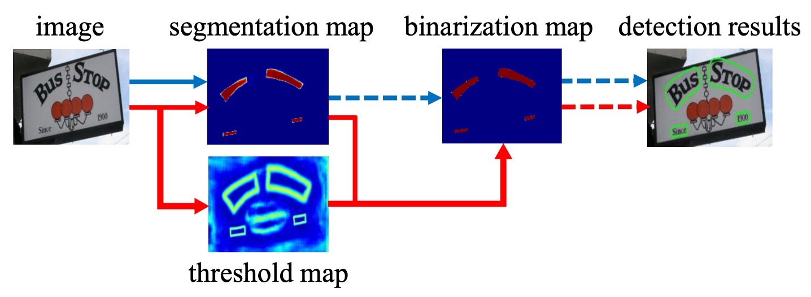
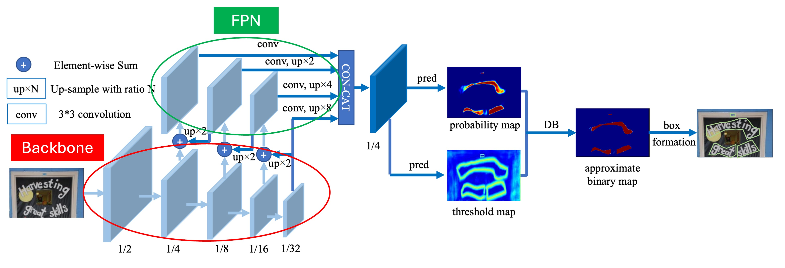
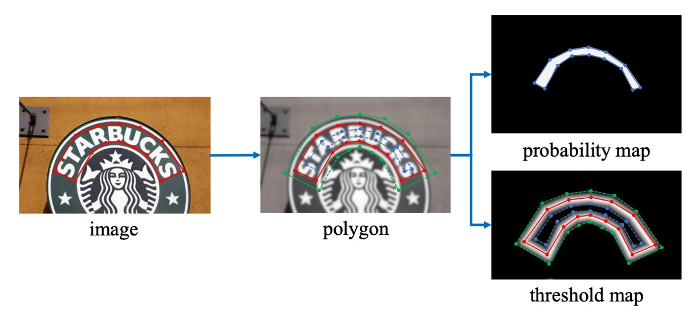
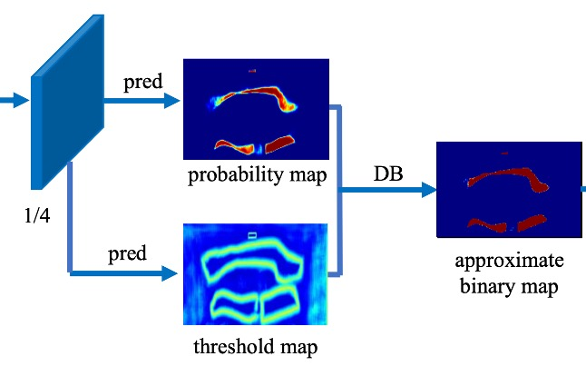

## 微分可能な二値化関数

[**Real-time Scene Text Detection with Differentiable Binarization**](https://arxiv.org/abs/1911.08947)

---

いくつかの論文を見てきた結果、テキスト検出分野では、主流のモデルは分割ベースの手法に基づいています。

分割というのは、実際にはテキスト領域のピクセル値を直接予測する方法で、このアプローチには生まれつきの欠点があります：

- **重なったテキストの問題を解決できない。**

分割ベースの画像分類では、一般的に各クラスに独立したチャネルを与えます。この方法で異なるクラス間の重なり問題を解決できますが、テキストは同じクラスであるため、A 領域のテキストと B 領域のテキストはどちらも「テキスト」であり、チャネルを分ける方法では解決できません。

本当に解決しようと思えば、出力を 1000 チャネルにして、モデルにどのテキスト領域をどのチャネルに割り当てるかを決めさせれば、重なったテキストの問題は解決できます。

しかし、一つのチャネルを一つのテキスト領域に割り当てるのは、あまりにも無駄ではないでしょうか？分割ベースの出力は高解像度の画像であり、このように多くのチャネルを使うことでトレーニングがうまく進むかどうかは問題です。さらに、どのくらいのチャネルを使うべきかもわからないという問題があります。

計算リソースの無駄を考えると、このアプローチは明らかに実行不可能です。

## 問題の定義



一部の主流の研究では、この問題を解決する方法として、まずテキストのコアを見つけ、次にそれを拡張してテキスト領域を形成するという方法を取っています。例えば、PSENet はテキストのコアを見つけてから、その外側を探索してテキスト領域を広げる方法を使用しています。PAN はテキストのコアを見つけた後、クラスタリングで領域ピクセルを集約します。また、TextSnake はテキストのコアを見つけてから、角度方向でテキスト領域を予測します。

しかし、この論文の著者は、これらの方法に共通する欠点があると考えています：**遅すぎる！**

もしかしたら、モデル自身が複雑な後処理なしで、異なるテキストインスタンスを「切り離す」方法を学べるようにするべきかもしれません。

## 解決問題

### モデルアーキテクチャ



このアーキテクチャ自体は本論文の主な焦点ではありませんが、私たちが見たところ、特別な点はありません。

上の図に示すように、赤い枠で囲まれている部分が Backbone で、論文では ResNet-18 と ResNet-50 が使われています。緑の枠で囲まれている部分が FPN で、異なるスケールの特徴を抽出するために使われます。

ここで多スケールの特徴マップを得た後、これらの特徴マップは同じスケールに拡大され、Concat 操作でこれらを結合して最終的な予測ヘッドの入力とします。

---

予測ヘッドは二つの部分に分かれています：

最初の部分はテキスト領域のピクセル単位での予測を行い、他の文献でもよく見られるこのアプローチです。

第二の部分は本論文の焦点である「閾値マップ」の予測です。

閾値マップは論文内では **Threshold Map** と呼ばれ、テキスト領域を「切り分ける」ために使用され、テキスト領域の予測結果に重ねて、異なるテキスト領域を分けるために用います。上の図では、テキスト領域マップと閾値マップが重なり、最終的な結果を形成しているのが分かります。

---

この部分の操作は論文ではあまり詳しく書かれていないかもしれませんが、実装コードを見てみましょう：[**MhLiao/DB**](https://github.com/MhLiao/DB/blob/master/decoders/seg_detector.py)

まずはテキスト領域の予測分岐部分です：

```python
self.binarize = nn.Sequential(
    nn.Conv2d(inner_channels, inner_channels //
                4, 3, padding=1, bias=bias),
    BatchNorm2d(inner_channels//4),
    nn.ReLU(inplace=True),
    nn.ConvTranspose2d(inner_channels//4, inner_channels//4, 2, 2),
    BatchNorm2d(inner_channels//4),
    nn.ReLU(inplace=True),
    nn.ConvTranspose2d(inner_channels//4, 1, 2, 2),
    nn.Sigmoid())
```

ここでは、FPN の特徴マップを入力として、いくつかの畳み込みと逆畳み込みを通した後、`Sigmoid` 関数を使って 0〜1 の値を出力します。この値はテキスト領域の確率を示します。

次に閾値マップの予測分岐部分です：

```python
self.thresh = nn.Sequential(
    nn.Conv2d(in_channels, inner_channels //
                4, 3, padding=1, bias=bias),
    BatchNorm2d(inner_channels//4),
    nn.ReLU(inplace=True),
    self._init_upsample(inner_channels // 4, inner_channels//4, smooth=smooth, bias=bias),
    BatchNorm2d(inner_channels//4),
    nn.ReLU(inplace=True),
    self._init_upsample(inner_channels // 4, 1, smooth=smooth, bias=bias),
    nn.Sigmoid())
```

こちらも同じく FPN の特徴マップを入力として、畳み込みとアップサンプリングを経て、最後に `Sigmoid` 関数で 0〜1 の値を出力します。この値が閾値マップを表します。

最後に、テキスト領域マップと閾値マップを差し引いて最終的な結果を得ます：

:::tip
コード内にいくつかのコメントを追加しましたので、重要な情報を見逃さないようにしてください。
:::

```python
def forward(self, features, gt=None, masks=None, training=False):

    # ...省略 Backbone + Neck のコード...

    # テキスト領域マップを計算
    binary = self.binarize(fuse)


    if self.training:
        result = OrderedDict(binary=binary)
    else:

        # 推論モードでは、テキスト領域マップをそのまま返す
        return binary

    # 訓練モードの場合
    if self.adaptive and self.training:
        if self.serial:
            fuse = torch.cat(
                    (fuse, nn.functional.interpolate(
                        binary, fuse.shape[2:])), 1)

        # 閾値マップを計算
        thresh = self.thresh(fuse)

        # 閾値マップを二値化
        thresh_binary = self.step_function(binary, thresh)

        # 二つの結果を返す、監視学習用
        result.update(thresh=thresh, thresh_binary=thresh_binary)

    return result

# 二値化関数
def step_function(self, x, y):
    return torch.reciprocal(1 + torch.exp(-self.k * (x - y)))
```

ここで、最初に登場したのが本論文のタイトルにもある「可微分二値化関数」です！

上記コード内の `step_function` が本論文で述べている二値化関数で、入力はテキスト領域マップと閾値マップです。この二つを差し引いた後、0 と 1 の二値化結果に変換します。

見た感じ、非常におなじみのものです：

この `torch.reciprocal(1 + torch.exp(-self.k * (x - y)))` は...

おっと！これってまさに Sigmoid 関数ではないですか！

:::tip
標準的な Sigmoid 関数は次のようになります：

$$
\sigma(x) = \frac{1}{1 + e^{-x}}
$$

:::

違いは、ここでは Sigmoid 関数に追加のパラメータ $k$ が含まれている点です。このパラメータは二値化の閾値を制御するために使われ、論文中では $k$ の値を 50 に設定しています。

そのため、この関数は次のようになります：

$$
\sigma(x) = \frac{1}{1 + e^{-50(x - y)}}
$$

もし自分で計算してみると、この式は非常に急激な階段関数に近い形になります。ほぼ二値化関数のような形ですが、違いはこの関数が微分可能であるという点です。

:::tip
論文のここで謎が解けました！

著者は `Sigmoid` 関数を使って二値化を実現し、楽しく論文を発表したわけです。
:::

### 標籤生成



この部分のアルゴリズムは、PSENet のアイデアに触発されたものです：

- [**[19.03] PSENet: 逐次拡張戦略**](../1903-psenet/index.md)

与えられたテキスト画像では、各テキスト領域のポリゴンが一連の線分で記述されます：

$$
G = \{S_k\}_{k=1}^{n}
$$

ここで、$n$ は頂点数です。異なるデータセットでは異なる頂点数があり、例えば ICDAR 2015 データセットでは 4 頂点、CTW1500 データセットでは 16 頂点です。

次に、正のサンプル領域は Vatti 裁断アルゴリズムを使用してポリゴン $G$ を収縮させて $G_s$ を生成することで作成されます。

収縮のオフセット $D$ は、元のポリゴンの周囲長 $L$ と面積 $A$ を使って計算されます：

$$
D = \frac{A(1 - r^2)}{L}
$$

ここで、$r$ は収縮比率で、経験的に 0.4 に設定されます。

---

同様のプロセスを使って、閾値マップのラベルも生成します。

まず、テキストポリゴン $G$ を同じオフセット $D$ で拡張し、$G_d$ を得ます。次に、$G_s$ と $G_d$ の間の領域をテキスト境界として考え、この領域内で閾値マップのラベルは、$G$ 内の最も近い線分との距離を計算することで生成されます。

### 損失関数

<div align="center">

</div>

損失関数 $L$ は、確率マップ損失 $L_s$、二値マップ損失 $L_b$、および閾値マップ損失 $L_t$ の加重合計として表すことができます：

$$
L = L_s + \alpha \times L_b + \beta \times L_t
$$

ここで、$L_s$ は確率マップの損失、$L_b$ は二値マップの損失です。数値に基づき、$\alpha$ と $\beta$ はそれぞれ 1.0 と 10 に設定されます。

確率マップ損失 $L_s$ と二値マップ損失 $L_b$ には、バイナリクロスエントロピー（BCE）損失が適用されます。不均衡な正負サンプルの問題を解決するため、BCE 損失では困難な負サンプルのマイニングが行われ、正負サンプルの比率がバランスされます。

具体的な損失計算式は次の通りです：

$$
L_s = L_b = \sum_{i \in S_l} \left[ y_i \log x_i + (1 - y_i) \log (1 - x_i) \right]
$$

ここで、$S_l$ はサンプリングされたセットで、正負サンプルの比率は 1:3 です。

---

閾値マップ損失 $L_t$ は、予測値とラベルの間の、拡張テキストポリゴン $G_d$ 内の $L_1$ 距離の総和です：

$$
L_t = \sum_{i \in R_d} | y_i^* - x_i^* |
$$

ここで、$R_d$ は拡張ポリゴン $G_d$ 内のピクセルのインデックス集合、$y_i^*$ は閾値マップのラベルです。

---

推論段階では、著者は効率を高めるために確率マップを使って境界ボックスを生成し、このことで閾値分岐を省略します。

境界ボックス生成のプロセスには 3 つのステップがあります：

1. 確率マップまたは近似された二値マップを固定閾値 0.2 で二値化して二値マップを得る
2. 二値マップから連結成分（収縮されたテキスト領域）を抽出
3. Vatti 裁断アルゴリズムを使用してこれらの収縮領域を拡張し、オフセット $D_0$ は次のように計算されます：

   $$
   D_0 = \frac{A_0 \times r_0}{L_0}
   $$

   ここで、$A_0$ は収縮ポリゴンの面積、$L_0$ は収縮ポリゴンの周囲長、$r_0$ は経験的に 1.5 に設定されます。

### 訓練データセット

- **SynthText**

  このデータセットはモデルの事前訓練に使用されます。大規模なデータセットで、約 80 万枚の合成画像を含んでいます。これらの画像は自然なシーンとランダムなフォント、サイズ、色、方向で書かれたテキストが混ざり合っており、非常に現実的です。

- **CTW1500**

  CTW1500 は長曲線テキスト検出のための挑戦的なデータセットで、Yuliang らによって構築されました。1000 枚の訓練画像と 500 枚のテスト画像が含まれています。従来のテキストデータセット（例えば ICDAR 2015 や ICDAR 2017 MLT）とは異なり、CTW1500 のテキストインスタンスは 14 点の多角形でアノテーションされており、任意の曲線テキストの形状を表現できます。

- **Total-Text**

  Total-Text は新しく公開された曲線テキスト検出データセットで、水平、多方向、曲線テキストインスタンスを含んでいます。この基準データセットには 1255 枚の訓練画像と 300 枚のテスト画像が含まれています。

- **ICDAR 2015**

  ICDAR 2015 はテキスト検出において広く使用されるデータセットで、1500 枚の画像が含まれています。そのうち 1000 枚が訓練用で、残りはテスト用として使用されます。テキスト領域は四点の四角形でアノテーションされています。

- **MSRA-TD500**

  これは多言語、任意方向、長いテキスト行に対応するデータセットです。300 枚の訓練画像と 200 枚のテスト画像が含まれており、テキスト行は行単位でアノテーションされています。訓練セットが小さいため、実験では HUST-TR400 データセットの画像も訓練データとして使用されています。

- **ICDAR 2017 MLT**

  IC17-MLT は大規模な多言語テキストデータセットで、7200 枚の訓練画像、1800 枚の検証画像、9000 枚のテスト画像が含まれています。このデータセットは 9 言語の完全なシーン画像で構成されています。

## 討論

### 消融実験


上の表によると、微分可能な二値化技術は、MSRA-TD500 および CTW1500 データセットでパフォーマンスを大きく向上させました。ResNet-18 のバックボーンネットワークを使用した場合、DB は MSRA-TD500 データセットで 3.7%、CTW1500 データセットで 4.9% の F 値の向上を達成しました。

可変形畳み込みは、1.5%〜5.0% の性能向上をもたらし、バックボーンネットワークに柔軟な受容野を提供し、わずかな追加時間で計算できます。CTW1500 データセットで、ResNet-18 を使用すると性能は 3.6% 向上し、ResNet-50 を使用すると 4.9% 向上しました。

---


監視なしの閾値マップは外観上似ているものの、監視ありにすることで性能が向上します。上表に示すように、MLT-2017 データセットにおける閾値マップの監視は、ResNet-18 に対して 0.7%、ResNet-50 に対して 2.6% の向上を示しました。

バックボーンネットワークの比較では、ResNet-50 を使用した検出器の性能は ResNet-18 より優れていましたが、実行速度は遅くなりました。

### 曲線テキスト実験結果

<figure>

<figcaption>Total-Text 実験結果</figcaption>
</figure>

<figure>

<figcaption>CTW1500 実験結果</figcaption>
</figure>

---

上表によると、DB は精度と速度の両方で最新の最先端を達成しました。

本手法は Total-Text と CTW1500 の二つの曲線テキスト基準において、その形状の頑健性を証明しました。

DB-ResNet-50 は、Total-Text と CTW1500 データセットでそれぞれ 1.1% および 1.2% の向上を達成しました。さらに、DB-ResNet-50 の実行速度は以前のすべての方法よりも速く、ResNet-18 バックボーンを使用することで速度をさらに向上させ、わずかな性能低下しかありませんでした。

### ICDAR 2015 実験結果

<figure>

<figcaption>ICDAR 2015 実験結果</figcaption>
</figure>

---

ICDAR 2015 データセットは、小さなサイズと低解像度のテキストインスタンスを多数含む多方向テキストデータセットです。

上表によると、DB-ResNet-50 (1152) は精度において最新の最良性能を達成しました。以前の最速の方法と比較して、DB-ResNet-50 (736) は精度で 7.2% 向上し、速度は倍増しました。

ResNet-18 をバックボーンとして使用した場合、DB-ResNet-18 (736) は 48 FPS で実行し、F 値は 82.3 に達しました。

### 可視化結果


## 結論

DB は新しい微分可能な二値化技術を提案しており、この技術により後処理なしで確率マップから直接二値マップを生成することができます。この技術はテキスト検出の性能を向上させ、複数の基準データセットで最新の最良性能を達成しました。

実務的には、DB はその速度の速さから非常に多く使用されているモデルです。また、アーキテクチャがシンプルでトレーニングが容易であるため、PaddleOCR や MMOCR などの OCR フレームワークで実装を見ることができます。

この記事を通して、最も難しい部分は二値化関数の実装であることがわかりました。

最後に、このアーキテクチャは重なったテキストの問題を緩和しましたが、重なったテキストの問題自体は解決しておらず、今後の研究に期待したいところです。
