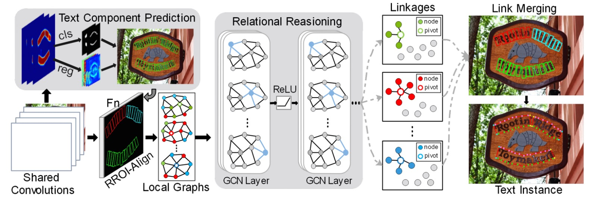
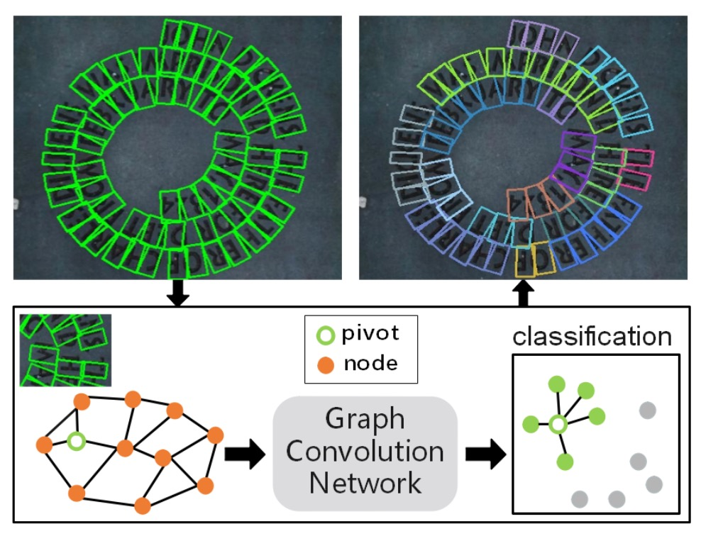

## グラフ畳み込みの初探

[**Deep Relational Reasoning Graph Network for Arbitrary Shape Text Detection**](https://arxiv.org/abs/2003.07493)

---

2020 年前後、グラフ畳み込みネットワーク（Graph Convolutional Network, GCN）が盛況を迎えました。

この時、Transformer が画像領域で広く使われる前、GCN は非常に良い選択肢でした。なぜなら、GCN は不規則なデータを処理でき、データ間の関係を捉えることができるからです。

しかし、グラフ畳み込みは、コンピュータビジョンの分野で流行し始めたばかりなのに、Transformer によってその発展を妨げられました。

:::tip
もしグラフ畳み込みネットワークが何か分からない場合は、まず以下の別の記事を読んでみてください：

- [**グラフ畳み込みネットワークの概要**](https://docsaid.org/ja/blog/graph-convolutional-networks/)
  :::

## 問題の定義

新しいツールが登場したにもかかわらず、文字検出の問題を解決するために使われていない、それが最大の問題です！

そこで著者は、文字検出の問題を解決するためにグラフ畳み込みネットワークを使うことに決めました。その結果、グラフ畳み込みネットワークを文字検出に適用した「最初の論文」が生まれました。

したがって、この記事の最も難しい部分は、グラフ畳み込みネットワークが何であるかを理解することです。この知識をすでに持っているなら、この論文はあまり難しくないでしょう。

## 解決問題

### モデルアーキテクチャ

<figure style={{"width": "90%"}}>

</figure>

全体のモデルアーキテクチャは非常に多くのコンポーネントで構成されており、大まかにいくつかの部分に分けることができます：

1. **特徴抽出器**：VGG-16 を主幹ネットワークとして使用し、FPN（Feature Pyramid Network）を加えています。
2. **文字の構成要素定義**：文字のインスタンスを順番に並べた、近似矩形の小さなセグメントに切り分けます。
3. **文字の構成要素予測**：畳み込み操作を使用して文字構成要素の予測結果を得ます。
4. **損失関数計算**：予測結果と真のラベルとの間で損失を計算します。
5. **グラフ畳み込みネットワーク**：文字構成要素間の関係をグラフとして表現し、GCN を使用して推論します。

### 特徴抽出

<figure style={{"width": "60%"}}>

</figure>

まず、特徴抽出器が必要です。ここでは VGG-16 を主幹ネットワークとして使用し、FPN（Feature Pyramid Network）を加えています。

論文では FPN と記載されていますが、図からわかるように、異なるレベルの特徴を結合する際に加算（addition）ではなく、連結（concatenate）を使用しているため、この構造は FPN よりもむしろ U-Net の構造に近いです。

### 文字の構成要素定義

<figure style={{"width": "60%"}}>

</figure>

:::tip
ここではいくつかの用語の対応があり、図と合わせて確認してください。
:::

この論文では、著者は完全な文字インスタンス（例えば、一行または単語の文字領域）を順番に並べた近似的な矩形の小さなセグメントに切り分けます。

これらの小さなセグメントを使うことで、予測時に文字の形状、サイズ、方向をより細かく記述でき、最終的にそれらのセグメントを再連結して完全な文字を形成します。

各文字構成要素 $D$ は以下の幾何学的属性のセットで表されます：

$$
D = (x, y, h, w, \cos\theta, \sin\theta)
$$

- $x, y$：この構成要素の中心点座標。つまり文字構成要素が画像内で位置する場所。
- $h, w$：それぞれ構成要素の高さ（height）と幅（width）を表します。
- $\cos\theta, \sin\theta$：文字構成要素の方向角度（orientation）を表すために使用されます。

角度は数学的に周期性があるため、$\cos\theta$ と $\sin\theta$ を使用することで、直接角度を使う際の複雑さを避け、方向の滑らかな変化を保証します。

- **$h$ の定義**：

  論文では、文字構成要素の高さ $h$ は、上半分 $h_1$ と下半分 $h_2$ を組み合わせて定義されています。

- **幅 $w$ と高さ $h$ の関係**：

  幅 $w$ は高さ $h$ に基づいて線形ルールで取得されます。

  実験では、最小幅 $w_{\min}$ と最大幅 $w_{\max}$ が設定されています。ルールは次のようになります：

  $$
  w_i =
  \begin{cases}
  w_{\min}, & h_i \leq 2 \cdot w_{\min} \\
  \frac{h_i}{2}, & 2 \cdot w_{\min} < h_i < 2 \cdot w_{\max} \\
  w_{\max}, & h_i \geq 2 \cdot w_{\max}
  \end{cases}
  $$

  意味は以下の通りです：

  - 構成要素が非常に小さい場合（$h_i$ が小さい）、幅は最小値 $w_{\min}$ に固定され、構成要素が狭すぎて識別が難しくなるのを避けます。
  - 構成要素の高さが中間範囲にある場合、幅は高さに比例します（$w = h/2$）。これにより、構成要素の外観が合理的な比率を保つことができます。
  - 高さが非常に大きい場合、幅は最大値 $w_{\max}$ に固定され、過度に広がるのを防ぎます。

  実験では、著者は $w_{\min} = 8$ と $w_{\max} = 24$ を設定しています。

---

文字の向きを明確に定義するため（例えば、斜めや水平）、および「文字中心領域（TCR）」を抽出しやすくするために、著者は TextSnake の方法を参照しています。

:::tip
もし TextSnake の詳細に興味がある場合は、別の記事を参照してください：

- [**[18.07] TextSnake: テキストスネーク**](../1807-textsnake/index.md)
  :::

手順は次の通りです：

1. **上辺と下辺の点の列を取得**：

   文字領域をその長辺方向に沿って一連の四辺形に分割します（長い文字をいくつかの小さな区間に分けるようなもの）。これにより、次の二つの点のセットを取得します：

   - $P_1 = \{tp_0, tp_1, ..., tp_n\}$：文字の上辺（top line）に対応する一連の点。
   - $P_2 = \{bp_0, bp_1, ..., bp_n\}$：文字の下辺（bottom line）に対応する一連の点。

   ここで、$tp_i$ と $bp_i$ は、同一の垂直面下で対応する上辺および下辺の点として扱われます。

2. **どの線が上辺で、どの線が下辺かを決定**：

   $P_1$ と $P_2$ を得た後、どの点のセットが文字の上辺で、どの点のセットが下辺であるかを判別する必要があります。

   ここで、次のようにベクトルのセット $V$ を定義します：

   $$
   V = \{ tp_0 - bp_0, tp_1 - bp_1, \ldots, tp_n - bp_n \}
   $$

   すなわち、上辺の各点から下辺の対応点を引いて得られる一連の垂直ベクトルです。その後、次を計算します：

   $$
   p = \sum_{i=0}^{n} \sin(v_i)
   $$

   ここで、$v_i = tp_i - bp_i$ です。もし $p \geq 0$ なら、$P_1$ が上辺、$P_2$ が下辺となります；それ以外の場合は逆です。

   この判定方法はベクトルの方向を用いて上下の辺を決定し、文字領域の上下方向を特定して文字の傾き角度 $\theta$ を推定します。

3. **文字中心領域（TCR）の取得**：

    

    <figure style={{"width": "90%"}}>
    
    </figure>
    

   文字の向きが確定した後、文字領域（Text Region, TR）を「縮小」して、より小さく正確な文字中心領域（TCR）を得ます。

   上記の図を拡大して見ると、これを行う方法は 3 つのステップに分けることができます：

   - 文字の中心線（center line）を計算します。これは上辺と下辺の中間に位置する線です。
   - 中心線の両端をそれぞれ $0.5w$ ピクセル縮め、隣接する文字インスタンスと過度に近づかないようにします。
   - 中心線を上下方向にそれぞれ $0.3h$ の距離だけ外向きに拡張し、わずかに厚みを持たせた中心帯状領域を作ります。これが TCR です。

   TCR の存在により、ネットワークは後の判断で実際の文字コアの位置に焦点を合わせやすくなり、隣接する文字（例えば、同一行の連続した文字）の区別にも柔軟性が増します。

### 文字構成要素予測

著者が定義した文字構成要素については既に知っています。次に、Backbone と FPN を通過した特徴マップを使用して文字構成要素を予測します。以下の畳み込み操作を通じて CR を得ます：

$$
CR = \text{conv}_{1\times1}(\text{conv}_{3\times3}(F_{\text{share}}))
$$

これは、特徴マップに対してまず$3\times3$の畳み込みを行い、その後$1\times1$の畳み込みを適用することを意味します。

最終的な$CR$テンソルの次元は$(h \times w \times 8)$となります。ここで、$h \times w$は特徴マップの空間的サイズであり、最後の次元は 8 つのチャネルを持ち、それぞれ次のように対応します：

- 4 つのチャネルは分類のロジットに使用され（このロジットは、各ピクセルが TR / TCR またはその他のクラス（例えば背景）に属するかを決定するために使用されます）。これらの 4 つのチャネルに対して softmax を適用することで、各ピクセルが TR または TCR に属する確率分布が得られます。
- 4 つのチャネルは回帰（regression）出力に使用され、これには$h_1, h_2, \cos\theta, \sin\theta$が含まれます。

ここでの softmax 操作は、各ピクセルが「文字領域」または「文字中心領域」に属するかを分類するために行われます。また、$\cos\theta$と$\sin\theta$を正規化することで、$\cos^2\theta + \sin^2\theta = 1$を保証し、方向値の整合性を維持します。

最後に、予測結果に対してしきい値（threshold）を設定し、局所領域で NMS（Non-Maximum Suppression）を行うことで、冗長な重複構成要素を除去し、よりクリーンで精度の高い文字構成要素の検出結果が得られます。

### 損失関数の計算

全体の検出損失 $L_{\text{det}}$ は 2 つの部分から成り立っています：

$$
L_{\text{det}} = L_{\text{cls}} + L_{\text{reg}}
$$

- $L_{\text{cls}}$: 分類損失（classification loss）、どのピクセルが文字領域（TCR/TR）または背景に属するかを決定するために使用されます。
- $L_{\text{reg}}$: 回帰損失（regression loss）、文字の幾何学的属性（高さ、方向など）を正確に予測するために使用されます。

---

分類損失 $L_{\text{cls}}$ は交差エントロピー損失（cross-entropy loss）です。

論文では、文字関連領域を 2 つの範囲に分けています：

- **TR (Text Region)**：文字全体の領域で、文字の上下辺の間に位置する範囲。
- **TCR (Text Center Region)**：TR の中心を縮小/調整した「文字中心領域」で、文字のコア位置をより正確に特定し、干渉を避けるために使用されます。

定義は次の通りです：

$$
L_{\text{cls}} = L_{\text{tr}} + \lambda_1 L_{\text{tcrp}} + \lambda_2 L_{\text{tcrn}}
$$

ここには 3 つのサブ損失があります：

1. $L_{\text{tr}}$：
   文字領域 TR に属するピクセルの分類誤差を計算します。

2. $L_{\text{tcrp}}$：
   TR 内のピクセルにのみ計算され、文字領域内で TCR（文字の中心領域）を正確に識別することを確保します。
   言い換えれば、$L_{\text{tcrp}}$ は「文字と確定した」場所で、さらにそのピクセルを「文字中心領域」または「非中心の文字領域」と区別します。

3. $L_{\text{tcrn}}$：
   「非 TR」範囲内のピクセルに計算され、背景領域で TCR が現れるノイズを抑制します。
   簡単に言えば、背景（文字がない場所）で TCR を予測すると、この損失を大きくしてネットワークが背景で誤って TCR をラベル付けしないようにします。

トレーニングをより安定させるために、論文では OHEM（Online Hard Example Mining）法が使用されています。OHEM は困難な負のサンプル（文字領域に属さないピクセル）を選択して損失を計算し、簡単に判定できる負のサンプルがトレーニングに影響を与えるのを防ぎます。著者は負と正のサンプルの比率を 3:1 に設定しました。

実験では、ハイパーパラメータとして$\lambda_1 = 1.0$と$\lambda_2 = 0.5$が設定されており、これは$L_{\text{tcrp}}$と$L_{\text{tcrn}}$が全体の分類損失においてどれだけの重みを持つかを示しています。

---

回帰損失は、モデルが文字の高さや方向などの属性を正確に推定できるようにするために使用されます。

しかし、TCR 内でのみ明確な高さや方向の情報（TCR は文字の中心に正確に位置し、文字の方向と高さのラベルを安定的に取得できる範囲）が得られるため、回帰損失は TCR 範囲内でのみ計算されます。

定義は次の通りです：

$$
L_{\text{reg}} = L_{h} + \beta(L_{\sin} + L_{\cos})
$$

ここには 3 つの部分があります：

1. **$L_h$：高さ回帰損失**

   予測された高さと実際の高さの差異を測定します。

   高さ$h$は$h_1$と$h_2$から構成され（前述の定義で$h = h_1 + h_2$として知られています）、損失計算は次のようになります：

   $$
   L_{h} = \frac{1}{\Omega} \sum_{i \in \Omega} \left( \log(h + 1) \sum_{k=0}^{2} \text{smoothL1}\left(\frac{\hat{h}_{ki}}{h_{ki}} - 1\right) \right)
   $$

   ここで：

   - $\Omega$：TCR 内のすべての正サンプルの集合（ラベルのあるピクセル）。
   - $h_{ki}$：実際の高さに関連するパラメータ（$h_0, h_1, h_2$のようなインデックス、実際には高さコンポーネントの回帰）。
   - $\hat{h}_{ki}$：モデル予測値。

     ***

   :::tip
   **なぜ$\log(h+1)$という重み項が必要なのか？**

   高い文字（大きな高さ）に対して予測誤差の影響が大きくなる可能性があるため、$\log(h+1)$を使用することで、より大きな文字の構成要素に大きな重みを与え、モデルがさまざまな文字サイズで精度を維持できるようにします。
   :::

2. **$L_{\sin}$ と $L_{\cos}$：方向回帰損失**

   予測された文字の方向（$\sin \theta$と$\cos \theta$で表される）がどれだけ正確であるかを測定します：

   $$
   L_{\sin} = \text{smoothL1}(\hat{\sin\theta} - \sin\theta)
   $$

   $$
   L_{\cos} = \text{smoothL1}(\hat{\cos\theta} - \cos\theta)
   $$

   極端な誤差の影響を軽減するために smooth L1 損失を使用し、トレーニングをより安定させます。

3. **$\beta$：バランス因子**

   これは方向損失$L_{\sin}$と$L_{\cos}$が全体の$L_{\text{reg}}$においてどれだけの重みを持つかを調整するために使用されます。論文では$\beta = 1.0$に設定されています。

### 局所的なグラフの生成

<figure style={{"width": "70%"}}>

</figure>

著者はこの論文で文字検出の問題を解決するためにグラフ畳み込みネットワーク（GCN）を使用したいと考えており、そのためには文字構成要素間の関係をグラフとして表現する必要があります。

画像内で多くの文字構成要素が検出される可能性があるため、画像全体に巨大なグラフ構造を生成すること（すべてのノードを完全に接続すること）は非常に非効率です。

実際には、各文字構成要素は空間的に近くにある少数の要素とのみ関連があり、画像内のすべての要素との関係を構築する必要はありません。したがって、著者は各「ピボット点（pivot）」文字構成要素に対して、少数の隣接する要素のみを含む「局所的なグラフ」を構築することを選び、過度に複雑な全体グラフの処理を避けました。

局所的なグラフは、特定の文字構成要素（「ピボット」と呼ばれる）を中心に、その周囲の他の構成要素だけを考慮し、小さなグラフ構造を形成します。このようにして、グラフのサイズは非常に小さな範囲に制限され、後続の関係推論プロセスを加速させることができます。

局所的なグラフを作成するために、著者は過去の文献（下記）を参考にしており、検出された文字構成要素から 1 つの要素を「ピボット」として選び、その周囲で隣接ノードを探し、局所的なグラフ $G_p$ を形成し、隣接ノードを「1-hop」および「2-hop」範囲に分けます：

- 1-hop 隣接ノード：ピボットから始めて、距離（ある種の類似度測定に基づく）で最も近い 8 つの構成要素を第一階隣接ノードとして選びます（つまり、ピボットに最も近い要素）。
- 2-hop 隣接ノード：1-hop に基づいてさらに外に広げ、4 つのより遠い構成要素を第二階隣接ノードとして選びます。

:::tip
参考文献：[**[19.03] Linkage Based Face Clustering via Graph Convolution Network**](https://arxiv.org/abs/1903.11306)
:::

上記のロジックに基づき、1 つのピボットの局所的なグラフ $G_p$ は、ピボット自身のノード$p$、8 つの 1-hop 隣接ノード、そして 4 つの 2-hop 隣接ノードを含み、合計で十数個のノードを超えないようになります。これは画像全体で数百または数千の構成要素がある場合と比べて、かなり少ない数です。

最後に、どの構成要素がピボットの最も近い隣接ノードであるかを決定するために、「類似度」や「距離」を測定する方法が必要です。

論文では、ユークリッド距離の相対的な比率を使用して類似度を定義しています：

$$
E_s = 1 - \frac{D(p, v_i)}{\max(H_m, W_m)}
$$

- $D(p, v_i)$ はピボット $p$ とノード $v_i$ の間の L2 ユークリッド距離（画像座標空間内の距離）。
- $H_m$ と $W_m$ は画像全体の高さと幅です。

### 重複サンプルのフィルタリング

トレーニング中、同一の文字インスタンス内で選択された異なるピボットに対応する局所的なグラフがあまりにも似ている場合（例えば、同じ行の隣接する文字を選んだ場合、その結果、局所的なグラフのほとんどのノードが重複して現れる）、これはモデルが「簡単なサンプル」を繰り返し学習することになり、トレーニングの効率が低下します。

このため、著者はフィルタリング条件を提案しました：

$$
G_{\text{iou}} = \frac{G_p \cap G_q}{G_p \cup G_q} < \xi
$$

ここで $G_p$ と $G_q$ は同一の文字インスタンス $T$ 内で異なるピボットから形成された 2 つの局所的なグラフであり、それらの 1-hop 隣接ノード集合を交差（$\cap$）および結合（$\cup$）して、2 つの局所的なグラフの「重なりの割合」を計算します。

重なりの割合 $G_{\text{iou}}$ が高すぎる場合（例えば 1 に近い場合、2 つの局所的なグラフがほぼ同じであることを意味する）、そのピボットは使用されません。これにより、「重複した、簡単な」サンプルを生成するのを避けます。

著者は実験で$\xi = 0.75$を設定しており、重なりの割合が 0.75 未満の場合にのみ使用します。この戦略により、トレーニング過程で「簡単な」サンプルと「難しい」サンプルの両方をカバーでき、モデルの学習効率と安定性が向上します。

### グラフ畳み込みネットワーク（GCN）

前述のステップで、著者は各画像に複数の「局所的なグラフ」を作成しました。各局所的なグラフは、「ピボットノード」とその 1-hop および 2-hop 隣接ノードを含んでいます。これらの局所的なグラフを使用して、ノード間の初歩的な接続情報を把握できますが、これらは粗い接続の推定にすぎません。

ノード間の実際の接続確率をより深く推論するため、特にピボットノードとその 1-hop 隣接ノード間の関係を判定するために、著者はここで「グラフ畳み込みネットワーク（Graph Convolutional Network, GCN）」モデルを導入します。

GCN を使用することで、グラフ構造内で隣接情報を層ごとに集約し、より高度な関係推論を行うことができます。

:::tip
これまでの説明はすべて「グラフ畳み込みネットワーク」を導入するための準備でした！
:::

1 つのグラフ（Graph）は通常、$g(X, A)$として表されます：

- $X$：ノード特徴行列、各行が 1 つのノードの特徴ベクトルを表します。
- $A$：隣接行列、ノード間の接続関係を記述します。もし第$i$ノードと第$j$ノードがエッジで接続されていれば、$A_{ij} = 1$、そうでなければ 0（または他の重み）となります。

ここでは、局所的なグラフ$G_p$（ピボット$p$を中心とした局所的なグラフ）のためにノード特徴行列$X$と隣接行列$A$を構築し、それらをグラフ畳み込みネットワークに入力して関係推論を行います。

ノード特徴は 2 つの部分から構成されます：

1. **RROI 特徴（RROI features）**
2. **幾何学的特徴（geometric features）**

RRoI-Align（RRoI は回転した RoI、つまり回転した文字の領域を考慮する RoI 基準）法を使用して、画像の特徴マップから各文字構成要素の特徴ブロックを抽出し、その特徴ベクトルを$F_r$と呼びます。

:::tip
RRoI-Align の詳細については、以下の文献を参照してください：

- [**[17.03] Arbitrary-oriented scene text detection via rotation proposals**](https://arxiv.org/abs/1703.01086)
  :::

これらの特徴は主に画像の外観情報に由来しますが、文字領域内のテクスチャや形状を捉えることができますが、文字構成要素が画像全体でどこにあるのか、スケール、方向などの「幾何学的な属性（geometric features）」が欠けています。

そのため、ノード特徴をより包括的にするために、著者はここで Transformer の位置エンコーディングを直接採用し、文字構成要素の幾何学的情報を高次元空間に埋め込み（embedding）ます：

$$
\varepsilon_{2i}(z) = \cos\left(\frac{z}{1000^{2i/C_{\varepsilon}}}\right), \quad i \in [0, C_{\varepsilon}/2 - 1]
$$

$$
\varepsilon_{2i+1}(z) = \sin\left(\frac{z}{1000^{2i/C_{\varepsilon}}}\right), \quad i \in [0, C_{\varepsilon}/2 - 1]
$$

1 つの文字構成要素には 6 つの幾何学的属性（例えば$x, y, h, w, \cos\theta, \sin\theta$）がありますが、これらの各属性は上記の埋め込み（embedding）を使用して$C_{\varepsilon}$次元に変換され、最終的に$6 \cdot C_{\varepsilon}$次元の特徴ベクトル$F_g$が得られます。

最後に、$F_r$（RROI 特徴）と$F_g$（幾何学的特徴埋め込み）を連結し、ノードの完全な特徴ベクトル$x_q = [F_r; F_g]$を形成します。

---

ノード特徴の準備が整った後、次は隣接行列$A$を構築することです。

グラフの疎性と計算量を制御するため、著者は各ノードに対して最も近い$u$個の隣接ノードを選び、各ノードが他のノードと過度に接続されないようにしています。もしノード$n_j$がノード$n_i$の最も近い$u$個の隣接ノードの 1 つであれば、$A_p(n_i, n_j) = 1$、そうでなければ 0 となります。実験では$u$は 3 に設定されています。

このようにして構築された隣接行列$A \in \mathbb{R}^{N \times N}$は、局所的なグラフのトポロジー構造を定義します。

---

ノード特徴行列$X$と隣接行列$A$を得た後、著者はここで 1 層のバッチ正規化（Batch Normalization）と 4 層のグラフ畳み込み層を積み重ね、各層の後に ReLU 活性化関数を適用しました。モデルは softmax 交差エントロピー損失を使用して、1-hop ノードとピボットの接続予測を行います。

トレーニング段階では、バックプロパゲーションは 1-hop ノードの分類誤差のみに適用されます。実際に最も重要なのはピボットとその最も近い隣接ノードとの接続が成立しているかどうかを決定することです。2-hop ノードは補助情報として提供され、グラフ畳み込みがより広範な文脈的特徴を捉えるのを助けますが、2-hop ノードの接続について直接最適化は行われません。

テスト段階では、トレーニングされたモデルを使用して、ピボットと 1-hop ノードの接続結果を判断し、最終的な文字インスタンスを再構築します。再度、前述のグラフを確認しましょう：

<figure style={{"width": "70%"}}>

</figure>

文字ノードの特徴は GCN を通じて処理され、最終的に softmax 関数を使用して文字構成要素とピボット間の関連確率が得られ、最終的な文字検出結果が得られます。

## 討論

### 消融実験

<figure style={{"width": "70%"}}>

</figure>

モデル全体のアーキテクチャは非常に複雑であるため、まずは消融実験に注目しましょう。

データの差異が実験結果に与える影響を減らすために、著者はまず SynthText を使用して事前学習を行い、その後、モデルを Total-Text と CTW1500 に微調整しました。MSRA-TD500 データセットについては、英語と中国語の文字が含まれているため、ICDAR2017-MLT で事前学習を行い、MSRA-TD500 で微調整を行いました。

実験結果は表に示されていますが、関係推論ネットワークを導入した後、各データセットで Hmean（F-score）が向上しました：

- Total-Text で Hmean は 1.83%向上。
- CTW1500 で Hmean は 0.78%向上。
- MSRA-TD500 で Hmean は 4.27%向上。

特に MSRA-TD500 での結果は顕著で、長いテキストが多いデータセットでより良い結果を得られることを示しています。しかし、著者は CTW1500 での改善幅が他のデータセットに比べてあまり顕著ではない理由を指摘しています。その理由は CTW1500 のアノテーションにいくつか問題があるためです：

- CTW1500 には「DO NOT CARE」のアノテーション基準がなく、非常に小さな文字や非英語文字がアノテーションされていないため、評価時に干渉が生じます。下の図の例のように。
- このデータセットの文字行（text line）のアノテーションが時々非常に混乱しており、モデルの予測とアノテーションが整合しづらいです。

<figure style={{"width": "70%"}}>

</figure>

CTW1500 での結果はあまり目立ちませんが、他のデータセットでの明らかな向上は関係推論ネットワークの有効性と実用性を証明しています。

:::tip
この消融実験、少し内容が足りないのでは？

GCN モジュールには多くのコンポーネントがありますが、消融実験ではそれを全体として扱い、もっと細かい分析がされていないのは少し残念です。
:::

### 他の方法との比較

<figure style={{"width": "90%"}}>

</figure>

著者は ICDAR2017-MLT を事前学習データセットとして使用し、CTW1500 と Total-Text で微調整を行いました。

上記の表に示されているように、本論文の方法（DRRG）は Total-Text で Hmean 85.73%、CTW1500 で 84.45%に達しており、他の先進的な方法を上回っています。TextSnake と比較すると、DRRG は CTW1500 と Total-Text でそれぞれ 8.85%と 6.6%Hmean を向上させています。

MSRA-TD500 では、DRRG の Hmean も 85.08%に達し、他の方法よりも優れています。

### 可視化結果

<figure style={{"width": "90%"}}>

</figure>

曲がった不規則な文字に対して、著者は実験で良い結果を得ています。

上の図のように、DRRG はさまざまな形状の文字を効果的に検出し、文字の境界を正確にマークできます。

## 結論

この論文の革新は、文字構成要素間の関係をグラフ問題として構造化し、グラフ畳み込みネットワークを使用してノードとエッジの深い推論を行い、真の接続関係を確定することにあります。その後の後処理ステップで、これらの要素を効果的に統合し、完全な文字インスタンスを形成します。

次の TextBPN アーキテクチャでもグラフ畳み込みネットワークが登場し、グラフ畳み込みネットワークが文字検出タスクにおいて有効であることが証明されます。

:::info
この論文でのグラフ畳み込みは文字ノード間の接続を見つけるために使用されており、別の論文では文字輪郭の座標予測を洗練させるためにグラフ畳み込みを利用しています。興味のある読者は以下の文献も参照してください：

- [**[21.07] TextBPN: グラフ畳み込みの再考**](../2107-textbpn/index.md)
  :::

:::tip
モデルアーキテクチャは常に複雑な問題ですが、グラフ畳み込みは本当に魅力的な研究方向であり、従来の CNN アーキテクチャを超えて、グラフ問題の推論能力を深層学習領域に導入することで、多くのアプリケーションに新たな可能性をもたらしています。
:::
