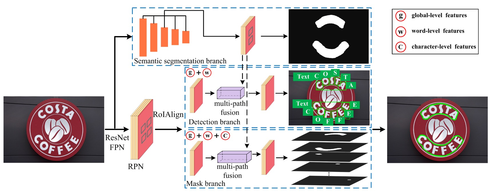

## 複数画像特徴の融合

[**TextFuseNet: Scene Text Detection with Richer Fused Features**](https://www.ijcai.org/proceedings/2020/72)

---

この論文は発表されたのが 2020 年で、月は不明です。

そのため、彼らの GitHub プロジェクトを確認しましたが、アップロードされた日時は 2020 年 9 月でした。

- [**ying09/TextFuseNet**](https://github.com/ying09/TextFuseNet)

これで間違いないと思いますが、もし情報が間違っている場合は教えてください。

## 問題の定義

文字検出の問題は大まかに言って、セグメンテーションタスクとして定義されています。

セグメンテーションタスクの結果は背景の干渉を受けやすく、特に複雑なシーンでは、予期しない物体が文字を覆うと、モデルのパフォーマンスが急激に低下します。

モデルの堅牢性を向上させるために、この論文の著者は特徴融合の観点からアプローチしています。彼は特徴には次のものが含まれるべきだと考えています：

1. **文字レベルの特徴**：文字の形状、サイズ、方向など
2. **領域レベルの特徴**：文字のコンテキスト、背景など
3. **画像レベルの特徴**：全体の画像の特徴

そのため、彼らは新しいモデル「TextFuseNet」を提案しました。このモデルはこれら三つの特徴を同時に抽出し、それらを融合させます。

## 解決問題

### モデルアーキテクチャ

この図は少し複雑に見えますが、一歩ずつ見ていきましょう。ここには 5 つの部分があります：

1. **バックボーン+ネック**: これは標準装備で、この論文では ResNet-50 をバックボーンネットワークとして使用し、FPN をネックネットワークとして採用しています。
2. **RPN**: 文字候補領域を生成するネットワークで、ここでは RPN + RoIAlign が使用されています。
3. **ヘッド 1**: 文字領域予測分岐で、この分岐はマスク形式で出力します。
4. **ヘッド 2**: 文字レベルの検出分岐で、この分岐はバウンディングボックス形式で出力します。
5. **ヘッド 3**: 文字レベルのセグメンテーション分岐で、この分岐はマスク形式で出力します。

---

最初の部分には特に言うことはなく、皆さんもよく知っている内容です。2 番目の部分から見ていきましょう。

:::tip
もし不明な読者がいれば、[**FPN: ピラミッド構造**](../../feature-fusion/1612-fpn/index.md)シリーズの紹介を参照してください。
:::

---

2 番目の部分は RPN + RoIAlign です。

著者は Mask R-CNN と Mask TextSpotter のアイデアを参考にし、RPN を使って後続の検出とマスク分岐に必要な文字提案を生成し、セマンティックセグメンテーションと多層特徴抽出を行い、最終的な文字検出を行います。

- [**[17.03] Mask R-CNN**](https://arxiv.org/abs/1703.06870)
- [**[19.08] Mask TextSpotter**](https://arxiv.org/abs/1908.08207)

RPN の仕事は、FPN で抽出された特徴マップを基に、初期の「文字候補領域」を生成することです。スライディングウィンドウ方式で画像をスキャンし、畳み込み層を通して「アンカーボックス（anchor boxes）」を出力します。アンカーボックスは潜在的な文字の位置を表します。各候補領域に対して、RPN は文字が存在するかどうかを予測し、位置を修正するためのバウンディングボックス回帰を行います。

RPN によって文字領域提案が生成された後、RoIAlign を使って異なる特徴を抽出し、単語と文字の両方を検出します。

---

3 番目の部分は文字領域予測分岐で、上図の `Semantic Segmentation Branch` に相当します。

この分岐は、全体的なシーンの背景のようなグローバルな意味特徴を抽出するために使用されます。

文字と背景が混ざったり、形状が不規則な場合、このセマンティックセグメンテーション分岐は、グローバルなコンテキスト情報をキャッチすることで検出精度を向上させることができます。この分岐の特徴は FPN の出力から来ており、異なるレベルの特徴を整列させ、最終的には 1×1 畳み込みを行って特徴を融合します。

---

4 番目の部分は文字レベルの検出分岐で、上図の `Detection Branch` に相当します。

この分岐は、文字提案から具体的な単語や文字を検出する役割を担っています。

まず、RoIAlign 技術を使って候補領域の特徴を抽出します。この技術は、異なる解像度の特徴マップを正確に整列させることができ、従来の RoIPooling での量子化誤差を防ぎます。次に、分類とバウンディングボックス回帰を行い、単語と文字の位置を正確に特定します。従来の手法では単一のレベル（例えば単語または文字のみ）を検出するのに対し、TextFuseNet は単語と文字を同時に検出できます。

:::info
RoIAlign は Mask R-CNN で提案された技術で、RoIPooling の量子化誤差の問題を解決するために使われます。
:::

---

5 番目の部分は文字レベルのセグメンテーション分岐で、上図の `Mask Branch` に相当します。

マスク分岐は、検出された単語や文字のインスタンスセグメンテーションを担当します。

これは文字の位置を判別するだけでなく、文字の輪郭もセグメント化することを意味します。形状が複雑または不規則な文字に対する設計です。マスク分岐は、検出分岐から出力された特徴を細かく処理し、多重融合技術を使って文字、単語、全体の特徴を融合させ、最終的なマスクを生成します。

### マルチルート融合アーキテクチャ

マルチルート融合アーキテクチャは、このモデルの重要な革新点であり、文字、単語、全体の特徴を効果的に融合させることによって、検出とセグメンテーションの精度を向上させます。

1. **検出分岐における融合**：

   検出分岐では、TextFuseNet はまず文字提案からグローバルおよび単語レベルの特徴を抽出します。これらの特徴は FPN の異なるレベルの特徴マップから得られます。

   各文字提案に対して、RoIAlign 技術を使って 7×7 の特徴マップからグローバルおよび単語レベルの特徴を抽出し、これらの特徴を要素ごとに加算（element-wise summation）することで融合します。

   融合後、3×3 畳み込み層と 1×1 畳み込み層を使ってこれらの特徴をさらに処理し、最終的には分類とバウンディングボックス回帰に使用されます。

2. **マスク分岐における融合**：

   マスク分岐では、各単語提案に対して、まず次の式を使って文字の属性集合を計算します：

   $$
   C_i = \{c_i | \frac{b_i \cap b_j}{b_j} > T\}
   $$

   ここで、$b_i$と$b_j$はそれぞれ単語と文字のバウンディングボックスを表し、閾値$T$は 0.8 に設定されています。

   各文字に対して RoIAlign 操作を行い、14×14 の特徴マップから文字特徴を抽出し、これらの文字レベル特徴を要素ごとに加算します。その後、3×3 畳み込み層と 1×1 畳み込み層を通して最終的な文字特徴を生成します。

3. **三層特徴融合**：

   最後に、文字レベル、単語レベル、および全体のセマンティック特徴を融合させます。

   融合方法は、RoIAlign を使って対応する特徴を抽出し、それらを要素ごとに加算し、さらに一連の畳み込み層で処理します。これらの特徴は、融合と処理を経て、より豊かで識別力のある表現を生成し、文字のインスタンスセグメンテーションに使用されます。

:::tip
私たちはこの部分を真剣に読みましたが、正直言って：

この華麗な特徴融合方法は、推論速度が遅いのではないかと思います…
:::

### 弱監督学習

文字レベルの検出とセグメンテーションを使用するモデルは、皆同じ問題に直面します：ラベル付きデータが不足していることです。

そのため、著者は CRAFT と同様に、弱監督学習の方法を使ってこの問題を解決しました。興味がある読者は、以前紹介した記事をご覧ください：

- [**[19.04] CRAFT: ワードクラフト**](../1904-craft/index.md)

---

まず、著者は完全な文字および単語のラベルが提供されたデータセットで TextFuseNet を訓練し、事前訓練されたモデル$M$を得ました。このモデルは文字と単語を同時に検出できるものです。

次に、事前訓練されたモデル$M$を、単語ラベルのみがあるデータセット$A$に適用し、潜在的な文字サンプルを検出します。

データセット$A$の各画像に対して、事前訓練されたモデルは一組の文字候補サンプル$R$を生成します。具体的には以下のように定義されます：

$$
R = \{r_0(c_0, s_0, b_0, m_0), r_1(c_1, s_1, b_1, m_1), \cdots , r_i(c_i, s_i, b_i, m_i), \cdots \}
$$

ここで、$r_i$は$i$番目の文字候補サンプルを表し、$c_i$は予測された文字クラス、$s_i$は信頼度スコア、$b_i$は文字のバウンディングボックス、$m_i$はその文字のマスクです。

次に、予測された信頼度スコアと弱監督による単語レベルのラベルを使って文字サンプルをフィルタリングし、フィルタリングされたデータは文字レベルのラベルとして使用され、単語レベルのラベルと組み合わせることで、訓練過程でより堅牢で精度の高い文字検出モデルを生成することができます。

### 訓練データセット

- **SynthText**

  このデータセットはモデルの事前訓練に使用されます。大規模なデータセットで、約 80 万枚の合成画像が含まれています。これらの画像は、自然なシーンとランダムなフォント、サイズ、色、方向の文字が混在しており、非常に現実的です。

- **CTW1500**

  CTW1500 は長曲線文字検出の挑戦的なデータセットで、Yuliang などによって構築されました。このデータセットには 1000 枚の訓練画像と 500 枚のテスト画像が含まれています。従来の文字データセット（ICDAR 2015 や ICDAR 2017 MLT など）とは異なり、CTW1500 の文字インスタンスは 14 個の点で構成された多角形でラベル付けされ、任意の曲線文字の形状を表現できます。

- **Total-Text**

  Total-Text は新たに発表された曲線文字検出用のデータセットで、水平、多方向、および曲線文字インスタンスを含みます。この基準データセットには 1255 枚の訓練画像と 300 枚のテスト画像があります。

- **ICDAR 2013**

  ICDAR2013 は読解コンペティションの際に発表されたもので、シーン文字検出に特化しています。高解像度の画像で構成され、229 枚が訓練用、233 枚がテスト用で、英語の文字が含まれています。注釈は矩形ボックスで文字レベルで行われています。

- **ICDAR 2015**

  ICDAR 2015 は文字検出でよく使われるデータセットで、1500 枚の画像が含まれており、そのうち 1000 枚が訓練用、残りがテスト用です。文字領域は四つの頂点からなる四角形でラベル付けされています。

## 討論

### 消融実験

元々の Mask R-CNN と比較して、著者は TextFuseNet に 2 つのモジュールを導入し、文字検出の性能を向上させました：

1. **多層特徴表現（MFR）**：このモジュールは異なるレベルの特徴を抽出し、異なるスケールの文字をより正確に捉えることを助けます。
2. **多パス特徴融合アーキテクチャ（MFA）**：このアーキテクチャは多層特徴を融合させ、より豊かな特徴表現を生成し、文字検出に役立ちます。

これら 2 つのモジュールの有効性を検証するために、著者は ICDAR 2015 と Total-Text の 2 つのデータセットで消融実験を行いました。各データセットで、著者は 3 つの異なるモデルを用意し、性能を比較しました。具体的なモデル設定は以下の通りです：

- **ベースライン**：元々の Mask R-CNN で訓練されたモデル。
- **MFR**：多層特徴表現（MFR）を使用した Mask R-CNN モデル。
- **MFR+MFA**：MFR と MFA を含む完全な TextFuseNet モデル。

この消融研究では、バックボーンネットワークとして ResNet-50 を使用した FPN が採用されました。

---

上記の表のように、**多層特徴表現（MFR）**を単独で使用することで、精度（Precision）と再現率（Recall）が顕著に向上しました。ICDAR 2015 と Total-Text データセットで、MFR を使用したモデルは、ベースラインモデルと比較して F 値（F-measure）が 2%以上向上しました。

さらに、**多層特徴表現（MFR）**と**多パス特徴融合（MFA）**を組み合わせて使用することで、さらに性能が向上しました。ICDAR 2015 データセットでは、F 値がベースラインモデルより 4.6%向上し、Total-Text データセットでは 4.3%向上しました。これらの結果は、2 つのモジュール、すなわち多層特徴表現と多パス特徴融合が文字検出性能の向上に貢献していることを示しています。

これらの結果は、これら 2 つのモジュールがより豊かで識別力のある特徴表現を生成し、文字検出の精度と堅牢性を向上させることを確認しています。

### 他の手法との比較

上記の表の最後の 2 列に示されているように、TextFuseNet は CTW-1500 と Total-Text のデータセットで最良の性能を達成しました。

CTW-1500 データセットでは、ResNet-50 をバックボーンネットワークとして使用した TextFuseNet は 85.4%の F 値を達成し、これまでの最良モデルを 1.7%上回りました。ResNet-101 をバックボーンネットワークとして使用した場合、性能はさらに向上し、86.6%となり、他の手法を少なくとも 2.9%上回りました。

Total-Text データセットでは、TextFuseNet の ResNet-50 バージョンがすでに最良の結果を達成しており、ResNet-101 バージョンは他の手法を少なくとも 2.1%上回りました。これらの実験結果は、TextFuseNet が任意の形状の文字検出において最先端の性能を達成できることを示しています。

### 可視化

## 結論

この論文では、TextFuseNet という、任意の形状の文字検出に特化した革新的なフレームワークを提案しました。文字レベル、単語レベル、そしてグローバルなセマンティックレベルの多層特徴を融合することで、検出精度を向上させました。この多層特徴融合方式は、文字検出においてより豊かな表現能力をもたらし、CTW-1500 や Total-Text などのデータセットで先端的な検出性能を達成しました。

実験結果から、TextFuseNet は複雑な文字形状を処理する能力が強力であり、期待される成果を上げたことが示されました。この方法の潜在能力を示しています。

:::tip
少し遅いのは残念ですが、エンジニアとしては、ほとんどの場面でこのアーキテクチャを実際の作業に使うことはできません。
:::
