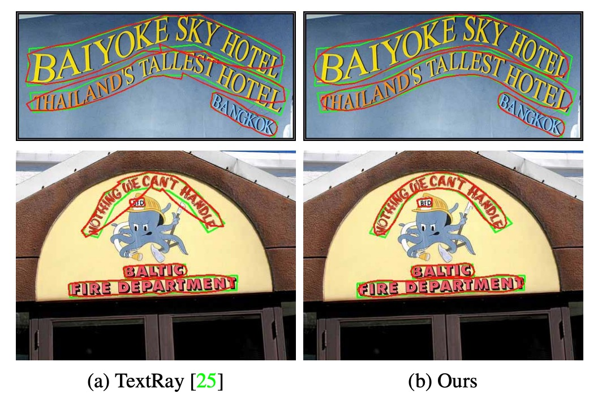
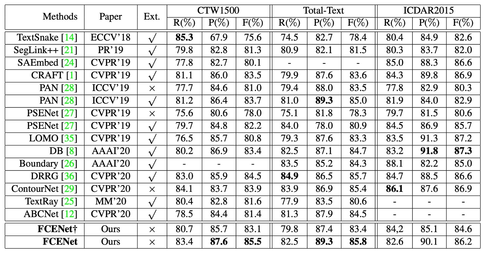

# [21.04] FCENet

## フーリエの導き

[**Fourier Contour Embedding for Arbitrary-Shaped Text Detection**](https://arxiv.org/abs/2104.10442)

---

あなたはこの論文を開いて、いくつかのテキスト検出テクノロジを知りたいと考えています。

この時、あなたは不意を突かれてフーリエに正面から撃たれ、目が真っ暗になって地面に倒れました。

## フーリエ変換

数学者ジョセフ・フーリエは 19 世紀初頭にこの数学的ツールを提案し、その後、さまざまな分野で大きな成果を上げ、百年以上にわたって輝かしい業績を残しました。

:::tip
すべての学生が目の前の問題に迷った時に、次のように言うことができます：

- **フーリエ変換を試してみてはどうか？**

解決の手助けになることは少ないかもしれませんが、偉大な先人への祈りの気持ちを込めて……

もしかしたら役に立つかもしれませんよ？
:::

フーリエの核心的な考え方は非常にシンプルです：

- **すべての波は、正弦波と余弦波の合成として分解できる。**

音楽の各音符を分解するように、フーリエ変換は、元々混乱している時間的または空間的な信号から、その周波数成分を見つける手助けをします。

この関連する応用範囲は、すでに数学や物理学の領域を超えており、工学、医学、天文学、さらには現在の深層学習技術にまで及んでいます。

しかし、たとえ「簡単に」フーリエ変換を紹介しようとしても、あまりにも多くのページを割いてしまうため、別の記事にしてこのテーマを紹介しています：

- [**フーリエ変換について**](https://docsaid.org/ja/blog/fourier-transform)

もしフーリエ変換が何かまだわからないのであれば、こちらをクリックして確認してみてください。

## 問題の定義

多方向に歪んだ文字は、研究者たちの長年の課題です。

既存の方法の多くは、空間領域での表現に基づいており、たとえば各ピクセルのマスクや輪郭点のシーケンスを使用しています。これらはデカルト座標系や極座標系を使用していますが、いくつかの欠点もあります：

- マスク表現には高い計算コストがかかり、大規模な訓練データに高い依存があります。
- 輪郭点のシーケンス表現は、高度に曲がった文字のモデリング能力が限られています。

したがって、私たちが必要としているのは、簡潔で汎用性の高い文字のインスタンス表現です。

空間領域の問題が解決できないのであれば、アプローチを変えて、周波数領域から見てみましょうか？

そうすれば、フーリエがあなたを助けることになります！

## 解決問題

### フーリエ輪郭埋め込み

原文は Fourier Contour Embedding、略して FCE です。

FCE は複素値関数 $f : \mathbb{R} \to \mathbb{C}$ を使用して閉じた「文字輪郭」を表現します：

$$
f(t) = x(t) + iy(t),
$$

ここで $i$ は虚数単位、$(x(t), y(t))$ は時間 $t$ における空間座標です。

$f(t)$ は閉じた輪郭であるため、$f(t) = f(t + 1)$ となります。

:::tip
**閉じた輪郭とは？**

閉じた輪郭は「曲線の始点と終点が同じ」幾何学的形状です。

閉じた輪郭をパラメータ化関数 $f(t)$ で表現する場合、パラメータ $t$ は通常、曲線上の位置を示し、その範囲は $t \in [0, 1]$ に設定されます。この場合、$t=0$ と $t=1$ は曲線上の同じ点に対応します。したがって：

$$
f(0) = f(1).
$$

この特性により、$f(t)$ は周期性を持ち、次のように満たします：

$$
f(t) = f(t + n), \quad n \in \mathbb{Z}.
$$

本論文では、$t$ は時間と見なされ、時間 $t$ の変化に従って点は閉じた輪郭に沿って移動します。したがって、$t$ が 1 を超えると、曲線は再び始点に戻り、周期的な運動を形成します。

:::

フーリエ逆変換 (Inverse Fourier Transformation, IFT) を通じて、$f(t)$ は次のように表現できます：

$$
f(t) = \sum_{k=-\infty}^{+\infty} c_k e^{2\pi i k t},
$$

ここで $c_k$ は複素値のフーリエ係数で、周波数 $k$ の初期状態を表します。

各 $c_k e^{2\pi i k t}$ は特定の周波数の円周運動を示します。

- **低周波**：輪郭全体の形状を担当します。
- **高周波**：輪郭の詳細を担当します。

本論文の実験結果によると、最初の $K = 5$ 個の低周波成分を保持するだけで、良好な輪郭の近似が得られ、フーリエ署名ベクトル（Fourier signature vector）が形成されます。

実際の応用では、文字の輪郭関数の形式は未知であるため、関数 $f(t)$ を $N$ 個の点に離散化する必要があります：

$$
\{f\left(\frac{n}{N}\right)\}, \quad n = 1, \dots, N.
$$

フーリエ係数 $c_k$ はフーリエ変換を通じて計算できます：

$$
c_k = \frac{1}{N} \sum_{n=1}^N f\left(\frac{n}{N}\right) e^{-2\pi i k \frac{n}{N}},
$$

ここで $c_k = u_k + i v_k$、$u_k$ は実部、$v_k$ は虚部です。

$k = 0$ の場合は輪郭の中心位置を示します：

$$
c_0 = u_0 + iv_0 = \frac{1}{N} \sum_n f\left(\frac{n}{N}\right),
$$

最終的なフーリエ署名ベクトルは次のようになります：

$$
[u_{-K}, v_{-K}, \dots, u_0, v_0, \dots, u_K, v_K].
$$

### FCE サンプリングフロー

<figure style={{"width": "90%"}}>

</figure>

異なるデータセットでは輪郭点の数が異なります。例えば、CTW1500 では 14 点、Total-Text では 4 から 8 点です。

著者は再サンプリングを通じて形式を統一し、輪郭上で等間隔に固定数の点を選択しています（実験では $N=400$ です）。

署名ベクトルの安定性を保つため、再サンプリングプロセスには次の制約が設けられています：

- **開始点**：輪郭の中心水平線と輪郭の最右端との交点に設定します。
- **サンプリング方向**：時計回りに行います。
- **均等速度**：隣接するサンプリング点の間隔は等間隔です。

### モデルアーキテクチャ

<figure style={{"width": "90%"}}>

</figure>

フーリエが理解できない問題を一旦脇に置いておくと、この論文のデザインは非常にシンプルで明確です。

FCE を基にしたアンカーフリー文字検出ネットワーク、著者はこれを FCENet と名付けました。

FCENet は ResNet50（可変畳み込み DCN を使用）をバックボーンとして採用し、FPN（特徴ピラミッドネットワーク）で多尺度特徴を抽出します。特徴マップ $P_3$、$P_4$、$P_5$ はそれぞれ小、中、大尺度の文字を担当します。

この部分で使用されている手法は以前の研究と似ており、ここでは詳述しません。

予測ヘッドは 2 つのブランチに分かれています：

1. **分類ブランチ**

   上図の上半部に位置する、Classification Branch で、さらに 2 つのサブブランチに分かれます：

   - 各ピクセルの文字領域 (Text Region, TR) マスクの予測。
   - 文字中心領域 (Text Center Region, TCR) マスクの予測。このブランチは、境界付近の予測精度を向上させるためにあります。

2. **回帰ブランチ**

   これが本論文の核心的な目的です：ここでは、各ピクセルのフーリエ署名ベクトルを予測します。

   前の章で説明したフーリエ署名ベクトルの計算は、この目的のために行われ、ここで訓練目標として提供されます。

   モデルの予測結果はフーリエ逆変換 (IFT) を通じて検出結果として再構築されます。以下の図に示します：

   

    <figure style={{"width": "70%"}}>
    
    </figure>
    

## 損失関数

総損失は次のように定義されます：

$$
L = L_\text{cls} + \lambda L_\text{reg},
$$

ここで、$\lambda=1$ です。

分類損失 $L_\text{cls}$ と回帰損失 $L_\text{reg}$ はそれぞれ次のように定義されます：

1. **分類損失**

   $$L_\text{cls} = L_\text{tr} + L_\text{tcr}$$

   ここで $L_\text{tr}$ と $L_\text{tcr}$ は文字領域と中心領域の交差エントロピー損失で、負サンプルと正サンプルの比率は 3:1（OHEM を使用）です。

2. **回帰損失**

   空間領域内での検出品質を直接最適化するために、フーリエ署名ベクトル間の距離ではなく、次のような損失を設計しました：

   $$
   L_\text{reg} = \frac{1}{N'} \sum_{i \in T} \sum_{n=1}^{N'} w_i l_1\left(F^{-1}\left(\frac{n}{N'}, c_i\right), F^{-1}\left(\frac{n}{N'}, \hat{c}_i\right)\right),
   $$

   ここで：

   - $l_1$ は $ \text{smooth L1}$ 損失です。
   - $F^{-1}$ はフーリエ逆変換です。
   - $T$ は文字領域のピクセル集合です。
   - $c_i$ と $\hat{c}_i$ はそれぞれ真のフーリエ署名ベクトルと予測されたフーリエ署名ベクトルです。
   - $w_i$ は重みで、中心領域のピクセルに対して $w_i=1$、それ以外の場合は $w_i=0.5$ です。
   - サンプリング点数 $N'=50$ は過学習を防ぐためです。

   ***

   :::tip
   この詳細に注目してください。著者はフーリエ署名ベクトル間の距離を直接計算するのではなく、それを空間領域に戻してから空間領域内の損失を計算しています。

   **なぜ？**

   フーリエ署名ベクトルは、輪郭が周波数領域で持つ特徴を表現しているため、直接的な空間領域の幾何学的形状を示しているわけではありません。署名ベクトルの差異をそのまま計算することは、輪郭の空間における形状差異を正確に反映できない可能性があります。

   もし低周波成分にわずかな誤差があった場合、それは輪郭の全体的な位置に影響を与えるかもしれませんが、フーリエ署名ベクトルの差異は依然として小さいままであるかもしれません。

   一方、高周波成分の誤差は輪郭の細かなディテールにのみ影響を与えるかもしれませんが、署名ベクトルの距離には大きな影響を与えることがあります。

   著者はこのような設計に関連する実験を行っていると考えられます。
   :::

### 訓練データセット

- **1. CTW1500**

  - 中国語と英語の文字を含み、**テキスト行（text-line）単位でアノテーション**されています。
  - データ量：1000 枚の訓練画像、500 枚のテスト画像。

- **2. Total-Text**

  - 多様なシーンデータを含み、文字に似た背景干渉や低コントラストの文字があります。
  - **単語単位のポリゴン**としてアノテーションされています。
  - データ量：1255 枚の訓練画像、300 枚のテスト画像。

- **3. ICDAR2015**
  - 多方向の街角文字のデータセットで、**単語単位のアノテーション**は四隅の点で表されています。
  - データ量：1000 枚の訓練画像、500 枚のテスト画像。

## 討論

### FCE 評価

<figure style={{"width": "70%"}}>

</figure>

理論的には、閉じた連続的な輪郭は、FCE のフーリエ階数 $K$ を増加させることで、より良い適合が得られるとされています。

上記の結果に基づくと、少ない $K$ でも大部分の任意形状の文字輪郭に対して満足のいく適合が得られ、これは FCE の強力な表現能力を示しています。

FCE と最近の最新の任意形状文字検出手法 **TextRay** を比較した結果が以下の通りです：

<figure style={{"width": "70%"}}>

</figure>

高曲率の文字に関して、**TextRay** は実際の輪郭を正確に適合できず、高曲率文字のモデリングにおける限界を示しています。それに対して、FCE はこのような文字輪郭の適合において非常に高い精度を発揮しました。

効率の観点では、FCE は 22 次元のパラメータだけで文字輪郭を表現できます。TextRay は 44 次元のパラメータを使用し、FCE の 2 倍ですが、効果は FCE に及びません。したがって、FCE はパラメータ効率と適合精度の両方で明確な優位性を持っています。

### 消融実験

<figure style={{"width": "70%"}}>

</figure>

FCENet の各構成要素の有効性を検証するために、著者は CTW1500 と Total-Text データセットを使用して消融実験を行いました。その結果は以下の通りです：

- **文字中心領域 (TCR) 損失**：分類ブランチの TCR 損失が検出性能を大幅に向上させました。
- **回帰損失**：回帰ブランチで設計された新しい損失が再構築された文字輪郭を効果的に最適化し、性能の向上に寄与しました。

:::tip
この回帰損失の向上効果は非常に顕著であり、フーリエ署名ベクトルの有効性を直接証明しています。これは本論文の大きな特徴です。
:::

### 一般化能力

<figure style={{"width": "70%"}}>

</figure>

FCE の一般化能力を検証するために、著者は CTW1500 データセットで訓練データを縮小する実験を行いました。訓練データを元の 50% および 25% に減らし、他の手法（DRRG、TextRay、ABCNet など）と比較しました。

結果は、他の手法の性能が大きく低下したのに対して、FCENet は精度、再現率、F 値が良好なままであり、特に精度は常に 80% を超えて非常に安定した性能を発揮しました。

:::tip
関連する論文については以下のリンクを参照できます：

- [**[20.02] ABCNet**](https://arxiv.org/abs/2002.10200)
- [**[20.03] DRRG**](https://arxiv.org/abs/2003.07493)
- [**[20.08] TextRay**](https://arxiv.org/abs/2008.04851)
  :::

### 他の手法との比較

- **Ext: 追加の訓練データを使用した場合**
- **†: 簡略版 FCENet†、DCN を含まない**

---

CTW1500 と Total-Text データセットで FCENet と他の最新手法を比較した結果は以下の通りです：

- **精度 (P) と F 値 (F)**：FCENet が最良の性能を達成しました。
- **再現率 (R)**：競争力のある結果を達成しました。

ICDAR2015 データセットでは、FCENet は追加の設定なしで競争力のある結果を達成しました。

FCENet のネットワーク構造はシンプルで、後処理（IFT と NMS）が効率的であり、実装が容易で実用的です。DCN を含まない ResNet50 をバックボーンとして使用しても（ABCNet と同じ設定）、FCENet は複数のデータセットで競争力のある結果を達成しました。

:::tip
この部分はまた、DCN が非常に強力な演算子であり、モデルの性能を効果的に向上させることができることを示しています。
:::

### 高曲率文字

最後に、著者は CTW1500 データセットで高曲率文字のサブセットを構築し、高曲率文字の検出能力を評価しました。

結果は上図の通りで、FCENet は高曲率文字の検出精度と精度の両方で優れた性能を示し、不規則な文字インスタンスの表現能力をさらに向上させました。

## 結論

フーリエの優雅さは疑いようがありません。

本論文で提案されたフーリエ輪郭埋め込み法は、任意形状の文字輪郭を正確に表現することができ、特に高曲率文字の適合において優れた成果を上げました。FCENet はフーリエ署名ベクトルを予測し、逆変換を行って文字輪郭を再構築します。煩雑な後処理ステップを省き、精度と実用性のバランスを取ることができ、特に複雑な輪郭や曲線文字の検出に適しています。

フーリエ法は単なる数学的ツールではなく、実際の問題を解決するための強力な手段です。FCE と FCENet を通じて、著者は任意形状文字検出のための効率的で実用的な解決策を提供し、今後の文字形状モデリングの可能性を広げました。
