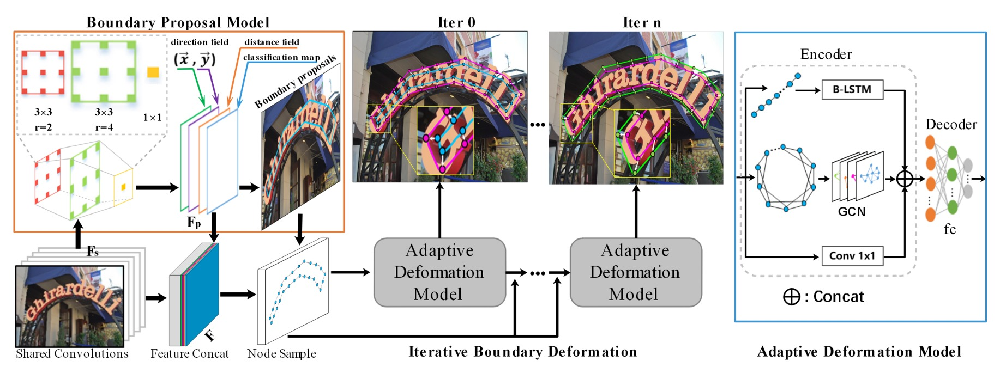
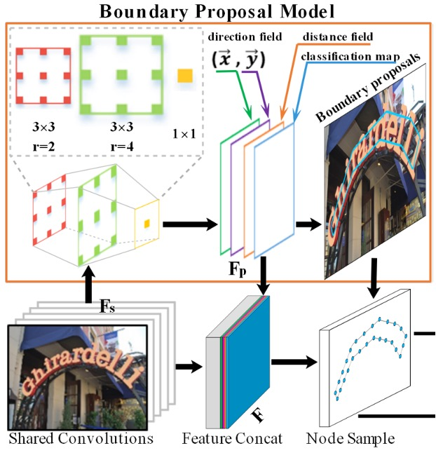
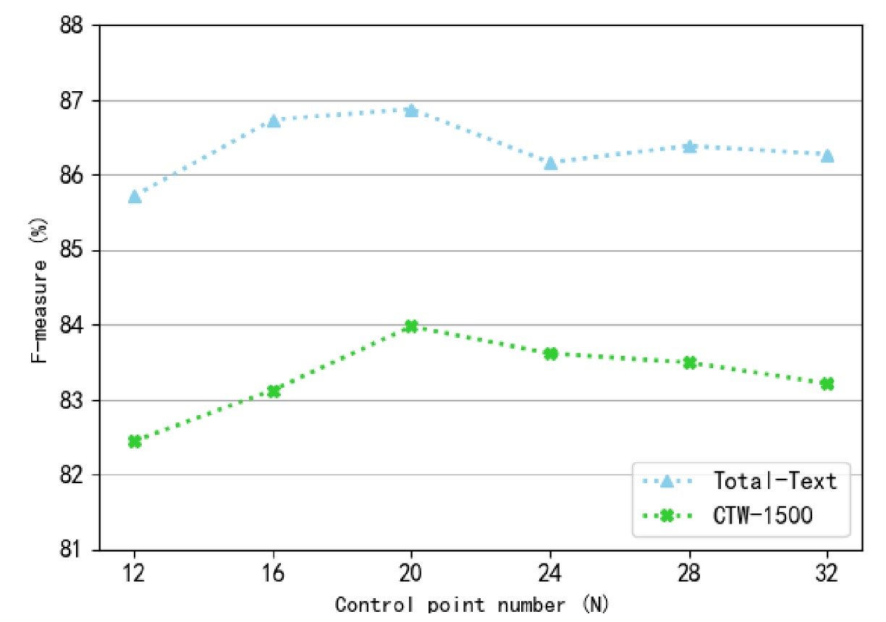

# [21.07] TextBPN

## グラフ畳み込みの再考

[**Adaptive Boundary Proposal Network for Arbitrary Shape Text Detection**](https://arxiv.org/abs/2107.12664)

---

この論文では、テキスト検出の問題を解決するためにいくつかの概念が導入されています。

最初の概念は LSTM で、文字の境界を捉えるシーケンシャルなデータを扱います。もう一つは GCN、つまりグラフ畳み込みネットワークで、文字境界の特徴を細かく調整するために使用されます。これらの概念については、詳しく説明すれば何日もかかりますが、読者の皆さんはすでにこれらの概念に馴染みがあると思います。

ですので、直接本題に入ります。

:::tip
グラフの畳み込みについて知らない場合は、以前の記事を参照してください。

- [**グラフ畳み込みネットワークの概要**](https://docsaid.org/ja/blog/graph-convolutional-networks)
  :::

## 問題の定義

これまでにいくつかのテキスト検出手法を見てきましたが、ほとんどの方法は文字領域の重なりを解決するために、「文字コア」を最初に特定し、その後そのコアから外向きに拡張して文字境界を見つけるというアプローチを取っています。

これらの方法は大抵遅く、論文中でも「複雑で非効率的」と表現されています。

これらの問題を改善するために、著者は任意の形状のテキスト検出に対応した新しい自適応境界提案ネットワークを提案しています。このネットワークは、後処理なしで直接任意の形状のテキストの正確な境界を生成することを学習できます。

## 問題の解決

### モデルアーキテクチャ

このアーキテクチャは一見複雑に見えますが、いくつかの部分に分けて見ていきましょう。

### Backbone + Neck

基本的な特徴マップの抽出は基本的な操作です。ここでの Backbone は ResNet-50 を使用し、Neck 部分では Concat 方式で特徴を融合しています。これは U-Net 風のアーキテクチャです。

最終的に Neck の出力は 32 チャンネルで、入力画像と同じサイズの特徴マップとなります。

### 境界提案生成

<figure align="center">

</figure>

境界提案生成（Boundary Proposal Generation）は、複数の膨張畳み込みから構成され、2 層の$3 \times 3$畳み込み層（異なる膨張率）と 1 層の$1 \times 1$畳み込み層を含みます。

これらの畳み込み層は、バックボーンネットワークから抽出された共有特徴を使用して、3 種類の出力を生成します：分類マップ、距離場マップ、方向場マップ。

1. **分類マップ：** 他のテキスト検出方法と同様に、二項分類のマップであり、各ピクセルはテキストであるかどうかの分類信頼度を示します（二項分類：テキスト/非テキスト）。
2. **方向場マップ：**

   方向場マップ$V$は、2 次元単位ベクトル$(\vec{x}, \vec{y})$であり、各テキストピクセルが最寄りの境界ピクセルに向かう方向を示します。各テキストインスタンス$T$内のピクセル$p$について、最寄りの境界ピクセル$B_p$を見つけ、$p$から$B_p$への単位ベクトル$V_{gt}(p)$を計算します。その式は以下の通りです：

   $$
   V_{gt}(p) =
   \begin{cases}
   \frac{\overrightarrow{B_p p}}{\|\overrightarrow{B_p p}\|}, & p \in T \\
   (0, 0), & p \notin T
   \end{cases}
   $$

   ここで、$$\|\overrightarrow{B_p p}\|$$は$B_p$とテキストピクセル$p$との間の距離を示します。

3. **距離場マップ：**

   距離場マップ$D$は正規化された距離マップであり、テキストピクセル$p$から最寄りの境界ピクセル$B_p$への正規化された距離を示します。その式は以下の通りです：

   $$
   D_{gt}(p) =
   \begin{cases}
   \frac{\|\overrightarrow{B_p p}\|}{L}, & p \in T \\
   0, & p \notin T
   \end{cases}
   $$

   ここで$L$はテキストインスタンス$T$のスケールであり、次のように定義されます：

   $$
   L = \max(D_{gt}(p)), p \in T
   $$

距離場マップ$D$に基づいて、固定された閾値$th_d$を使用して候補境界提案を生成できますが、これらの提案には誤検出が含まれる可能性があります。そのため、分類マップを使用して各候補境界提案の平均信頼度を計算し、閾値$th_s$を使用して信頼度の低い提案を除去します。

これらの手順と式は、境界提案生成プロセスを構成し、テキスト領域を効果的に検出し、隣接するテキストインスタンス間の境界問題を処理することができます。

### 自適応境界変形

自適応境界変形（Adaptive Boundary Deformation）モデルのアイデアは、過去の研究論文に基づいています：

- [**[18.03] Efficient Interactive Annotation of Segmentation Datasets with Polygon-RNN++**](https://arxiv.org/abs/1803.09693)
- [**[19.03] Fast Interactive Object Annotation with Curve-GCN**](https://arxiv.org/abs/1903.06874)
- [**[20.01] Deep Snake for Real-Time Instance Segmentation**](https://arxiv.org/abs/2001.01629)

これらの論文の詳細については、後日別の記事で紹介しますが、ここでは既知の結論をそのまま使用します：

これらの方法により、モデルは各インスタンスの具体的な境界制御点を制御することができます。モデルは CNN 特徴を入力として使用し、各頂点のオフセット予測を行います。各境界提案は均等に N 個の制御点をサンプリングし、これらの制御点で閉じた多角形を形成し、トポロジーコンテキストとシーケンスコンテキストを考慮します。

各制御点$cp_i = [x_i, y_i]^T$に対して、特徴ベクトル$f_i$が生成されます。

これらの特徴は、CNN のバックボーンネットワークから取得された 32 次元の共有特徴$F_s$と 4 次元の事前特徴$F_p$（ピクセル分類、距離場、方向場など）を組み合わせたものです。

具体的な式は次の通りです：

$$
f_i = \text{concat}\{F_s(x_i, y_i), F_p(x_i, y_i)\}
$$

---

制御点の予測を得た後、次に境界提案を精緻化します。

ここでは GCN と RNN を導入して境界変形を行います。下の図のように：

<figure align="center">

</figure>

エンコーダは GCN と RNN を組み合わせており、境界のトポロジーとシーケンスコンテキストを最大限に活用します。式は次の通りです：

$$
X' = \text{RNN}(X) \oplus \text{GCN}(X) \oplus \text{Conv1x1}(X)
$$

ここで、RNN は 128 の隠れ層を持つ B-LSTM から構成されています。

例えば、ここでの入力は：[バッチサイズ, 制御点シーケンス, 制御点特徴]となります。

---

GCN は ReLU を活性化関数として持つ 4 層のグラフ畳み込み層を含んでおり、グラフ畳み込み層の式は次の通りです：

$$
X_g = \text{ReLU}((X \oplus GX)W)
$$

ここで、$G = D^{-1/2} \tilde{A} D^{-1/2}$、$\tilde{A} = A + I_N$、$A$は局所グラフの隣接行列、$I_N$は単位行列、$D$は対角行列です。

GCN 内の各制御点はその 4 つの隣接点と接続され、このようにして制御点間のコンテキスト関係を処理します。

---

上記の 2 つの分岐に加えて、1 つの$1 \times 1$畳み込み層が残差接続を形成し、3 つの分岐で特徴融合が行われます。

すべての特徴は結合（Concat）された後、デコーダに入力され、デコーダの出力は制御点のオフセットとなります。

より精度の高い文字境界を得るために、境界変形は複数回の反復処理を経て実行されます。これらの手順により、モデルは反復的に変形を行い、初期の境界提案を段階的に精緻化し、最終的に正確な文字検出を実現します。

:::tip
ここでは、RNN はシーケンス処理に使用され、GCN は隣接ノードの情報フローを処理します。

私たちの経験では、2021 年の時点でこれらの作業はすべて Transformer で実行できるようになっており、今後の改良方向として考えられるかもしれません。
:::

### 訓練データセット

- **SynthText**

  このデータセットは、モデルの事前訓練に使用されます。これは約 80 万枚の合成画像を含む大規模なデータセットです。これらの画像は、自然なシーンとランダムなフォント、サイズ、色、方向のテキストを組み合わせたもので、非常に高い現実感を持っています。

- **CTW1500**

  CTW1500 は、長い曲線テキスト検出のための挑戦的なデータセットで、Yuliang らによって構築されました。このデータセットは、1000 枚の訓練画像と 500 枚のテスト画像を含んでいます。従来のテキストデータセット（ICDAR 2015、ICDAR 2017 MLT など）とは異なり、CTW1500 のテキストインスタンスは 14 点の多角形で注釈が付けられており、任意の曲線テキストの形状を記述できます。

- **Total-Text**

  Total-Text は、新しく公開された曲線テキスト検出用のデータセットで、水平、多方向、曲線テキストインスタンスを含みます。このベンチマークデータセットには、1255 枚の訓練画像と 300 枚のテスト画像が含まれています。

- **MSRA-TD500**

  これは、多言語、任意方向、長いテキスト行のデータセットです。300 枚の訓練画像と 200 枚のテスト画像を含み、テキスト行には行レベルの注釈が付けられています。訓練セットが小さいため、実験では HUST-TR400 データセットの画像が訓練データとして追加されています。

- **ICDAR 2017 MLT**

  IC17-MLT は、大規模な多言語テキストデータセットで、7200 枚の訓練画像、1800 枚の検証画像、9000 枚のテスト画像を含んでいます。このデータセットは、9 つの言語からの完全なシーン画像で構成されています。

## 討論

### 消融実験

自適応変形モデルの有効性を検証するために、著者は Total-Text および CTW-1500 データセットでいくつかの消融実験を実施しました。

1. **自適応変形モデルの有効性：**

   

   4 つの異なるエンコーダを比較しました：全結合ネットワーク（FC）と Conv1x1、RNN、循環畳み込み（Circular Convolution）、グラフ畳み込みネットワーク（GCN）。

   上の表から、自己適応変形モデルは、Total-Text と CTW-1500 の両データセットで最良のパフォーマンスを達成しており、RNN と比較して Total-Text で F-measure が 0.94%向上し、GCN と比較して 0.85%向上しました。また、自己適応変形モデルは、検出時間を顕著に増加させることはありませんでした。

2. **制御点の数（N）の影響：**

   

   著者は、検出性能に対する異なる制御点の数の影響を調べました。制御点の数は 12 から 32 の範囲で、間隔は 4 に設定されました。

   上の図からわかるように、制御点の数が多すぎるか少なすぎると、F-measure は低下します。特に制御点が少ないと、検出した境界がテキスト領域全体を正しくカバーできなくなり、性能が大幅に低下します。制御点数が約 20 の時、Total-Text および CTW-1500 データセットで最適な検出性能を達成しました。したがって、実験では制御点の数を 20 に固定しました。

3. **反復回数の影響：**

   

   著者は、異なる推論反復回数のモデル性能を比較しました。上の表によると、反復回数の増加に伴い検出性能は向上しましたが、推論速度は低下しました。反復回数が 2 回から 3 回に増加すると、検出性能の向上は顕著ではなくなりました。速度と性能のバランスを考慮し、実験では反復回数を 3 回に設定しました。

4. **先験情報の影響：**

   

   著者は、Total-Text データセットで消融実験を実施し、異なる先験情報（分類マップ、距離場、方向場）の重要性を検証しました。上の表によると、分類マップのみを使用した場合、検出性能は良好ではありません。距離場と方向場を加えると、性能が著しく向上し、F-measure はそれぞれ 5.45%と 1.55%向上しました。

### 曲線テキスト実験結果

<figure>

<figcaption>Total-Text 実験結果</figcaption>
</figure>

<figure>

<figcaption>CTW1500 実験結果</figcaption>
</figure>

---

テスト時、画像の短辺は 640 にスケーリングし、長辺は 1024 ピクセル以内に制限しました。候補境界提案を取得するための距離場閾値$th_d$は 0.3 に固定されました。

Total-Text でテストする際の分類閾値$th_s$は 0.825 に設定しました。

上の表に基づくと、SynthText で事前訓練を行った場合、TextBPN は F-measure で 87.37%を達成し、MLT17 で事前訓練を行うと F-measure が 87.85%に向上しました。他の方法と比較して、TextBPN は F-measure で他の技術を顕著に上回っています。

CTW-1500 でテストする際、分類閾値$th_s$は 0.8 に設定しました。

TextBPN は精度（87.81%）と F-measure（85.0%）の両方で優れたパフォーマンスを発揮しました。特に TextSnake および DB 方法と比較して、TextBPN の F-measure はそれぞれ 9.4%および 1.6%向上しました。

### MSRA-TD500 実験結果

MSRA-TD500 でテストする際、分類閾値$th_s$は 0.925 に設定しました。

TextBPN は任意の方向およびサイズの長いテキスト行を成功裏に検出し、F-measure で 85.57%を達成しました。他の技術（DB および DRRG など）を超えました。

### 可視化結果

## 結論

GCN および RNN を文字検出分野に導入することは、非常に新しい戦略であることがわかりました。

実験結果は、この方法が Total-Text、CTW-1500 などの挑戦的なデータセットで顕著な性能向上を達成したことを証明しており、特に不規則および曲線的なテキストの処理において優れたパフォーマンスを示しています。

今後の研究では、検出精度を維持しながら推論速度および応用の柔軟性をさらに向上させることができれば、より広範なシーンで実用性を発揮する可能性があります。

:::tip
実際、分類閾値$th_s$は評価データセットで非常に重要な役割を果たしていることがわかります。この部分には多くの議論の余地があります。パラメータを調整ミスすると、モデルのパフォーマンスが大幅に低下する可能性があり、エンジニアの視点からは多くの悩みの種になるかもしれません。
:::
