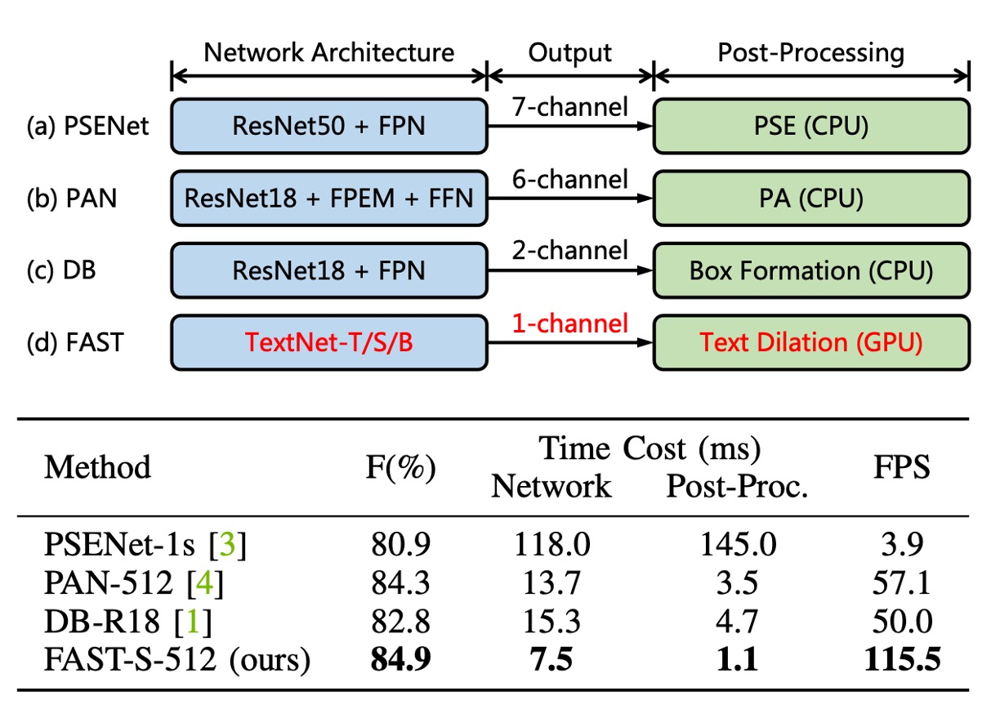
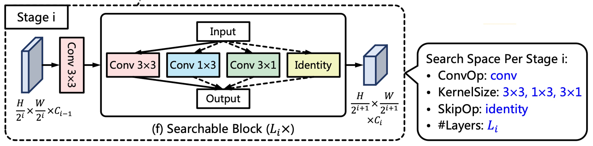
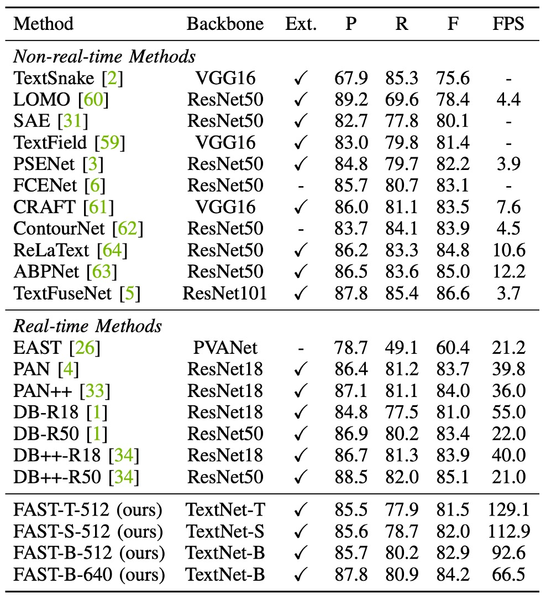
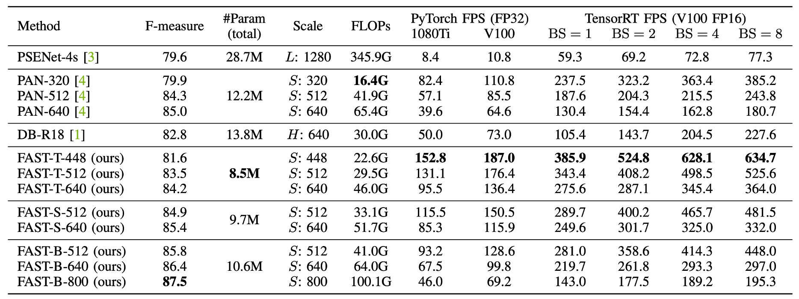

## とても速い

[**FAST: Faster Arbitrarily-Shaped Text Detector with Minimalist Kernel Representation**](https://arxiv.org/abs/2111.02394)

---

どの著者も前作の非効率な設計を一度は嘲笑し、しかしその後に提案するアーキテクチャはわずかな改善しかもたらしていない。

今回は少し違うようだ。この論文では新しい基盤となるアーキテクチャを設計し、後処理方法を最適化したことで、全体的な性能が大幅に向上した。推論速度と予測精度のバランスが良好で、今後数年間の優れた基準となるだろう。

## 定義された問題

著者は現在のテキスト検出方法の「後処理」プロセスに大きな問題があると考えている。

上の図のように、現在の主要な検出方法では、「後処理」が全体の約 30%を占めている。そして、これらの方法の後処理はすべて CPU 上で実行されており、GPU のリソースと並行して動作させることが難しく、明らかな性能ボトルネックを引き起こしている。

これを変更する必要がある！

---

一方で、現在流行している検出方法では、Backbone の設計の多くが既存の画像分類ネットワークに基づいており、その後 FPN や U-Net を使って特徴融合を行っている。

文字は形が多様で、通常は非常に長いため、このような設計は適していない可能性がある。

したがって、Backbone も変更する必要がある！

## 解決問題

### 模型アーキテクチャ

まず、著者は多くの主流の Backbone + Neck アーキテクチャを捨てました。

新しい Backbone アーキテクチャ「TextNet」を再構築し、このアーキテクチャの出典については後ほど説明します。

Neck は捨てましたが、特徴融合は依然として必要です。ここでは、著者は Backbone から出力される多尺度特徴マップをそのまま使用し、最後にそれらを結合（concatenate）します。

### 極簡文字表現法

予測ヘッド部分では、入力特徴マップは先に述べた多尺度特徴マップで、出力は 1 チャンネルで構成される文字コアマップです。

Minimalist Kernel Representation（MKR）は、著者が提案した文字コアの表現法です。

従来の研究では収縮演算を使用して文字コアを取得していましたが、ここでは「侵食」操作を使用して文字コアを取得します。文字コアマップを得た後、「連結領域ラベリング」が行われます。この概念は以下の論文から来ています：

- [**[19.08] Optimized Block-Based Algorithms to Label Connected Components on GPUs**](https://www.researchgate.net/publication/335183975_Optimized_Block-Based_Algorithms_to_Label_Connected_Components_on_GPUs)

これは、GPU 上で「連結領域ラベリング」の演算を行うために CUDA コードを直接実装したものです。

関連実装は FAST の[**GitHub**](https://github.com/czczup/FAST)にて確認できます：[**ccl_cuda.cu**](https://github.com/czczup/FAST/tree/main/models/post_processing/ccl)

アルゴリズムの実装ロジックは以下の通りです：

推論段階では、文字インスタンスを出力する前に連結領域ラベリングが行われ、その後`max_pool2d`を使用して文字の膨張機能が完了します。

`max_pool2d`を使用しているため、文字膨張の過程で重なった部分は、連結領域番号が大きい部分に優先的に割り当てられます。

### ラベル生成戦略

モデルを監視するために、ラベルを生成する必要があります。

ここで著者は`Erode`操作を使用してラベルを生成します。最終出力段階で`Dilate`操作が文字膨張に使用されるため、ラベル生成時にはデータセット内の文字ラベルに`Erode`操作を施すだけで十分です。

### TextNet

最後に Backbone の設計方法です。

著者は ProxylessNAS の設計を基に、文字検出専用のアーキテクチャ検索のための Backbone を構築しました。

- [**[18.12] Proxylessnas: Direct neural architecture search on target task and hardware**](https://arxiv.org/abs/1812.00332)

各ネットワーク段階には、ストライド 2 の畳み込み層と複数の検索可能なブロックが含まれており、上図に示されています。

ストライド 2 の 3x3 畳み込み層は特徴マップのダウンサンプリングに使用され、各検索可能なブロックは候補操作のセットで構成され、アーキテクチャ検索後に最適な操作が最終的な操作として選ばれます。

最高速度を追求するため、著者は候補操作として再パラメータ化畳み込みを使用し、推論過程でそれを単一のブランチの畳み込み操作に統合しました。その中で、著者は階層的候補操作セットを設計し、以下のように定義しています：

- $\text{conv 3x3}$
- $\text{conv 1x3}$
- $\text{conv 3x1}$
- $\text{identity}$

$1 \times 3$および$3 \times 1$の畳み込みは非対称のカーネルと方向性の構造的先験があり、これらの操作は極端な長さ比率および回転した文字列の特徴を捉えるのに役立ちます。さらに、identity 操作はその層をスキップすることを意味し、ネットワークの深さと推論速度を制御します。

:::tip
これはあまり注目されていない部分かもしれませんが、論文に記載されている通り：

実際に検索段階に進むアーキテクチャネットワークは`RepConvLayer`であり、通常の畳み込み層ではありません。

この実装は[**BreadcrumbsFAST/models/utils/nas_utils.py#RepConvLayer**](https://github.com/czczup/FAST/blob/6bdfd251f04f800b5b20117444eee10a770862ad/models/utils/nas_utils.py#L603C7-L603C19)に記載されています。

この畳み込み層に`kernel_size=[3, 3]`を入力すると、完全な再パラメータ化されたブランチ構造が得られます。`kernel_size=[3, 1]`を入力すると、固定方向の構造が得られます。このように、検索されるアーキテクチャの目標はこの`kernel_size`の設定であり、選択可能な操作は`3x3`、`3x1`、`1x3`、`Identity`です。しかし、どのようにアーキテクチャが検索されても、その内部の操作のコアは`RepConvLayer`であり、最終的には推論時に「再パラメータ化」が行われます。

「再パラメータ化」が何であるか分からない場合は、以前書いた記事を参照してください：

- [**[21.01] RepVGG: 让 VGG 再次伟大**](../../reparameterization/2101-repvgg/index.md)

:::

### 損失関数

FAST モデルの損失関数は次のように表されます：

$$
L = L_{ker} + \alpha L_{tex}
$$

ここで、$L_{ker}$と$L_{tex}$はそれぞれ文字コア領域と文字領域の損失を表します。

一般的な方法に従い、著者はネットワークの訓練を監視するために Dice 損失を使用しているため、$L_{ker}$と$L_{tex}$は次のようにそれぞれ表されます：

$$
L_{ker} = 1 - \frac{2 \sum_{x,y} P_{ker}(x, y) G_{ker}(x, y)}{\sum_{x,y} P_{ker}(x, y)^2 + \sum_{x,y} G_{ker}(x, y)^2}
$$

$$
L_{tex} = 1 - \frac{2 \sum_{x,y} P_{tex}(x, y) G_{tex}(x, y)}{\sum_{x,y} P_{tex}(x, y)^2 + \sum_{x,y} G_{tex}(x, y)^2}
$$

ここで、$P(x, y)$と$G(x, y)$はそれぞれ予測値と真実値が位置$(x, y)$で取る値です。

さらに、著者は$L_{tex}$に**オンライン困難サンプル挖掘**（OHEM）を適用して、簡単な非文字領域を無視するようにしています。

$\alpha$は$L_{ker}$と$L_{tex}$の重要性をバランスさせるために使用され、実験では 0.5 に設定されています。

### 訓練データセット

- **CTW1500**

  CTW1500 は、長曲線文字検出のための挑戦的なデータセットで、Yuliang などによって作成されました。このデータセットには 1000 枚の訓練画像と 500 枚のテスト画像が含まれています。従来の文字データセット（例：ICDAR 2015、ICDAR 2017 MLT）とは異なり、CTW1500 の文字インスタンスは 14 点の多角形ラベルで、任意の曲線文字の形状を記述できます。

- **Total-Text**

  Total-Text は新たに公開された曲線文字検出データセットで、水平、多方向、および曲線文字インスタンスが含まれています。このベンチマークデータセットには 1255 枚の訓練画像と 300 枚のテスト画像が含まれています。

- **MSRA-TD500**

  これは多言語、任意方向、長い文字列を含むデータセットです。300 枚の訓練画像と 200 枚のテスト画像が含まれており、文字列は行レベルのラベルとしてアノテーションされています。訓練セットが小さいため、実験には HUST-TR400 データセットの画像を訓練データとして加えました。

- **ICDAR 2015**

  ICDAR 2015 は文字検出でよく使用されるデータセットで、1500 枚の画像が含まれており、そのうち 1000 枚は訓練用、残りはテスト用です。文字領域は四つの頂点を持つ四角形でアノテーションされています。

- **ICDAR 2017 MLT**

  IC17-MLT は大規模な多言語文字データセットで、7200 枚の訓練画像、1800 枚の検証画像、および 9000 枚のテスト画像が含まれています。このデータセットは 9 言語からの完全なシーン画像で構成されています。

## 討論

### NAS 検索アーキテクチャ

上図のように、著者は TextNet-T/S/B の検索アーキテクチャを描いており、以下の現象を観察しています：

- **非対称畳み込み**は TextNet の主要な操作であり、文字列を高い精度と効率で検出するのに役立ちます。
- **TextNet-T と TextNet-S**は、より深い層（stage-3 および stage-4）で多くの畳み込み層を積み重ねており、**TextNet-B**は、より浅い層（stage-1 および stage-2）で積み重ねる傾向があります。

これにより、TextNet が 100FPS、80FPS、60FPS という 3 つの特定の速度制限下で異なる積み重ねのルールを示し、手動で設計されたネットワーク（通常は stage-3 で多くの層を積み重ねる戦略）がリアルタイム文字検出には最適ではない可能性があることが示されます。

### アブレーション実験

- **提案されたコンポーネントの比較**

  

  上表に示すように、著者は提案されたコンポーネントの効果を比較しています。例えば、PAN アーキテクチャでは`Pixel Aggregation`を使用しており、本論文では著者が提案する`Text Dilation`です。

  公平な比較のために、すべてのモデルは IC17-MLT で事前学習され、その後 Total-Text または ICDAR 2015 で微調整が行われました。

  ResNet18 と CPU ベースの後処理である Pixel Aggregation のベースラインと比較して、**FAST-R18**は後処理を GPU 並列化された文字膨張操作に置き換え、より高い効率を達成し、検出性能は同等でした。

  また、ResNet18 のバックボーンネットワークを**TextNet-B**に置き換えることで、性能と効率がさらに向上し、パラメータ数が削減されました。

- **収縮コア**

  

  この実験では、著者は**FAST-R18**モデルを基に膨張サイズ$s$（侵食サイズに相当）の効果を研究しました。

  ここでは、Total-Text と ICDAR 2015 データセットの画像の短辺を 640 ピクセルと 736 ピクセルにスケーリングしました。

  上表に従い、膨張サイズが小さすぎると、両データセットで F 値が低下します。著者は経験的に膨張サイズ$s$を 9 に設定しました。

  短辺のサイズ$S$が変更された場合、膨張サイズ$s$は最適な性能を得るために比例的に更新される必要があります：

  $$
  s_{\text{new}} = \text{Round}\left(\frac{S_{\text{new}} \times s_{\text{default}}}{S_{\text{default}}}\right)
  $$

  ここで、$\text{Round}(·)$は丸め関数です。例えば、上記の式に基づき、短辺を 640 ピクセルではなく 800 ピクセルに固定した場合、膨張サイズ$s$は 11 に設定する必要があります。

### 曲線文字実験結果

<figure>

<figcaption>Total-Text 実験結果</figcaption>
</figure>

---

Total-Text データセットでは、**FAST-T-448**は 152.8 FPS の速度で 81.6%の F 値を達成し、すべての先行手法を超えました。**FAST-S-512**は F 値でリアルタイム文字検出器の DB++-R18 を 1.6%上回り（84.9% vs. 83.3%）、速度は 2.4 倍速くなりました。

PAN++と比較して、**FAST-B-640**は 29.2 FPS 速く、F 値は 1.1%向上しました（86.4% vs. 85.3%）。

入力解像度が増加すると、**FAST-B-800**は 87.5%の最良 F 値を達成し、すべてのリアルタイム検出手法を少なくとも 1.5%上回り、なおかつ高速な推論速度（46.0 FPS）を維持しています。

---

<figure>

<figcaption>CTW1500 実験結果</figcaption>
</figure>

---

**FAST-T-512**の推論速度は 129.1 FPS で、従来の手法よりも少なくとも 2.3 倍速く、F 値も競争力があります（81.5%）。

FAST の最良 F 値は 84.2%で、DB++-R18（84.2% vs. 83.9%）をわずかに上回り、私たちの方法はより高速です（66.5 FPS vs. 40.0 FPS）。

### ICDAR2015 実験結果

<figure>

<figcaption>ICDAR2015 実験結果</figcaption>
</figure>

---

上表からわかるように、最速のモデル**FAST-T-736**は 60.9 FPS の速度で 81.7%の競争力のある F 値を維持しました。

PAN++と比較して、**FAST-B-896**は F 値が 3.2%向上しました（86.3% vs. 83.1%）、さらに効率が高く（31.8 FPS vs. 28.2 FPS）なっています。

ICDAR 2015 には多くの小さな文字列が含まれており、従来の手法では通常、高解像度画像を使用して検出性能を確保していました。

この設定では、**FAST-B-1280**は 87.1%の F 値を達成し、DB-R50 および DB++-R50 とほぼ同等です（87.1% vs. 87.3%）。さらに、PSENet と比較して、このモデルは F 値が 1.4%向上しました（87.1% vs. 85.7%）、速度は 9.8 倍速くなりました。

### MSRA-TD500 実験結果

<figure>

<figcaption>MSRA-TD500 実験結果</figcaption>
</figure>

---

上表に基づくと、MSRA-TD500 データセットで、**FAST-T-736**は 137.2 FPS の速度で 84.5%の F 値を達成し、すべての従来のリアルタイム検出器よりも優れた効率を示しました。

FAST の速度は PAN の 4.5 倍、DB-R18 の 2.2 倍で、さらに高い検出 F 値を維持しています。さらに、**FAST-S-736**は 72.0 FPS で 86.4%の F 値を達成し、DB++-R18 を超えて 1.3%向上しました（86.4% vs. 85.1%）、速度は 17 FPS 速くなりました（72.0 FPS vs. 55.0 FPS）。

**FAST-B-736**の F 値は 87.3%で、DB++-R50 をわずかに上回りましたが、効率は大幅に向上しました（56.8 FPS vs. 29.0 FPS）。

### 総合比較

最後に、著者は Total-Text データセットに基づいて、FAST と他の最先端の文字検出方法を総合的に比較しました。

この内容は前述の議論とほぼ同じですので、読者の皆様に直接ご確認いただければと思います。

:::tip
この部分は著者が比較をわかりやすく見せるために示している部分で、より良いアピールを意図しています。
:::

### 可視化結果

## 結論

FAST の主要な貢献は、**極簡文字コア表現法（MKR）**と**GPU ベースの文字膨張後処理技術**の 2 つの重要な設計にあります。これらの設計により、モデルは完全に GPU 上で動作し、推論速度が大幅に向上しました。これにより、リアルタイムアプリケーションにおいて非常に高い価値を持つことが実現されました。

また、著者は文字検出タスクに特化した検索空間と報酬関数を設計し、自己検索技術によってこのタスクに適した効率的なバックボーンネットワーク系列（TextNet）を見つけ出しました。これにより、FAST は複数の挑戦的なデータセットで優れたパフォーマンスを発揮し、推論速度にも大きな改善が見られました。

性能と速度の最適な折衷により、FAST は実際のアプリケーションで非常に高い潜力を持っています。

:::tip
実際のアプリケーションでは、TextNet バックボーンネットワークはさらに大規模な事前学習モデルに置き換えられることが予想されます。検出ヘッドの部分は、私たちが最も頻繁にデプロイする方法の 1 つです。

速くて効率的！
:::
