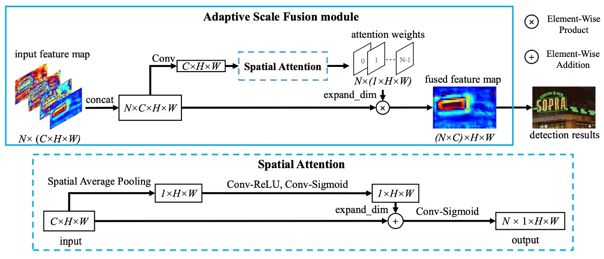
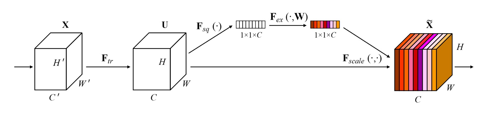
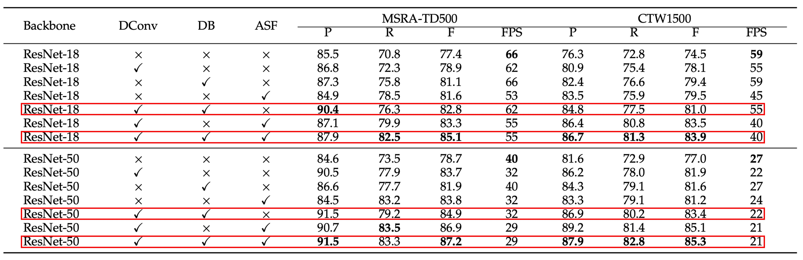

## 画像特徴の自動融合

[**Real-Time Scene Text Detection with Differentiable Binarization and Adaptive Scale Fusion**](https://arxiv.org/abs/2202.10304)

---

DBNet シリーズの論文の紹介文を執筆する際に、私たちはずっと「DBNet」の名前が「DB」なのか「DBNet」なのかを考えていました。

第一版の論文では「DBNet」という名前は一切登場していなかったため、他の文献ではすべて「DB」と呼ばれていました。その後、この論文で著者が自分のモデルを「DBNet」と呼んでいることを確認したため、私たちは著者の命名を尊重し、このシリーズの論文を「DBNet」と呼ぶことにしました。

## 問題の定義

前回の DBNet の論文を継続し、著者はモデルにまだ改善の余地があると感じ、元のアーキテクチャに基づいて特徴融合方法を最適化し、DBNet++を提案しました。

前回の論文をまだ読んでいない方には、そちらを先に読むことをお勧めします。ここでは多くの重複した詳細を省略します。

- [**[19.11] DBNet: 微分可能な二値化関数**](../1911-dbnet/index.md)

## 問題の解決

### モデルアーキテクチャ

まず、第一版論文とほぼ同じアーキテクチャであるため、その部分は省略します。

今回は変更点、つまり上図にある**Adaptive Scale Fusion Module**の部分に焦点を当てます。

### 自適応スケール融合

自適応スケール融合、論文中では `Adaptive Scale Fusion`（ASF）と呼ばれる新しいモジュールは、DBNet の基盤の上に著者が提案したものです。

元々の設計では、異なるスケールの特徴マップを単純に結合し、その後畳み込み層で特徴融合を行い、次に予測ブランチに渡すだけでした。

著者は、この段階でより詳細に処理を行うべきだと考えました。なぜなら、異なるスケールの特徴には異なる重要性があるため、融合段階で画像内の各位置の重要性を計算し、その重要性に基づいて異なるスケールの特徴の融合程度を決定すべきだと考えたからです。

上図に沿って、著者のアプローチを順を追って見ていきましょう：

1. 入力特徴マップ、サイズ： `C x H x W`
2. 次に進むのは `Spatial Attention` 部分：
   1. 空間平均プーリングを行い、`1 x H x W` の特徴マップを得ます。これは各チャンネルで平均を取って、各位置の重要性を得ることを意味します。
   2. 畳み込み層と `Sigmoid` を通し、`1 x H x W` 特徴マップの非線形表現能力を高め、再度 `C` チャンネルに拡張し、サイズを `C x H x W` にします。
   3. この特徴マップを元の特徴マップと「加算」し、加重された特徴マップを得て、再度 `Conv` と `Sigmoid` を通して、`0〜1` の間の値に圧縮し、チャンネル数を縮小し、出力サイズを `1 x H x W` にします。
3. `Adaptive Scale Fusion` 部分に戻る：
   1. 上記で得られた出力をチャンネル数を拡張し、サイズを `C x H x W` にします。
   2. 加重融合を行い、これらの特徴マップに先程の加重特徴マップを「掛け算」して、最終的な融合特徴マップを得ます。

:::tip
この概念は、以前見た SENet と非常に似ていますが、違いは SENet がチャンネルに重み付けを行うのに対し、ここでは空間に重み付けを行う点です。

- [**[17.09] SENet: 強く絞ってください**](../../lightweight/1709-senet/index.md)

  
  :::

## 討論

### 元々の DBNet との比較

著者は MSRA-TD500 と CTW1500 のデータセットでアブレーション実験を行いました。これには、可微分二値化（Differentiable Binarization, DB）、可変形畳み込み（Deformable Convolution）、および自適応スケール融合（Adaptive Scale Fusion）モジュールが含まれています。

重要な部分を取り上げると、赤枠で囲まれた部分が ASF モジュールを追加した後の効果です。

このモジュールを追加した後、Precision と Recall の両方が多くの場合向上しましたが、特に Recall が多く改善されました。つまり、このモジュールは誤報が増えるものの、正しい文字領域をより多く検出できるようになるということです。

全体的に、F-measure は向上し、MSRA-TD500 データセットと CTW1500 データセットでそれぞれ 2.3%と 1.9%の改善が見られました。この結果は ASF モジュールの有効性を証明しています。

### 可視化

## 結論

この論文の内容はほとんどが前回の DBNet と同じであるため、詳細な説明は省略します。

自適応スケール融合モジュールは、入力に基づいて異なるスケール特徴の融合度を自動的に調整することを可能にし、この設計は実験でその有効性が証明されました。推論中の速度は若干低下しますが、全体的にモデル性能は約 2%向上しました。

計算すると、非常に良い投資であると言えます！
