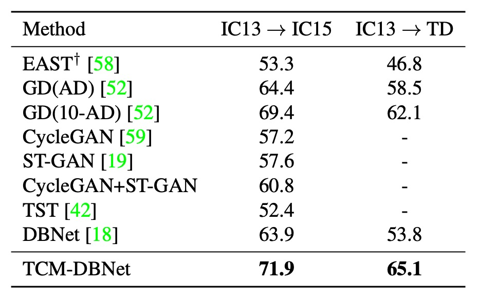

## ある者は喜び、ある者は悲しむ

[**Turning a CLIP Model into a Scene Text Detector**](https://arxiv.org/abs/2302.14338)

---

対比学習の足跡は、すでに多くの分野に深い印象を残しています。

文字検出の研究者たちも、当然のようにその波に乗りたがっています。

## 問題の定義

マルチモーダルなアプリケーションは非常に人気があり、特に CLIP モデルのオープンソース公開後、そのシンプルな概念が研究者たちを惹きつけました。

皆が自分の分野で、事前学習したモデルを活用し、最新の潮流に乗ろうと考えています。

ちょっと待って！あなたはまだ CLIP が何か知らない？

:::tip
すでに CLIP について読んだことがある読者もいますが、未だに触れていない読者のために、以前の記事を参考にしてください：

- [**[21.03] CLIP: 次元の壁を破る**](../../multimodality/2103-clip/index.md)
  :::

### CLIP

この章はすでに何度も繰り返し説明されていますが、もう一度簡単に CLIP を紹介します。

下の図が CLIP のアーキテクチャです：

画像とテキストのペアがあると仮定します。例えば、あるペアは犬の画像と「かわいい小犬」というテキストです。

1 回のトレーニングバッチで、CLIP はこのような複数のペアを受け取ります。画像エンコーダは ResNet や ViT を使って画像を処理し、画像特徴を抽出します。一方、テキストエンコーダは Transformer を使ってテキストを処理し、テキスト特徴を抽出します。

その後、モデルはこれらの特徴を比較し、正しくペアになった画像とテキスト（例えば、犬の画像と「かわいい小犬」のテキスト）間のコサイン類似度を最大化し、間違ったペア（例えば、犬の画像と「りんご」のテキスト）のコサイン類似度を最小化します。

最後に、4 億組の画像とテキストのペアを使ってトレーニングします。

### マルチモーダルニューロン

CLIP 発表後まもなく、OpenAI は CLIP モデルについていくつかの研究を行い、興味深い現象を発見しました。

:::info
論文の原文はこちらです：

- [**[21.03] Multimodal Neurons in Artificial Neural Networks**](https://distill.pub/2021/multimodal-neurons/)

この記事は、マルチモーダルモデルの内部世界を理解する手助けをし、研究者の思考を促進するもので、非常にお勧めです！
:::

この論文では、CLIP のニューロンが専門的な役割分担をしていることが指摘されています。例えば、感情を処理するニューロンや地理的位置を処理するニューロンなどです。

テキストに関連するものとしては、下の図が紹介されています。これを一緒に見てみましょう：

<figure style={{"width": "90%"}}>

</figure>

一番左側が元の画像入力で、モデルはこの画像を正しく認識し、画像に対応する内容を正しく特定しています。

しかし、2 枚目からは面白いことが起こります。

その後の入力では、画像の上に「ipad」や「pizza」のテキストブロックが重ねられ、私たちは驚くべきことに気付きます：

- **モデルはこれで完全に偏ってしまった！**

画像に文字が含まれると、モデルは文字を優先して認識し、画像ではなく文字に注目してしまうのです。これは非常に直感に反します！

:::tip
直感的に、画像内の文字の領域は非常に少なく、ほんの「少し」のピクセルしか占めていないので、モデルがこんな少ない領域に影響されるとは思えませんよね？
:::

### では、どうすべきか？

OpenAI の研究者たちは、これは重大な問題であると考えています。なぜなら、これが意味するのは、CLIP モデルが文字に対して非常に敏感であり、最終的な応用において悪意のある攻撃を受ける可能性があるということです。

悪意のある行為者は、文字の干渉を利用してモデルの認識結果に影響を与え、最終的には攻撃者にとって有利な誤った結果を導くことができます。したがって、OpenAI にとっては、文字による攻撃を克服し、文字が簡単に最終的な画像認識結果に影響を与えないようにすることが課題です。

しかし、文字検出の研究者たちにとっては：

- **これはバグではなく、機能なんだ！**

実は、CLIP は文字と非常に親和性の高いモデルだったのです。これは文字検出と認識の分野にとって、非常に大きな朗報です！

だから、私たちはそれを使うだけでなく、どんどん活用すべきなんです！

## 解決問題

CLIP の事前学習知識を効果的に活用するために、過去の文献には多くの研究があり、特に有名なのが CoOp です。

:::tip
CoOp についてよく知らない読者は、以下の 2 本の論文を参考にできます：

- [**[21.09] CoOp: 揺れるささやき**](../../model-tuning/2109-coop/index.md)
- [**[22.03] CoCoOp: 先に画像を見てから話す**](../../model-tuning/2203-cocoop/index.md)

:::

簡単に言うと、画像を CLIP の画像分岐に入力し、画像特徴を取得します。次に、テキストプロンプトを CLIP のテキスト分岐に入力し、テキスト特徴を取得します。この方法で CLIP の知識を転送し、文字検出のタスクに応用します。

画像分岐には特に手を加える必要はありません。なぜなら画像自体はそのままであり、大きな変更はできません。しかし、テキスト分岐には大きな変更を加えることができ、先程言及した知識転送のタスクはテキスト分岐を通じて達成されます。

先に述べた CoCoOp の研究では、研究者たちは画像特徴を使用してテキスト分岐のプロンプトを生成し、適応型のプロンプト学習によってテキスト分岐のパフォーマンスを向上させました。この技術はその後の研究で広く応用されています。

この記事では、この技術に基づいて CLIP の知識を抽出するためのモデルアーキテクチャを提案しています。

### モデルアーキテクチャ

<figure style={{"width": "90%"}}>

</figure>

このモデルのアーキテクチャは、著者によって TCM という名前が付けられています。少し複雑に見えますが、ひとつずつ見ていきましょう。

まず、著者は CLIP の事前学習済み ResNet50 を画像エンコーダとして使用し、入力画像$I_0 \in \mathbb{R}^{H \times W \times 3}$を埋め込みベクトル$I \in \mathbb{R}^{\tilde{H} \times \tilde{W} \times C}$にマッピングします。ここで、次のように定義されます：

$$
\tilde{H} = \frac{H}{s}, \quad \tilde{W} = \frac{W}{s}, \quad C = 1024, \quad s = 32
$$

式は以下のようになります：

$$
I = \text{ImageEncoder}(I_0)
$$

:::tip
上記の式は、画像を ResNet を通して 5 回のダウンサンプリングを経た後の過程を示しています。もしこの数式が難しいと感じるなら、CNN の基本的な知識を先に学ぶと良いでしょう。
:::

### 言語プロンプト生成器

上図の「Language Prompt Generator」です。

前のステップで画像特徴を得ました。

次に、テキスト分岐の知識を活用するために、CoOp に触発された方法で、テキストエンコーダへの入力に学習可能なプロンプト$\{c_1, \dots, c_n\}$を加え、テキスト埋め込みの転送能力を強化します。式は以下のようになります：

$$
t_\text{in} = [c_1, \dots, c_n, t_\text{in}^0] \in \mathbb{R}^{(n+1) \times D}
$$

言語プロンプト生成器は、先程得られた画像特徴$I$を基に、プロンプト$cc$を生成します。式は以下のようになります：

$$
cc = \text{LN}(\sigma(\text{LN}(\bar{I})W_1 + b_1))W_2 + b_2 \in \mathbb{R}^D
$$

ここで、$W_1 \in \mathbb{R}^{C \times C}, W_2 \in \mathbb{R}^{C \times D}, b_1 \in \mathbb{R}^C, b_2 \in \mathbb{R}^D$です。

:::tip
この数式の読み方は次の通りです：

1. 画像特徴$I$を線形変換$W_1$に通し、バイアス$b_1$を加えた後、LN と Sigmoid 関数を通します。
2. 結果をさらに線形変換$W_2$に通し、バイアス$b_2$を加えた後、最終的なプロンプト$cc$を得ます。
   :::

### テキストエンコーダ

論文では、CLIP の事前学習済みテキストエンコーダを凍結し、定義されたプロンプト「Text」を使用します。

テキストエンコーダは、デフォルトの単一カテゴリプロンプトを連続ベクトル空間に埋め込みます。式は以下のようになります：

$$
t_\text{in}^0 = \text{WordEmbedding}(\text{Text}) \in \mathbb{R}^D
$$

ここで$D = 512$です。

最終的に、プロンプトとテキスト埋め込みを結合し、最終的なテキスト埋め込み$t_\text{out}$を得ます：

$$
t_\text{out} = \text{TextEncoder}(t_\text{in}) \in \mathbb{R}^C
$$

### 視覚プロンプト生成器

上図の「Visual Prompt」の部分を見てみましょう。

ここでは、Transformer の交差注意機構を使用して、視覚プロンプト$\tilde{I}$を学習し、画像レベルからテキストインスタンスレベルへの情報を伝達します。式は以下のようになります：

$$
\tilde{I} = \text{TDec}(Q = I, K = t_\text{out}, V = t_\text{out}) \in \mathbb{R}^{\tilde{H} \times \tilde{W} \times C}
$$

画像埋め込みは、プロンプト調整後に次のようになります：

$$
\hat{I} = I + \tilde{I}
$$

このステップを経て、上図の「Locality Embeddings」が得られます。

:::tip
クエリ主体は画像特徴$I$であり、キーと値はテキスト特徴$t_\text{out}$です。この設計は、画像特徴がテキストプロンプトを「認識」し、「融合」できるようにするためです。
:::

### 実例-言語マッチング

テキスト埋め込み$t_\text{out}$と調整後の画像埋め込み$\hat{I}$を内積し、Sigmoid 関数を通じて二値分割マップ$P$を生成します：

$$
P = \text{sigmoid}\left(\frac{\hat{I} t_\text{out}^\top}{\tau}\right) \in \mathbb{R}^{\tilde{H} \times \tilde{W} \times 1}
$$

分割マップと真値$y_{ij}$の二値交差エントロピー損失（BCE Loss）は次のように表されます：

$$
L_\text{aux} = \sum_{i=1}^{\tilde{H}} \sum_{j=1}^{\tilde{W}} \left[y_{ij} \log(P_{ij}) + (1-y_{ij}) \log(1-P_{ij})\right]
$$

総損失関数は次のようになります：

$$
L_\text{total} = L_\text{det} + \lambda L_\text{aux}
$$

ここで、$\lambda = 1$、$L_\text{det}$は検出方法に基づく損失です。

推論段階では、検出ヘッドの出力が最終結果となります。

### 訓練戦略

人気のある文字検出手法を使用して実験を行います。これには**DBNet (DB)**、**PAN**、**FCENet (FCE)**が含まれます。設定の一貫性を保つため、検出器は**SynthText**と実際のデータセットで訓練されます。特に指定がない限り、バックボーンは CLIP の事前学習済み画像エンコーダ ResNet50 を使用します。

視覚プロンプト生成器には、3 層の Transformer デコーダが含まれており、4 つの注意機構ヘッドを使用します。Transformer の幅は 256、フィードフォワード隠れ層の次元は 1024 に設定されています。検出ヘッドは DBNet、PAN、FCENet の対応する検出ヘッドを使用して最終結果を予測します。

評価指標は、モデルが文字領域を正しく検出したかどうかを判断するために、交差比の和（IoU）を使用します。また、精度、再現率、F 値を計算して比較します。公平な比較を確保するために、訓練とテスト時には「気にしない」または「###」としてマークされた領域は無視されます。

## 討論

### 現有方法との組み合わせ

<figure style={{"width": "80%"}}>

</figure>

著者は最初に TCM をプラグイン型モデルとして定義し、既存の文字検出手法と組み合わせて使用できるようにしています。上表は、IC15、TD、CTW データセットで TCM を 3 つの文字検出方法と組み合わせた結果を報告したものです：

- **F 値の向上**：TCM は IC15 データセットにおいて、元の FCENet、PAN、DBNet に比べ、それぞれ+0.9%、+1.7%、+1.9%の F 値の向上を達成しました。TD および CTW データセットでも、同様の安定した性能向上が見られました。
- **推論速度**：IC15、TD、CTW データセットでは、PAN、FCENet、DBNet を組み合わせた TCM が、それぞれ 18 FPS、8.4 FPS、10 FPS を達成し、検出器の高い効率を維持しました。

:::tip
推論速度の影響は依然として大きいと思われます。論文では「保持」していると言っていますが、この表現は少し楽観的かもしれません。
:::

### 事前学習済み CLIP バックボーン

<figure style={{"width": "80%"}}>

</figure>

まず、DBNet の元々のバックボーンネットワークを CLIP の事前学習済み画像エンコーダ ResNet50 に置き換え、バックボーンネットワークの性能に対する影響を定量化しました。上表で、`CR50`は CLIP の画像分岐を使用し、`R50`は DBNet の元のバックボーンネットワークを使用しています。

結果として、CLIP の事前学習済みモデルを単独で使用するだけでは、CLIP の視覚-言語知識を十分に活用できず、元の DBNet バックボーンネットワークと大差ない性能でした。

:::tip
CLIP は無理に使うべきではありません。
:::

### モデルコンポーネントの有効性

<figure style={{"width": "70%"}}>

</figure>

まず、上表の各種略語の意味を理解しましょう：

- **BSL**: DBNet ベースライン
- **PP**: 事前定義プロンプト
- **LP**: 学習可能プロンプト
- **LG**: 言語プロンプト生成器
- **VG**: 視覚プロンプト生成器
- **TCM**: 完全なモデル構成

---

事前定義プロンプトを使用した場合（上表の 2 行目）、IC15、TD、TT、CTW の 4 つのデータセットで、性能がわずかに向上し、それぞれ 0.05%、0.2%、0.04%、0.1%の改善が見られました。

学習可能プロンプトと事前定義プロンプトを組み合わせて使用した場合（上表の 3 行目）、学習可能プロンプトが一貫して性能を向上させることが示されました。

:::tip
学習可能プロンプトの数は自由に設定できます。ここでは、4、18、32 などの異なる数のプロンプトをテストし、結果としてプロンプトの数が多いほど性能が向上することが示されました。
:::

プロンプト数を 4 に設定した場合と比較して、32 に設定した場合、各データセットでの性能が顕著に向上しました。これは、より多くの学習可能プロンプトが事前学習されたテキストエンコーダの知識をより適切に誘導し、文字検出に有用であるためと考えられます。後続の実験を簡素化するため、デフォルトでは学習可能プロンプト数は 4 に設定されています。

---

著者はまた、言語プロンプト生成器の性能も評価しました（上表の 7 行目）。

言語プロンプト生成器の助けを借りて、TCM は 4 つのデータセットでさらに性能が向上し、特に ICDAR2015 でのパフォーマンスが向上しました。これは、言語プロンプト生成器が生成する条件付き手が、異なるデータセットタイプにおいてより良い汎化能力を確保できることを示しています。

---

視覚プロンプト生成器と他のコンポーネントを組み合わせた場合、F 値は 4 つのデータセットでベースラインよりも高くなり、特に IC15 および TD データセットでの向上が顕著で、それぞれ 1.7%および 2.0%の改善が見られました。

この顕著な補完効果は、視覚プロンプト生成器がテキスト特徴から細粒度の視覚意味情報を伝播できるためです。

さらに、視覚プロンプト生成器が生成したプロンプト局所画像埋め込みは、モデルがより正確な文字インスタンスレベルの視覚表現を得るのを導き、インスタンス-言語マッチング能力を強化し、下流の検出ヘッドに役立つ精度の高い分割図を生成します。

### VG と LG の一般化性能に対する消失実験

TCM において視覚プロンプト生成器（VG）と語学プロンプト生成器（LG）を除外すると、一般化性能が著しく低下することが示されており、これにより VG と LG の有効性がさらに証明されました。

### エンコーダ凍結実験

<figure style={{"width": "70%"}}>

</figure>

通常、CLIP を使用する場合、元々のモデルの知識を保持するために、テキストエンコーダを凍結し、画像エンコーダのみを訓練します。ここでは、著者が画像エンコーダとテキストエンコーダの学習率因子を調整し、エンコーダ凍結の品質が性能に与える影響を調べました。

結果として、低い学習率でテキストエンコーダを凍結することで、最良のモデル性能が得られることがわかりました。

### 訓練データの増加

TCM がデータを増やすだけでは学べない追加的な知識を学べるかどうかをさらに探るため、著者は以下の実験を行いました：

- **訓練データ**：IC13、IC15、TD、CTW、TT、MLT17 を含む大規模な公共データセット（合計 13,784 枚の画像）でモデルを訓練しました。
- **テストデータ**：ArT から収集された夜間データ（326 枚の画像）でモデルをテストしました。夜間サンプルは以下のように示されています。
  

実験結果は以下の表に示されています：

<figure style={{"width": "70%"}}>

</figure>

大量の訓練データを増加させても、既存の手法は訓練セットの分布と明らかに異なる夜間データに対応する際に限界を見せました。TCM はこの場合でも安定したパフォーマンスを発揮し、代替不可能な一般化能力を示しました。

### パラメータ量の増加

<figure style={{"width": "70%"}}>

</figure>

公平に比較するため、著者は DBNet のパラメータ量を増加させ、バックボーンをより大きな ResNet に置き換え、TD500 データセットで実験を行いました：

TCM-DBNet は、パラメータ量と計算コストが増加した DBNet よりも優れたパフォーマンスを示しました。この結果は、TCM がシーンテキスト検出タスクにおいてより効率的な性能を持つことを示唆しています。

### 補助損失の影響

<figure style={{"width": "70%"}}>

</figure>

最後に、著者は TD500 データセットにおける補助損失を使用した場合と使用しない場合の結果を比較しました：

結果として、補助損失を使用したモデルはパフォーマンスが向上しました。補助損失はインスタンス-言語マッチングのスコアマップに制約を加えることにより、モデルの訓練効果を向上させる助けになります。

### 複数データセット間の一般化

<figure style={{"width": "70%"}}>

</figure>

著者は TCM が異なるデータセット間でどのように一般化するかをテストしました。上表は実際のデータセット間での移行実験結果を示しており、TCM は異なるデータセットにおいてもベースライン手法を上回る性能を示しました。

## 結論

誰もが CLIP を使って自分のモデルを強化したいと思っています。この論文はその良い例です。

本論文では TCM 方法を提案しており、事前学習なしで CLIP モデルから先験的知識を抽出し、シーンテキスト検出に応用できます。これは新しい文字検出の枠組みを構築したと言えるでしょう。

現在の実験では TCM の性能向上はそれほど顕著ではありませんが、データセット間の一般化実験結果から、事前学習されたマルチモーダルモデルは広範な知識を提供し、モデルの一般化能力の向上に寄与することがわかります。

総じて、TCM は今後の研究に対して素晴らしいアイデアと探求の方向性を提供しています。
