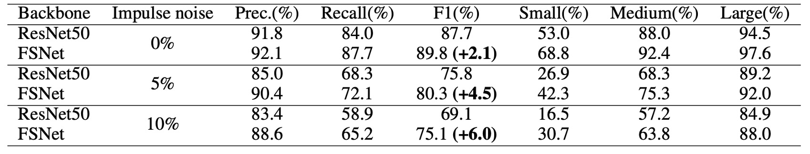

## マルチスケールシャッフルネットワーク

[**MixNet: Toward Accurate Detection of Challenging Scene Text in the Wild**](https://arxiv.org/abs/2308.12817)

---

検証データセットのパフォーマンスが飽和に近づく中、研究者たちは最終的な文字制御点の精度に焦点を当てています。

そして、背景ノイズは解決すべき問題の一つである可能性があります。

## 問題の定義

自然なシーンでテキストを検出する場合、テキストブロックはしばしば任意の形状や方向で現れ、小さくて曲がった文字のインスタンスでは、従来の畳み込みニューラルネットワークに基づく検出方法が、局所的なノイズや画像品質の変化に影響されやすく、テキストの全体的な幾何学的分布特性を安定して正確に抽出することができません。

著者は、この問題が既存の方法が局所的な画像特徴の処理に集中し、テキスト全体の幾何学的分布に関するグローバルな情報を無視している点にあると考えています。そのため、小さくて曲がったテキストや光の影響、背景ノイズの干渉を受けると、検出の頑健性が大きく低下します。

さらに、一般的なバックボーンネットワーク（ResNet、VGG、HRNet など）では、高解像度の特徴を提供する際にノイズの影響を受けやすく、後続の輪郭推定が容易な明確な特徴を抽出することが難しく、特に小さな文字インスタンスには不向きです。

したがって、「高解像度と低解像度の特徴間の相互作用」を調整し、高解像度の特徴がノイズに影響される負の影響を軽減する方法が、著者が解決すべき核心的な問題です。

## 問題の解決

### モデル構造

<figure style={{"width": "90%"}}>

</figure>

まず、特徴の相互作用の問題を解決するために、ほとんどの CNN アーキテクチャは局所的な畳み込み演算に過度に依存しており、効果的なスケール間特徴交流のパイプラインが欠けているため、低解像度の特徴によるノイズ抑制能力を十分に活用することができません。

この論文では、著者は新しいネットワーク構造を提案し、Backbone と Neck の 2 つの部分を組み合わせて、高解像度と低解像度の特徴が交差し、ノイズ干渉に強い、より安定した精細な表現を生成する「Feature Shuffle Network」、略して FSNet を提案します。

もう一つの部分は、FSNet によって生成された特徴を使用して、次のステップで文字インスタンスの制御点を精緻化するもので、これは「Central Transformer Block」と呼ばれます。

まずは FSNet の構造を見てみましょう。

### 特徴シャッフルネットワーク

<figure style={{"width": "80%"}}>

</figure>

この構造は一見複雑に見えますが、実際にはシンプルな概念です。ボックスで見てみましょう：

- **赤いボックス部分**：ここは Backbone ネットワークの特徴抽出部分に対応しており、複数の段階のダウンサンプリング過程を含んでいます。
- **青いボックス部分**：ここは Neck ネットワークの特徴抽出部分で、特徴シャッフル部分がここで実装されています。

方法としては、各解像度の特徴チャネルを分割し、それを再混合、アップサンプリング／ダウンサンプリングし、最後に再結合（concatenate）して新しい特徴を生成します。

このような混合と再構成を通じて、モデルはさまざまなスケールの特徴の利点を効率的に取り込むことができ、小さくて曲がった低品質な文字に対してより認識可能な特徴を生成します。具体的な操作は以下の図の通りです：

<figure style={{"width": "40%"}}>

</figure>

FSNet では、2 つのシャッフル層（Shuffle layer）が設計されており、最初のシャッフル層は 2 つのスケールの入力特徴を受け取り、2 番目のシャッフル層は 3 つのスケールの入力特徴を受け取ります。

2 番目のシャッフル層を例にとると、$F_1, F_2, F_3$の 3 組の入力特徴があると仮定します。ここで$F_i$は第$i$の解像度の特徴を示します。シャッフル層は各特徴のチャネル数を 3 等分し、$F_i$は$F_{i1}, F_{i2}, F_{i3}$の 3 つの部分に分割されます。

次に、各部分に対応する解像度インデックスに基づいて、$F_{i1}, F_{i2}, F_{i3}$をそれぞれアップサンプリングまたはダウンサンプリングして統一されたサイズにします。最後に、異なる解像度からの特徴部分を異なる倍率で再生成し、それらを結合して新しい特徴表現を作成します。

これにより、元々単一解像度の特徴が「シャッフル」され、複数の解像度情報を混合した新しい特徴が生成されます。

:::tip
これは以前見た ShuffleNet に似ています：

- [**[17.07] ShuffleNet: チャネルシャッフルネットワーク**](../../lightweight/1707-shufflenet/index.md)

    

    <figure style={{"width": "80%"}}>
    
    </figure>
    

もし覚えているなら、ShuffleNet では「グループ畳み込み」を経て、各グループの特徴マップチャネルをシャッフルします。MixNet では、異なる解像度の特徴マップをシャッフルする形に変更されており、設計理念は非常に似ています。
:::

### Central Transformer Block

<figure style={{"width": "70%"}}>

</figure>

先ほどのアーキテクチャ図を切り分け、CTBlock の部分を取り出して、CTBlock の動作フローを簡単に整理してみましょう：

1. **輪郭線制御点（Contour points）**:

   最初に、CTBlock は FSNet によって生成されたヒートマップ（heatmap）を使用して、各テキストインスタンスの大まかな境界を取得します。その後、その境界に沿って等間隔で N 個の点（実験では N=20）をサンプリングし、これらを文字の輪郭を代表する点とします。これらの点の画像特徴と対応するヒートマップ値は、特徴シーケンスを構成し、最初の Transformer モジュールに入力されます。

2. **中心線制御点（Central points）**:

   最初の Transformer モジュールを通過すると、その文字領域を記述する中心線の特徴点シーケンス（中心線の点数は固定で C=10）が得られます。同様に、これらの中心線点に対応する画像特徴とヒートマップは、別の特徴シーケンスを構成します。

3. **Transformer Encoder-Decoder**:

   CTBlock で使用される Transformer はエンコーダ・デコーダ構造を採用しています。エンコーダは複数の Transformer ブロックで構成されており、各ブロック内にはマルチヘッド自己注意機構（multi-head self-attention）と MLP が含まれており、特徴シーケンスがグローバルな注意機構を通じて文字の輪郭と中心線点の全体的な幾何学的分布を学習できるようになっています。デコーダはシンプルな MLP で構成されており、エンコーダで抽出された特徴を基に、各輪郭点位置の頂点オフセット（vertex offset）を予測し、最終的により精度の高い文字輪郭を生成します。

輪郭線と中心線の対応は以下の図の通りです：

<figure style={{"width": "90%"}}>

</figure>

:::tip
ここでの Transformer の出力は「オフセット」であり、直接的な輪郭点の位置ではありません。この設計により、モデルは輪郭点の微細な変化を学習しやすく、また異なる形状の文字に対しても拡張しやすくなります。

したがって、上図では、モデルの出力を元の輪郭点と加算して最終的な輪郭点位置を得る必要があることがわかります。
:::

### 実装の詳細

- **Backbone:** FSNet
- **事前学習:** SynthText データセットで 5 エポック訓練、Adam オプティマイザーを使用、学習率は固定で 0.001
- **微調整:** Total-Text、ArT などのデータセットで 600 エポック訓練
- **訓練環境:** Python3、PyTorch 1.10.2、RTX-3090 GPU
- **入力画像サイズ:** 640 × 640
- **データ拡張:** ランダム回転（−30°〜30°）、ランダムクロップ、ランダムフリップ、カラージッタ（color jittering）

## 討論

### FSNet の有効性

この論文の主題は FSNet であり、まずは FSNet が効果的かどうかを見てみましょう。

<figure style={{"width": "90%"}}>

</figure>

著者はまずテキストをサイズ別に小、中、大の 3 つのカテゴリに分け、FSNet と他の一般的なバックボーンネットワーク（例えば ResNet50）をノイズのないデータセットで比較しました。

結果として、FSNet は「小型と中型」のテキストの検出において顕著な改善を示しました。この改善は主に、FSNet アーキテクチャにおける高解像度と低解像度の特徴の交換メカニズムに起因しており、高解像度の特徴がノイズの影響を受ける問題を軽減し、モデルが小さな文字の輪郭と形状特徴をより捉えやすくなりました。

さらに、FSNet のノイズ耐性を検証するため、著者はテストデータに特定の割合のインパルスノイズ（impulse noise）を加え、FSNet と ResNet50 をノイズなし、5%ノイズ、10%ノイズの 3 つのシナリオで比較しました。

ノイズはすべてのモデルのパフォーマンスを低下させましたが、FSNet はそれでも優れた安定性を示しました。ノイズなしの場合、FSNet の F1 スコアは ResNet50 よりも 2.1%高く、5%および 10%のノイズ比率ではその増加幅はそれぞれ 4.5%および 6.0%に達しました。

最後に、汎用性の向上について、著者は FSNet をバックボーンネットワークとして既存のテキスト検出方法に適用しました。DB、PAN、FAST などのアーキテクチャにおける結果は以下の表の通りです：

<figure style={{"width": "60%"}}>

</figure>

これらの方法の元々のバックボーンネットワークを FSNet に置き換えた後、DB と PAN の F1 スコアはそれぞれ約 1.5%向上し、FAST は約 1.8%向上しました。この結果は、FSNet が単独で認識能力を向上させるだけでなく、既存の多くの方法の検出性能をバックボーンネットワークとして効果的に強化できることを示しています。

:::tip
上記で言及された他のネットワークアーキテクチャについて興味がある場合は、以前の記事を参照できます：

- [**[19.08] PAN: ピクセル集約戦略**](../1908-pan/index.md)
- [**[19.11] DBNet: 微分可能な二値化関数**](../1911-dbnet/index.md)
- [**[21.11] FAST: とても速い**](../2111-fast/index.md)
  :::

### 消融実験

<figure style={{"width": "60%"}}>

</figure>

次に、著者は各設計の有効性を検証するため、Total-Text データセットを使用し、ResNet50 をベースラインモデルとして比較した消融実験の結果を示しています。

結果として、FSNet は F1 スコアで 2.1%の改善を達成し、さらに CTBlock に中心線特徴を追加することで 0.5%のさらなる向上が見られました。

### 他の方法との比較

<figure style={{"width": "60%"}}>

</figure>

上記の表は、MSRA-TD500 データセットにおける多方向テキスト検出の比較結果です。MixNet は F1 スコアで 89.4%を達成し、他の方法よりも 2.1%の改善を示しました。この結果は、多言語および多方向テキスト検出のシナリオにおける優れた性能を証明しています。

<figure style={{"width": "60%"}}>

</figure>

次に、任意形状のテキスト検出に関して、Total-Text データセットでの比較結果を示します。

MixNet は Total-Text で 90.5%の F1 スコアを達成し、TextFuseNet に比べて 1.5%の向上を見せました。

### 可視化結果

<figure style={{"width": "90%"}}>

</figure>

## 結論

本論文で提案された MixNet アーキテクチャは、FSNet と CTBlock モジュールを核心に、従来のマルチスケール特徴融合過程における高解像度特徴がノイズに干渉しやすい問題を解決しただけでなく、小型、曲がった、低品質のテキスト検出精度を大幅に向上させました。

実験結果は、FSNet が異なるアーキテクチャに容易に統合でき、全体的な検出性能を効果的に改善できることを証明しています。

:::tip
この論文の実装はそれほど難しくありませんが、FSNet を追加したことで推論速度が約 30%遅くなりました。アプリケーションにおいては、速度と精度のバランスを考慮する必要があります。
:::
