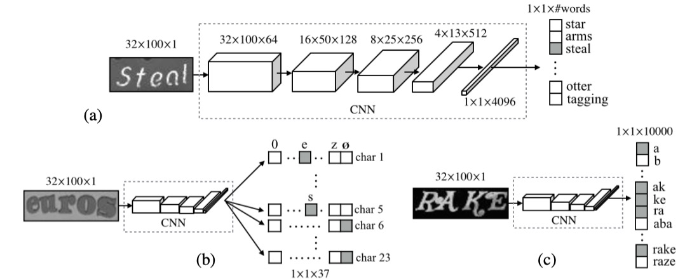
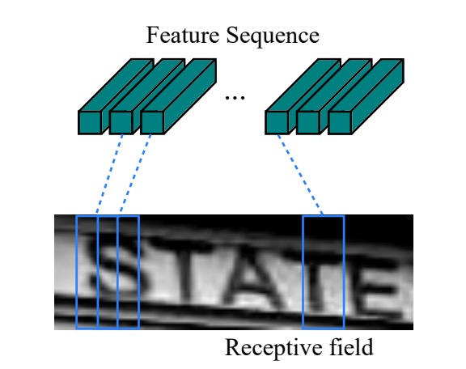
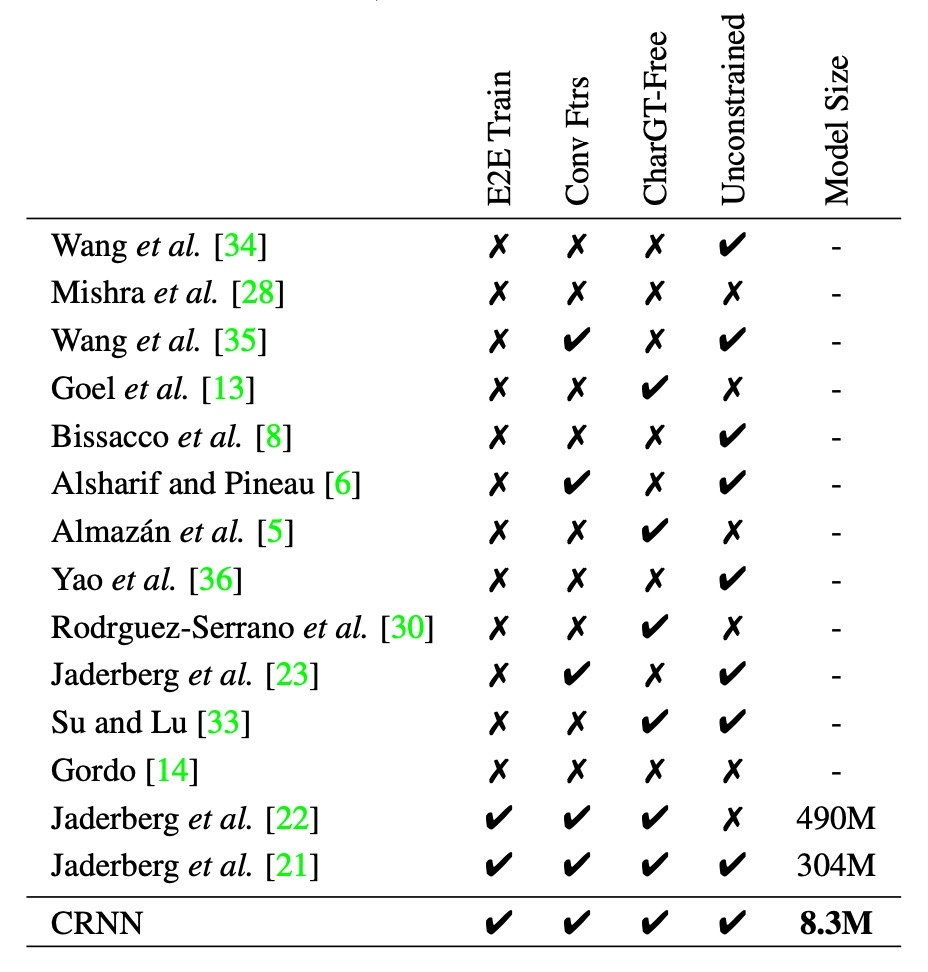
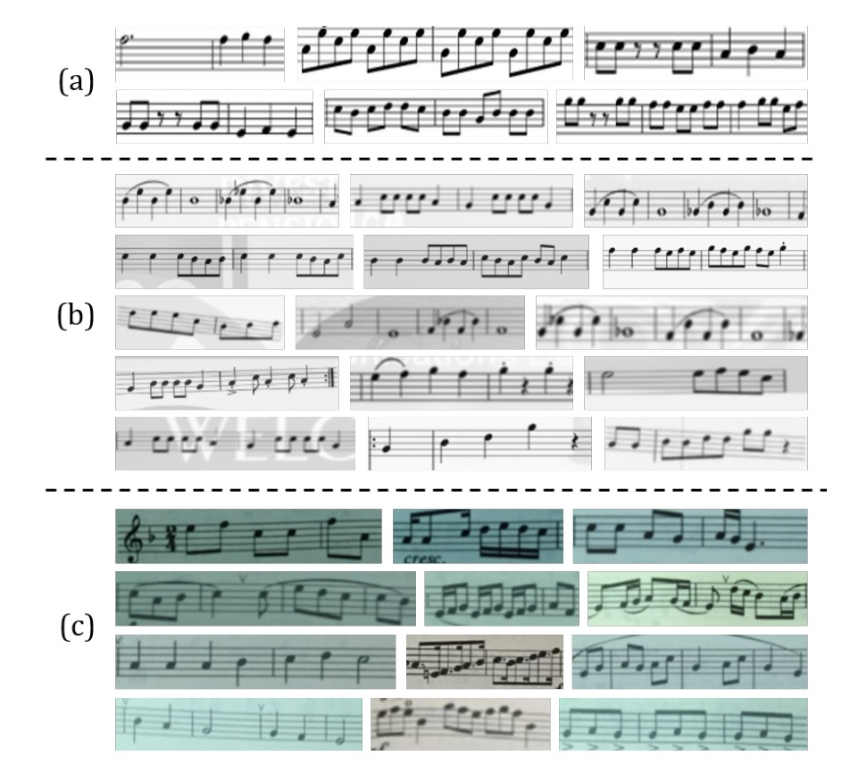

# [15.07] CRNN

## 私は全部欲しい！

[**An End-to-End Trainable Neural Network for Image-based Sequence Recognition and Its Application to Scene Text Recognition**](https://ieeexplore.ieee.org/document/7801919)

---

OCR は古い学問ですが、深層学習の推進により、再び注目を集めています。

## 問題の定義

深層学習の普及に伴い、OCR（光学文字認識）分野は新たな発展の機会を迎えています。従来の手作業で設計された特徴に基づく分類方法と比較して、CNN（畳み込みニューラルネットワーク）を利用した OCR 方法は、より高い性能と強力な一般化能力を示しています。

その中で最も重要な利点の 1 つは、CNN が画像から特徴を自動的に学習できることです。これにより、手作業で特徴を設計し選択する必要がなくなり、大量の人件費を節約でき、計算リソースの消費も減少します。

しかし、文字認識における重要な問題は依然として存在します：**どのように効果的に分類するか**？

最終的な文字分類にはいくつかの主流の方法があります。まず、隣の**CHAR**から画像を 1 枚借りてみましょう：

- [**[14.06] Synthetic Data and Artificial Neural Networks for Natural Scene Text Recognition**](https://arxiv.org/abs/1406.2227v4)

  

### 1. 辞書の定義

辞書エンコーディングは、最も簡単で直接的な方法であり、辞書エンコーディングとも呼ばれます。この方法では、システムが最初に辞書を定義します。この辞書には、すべての可能なラベル（通常は単語やフレーズ）が含まれます。システムが画像を処理すると、認識された文字は辞書のいずれかのエントリに分類されます。簡単に言えば、モデルの任務は、事前に決められた単語リストから最適な単語を選ぶことです。

画像内の文字が辞書にない場合、この方法は機能しなくなります。モデルは辞書外の内容を認識することができません。これは、辞書外のランダムな文字列（例えばランダムに生成されたパスワードや電話番号など）を処理する場合には効果が薄くなります。

さらに、処理する必要がある辞書が非常に大きい場合（例えば数十万のエントリ）、システムの効率が大きく影響を受け、辞書の拡張性が低くなります。

### 2. 文字列シーケンスエンコーディング

文字列シーケンスエンコーディングは、もう 1 つの一般的な分類方法であり、辞書エンコーディングとは異なり、事前定義された辞書に依存せず、文字を直接文字列のシーケンスに分類します。これは、システムが具体的な単語を知る必要はなく、画像内の各文字を分類して最終的に完全な文字列シーケンスを構築することを意味します。

文字列シーケンスエンコーディングは、辞書エンコーディングよりも挑戦的です。モデルは各文字の特徴を学習し、文字を正確に組み合わせて完全なシーケンスを構築する必要があり、モデルの能力に対する要求が高くなります。文字列間には依存関係があるため、モデルは良好な文脈理解能力を持っていなければ、誤った文字の組み合わせを生成する可能性があります。

### 3. N-gram エンコーディング

Bag-of-N-gram エンコーディング、N-gram エンコーディングは、単語と文字を混合した方法である折衷的な解決策です。N-gram は、N 個の文字で構成されるシーケンスであり、N は 2（bi-gram）や 3（tri-gram）、さらにはそれ以上のシーケンスになることもあります。このエンコーディング方法は、単一の文字を識別するだけでなく、文字の組み合わせも識別することで、文脈情報をより良く捉えることができます。

N の増加とともに、N-gram 組み合わせの数は急激に増加し、計算コストが高くなります。特に長いテキストシーケンスを処理する際、効率が低下する可能性があります。一部の語彙に対して、N-gram は単語全体の意味を正確に捉えることができない場合があり、特に N が小さい場合、辞書エンコーディングや文字列シーケンスエンコーディングほど認識精度が高くない場合があります。

---

以上を総合すると、著者は優れたモデルがいくつかの要求を満たすべきだと考えています：

1. **エンドツーエンドの学習**：前処理や手順を必要とせず、直接画像から特徴を学習する。
2. **畳み込み特徴**：手作業で設計された特徴ではなく、学習された畳み込み特徴を使用する。
3. **文字レベルのアノテーション不要**：文字レベルのアノテーションなしでモデルを訓練し、画像から直接文字列を学習する。
4. **制限なし**：特定の辞書に制限されず、任意の文字列を処理できる。
5. **モデル規模が小さい**：モデルの保存容量が小さく、実行効率が高い。

少し欲張りなように見えますが、著者がどのように解決したのか見てみましょう。

## 問題の解決

### モデルアーキテクチャ

<div align="center">
<figure style={{"width": "70%"}}>

</figure>
</div>

CRNN モデルは三つの部分で構成されています。上の図を見ながら説明していきましょう。

### 畳み込みネットワーク層

上の図の一番下から見ていきましょう。つまり、畳み込み層（Convolutional Layers）の部分です。ここでは、私たちが馴染みのある畳み込みニューラルネットワーク（CNN）を使用して、画像の特徴を抽出します。

ここで、文字が含まれる画像の入力サイズが`32x128`だと仮定します。各「列」を見ると、これは長さ 128 のシーケンスであり、各「行」は 3x32 次元の特徴ベクトルです（RGB 画像を仮定）。

実際には、次の選択肢もあります：「直接元画像をシーケンスモデルに送る」ことです。

しかし、この方法ではモデルが非常に複雑になり、シーケンスの長さが長くなると、モデルが訓練しにくくなる可能性があります。そこで、著者は最初に画像を畳み込みネットワークで特徴を抽出し、その特徴をシーケンスモデルに送るという方法を選びました。

しかし、畳み込みネットワークを使用すると、別の問題が発生します：モデルがシーケンス情報を大きく失ってしまうのです。

先程の例で、文字が含まれる画像のサイズが`32x128`だと仮定し、一般的なバックボーンを使用すると、大抵は 5 回のダウンサンプリングが行われ、最終的な特徴マップのサイズは`1x4`になります。

これは明らかに望ましくありません。予測に使用できる情報が少なすぎます！

そこで、著者は畳み込みネットワークにいくつかの変更を加えました。方法は非常にシンプルです：`MaxPooling`操作を変更しただけです。元々は`kernel=2, stride=2`でしたが、これを`kernel=(2, 1), stride=(2, 1)`に変更しました。

これにより、特徴マップの幅は変わらず、高さだけが減少します。つまり、`32x128`の画像を入力すると、5 回のダウンサンプリングを経て、特徴マップのサイズは`1x128`になります。

:::tip
実装において、シーケンスの幅が大きすぎる可能性を考慮して、著者は論文内で幅に対して 2 回、高さに対して 4 回のダウンサンプリングを行っています。

<div align="center">
<figure style={{"width": "70%"}}>

</figure>
</div>
:::

### 再帰神経網層

次に、中央の再帰層（Recurrent Layers）です。

先程、入力された文字画像をシーケンスデータに変換しましたが、次にこれらのデータをシーケンスモデルに送る必要があります。ここで著者は BiLSTM を使用して、このシーケンスを処理しています。

LSTM は改良された RNN（循環神経ネットワーク）で、主に伝統的な RNN の長期依存性問題を改善するものです。RNN は時間ステップが進むにつれて、以前の情報を保持することが難しく、特にシーケンス内の長距離依存が問題となります。LSTM は「メモリセル」や「ゲート機構」（入力ゲート、忘却ゲート、出力ゲートなど）を使用して、情報の流れを制御し、長時間のシーケンス内で重要な情報を保持し、不要な内容を捨てることができます。これにより、長いシーケンスデータの処理が得意になります。

BiLSTM は LSTM と双方向ネットワークの利点を組み合わせたものです。2 つの LSTM 層を使用してデータを処理します。1 つは前から後へ（シーケンスの先頭から末尾）、もう 1 つは後ろから前へ（シーケンスの末尾から先頭）処理します。これにより、各タイムステップの情報には、両方向からの文脈が含まれます。言語モデル、音声認識、機械翻訳などのタスクにおいて、BiLSTM は全体の文脈をよりよく捉え、モデルの予測精度を向上させることができます。

<div align="center">
<figure style={{"width": "70%"}}>

</figure>
</div>

先程の問題に戻ると、画像 CNN で特徴を抽出した後、このシーケンスの長さは画像の幅になります。各タイムステップは、元の画像内の 1 つのブロックに対応します（下の図のように）。各タイムステップの「受容野」は畳み込みネットワークの設計によって決まります。

<div align="center">
<figure style={{"width": "50%"}}>

</figure>
</div>

この特徴シーケンスを BiLSTM に入力すると、より高度な特徴表現が得られ、これを使用して画像内の文字を予測できるようになります。

### アライメントされていないシーケンスラベル

これは上図のトランスクリプションレイヤーに相当します。

最初に述べたように、文字単位のラベル付けは非常に手間のかかる作業です。

そのため、文字のアライメントシーケンスの問題を解決するために、本論文では CTC（Connectionist Temporal Classification）技術を導入して、文字シーケンスを予測します。

- [**[06.06] Connectionist temporal classification: labelling unsegmented sequence data with recurrent neural networks**](https://dl.acm.org/doi/abs/10.1145/1143844.1143891)

CTC は、アライメントされていないシーケンスラベルの問題を処理するために特別に設計された技術で、逐次予測 $y = \{y_1, ..., y_T\}$ に基づくラベルシーケンス $l$ の下で、各ラベルの位置を無視します。これにより、音声認識や手書き文字認識などのシーケンスデータに特に適しています。

従来のシーケンスモデルとは異なり、CTC は各時間ステップを具体的な文字位置と正確に対応させる必要がなく、これによって訓練過程が大幅に簡素化されます。

入力がシーケンス $y = \{y_1, ..., y_T\}$ であり、$T$ はシーケンスの長さだと仮定します。各 $y_t \in \mathbb{R}^{|L'|}$ は、ラベル集合 $L' = L \cup \{\text{blank}\}$ 上の確率分布です。$L$ はタスクにおけるすべてのラベル（例えば英字）を含み、"blank" は空白ラベルを意味します。この「空白ラベル」は、特定の時間ステップで文字を出力しないことを示すため、規則的でないシーケンス長に対して有用です。

モデルの逐次予測が複数の時間ステップで同じ文字や空白ラベルを予測する可能性があるため、CTC はマッピング関数 $B$ を使用してこれらの冗長部分を取り除き、最終的なラベルシーケンスを得ます。具体的な操作としては、重複する文字を削除し、次に`blank`ラベルを削除します。

例えば、モデルが単語「hello」の逐次出力を次のように予測したとします：

```
--hh-e-l-ll-oo--
```

ここで、`-` は `blank` ラベルを示し、重複する文字が統合され、`blank` は取り除かれます。マッピング関数 $B$ によって処理された後、このシーケンスは次のようになります：

```
hello
```

CTC の特徴は、これらの冗長な情報を処理し、出力シーケンスを簡潔なラベルシーケンスにマッピングできることです。

CTC では、与えられた逐次予測 $y = \{y_1, ..., y_T\}$ に対して、ラベルシーケンス $l$ の条件付き確率を計算したいと考えています。多くの異なる逐次シーケンス $\pi$ が同じラベルシーケンス $l$ にマッピングされる可能性があるため、CTC はこれらすべての可能な $\pi$ の確率を加算して、最終的なラベルシーケンス $l$ の確率を求めます：

$$
p(l | y) = \sum_{\pi : B(\pi) = l} p(\pi | y),
$$

ここで、各逐次シーケンス $\pi$ の確率は次のように定義されます：

$$
p(\pi | y) = \prod_{t=1}^{T} y^t_{\pi_t},
$$

これは、各時間ステップ $t$ において、モデルがラベル $\pi_t$ を出力する確率を示しています。

:::tip
理解を助けるために、「cat」という単語を処理する例を挙げましょう。

入力が音声の一部であり、モデルが各時間ステップで次のような予測を行ったと仮定します：

| 時間ステップ | c   | a   | t   | blank |
| ------------ | --- | --- | --- | ----- |
| 1            | 0.6 | 0.1 | 0.1 | 0.2   |
| 2            | 0.1 | 0.7 | 0.1 | 0.1   |
| 3            | 0.1 | 0.2 | 0.6 | 0.1   |
| 4            | 0.2 | 0.2 | 0.2 | 0.4   |

各時間ステップで、モデルは各ラベル（空白ラベル `blank` を含む）の確率予測を行います。例えば、最初の時間ステップではラベル `c` の確率が高く、4 番目の時間ステップでは `blank` の確率が高いです。

この場合、最終的なラベルシーケンス「cat」にマッピングされる複数の逐次予測シーケンスが考えられます：

- シーケンス $\text{c--a-t}$ は "cat" にマッピング可能；
- シーケンス $\text{-c-a--t}$ も "cat" にマッピング可能。

CTC は、すべての可能な逐次予測シーケンスの確率を加算して、最終的にラベルシーケンス「cat」の総確率を得ます。訓練過程では、モデルの目標は正しいラベルシーケンス「cat」の負の対数尤度を最小化することです。これにより、訓練が進むにつれて、モデルはより正確な逐次予測を出力するようになります。

この方法を通じて、CTC は各時間ステップで対応する文字を明確にラベル付けせずとも、効果的に学習し、正しいラベルシーケンスを予測できるのです。
:::

### 訓練戦略

著者は Jaderberg らが公開した合成データセットを場面文字認識の訓練データとして使用しました：

- [**Text Recognition Data**](https://www.robots.ox.ac.uk/~vgg/data/text/)：このデータセットには、800 万枚の訓練画像とそれに対応するラベル付き文字が含まれています。これらの画像は合成エンジンで生成され、非常に高いリアルさを持っています。

モデルはこの合成データのみで一度訓練し、その後、すべての実世界のテストデータセットでテストを行いました。これらのデータセットには微調整を行っていません。

ネットワークの構成詳細は以下の通りです：

- 畳み込み層の構造は VGG 構造をベースにしており、英語文字認識に適応するように調整されています。
- 3 番目および 4 番目の最大プーリング層では、従来の正方形のプーリングウィンドウではなく、$w=1, h=2$ の長方形プーリングウィンドウを採用しています。
- 5 番目および 6 番目の畳み込み層の後には、それぞれバッチ正規化層を 2 つ挿入しており、これにより訓練過程が大幅に加速されました。
- 訓練には ADADELTA アルゴリズムを使用し、パラメータ$\rho$は 0.9 に設定しています。訓練中、すべての画像は訓練を加速するために$100 \times 32$にリサイズされます。
- テスト画像の高さは 32 にスケーリングされ、幅は高さに比例してスケーリングされますが、少なくとも 100 ピクセルに保たれます。

### 評価指標

著者は、モデルの性能を評価するために、以下の 4 つの一般的な場面文字認識ベンチマークデータセットを使用しました：

1. **ICDAR 2003 (IC03)**

   - テストセットには 251 枚の場面画像が含まれており、これらの画像には文字の境界ボックスがラベリングされています。
   - 先行研究と公平に比較するために、非アルファベット数字文字や 3 文字未満の文字が含まれる画像は通常無視されます。フィルタリング後、最終的に 860 枚の切り抜かれた文字画像がテストセットとして使用されます。
   - 各テスト画像には 50 単語の語彙（辞書）が付随しており、さらに、すべての画像の語彙を統合した**完全辞書**があり、評価に使用されます。

2. **ICDAR 2013 (IC13)**

   - テストセットは IC03 の一部データを引き継ぎ、修正されたもので、最終的に 1,015 枚の切り抜かれた文字画像が含まれ、正確なラベルが提供されています。
   - IC03 とは異なり、IC13 には語彙表が提供されていないため、評価時には辞書補助は使用されません（つまり、辞書なし設定です）。

3. **IIIT 5K-Word (IIIT5k)**

   - テストセットには、インターネットから収集された 3,000 枚の切り抜かれた文字画像が含まれており、より多様なフォントと言語の変化をカバーしています。
   - 各画像には 2 つの語彙表が添付されており、一つは 50 単語の小さな辞書、もう一つは 1,000 単語を含む大きな辞書で、辞書補助の評価に使用されます。

4. **Street View Text (SVT)**

   - テストセットは、Google ストリートビューから収集された 249 枚の場面画像で構成され、647 枚の文字画像が切り抜かれています。
   - 各文字画像には 50 単語の語彙表が添付されており、辞書補助の評価に使用されます。

## 討論

### モデルの多角的比較

<div align="center">
<figure style={{"width": "70%"}}>

</figure>
</div>

CRNN が他の方法と比べて優れている点をより包括的に示すために、著者は上記の表を提供しています：

- **E2E Train**：端到端の訓練がサポートされているか、前処理やステップ別の操作は不要。
- **Conv Ftrs**：手作業で設計された特徴ではなく、訓練画像から学習した畳み込み特徴を使用するか。
- **CharGT-Free**：モデルの訓練に文字レベルのラベル付けが必要かどうか。
- **Unconstrained**：特定の辞書に制限されることなく、辞書外の単語やランダムなシーケンスを処理できるか。
- **Model Size**：モデルのストレージサイズ。

表を見てみると、CRNN は多くの点で優れています。例えば、端到端訓練をサポートし、文字レベルのラベル付けを必要とせず、特定の辞書に制限されることなく、またモデルのサイズも小さいという特徴があります。

### 過去の方法との比較


上表は、CRNN モデルが 4 つの公共データセットでの認識精度を示し、最新の深層学習モデルとの比較を行ったものです。

制限された辞書（constrained lexicon）での状況下では、CRNN はほとんどのベンチマークで他の方法を上回り、提案された最良の文字認識モデルを平均的に超えています。特に IIIT5k および SVT データセットで顕著な成果を上げています。

CRNN は予め決められた辞書に依存せず、ランダムな文字列（例えば電話番号）や文章、他のタイプの文字（例えば中国語）も認識可能で、これによりすべてのテストデータセットで競争力を示しています。

辞書なし（unconstrained lexicon）の状況では、CRNN は SVT データセットで最良の結果を達成しています。

:::tip
この論文では、表を著者名で記載することが多く、探しにくいため、興味のある読者は原文を参照することをお勧めします。
:::

### 一般化の拡張

<div align="center">
<figure style={{"width": "70%"}}>

</figure>
</div>

文字だけが OCR ではありません。

CRNN は文字認識だけでなく、他の分野にも応用可能で、例えば光学音楽認識問題（OMR）にも利用できます。

従来の OMR 方法では、画像の前処理（例えば二値化）、五線譜検出、および個別の音符認識が必要です。著者は OMR をシーケンス認識問題に転換し、CRNN を使って画像から音符シーケンスを直接予測しました。

- **簡略化のために、ここでは音高の認識にのみ焦点を当て、和音は無視し、すべての楽譜は C メジャー調であると仮定しています。**

CRNN の訓練データを準備するために、著者は 2650 枚の musescore サイトからの画像を収集しました：

- [**https://musescore.com/sheetmusic**](https://musescore.com/sheetmusic)

各画像には 3〜20 個の音符片が含まれ、手動で音高のシーケンスがラベリングされ、回転、縮小、ノイズ追加などのデータ拡張技術を使用して訓練サンプルを 265k 枚に増加させました。

比較のため、著者は二つの商業 OMR エンジン、[**Capella Scan**](https://www.capella-software.com/us/index.cfm/products/capella-scan/info-capella-scan/)と[**PhotoScore**](https://www.avid.com/sibelius)を評価しました。


上表に示すように、CRNN はすべてのデータセットにおいてこれら二つの商業システムを大きく上回っています。

Capella Scan と PhotoScore は「Clean」データセットでは比較的良い結果を出していますが、合成データや実世界のデータでは顕著にパフォーマンスが低下します。

その主な理由は、これらのシステムが五線譜と音符の検出に頑強な二値化に依存しているため、合成データや実世界のシーンでは照明条件の不良、ノイズの干渉、背景の混乱により二値化が失敗しやすいためです。対照的に、CRNN は畳み込み特徴を使用しており、ノイズや変形に対して非常に頑健です。

さらに、CRNN の再帰層は楽譜内の文脈情報を活用でき、各音符の認識はそれ自体に依存するだけでなく、近接する音符も参照できます。例えば、音符の垂直位置を比較することで、特定の音符をより正確に識別できるようになります。

## 結論

初めに著者が提案した要件を再確認してみましょう：

1. **端到端訓練**：前処理やステップ別操作が不要で、直接画像から特徴を学習。
2. **畳み込み特徴**：手作業で設計された特徴ではなく、訓練画像から学習した畳み込み特徴を使用。
3. **文字レベルのラベル不要**：文字レベルのラベル付けを必要とせず、画像から直接文字列を学習。
4. **制限なし**：特定の辞書に制限されることなく、任意の文字列を処理できる。
5. **モデルサイズ小**：モデルのストレージサイズが小さく、効率的に実行可能。

これらすべてを CRNN は実現しており、まさに OCR における金字塔的な作品です。OCR に関わるすべての人に一読をお勧めします。
