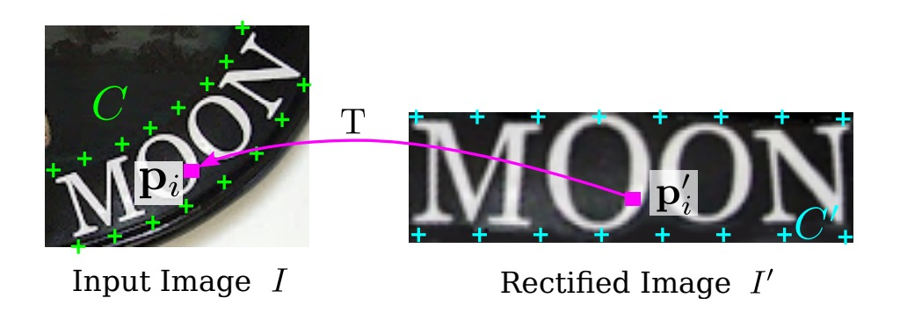

# [16.03] RARE

## 自動補正

[**頑健なシーンテキスト認識による自動補正**](https://openaccess.thecvf.com/content_cvpr_2016/papers/Shi_Robust_Scene_Text_CVPR_2016_paper.pdf)

---

CRNN が提案されてから、ほとんどの問題は解決されましたが、不規則な文字の認識については依然として難しさが残っています。

## 問題の定義

自然のシーンでの文字認識は、印刷された文字よりもはるかに難しいです。認識段階での文字は、しばしば激しい変形、歪み、遮蔽、ぼやけなどの問題に直面します。

本論文で著者が解決したいのは、主に変形と歪みの問題です。少し前に、有名な STN のモデルがあったことを思い出してみてください。

- [**[15.06] Spatial Transformer Networks**](https://arxiv.org/abs/1506.02025)

    

    <figure style={{ "width": "50%"}}>
    
    </figure>
    

もしかしたら、自動補正機能を備えたモデルを設計できるかもしれませんね？

## 問題の解決

### 空間変換ネットワーク

不規則な文字認識の問題を軽減するために、自動補正機能は認識モジュールの前に配置されるべきです。

ここで著者は、入力画像を補正するために空間変換ネットワーク（Spatial Transformer Network, STN）を導入しています。

STN の主な目的は、入力画像$I$を補正後の画像$I'$に変換することです。この補正は、予測された TPS（Thin Plate Spline）変換を通じて行われます。このネットワークは、位置決定ネットワーク（Localization Network）を使って基準点のセットを予測し、これらの基準点を利用して TPS 変換パラメータを計算します。次に、画像上でサンプリンググリッドを生成し、このサンプリンググリッドを使って入力画像から補正後の画像$I'$を生成します。

### 位相ネットワーク

位相ネットワークは、$K$ 個の基準点を定位する役割を担い、出力はこれらの基準点の $x$、$y$ 座標で、次のように記述されます：

$$
C = [c_1, \dots, c_K] \in \mathbb{R}^{2 \times K}, c_k = [x_k, y_k]^\top
$$

座標系の中心は画像の中央に設定され、座標値の範囲は $[-1, 1]$ です。

このネットワークは、畳み込みニューラルネットワークを使用して座標位置の回帰学習を行い、出力層には $2K$ 個のノードが含まれ、活性化関数として tanh を使用し、出力値が $(-1, 1)$ の範囲に収まるようにします。

ネットワークの訓練は、STN の他の部分から逆伝播される勾配に完全に監視され、基準点座標の手動ラベル付けは必要ありません。

### メッシュジェネレーター

著者はまず「基本的」な基準点のセットを定義し、上の図のように、位置決定ネットワークによって予測された基準点 $C$ を使って、これらの基本的な基準点を調整して新しい基準点 $C^\prime$ を得ます。

メッシュジェネレーターは、TPS 変換パラメータを推定し、サンプリンググリッドを生成します。ここでの TPS 変換パラメータは、行列 $T \in \mathbb{R}^{2 \times (K+3)}$ で表され、その計算式は次のようになります：

$$
T = \left( \Delta_{C^\prime}^{-1}
\begin{bmatrix}
C^\top \\
0^{3 \times 2}
\end{bmatrix}
\right)^\top
$$

ここで、$\Delta_{C^\prime} \in \mathbb{R}^{(K+3) \times (K+3)}$ は基準点 $C^\prime$ によって決定される行列であり、定数行列です。

$\Delta_{C^\prime}$ の具体的な形式は次のようになります：

$$
\Delta_{C^\prime} =
\begin{bmatrix}
1 & (C^\prime)^{\top} & R \\
0 & 0 & 1^{1 \times K} \\
0 & 0 & C^\prime
\end{bmatrix}
$$

ここで、$R$ 行列の第 $i$ 行第 $j$ 列の要素 $r_{i,j}$ は次のように定義されます：

$$
r_{i,j} = d_{i,j}^2 \ln d_{i,j}^2,
$$

そして、$d_{i,j}$ は基準点 $c^\prime_i$ と $c^\prime_j$ の間のユークリッド距離を表します。

補正後の画像 $I'$ 上のピクセルグリッドは、$P' = \{p'_i\}_{i=1, \dots, N}$ と表され、ここで $p'_i = [x'_i, y'_i]^{\top}$ は第 $i$ 番目のピクセルの $x$、$y$ 座標であり、$N$ は画像内のピクセル数です。

$P'$ 上の各ピクセル点 $p'_i$ に対して、次の変換を使用して入力画像 $I$ 上の対応するピクセル点 $p_i = [x_i, y_i]^{\top}$ を見つけることができます：

1. まず、$p'_i$ と基準点との距離を計算します：

   $$
   r'_{i,k} = d_{i,k}^2 \ln d_{i,k}^2,
   $$

   ここで、$d_{i,k}$ は $p'_i$ と第 $k$ 番目の基準点 $c^\prime_k$ の間のユークリッド距離です。

2. 次に、拡張ベクトル $\hat{p}'_i$ を構築します：

   $$
   \hat{p}'_i = \left[ 1, x'_i, y'_i, r'_{i,1}, \dots, r'_{i,K} \right]^{\top}.
   $$

3. 最後に、次の行列演算を使用して、入力画像上の点 $p_i$ に変換します：

   $$
   p_i = T \hat{p}'_i.
   $$

補正画像 $I'$ 上のすべてのピクセル点に対してこれらの演算を行うことによって、入力画像 $I$ 上のピクセルグリッド $P = \{p_i\}_{i=1, \dots, N}$ を生成することができます。

行列 $T$ の計算と点 $p_i$ の変換は微分可能であるため、メッシュジェネレーターは逆伝播で勾配を訓練に使用できます。

:::tip
上記は論文の原文ですが、もし数学的な部分が理解できなければ、以下に説明します：

例えば、歪んだ画像（撮影角度や他の理由によって歪みが生じている場合）を「平らにする」または「補正する」必要があるとしましょう。これにより、後続の認識作業が容易になります。

まず、画像上にいくつかの「基準点」を選定します。これらの点は、画像の重要な参照位置、例えば隅や端にあたります。その後、これらの基準点間の関係を計算します。この関係は「ユークリッド距離」を使用して求めます。これらの距離を基に、各ピクセルがどのように移動または調整されるべきかを導き出し、画像全体を平坦にします。

この「平坦化」プロセスでは、単に画像内の各点を移動するのではなく、整合性と自然さを保つために計算方法とルールに従って調整が行われます。

これが、上記の行列 $T$ と距離計算式が行っていることです。
:::

### サンプラー

サンプラー（Sampler）は、双線形補間を使用して入力画像のピクセル値から補正後の画像 $I'$ を生成します。

補正後の画像 $I'$ 中の各ピクセル $p'_i$ の値は、入力画像 $I$ 内の対応する $p_i$ 付近のピクセルを双線形補間計算することによって得られます。

このプロセスも微分可能であり、モデル全体の誤差を逆伝播できます。サンプリング後の結果は次のようになります：

<figure style={{ "width": "70%"}}>

</figure>

### エンコーダー-デコーダー

<figure style={{ "width": "70%"}}>

</figure>

画像の自動補正が完了した後、次はお馴染みの認識プロセスに戻ります。

最初はエンコーダー（Encoder）で、ここでは CRNN モデルが使用されます。これは、バックボーンネットワークを使用して入力画像を特徴量のシーケンスに変換し、その後 BiLSTM ネットワークを通じて時系列モデルを構築します。

次はデコーダー（Decoder）で、元々の CRNN モデルでは CTC アルゴリズムを使用して文字をデコードしていましたが、この論文ではよりシンプルな方法に変更されています：GRU を使用してデコードを行います。

:::tip
GRU と LSTM は似たような構造で、パラメータ量が比較的少ないため、トレーニング速度が速くなります。
:::

デコーダーの部分では、著者はデコード時に注意機構（Attention Mechanism）を組み合わせており、各時間ステップ $t$ において、デコーダーは注意重みベクトル $\alpha_t \in \mathbb{R}^L$ を計算します。ここで $L$ は入力シーケンスの長さです。

注意重みの計算式は次の通りです：

$$
\alpha_t = \text{Attend}(s_{t-1}, \alpha_{t-1}, h)
$$

ここで：

- $s_{t-1}$ は前の時間ステップの GRU ユニットの隠れ状態です。
- $\alpha_{t-1}$ は前の時間ステップの注意重みベクトルです。
- $h$ はエンコーダーが入力シーケンスをエンコードした表現です。

この Attend 関数は、デコーダーの前の隠れ状態 $s_{t-1}$ と前の注意重みベクトル $\alpha_{t-1}$ に基づいて、現在の注意重みベクトル $\alpha_t$ を計算します。このベクトルの各要素は非負の数であり、全要素の合計は 1 です。これにより、入力シーケンスの各要素が現在のデコードステップでどれだけ重要かが表されます。

$\alpha_t$ を計算した後、モデルは Glimpse ベクトル $g_t$ を生成します。このベクトルは、入力シーケンスのエンコード表現 $h$ に対する注意重み付きの和です。

計算式は次の通りです：

$$
g_t = \sum_{i=1}^{L} \alpha_{ti} h_i
$$

ここで：

- $\alpha_{ti}$ は注意重みベクトル $\alpha_t$ の第 $i$ 番目の要素です。
- $h_i$ は入力シーケンスの第 $i$ 番目の要素のエンコード表現です。

Glimpse ベクトル $g_t$ は、入力シーケンスにおいて現在モデルが注目している部分の加重和です。

$\alpha_t$ は確率分布であるため（全ての要素は非負で、合計は 1）、$g_t$ は入力シーケンスの特徴の加重和であり、デコーダーは現在のデコードステップに基づいて入力シーケンスの異なる部分に焦点を合わせることができます。

Glimpse ベクトル $g_t$ を計算した後、デコーダーは GRU の再帰的な式を使って隠れ状態 $s_t$ を更新します：

$$
s_t = \text{GRU}(l_{t-1}, g_t, s_{t-1})
$$

ここで：

- $l_{t-1}$ は前の時間ステップのラベルです。
- 訓練時には実際のラベルです。
- テスト時には前の時間ステップで予測されたラベル $\hat{l}_{t-1}$ です。
- $g_t$ は注意機構で計算された Glimpse ベクトルで、現在モデルが注目している入力情報を表します。
- $s_{t-1}$ は前の時間ステップの GRU の隠れ状態です。

GRU ユニットは、前のステップのラベル $l_{t-1}$、現在の Glimpse ベクトル $g_t$、および前の隠れ状態 $s_{t-1}$ に基づいて、現在の隠れ状態 $s_t$ を更新します。これにより、現在のステップの出力と入力情報の関係をエンコードします。

各時間ステップで、デコーダーは更新された隠れ状態 $s_t$ に基づいて次の出力文字を予測します。出力 $\hat{y}_t$ は、全ての可能な文字に対する確率分布であり、ここには「シーケンス終了」シンボル（EOS）が含まれています。モデルが EOS を予測すると、シーケンス生成プロセスが終了します。

### 辞書による補助認識

最終的な出力結果にはいくつかの誤りが含まれる可能性があり、著者は辞書を使用して認識を補助しています。最後に、辞書を使用した場合と使用しなかった場合の効果を比較します。

テスト画像が辞書と関連付けられている場合、モデルは条件付き後方確率が最も高い単語を選択します：

$$
l^* = \arg \max_l \log \prod_{t=1}^{|l|} p(l_t | I; \theta).
$$

辞書が非常に大きい場合（例えば、50k 語以上を含む Hunspell 辞書）、すべての単語を逐一チェックする計算コストが高いため、著者は前置木（プレフィックスツリー）を使用して効率的な近似検索を行います。以下の図のように：

<figure style={{ "width": "70%"}}>

</figure>

各ノードは 1 文字を表し、根ノードから葉ノードまでのパスは 1 つの単語を示します。

テスト時には、根ノードから開始し、モデルの出力分布に基づいて条件付き後方確率が最も高い子ノードを選択し、葉ノードに到達するまで進みます。対応するパスが予測単語となります。

ツリーの深さは辞書中の最長単語の長さであるため、この方法は逐一検索する計算量よりも大幅に小さくなります。

### モデルの訓練

著者は Jaderberg らが公開した合成データセットを、シーンテキスト認識の訓練データとして使用しています：

- [**Text Recognition Data**](https://www.robots.ox.ac.uk/~vgg/data/text/)：このデータセットは 800 万枚の訓練画像とその対応する注釈テキストを含んでおり、これらの画像は合成エンジンによって生成され、非常にリアルです。

これ以外には他の追加データは使用されていません。

訓練のバッチサイズは 64 に設定され、画像サイズは訓練およびテストで$100 \times 32$に調整されます。STN の出力サイズも$100 \times 32$です。モデルの訓練速度は秒間 160 サンプルを処理し、3 つの訓練サイクル後、2 日以内に収束しました。

### 評価指標

著者はモデルの性能を評価するために 4 つの一般的なシーンテキスト認識ベンチマークデータセットを使用しています。それぞれのデータセットは次の通りです：

1. **ICDAR 2003 (IC03)**

   - テストセットには 251 枚のシーン画像が含まれており、これらの画像にはテキストの境界ボックスが付いています。
   - 以前の研究と公平に比較するため、非アルファベット数字の文字や 3 文字未満の文字が含まれる画像は通常無視されます。フィルタリング後、最終的に 860 枚の切り抜かれた文字画像がテストセットとして使用されます。
   - 各テスト画像には 50 個の単語が含まれた語彙表（辞書）が付属しています。また、**完全辞書**があり、すべての画像の語彙表を統合したもので、評価に使用されます。

2. **ICDAR 2013 (IC13)**

   - テストセットは IC03 の一部のデータを引き継ぎ、修正したもので、最終的に 1,015 枚の切り抜かれた文字画像が含まれ、正確なアノテーションが提供されています。
   - IC03 と異なり、IC13 には語彙表が提供されていないため、評価時には辞書補助は使用されません（すなわち、無辞書設定）。

3. **IIIT 5K-Word (IIIT5k)**

   - テストセットには、インターネットから収集された 3,000 枚の切り抜かれた文字画像が含まれており、より広範囲なフォントや言語変化がカバーされています。
   - 各画像には 2 つの語彙表が付いています：50 個の単語を含む小さな辞書と 1,000 個の単語を含む大きな辞書です。これらは辞書補助の評価に使用されます。

4. **Street View Text (SVT)**

   - テストセットは、Google ストリートビューから収集された 249 枚のシーン画像で構成され、647 枚の文字画像が切り抜かれています。
   - 各文字画像には 50 個の単語が含まれた語彙表が付いており、辞書補助の評価に使用されます。

## 討論

### 他の方法との比較

上の表は、モデルが各基準データセットでの結果を示し、他の方法と比較したものです。「辞書補助なし」の認識タスクにおいて、モデルの性能はすべての比較対象を上回っています。

IIIT5K データセットでは、RARE は CRNN【32】よりも約 4 パーセントポイントの向上を示しており、顕著な性能改善を確認できます。これは、IIIT5K が多くの不規則なテキスト、特に曲線文字を含んでいるためで、RARE が不規則なテキストの処理において優れていることを示しています。

一部のデータセットではモデルが【17】のモデルに後れを取っているものの、RARE は電話番号などのランダムな文字列を認識できるのに対し、【17】のモデルは 90k の辞書内の単語のみを認識できます。

辞書補助のある認識タスクでは、RARE は IIIT5K、SVT、IC03 データセットで【17】のモデルと同等の精度を達成し、CRNN より少し低い精度を示しており、RARE が辞書補助の場合でも非常に強力で競争力があることがわかります。

:::tip
その当時の論文では理論や方法に名前を付けることが流行していなかったため、著者名をコード名として使うことが多く見られます。例えば、上表の【17】は Jaderberg らの論文を指しています：

- [**[14.12] Reading text in the wild with convolutional neural networks**](https://arxiv.org/abs/1412.1842)
  :::

## 結論

本論文は、主に不規則な文字の認識問題を解決することを目的としており、微分可能な空間変換ネットワーク（STN）モジュールを導入し、不規則な文字を自動的に補正することで、エンドツーエンドの学習を実現しました。いくつかの基準データセットで良好な結果を得ています。

著者は実験でも、モデルが「特に曲がった」文字に対してはうまく機能しないことを指摘しており、その原因として、訓練データに対応するパターンが不足していることが考えられます。これは今後改善できる方向です。

<figure style={{ "width": "70%"}}>

</figure>

:::tip
おおよそ 2020 年頃、私たちはこのモデルをデプロイしようとしましたが、ONNX に変換する際に多くの困難に直面しました。主に、当時の ONNX が `grid_sample` や `affine_grid_generator` などの操作をサポートしていなかったためです。

その後、このモデルの関心は薄れましたが、もし成功裏にデプロイした経験があれば、ぜひ共有してください。
:::
