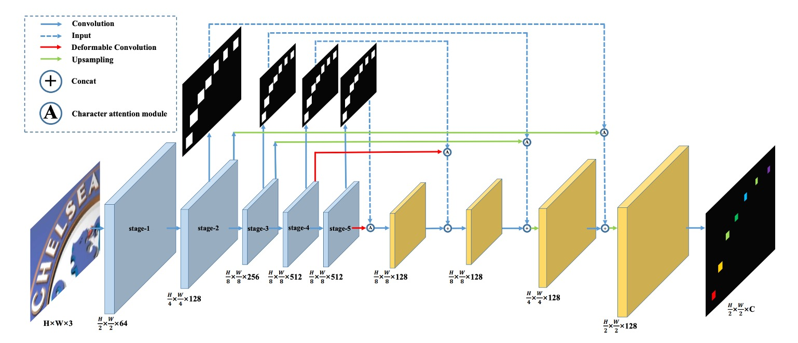
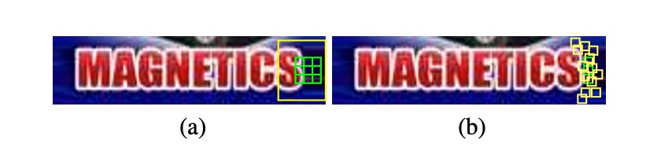

## 新しい次元の導入

[**Scene Text Recognition from Two-Dimensional Perspective**](https://cdn.aaai.org/ojs/4895/4895-13-7961-1-10-20190709.pdf)

---

CRNN とその後の改良研究は、シーンテキスト認識分野で近年支配的な地位を占めていますが、革新は簡単ではありません。

本論文の著者は、過去の研究を超えて、シーンテキスト認識の問題を二次元の視点から再考することを選択しました。

## 問題の定義

過去の研究、例えば CRNN などは、入力画像を一次元の時系列データに圧縮する方法を選んでいます。この方法は、規則的なテキスト認識には効果的ですが、高度に曲がった文字には一定の困難があります。

上図のように、左側の画像 (a) には高度に曲がった文字が含まれています。この画像を一次元の時系列データに圧縮すると、各時系列に多くの背景ノイズ（文字の曲がりによるもの）が含まれることが観察できます。この背景ノイズは、文字認識に干渉する可能性があります。

さらに、文字が曲がっているため、各時系列（列）は複数の文字を同時にカバーする可能性があり、モデルは重なった文字特徴から正しい文字を見つけ出さなければなりません。これは明らかに容易ではありません。

著者は、画像を一次元の時系列データに圧縮する方法は、高度に曲がった文字認識には適していないと考え、新しい方法を提案しています：

- **画像を二次元の形態のままで保持し、二次元空間内で文字認識を行うこと。**

新しい次元を導入することで、もう一つの利点が生まれます。それは、時系列の情報を考慮する必要がなくなることです！

これにより、畳み込みネットワークを使用して、全体の認識プロセスを完了することができます。

## 問題解決

### モデルアーキテクチャ

著者が提案したモデルアーキテクチャは上図のようになります。

ここでは、FCN の概念を導入し、全畳み込みネットワーク（FCN）の概念を用いることで、いくつかの文字カテゴリを事前に定義し、モデルは入力画像の各ピクセルを分類します。これにより、文字認識の問題は「ピクセル単位の分類問題」に変換されます。

上図の「青色」ブロックでは、VGG をバックボーンとして使用し、1/2、1/4、1/8 の特徴マップを抽出します。

その後、「青色」ブロックを上に向かって見ていくと、これらの特徴マップを使用して文字領域マップを予測します。各解像度には対応する予測結果があり、この分岐は訓練時に監視されます。

予測結果を得た後、これが「文字領域注意マップ」になります。著者はこのマップを元の特徴マップに掛け算することで、「重み付けされた」文字領域特徴を得ることができます。

重み付けの計算式は次のようになります：

$$
F_o = F_i \otimes (1 + A)
$$

ここで、$F_o$ は重み付け後の特徴マップ、$F_i$ は元の特徴マップ、$A$ は文字領域注意マップです。

これらの特徴マップは上采样され、最終的に C 個のチャンネルを持つ文字特徴マップとして出力されます。

ここでの C 個のチャンネルは、事前に定義した文字カテゴリの数です。

:::tip
上図の赤い線は、ここで「変形畳み込み」を使って、元の畳み込み操作を置き換えたことを示しています。著者はこれにより、文字の特徴をより良く捉えることができると予想しています。

下図では、左側が通常の畳み込みの受容野、右側が変形畳み込みの受容野です。変形畳み込みの受容野はより柔軟であり、文字の特徴をより精確にロックオンできることが分かります。

:::

### 訓練データの設計

訓練データの作成は以下のステップで行われます。著者はまず「文字単位」のアノテーション付き訓練データを準備し、その後これらのアノテーションを基に文字領域の二値マップを描画します。これが上図の(b)に示されるものです。

$ b = (x*{min}, y*{min}, x*{max}, y*{max}) $ は元の文字境界ボックスを示し、これは文字を覆う最小の軸合わせ矩形として表現できます。

実際の文字領域のアノテーション $ g = (x^g*{min}, y^g*{min}, x^g*{max}, y^g*{max}) $ は次の式に従って計算されます：

$$
w = x_{max} - x_{min}
$$

$$
h = y_{max} - y_{min}
$$

$$
x^g_{min} = \frac{x_{min} + x_{max} - w \times r}{2}
$$

$$
y^g_{min} = \frac{y_{min} + y_{max} - h \times r}{2}
$$

$$
x^g_{max} = \frac{x_{min} + x_{max} + w \times r}{2}
$$

$$
y^g_{max} = \frac{y_{min} + y_{max} + h \times r}{2}
$$

ここで、$r$ は文字領域のスケーリング比率です。

文字領域を縮小する理由は、縮小しないと近接した文字領域が重なり合いやすく、縮小プロセスを通じて文字の形成の難易度を減らすためです。

実際の実装では、著者は注意マップの監視に$r = 0.5$を使用し、最終的な出力の監視には$r = 0.25$を使用しました。

### 損失関数

損失関数は、文字予測損失関数 $L_p$ と文字注意力損失関数 $L_a$ の加重合計です：

$$
L = L_p + \alpha \sum_{s=2}^{5} L^s_a
$$

ここで、$s$ は段階のインデックスを示し、$\alpha$ は経験的に 1.0 に設定されています。

CA-FCN の最終出力形状は $H/2 \times W/2 \times C$ であり、$H$ と $W$ はそれぞれ入力画像の高さと幅、$C$ は文字クラスと背景を含むクラス数です。

$X_{i,j,c}$ を出力画像の 1 つの要素とした場合、$i \in \{1, ..., H/2\}$、$j \in \{1, ..., W/2\}$、$c \in \{0, 1, ..., C-1\}$ となります；$Y_{i,j} \in \{0, 1, ..., C-1\}$ は対応するクラスラベルを示します。

予測損失は以下の式で計算できます：

$$
L_p = - \frac{4}{H \times W} \sum_{i=1}^{H/2} \sum_{j=1}^{W/2} W_{i,j} \left( \sum_{c=0}^{C-1} (Y_{i,j} == c) \log\left(\frac{e^{X_{i,j,c}}}{\sum_{k=0}^{C-1} e^{X_{i,j,k}}}\right) \right),
$$

ここで、$W_{i,j}$ は各ピクセルに対応する重みです。

$N = H/2 \times W/2$ とし、$N_{neg}$ を背景ピクセルの数とした場合、重みは以下のように計算されます：

$$
W_{i,j} =
\begin{cases}
\frac{N_{neg}}{N - N_{neg}} & \text{もし} \ Y_{i,j} > 0, \\
1 & \text{それ以外}
\end{cases}
$$

---

文字注意力損失関数はバイナリ交差エントロピー損失関数であり、すべての文字ラベルを 1、背景ラベルを 0 として扱います：

$$
L^s_a = - \frac{4}{H_s \times W_s} \sum_{i=1}^{H_s/2} \sum_{j=1}^{W_s/2} \left( \sum_{c=0}^{1} (Y_{i,j} == c) \log\left(\frac{e^{X_{i,j,c}}}{\sum_{k=0}^{1} e^{X_{i,j,k}}}\right) \right),
$$

ここで、$H_s$ と $W_s$ は段階 $s$ の特徴マップの高さと幅です。

:::tip
上記の数式を見て、少し頭が痛くなったかもしれません。

実際には、これは Cross Entropy 損失関数を各ピクセルに適用して平均化したものです。特に注意すべき点は、$L_p$ を計算する際に前景と背景の重みが区別されていることです。これは、モデルが背景ピクセルによる干渉を受けず、文字領域の予測に集中できるようにするためです。
:::

### 単語生成モジュール

上図のように、単語生成モジュールは CA-FCN によって予測された精密な二次元文字マップを文字列に変換します。

- まず、著者は文字予測マップを二値化し、しきい値を使って対応する文字領域を抽出します。
- 次に、各領域が$C$個のクラスの中で最も高い平均値を持つクラスをその領域に割り当てます。
- 最後に、これらの領域を左から右に並べて単語を形成します。

この方法を使うことで、単語と各文字の位置を同時に生成できます。

単語生成モジュールは、単語が大まかに左から右に並んでいると仮定していますが、特定の状況では適用できない場合もあります。必要に応じて、CA-FCN に学習可能なコンポーネントを挿入することができます。

単語生成モジュールの構造は簡単ですが効果的で、1 つの超パラメータ（2 値化マップを作成するためのしきい値）があり、このしきい値はすべての実験で 240/255 に設定されています。

### 評価指標

著者は 4 つの一般的なシーンテキスト認識ベンチマークデータセットを使用して、モデルのパフォーマンスを評価しました。それぞれは次の通りです：

1. **ICDAR 2003 (IC03)**

   - テストセットには 251 枚のシーン画像が含まれており、これらの画像には文字境界ボックスがラベリングされています。
   - 過去の研究と公平に比較するため、通常、非アルファベット数字の文字や 3 文字未満の文字が含まれる画像は除外されます。フィルタリング後、最終的に 860 枚の切り抜かれた文字画像がテストセットとして使用されます。
   - 各テスト画像には 50 単語が含まれる語彙表（辞書）が提供され、さらに、**完全辞書**があり、すべての画像の語彙表を統合して評価に使用されます。

2. **ICDAR 2013 (IC13)**

   - テストセットは IC03 の一部データを引き継ぎ、修正したもので、最終的に 1,015 枚の切り抜かれた文字画像が含まれ、正確なアノテーションが提供されています。
   - IC03 と異なり、IC13 には語彙表が提供されていないため、評価時に辞書補助は使用されません（無辞書設定）。

3. **IIIT 5K-Word (IIIT5k)**

   - テストセットには、インターネットから収集された 3,000 枚の切り抜かれた文字画像が含まれており、さまざまなフォントや言語変化がカバーされています。
   - 各画像には 2 つの語彙表が付属しています：50 単語の小さな辞書と 1,000 単語の大きな辞書です。これらは辞書補助評価に使用されます。

4. **Street View Text (SVT)**

   - テストセットは Google ストリートビューから収集された 249 枚のシーン画像で構成され、647 枚の文字画像が切り抜かれています。
   - 各文字画像には 50 単語が含まれる語彙表が提供され、辞書補助評価に使用されます。

5. **CUTE**

   - テストセットには 288 枚の画像が含まれており、特に多くの曲がった文字が含まれていますが、語彙表は提供されていません。

### 訓練戦略

CA-FCN は全畳み込みアーキテクチャのため、入力画像のサイズに制限はありません。

著者はモデルの堅牢性を高めるためにマルチスケール訓練を採用し、入力画像はランダムに以下のサイズに調整されます：

- $32 \times 128$
- $48 \times 192$
- $64 \times 256$

また、訓練中にはデータ拡張技術を使用し、ランダム回転、色相、明るさ、コントラスト、ぼかし処理を行います。回転角度は$[-15^\circ, 15^\circ]$の範囲です。

その他のパラメータは以下の通りです：

- 訓練には Adam オプティマイザーを使用し、初期学習率は$10^{-4}$に設定されています。
- 学習率は第 3 サイクルで$10^{-5}$に、4 サイクルで$10^{-6}$に減少します。
- モデルは合計で約 5 サイクル訓練されます。
- 文字クラス数は 38 に設定されており、26 のアルファベット、10 の数字、1 つの特殊文字（アルファベットと数字以外の文字）、および 1 つの背景クラスを含みます。

テスト時、画像は$H_t \times W_t$のサイズに調整され、$H_t$は 64 に固定され、$W_t$は次の式で計算されます：

$$
W_t =
\begin{cases}
W \times \frac{H_t}{H} & \text{もし} \ W/H > 4, \\
256 & \text{それ以外}
\end{cases}
$$

ここで、$H$と$W$は元の画像の高さと幅です。

## 討論

### 他の方法との比較

CA-FCN は複数のベンチマークテストで優れたパフォーマンスを発揮し、最先端の性能を達成しました。

- **IIIT データセット**（辞書なし）では、以前の最適な方法に対して **3.7%** の改善が見られました。
- 不規則な文字データセットである **CUTE** では、**3.1%** の改善がありました。（追加の曲線文字訓練データは使用していません）
- **SVT** と **IC13** などの他のデータセットでも、同様に良好な結果を得ました。

(Cheng et al. 2017) と公平に比較するために、著者は SynthText アルゴリズムを使用して **400 万枚の合成画像** を生成し、Synth90k と同じ辞書を使用して訓練を行いました。追加データで微調整を行った結果、CA-FCN は**SVT**で(Cheng et al. 2017)を超えました。

(Bai et al. 2018) は規則的な文字認識で良好な結果を得ていますが、その一方向的な視点では **CUTE** のような複雑で不規則な文字を処理できない可能性があります。私たちの方法は、ほとんどのベンチマークテストで(Bai et al. 2018) を上回り、特に **IIIT** と **CUTE** で顕著な優位性を示しました。

:::tip
比較表では著者名と年のみが書かれており、実際には非常に読みづらいです！

ただし、この時期の論文ではこのように書かれていることが多いので、我慢して見るしかありません。興味のある読者は、原論文の表を調べてみてください。
:::

### 可視化結果

著者は論文で CA-FCN の可視化結果を示しており、上図は **IIIT** と **CUTE80** データセットでの結果です。

## 結論

CA-FCN は二次元モデルを採用して文字認識問題に取り組んでおり、各ピクセル位置での文字分類を通じて、規則的および不規則な文字を効果的に認識できるアルゴリズムを実現しました。

実験結果は、このモデルが規則的および不規則な文字データセットの両方で既存の方法を超え、さまざまなシーンでの強力なパフォーマンスを示していることを確認しました。

:::tip
実際には、このモデルをデプロイするのは非常に難しいです。なぜなら、漢字のクラス数は約 10 万に達し、最終的な予測ブランチのサイズが非常に大きくなるためです。

訓練と推論には大量の計算資源が必要であり、使用する際には慎重に検討する必要があります。
:::
