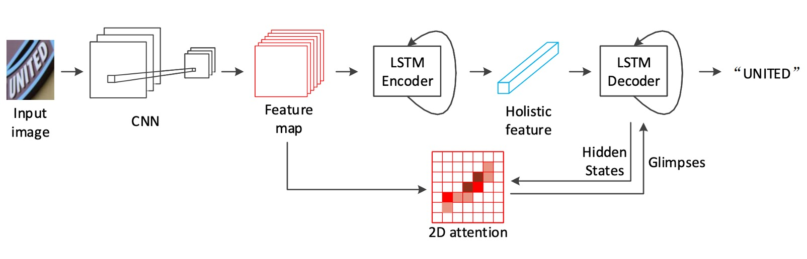
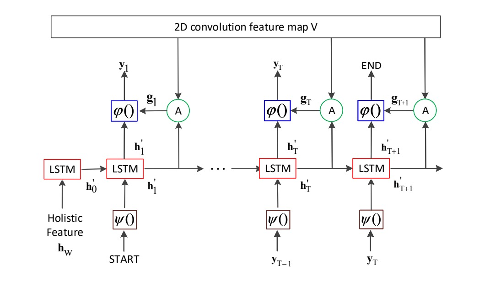
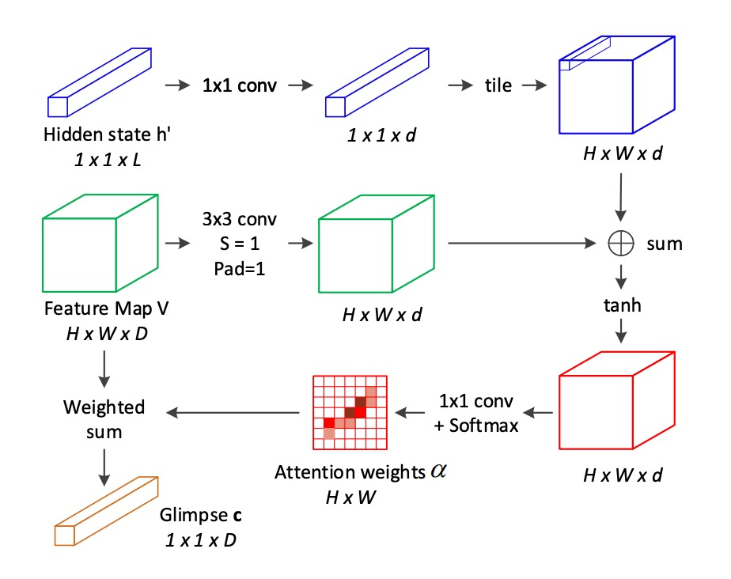

# [18.11] SAR

## 二次元注意力マップ

[**Show, Attend and Read: A Simple and Strong Baseline for Irregular Text Recognition**](https://arxiv.org/abs/1811.00751)

---

大きな曲がりくねった文字は認識モデルに非常に大きな困難をもたらします。過去には、STN ネットワークを使用して幾何学的な補正を行う方法など、いくつかの解決策が試みられてきましたが、その効果には限界があります。

## 問題の定義

これまでの解決方法を振り返ると、不規則な文字認識の問題に対しては、大きく分けて 3 つのアプローチがあります：

1. **補正アルゴリズムの使用**：代表的な方法として RARE があり、STN ネットワークを使用して幾何学的補正を行いますが、文字の歪みがひどい場合は依然として処理が難しいです。

   - [**[16.03] RARE: 自動補正**](../1603-rare/index.md)

2. **注意機構の使用**：文字をデコードする際に、モデルが局所的な 2D 特徴を選択できるようにしますが、訓練時には文字の監督情報が必要であり、訓練データの形態が制限されます。

   - [**[17.11] AON: Towards Arbitrarily-Oriented Text Recognition**](https://arxiv.org/pdf/1711.04226)

3. **多方向エンコーディング**：この方法は、任意の方向の文字を 4 つの方向からエンコードしますが、アーキテクチャの設計が複雑です。

   - [**[17.08] Learning to Read Irregular Text with Attention Mechanisms**](https://www.ijcai.org/proceedings/2017/0458.pdf)

---

いろいろ見て回った結果、著者はシンプルな方法を好んでいます。

注意機構に基づくエンコーダ・デコーダのフレームワークに戻り、著者は ResNet と LSTM のアーキテクチャをベースにし、カスタマイズされた二次元注意モジュールを組み合わせて不規則な文字認識の問題を解決しています。

## 解決問題

### モデルアーキテクチャ

上記のアーキテクチャ図に示すように、バックボーン部分には ResNet-31 が特徴抽出器として選ばれています。後続で 2D 特徴マップを直接使用するため、RCNN のように長さと幅が不一致なダウンサンプリングを行う必要はありません。

:::tip
以前の研究ではほとんどが VGG を使用していました。
:::

### エンコーダ

<figure style={{ "width": "85%"}}>

</figure>

特徴マップを得た後、最初に LSTM を使用して画像をエンコードします。

ご存知のように、LSTM は 1 次元のシーケンスデータを処理するために使用されます。そのため、ここでは特徴マップの「高さ」を最大プーリングして 1 次元のシーケンスデータに圧縮し、それを LSTM に入力します。

ここでの LSTM は 2 層で、各層には 512 個の隠れユニットがあります。図から見ると、これは単方向の LSTM です。

### デコーダ

<figure style={{ "width": "85%"}}>

</figure>

デコーダ部分も LSTM です。

上図に示すように、ここが著者が提案した主要な貢献点です：もし「2D 畳み込み特徴マップ V」の部分を取り除けば、それは基本的な LSTM デコーダになります。

ここでデコーダの入力は単純にエンコーダの出力特徴だけではなく、各デコードのステージで注意力マップに戻って注意重みを計算し、エンコーダの特徴を選択します。

ここでの LSTM も 2 層で、各層に 512 個の隠れユニットがあります。エンコーダとデコーダのパラメータはそれぞれ独立しており、共有されていません。訓練時には Teacher Forcing の方法を使用し、推論時には前の時間ステップの予測結果を使用します。

:::tip
**Teacher Forcing**

モデルがある時間ステップで次の出力を生成する際、前のステップの予測を次の入力として使用するのではなく、実際の出力ラベル（グラウンドトゥルース）を次の入力として使用します。

もしモデルが訓練初期に誤った出力を生成した場合、その誤った予測を次のステップの入力として使用し続けると、モデルはさらに多くの誤りを生成する可能性があります。Teacher Forcing はこのような誤差の蓄積を減らすことができます。

欠点として、もしモデルが Teacher Forcing に依存しすぎると、推論段階で正しい参照入力が欠如しているため、パフォーマンスが低下する可能性があります。この問題を緩和するために、Teacher Forcing の使用を徐々に減らしていき、モデルが訓練過程で自分の予測に依存して生成を行うようにします。
:::

### 2D 注意力マップ

<figure style={{ "width": "70%"}}>

</figure>

従来の 2D 注意機構の不足を補うため、著者は新しい 2D 空間関係に基づく注意機構を提案しています：

各位置$(i, j)$について、その注意重みを計算する際に、**隣接位置**の情報を考慮します。これらの隣接位置は位置$(i, j)$の**八方向近隣**から取得されます。

注意スコア$e_{ij}$は次の式で計算されます：

$$
e_{ij} = \tanh(W_v v_{ij} + \sum_{p,q \in N_{ij}} \tilde{W}_{p-i, q-j} \cdot v_{pq} + W_h h'_t)
$$

ここで：

- $v_{ij}$は位置$(i, j)$の局所特徴ベクトルです。
- $N_{ij}$は位置$(i, j)$の周囲の八方向近隣を表します。
- $h'_t$はデコーダ LSTM の時間ステップ$t$における隠れ状態で、注意を導く信号として使用されます。
- $W_v, W_h$、および$\tilde{W}$は学習すべき線形変換行列です。

softmax 関数を用いて注意重み$\alpha_{ij}$を計算します：

$$
\alpha_{ij} = \text{softmax}(w_e^T \cdot e_{ij})
$$

現在の時間ステップ$t$における注意加重和（glimpse）$g_t$を計算します：

$$
g_t = \sum_{i,j} \alpha_{ij} v_{ij}, \quad i = 1, \ldots, H, \quad j = 1, \ldots, W
$$

ここで$H$と$W$は特徴マップの高さと幅です。

従来の注意機構と比較して、ここでは**八方向近隣の加重和項**が追加され、近隣位置の影響を考慮しています。この改善により、モデルは局所特徴間の空間的関係を捉えることができます。

:::tip
この段落を読んで数式が多くて驚くかもしれませんが、実際には特徴マップに対して一度畳み込み演算を行い、その後 Softmax を計算し、最後に加重和を求めるだけです。

そのため、「八方向近隣」と書かれている理由を考えてみてください。畳み込みカーネルのサイズが$3 \times 3$であるため、各位置は周囲の 8 つの位置を考慮します。
:::

## 討論

### 他の方法との比較

不規則な文字データセット（例：**IC15**、**SVTP**、**CT80**、および**COCO-T**）において、SAR は他の方法に対して**顕著に優れた**性能を示しています。

- **SVTP-None**では、精度が**7.5%**向上しました（78.9%から 86.4%に）。
- **CT80**では、精度が**10.1%**向上しました（79.5%から 89.6%に）。

また、SAR は**規則的な文字データセット**（例：**IIIT5K**、**SVT**、および**IC13**）においても、**最先端の性能**を達成しています。

**語彙表なし**の状況では、特に**IIIT5K**や**SVTP**で優れた結果が得られます。これは、実際の状況（通常**語彙表が提供されない場合**）でも非常に高い実用性を持っていることを示しています。

### 可視化の表示

著者は、SAR の 2D 注意機構と従来の 2D 注意機構を比較しています。

デコード後の文字は対応する注意力マップの左側に表示され、誤った文字は赤でマークされています。SAR モデルはより正確な位置付けと優れた認識結果を示しています。

## 結論

SAR は、規則的および不規則な文字認識タスクにおいて卓越した性能を示しました。また、このモデルは今後の改善のためのいくつかの可能な方向性を提供しており、特に訓練プロセスの高速化や複雑な文字構造の処理において大きな発展の潜在力を持っています。

今後、SAR を基にしたいくつかの研究が比較対象として行われる予定であり、次回その詳細についてさらに掘り下げて話し合いたいと思います。
