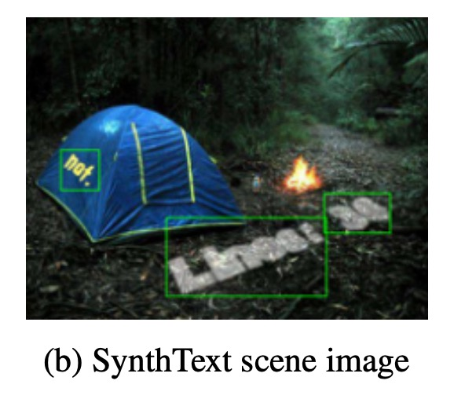
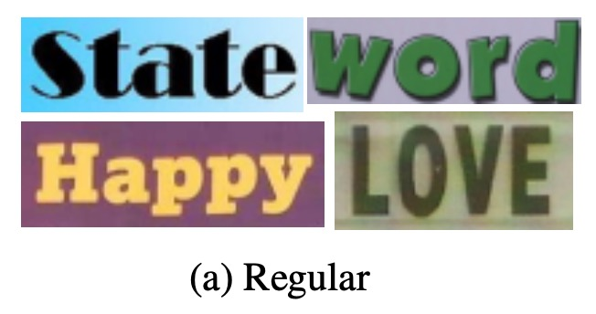
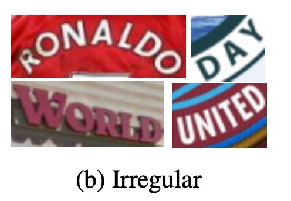
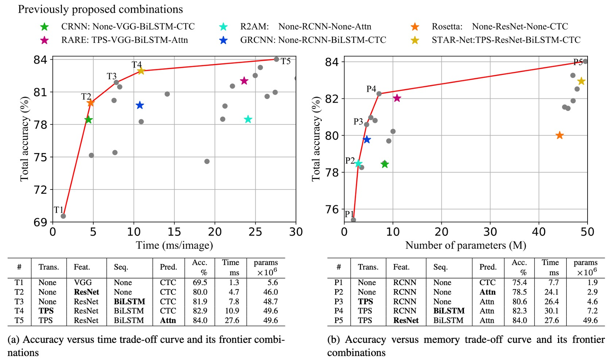

# [19.04] WWWSTR

## データセットとモデルの分析

[**What Is Wrong With Scene Text Recognition Model Comparisons? Dataset and Model Analysis**](https://arxiv.org/abs/1904.01906)

---

この論文は Clova AI によって発表されたもので、新しい技術を提案するのではなく、既存のアルゴリズムとデータセットに対して包括的な分析を行い、さまざまなモジュール間の組み合わせを探ることで、潜在的な最適解を探求しています。

## データセット分析

異なる研究では異なるデータセットの組み合わせを使用して訓練しており、そのため性能向上の理由が不明確で、新しいモデルの貢献によるものか、より良いまたは大規模なデータセットの使用によるものかを特定するのが難しいです。

このようなデータセットの不一致は、結果の公正性に影響を与える可能性があります。

### 訓練データセット

シーンテキスト画像の注釈付けはコストが高く、十分な注釈データを得るのが難しいため、ほとんどの STR モデルは合成データセットを使用して訓練します。

以下は STR 研究でよく使用される 2 つの合成データセットです：

- **MJSynth（MJ）**

  - [**Synthetic Word Dataset**](https://www.robots.ox.ac.uk/~vgg/data/text/)

    

    <figure style={{ "width": "60%"}}>
    
    </figure>
    

  MJSynth は STR のために設計された合成データセットで、890 万の単語ボックス画像を含んでいます。生成プロセスには、フォントレンダリング、枠線と影のレンダリング、背景塗り、フォントと背景の合成、透視変形の適用、実際の画像との混合、およびノイズの追加が含まれます。

- **SynthText（ST）**

  - [**SynthText in the Wild Dataset**](https://www.robots.ox.ac.uk/~vgg/data/scenetext/)

    

    <figure style={{ "width": "60%"}}>
    
    </figure>
    

  SynthText はもともとシーンテキスト検出のために設計された合成データセットですが、STR 研究にも使用されています。研究者たちはこのデータセットを単語ボックスで切り取って STR 訓練に使用しています。切り取られた SynthText データセットには約 550 万の訓練データがあります。

### テストデータセット

異なるバージョンのベンチマークデータセットには一定の違いがあります。

例えば、IC03 では 7 つのサンプルの差が 0.8%の性能差を生み出すことがあり、これは以前の研究結果を比較する際に大きな差となります。

IC13 や IC15 では、サンプル数の差は IC03 よりもさらに大きいです。

7 つの実際のシーンの STR データセットは、訓練後のモデル評価に広く使用されており、これらのデータセットは文字の難易度と幾何学的なレイアウトに基づいて「規則的データセット」と「不規則なデータセット」に分類できます：

- **規則的データセット**：水平に並べられ、文字間の間隔が均等な文字画像を含むデータセットで、これらのデータセットは比較的処理が容易です：

    

    <figure style={{ "width": "60%"}}>
    
    </figure>
    

  - **IIIT5K-Words (IIIT)**：Google 画像検索からのデータセットで、2,000 枚の訓練画像と 3,000 枚の評価画像が含まれています。
  - **Street View Text (SVT)**：Google Street View から収集された屋外の街景画像で、いくつかの画像にはノイズ、ぼやけ、または低解像度があります。257 枚の訓練画像と 647 枚の評価画像が含まれています。
  - **ICDAR2003 (IC03)**：ICDAR 2003 Robust Reading コンペティション用で、1,156 枚の訓練画像と 1,110 枚の評価画像があります。短すぎるまたは非アルファベットの文字を含む単語を除外しているため、データセットには 2 つのバージョン（860 枚と 867 枚の画像）が存在します。
  - **ICDAR2013 (IC13)**：主に IC03 の画像を継承し、ICDAR 2013 Robust Reading コンペティション用に設立され、848 枚の訓練画像と 1,095 枚の評価画像が含まれています。評価時には 2 つのバージョン（それぞれ 857 枚と 1,015 枚の画像）があります。

---

- **不規則なデータセット**：曲線、任意の回転、または歪んだ文字など、より挑戦的なシーンテキストが含まれるデータセットです：

    

    <figure style={{ "width": "60%"}}>
    
    </figure>
    

  - **ICDAR2015 (IC15)**：ICDAR 2015 Robust Reading コンペティション用で、4,468 枚の訓練画像と 2,077 枚の評価画像があります。画像は Google Glass を装着した人物の自然な移動中に撮影されたもので、多くのノイズ、ぼやけ、回転が含まれています。研究で使用される評価バージョンには 1,811 枚と 2,077 枚の 2 つのバージョンがあります。
  - **SVT Perspective (SP)**：Google Street View から収集されたもので、645 枚の評価画像が含まれており、非正面視点による透視投影が多く含まれています。
  - **CUTE80 (CT)**：自然なシーンから収集されたデータセットで、288 枚の切り取られた評価画像が含まれています。多くの画像は曲線文字画像です。

### バージョン差異

上記の情報に基づき、異なる研究では異なるバージョンのベンチマークデータセットを使用してモデル評価を行っています（特に IC03、IC13、IC15 データセットにおいて）。

例えば、IC03 では 7 つのサンプルの差異が 0.8%の性能差を生み出す可能性があり、これは以前の研究結果を比較する際に大きな差となります。IC13 や IC15 では、サンプル数の差異が IC03 よりもさらに大きいです。このデータセットのバージョン差異は、モデルの性能評価に顕著な誤差を引き起こすため、異なるモデルの性能比較時には特に注意が必要です。

:::tip
バージョンエラー、後悔先に立たず！慎重に！
:::

## アーキテクチャ分析

STR は「物体検出」タスクと「シーケンス予測」タスクに似ており、畳み込みニューラルネットワーク（CNN）とリカレントニューラルネットワーク（RNN）による恩恵を受けています。

最初に CNN と RNN を組み合わせて STR に使用したモデルは CRNN で、このモデルは CNN で特徴を抽出し、RNN でシーケンス予測を行いました。その後、性能向上を目指して多くのバリアントが提案され、フォントスタイルや背景などの複雑な特徴を処理するために異なるモジュールが導入されました。

一部の手法では推論時間を短縮するために RNN のステージを省略しています。その後の研究では、文字列シーケンスの予測を改善するために、注意機構に基づくデコーダが導入されました。

STR の四段階アーキテクチャは次のようになります：

1. **変換段階（Transformation）**：空間変換ネットワーク（STN）を使用して入力された文字画像を標準化し、後続の段階の負担を減らします。
2. **特徴抽出段階（Feature Extraction）**：入力画像を文字認識に特化した表現に変換し、フォント、色、大きさ、背景などに関連しない特徴を抑制します。
3. **シーケンスモデリング段階（Sequence Modeling）**：文字シーケンス内のコンテキスト情報を捉え、各文字の予測精度を高めます。
4. **予測段階（Prediction）**：特徴抽出の結果に基づいて最終的な文字列を予測します。

### 変換段階

この段階のモジュールは、入力画像 X を標準化された画像 X'に変換します。

自然のシーンにおける文字画像は形状が多様で（曲がりくねった文字や傾いた文字など）、そのまま後続の段階に入力すると、特徴抽出段階でこれらの幾何学的変形を不変な特徴として学習する必要があります。

この負担を軽減するために、いくつかの研究では薄板スプライン（Thin-Plate Spline, TPS）変換を使用しました。これは空間変換ネットワーク（STN）の変種であり、標準点間でスムーズなスプライン補間を行うことで文字領域を標準化します。

TPS は、異なるスケールの文字画像に柔軟に対応でき、文字領域を事前に定義された矩形に正規化します。

### 特徴抽出段階

この段階では、畳み込みニューラルネットワーク（CNN）が入力画像（X または X'）を視覚的な特徴マップに抽象化します。

特徴マップの各列は、入力画像の水平方向における個別の受容野に対応し、これらの特徴が各受容野内の文字予測に使用されます。

著者は 3 つの一般的なアーキテクチャを研究しました：VGG、RCNN、ResNet：

- **VGG**：複数の畳み込み層と少数の全結合層で構成されています。
- **RCNN**：CNN の変種で、受容野を調整するために再帰的に適用でき、文字形状に基づいて適応的に処理します。
- **ResNet**：残差接続を使用して、深い CNN の訓練の難しさを緩和します。

### シーケンスモデリング段階

特徴抽出段階の出力は特徴シーケンス V にリシェイプされ、特徴マップの各列$v_i \in V$がシーケンス内のフレームとして使用されます。

しかし、このようなシーケンスはコンテキスト情報を欠いている可能性があるため、以前の研究では双方向長短期記憶ネットワーク（BiLSTM）を使用してシーケンス$H = Seq.(V)$のパフォーマンスを向上させ、文字シーケンス内のコンテキスト関連を捉えています。

### 予測段階

この段階では、シーケンス$H$から文字列$Y = y_1, y_2, …$を予測します。

以前の研究に基づいて、著者は 2 つの予測オプションを提供しています：

1. **接続主義時系列分類（CTC）**：この方法は、固定された特徴数のままで可変長シーケンスを予測でき、重複文字と空白を削除して最終的な文字列に変換します。
2. **注意機構に基づくシーケンス予測（Attention-based Sequence Prediction, Attn）**：この方法は、入力シーケンス内の情報フローを自動的にキャプチャし、文字レベルの言語モデルを学習して出力クラス間の依存関係を表現します。

これらのモジュールは、さまざまなシーンテキスト認識アプリケーションに適応するために選択または調整できます。

## 実験設定

前述のように、データセットは STR モデルの性能に大きな影響を与えるため、公平な比較のために著者は訓練、検証、評価用のデータセット選択を固定しました。

- **訓練データセット**：MJSynth（8.9 百万サンプル）と SynthText（5.5 百万サンプル）を組み合わせたデータセットで、合計 14.4 百万サンプル。
- **検証データセット**：IC13、IC15、IIIT、および SVT の訓練セットを組み合わせて検証データセットとして使用。
- **訓練パラメータ**：AdaDelta オプティマイザ、減衰率 ρ=0.95、訓練バッチサイズ 192、総イテレーション数 300,000 回、勾配クリッピング幅 5、He 初期化、2,000 回の訓練ステップごとにモデルを検証。
- **重複データ処理**：IC03 の一部の訓練データは除外されました。なぜなら、34 枚のシーン画像（215 個の文字ボックスを含む）が IC13 の評価データセットと重複しているためです。
- **評価指標**：
  - **精度**：9 つの評価データセットに対して単語予測の成功率を分析。
  - **速度評価**：各画像の平均処理時間（ミリ秒）を測定。
  - **メモリ評価**：STR モデル全体の学習可能な浮動小数点パラメータ数を計算。
- **実験環境**：Intel Xeon(R) E5-2630 v4 2.20GHz CPU、NVIDIA TESLA P40 GPU、252GB RAM。

## 討論

著者は異なるモジュールの組み合わせにおける精度-時間および精度-メモリのトレードオフを分析しています。

上の図は、すべてのモジュール組み合わせのトレードオフを示しており、図には 6 つの以前に提案された STR モデル（星印で示されている）も含まれています。

### 精度-時間トレードオフ分析

<figure style={{ "width": "80%"}}>

</figure>

上表(a)に基づいて、T1 は最も時間がかからないモデルで、変換やシーケンスモジュールが含まれていません。

T1 から T5 にかけて、モジュールが順次追加され（**太字**で表示）：**ResNet**、**BiLSTM**、**TPS**（薄板スプライン）、および**Attn**（注意機構）が追加されます。

T1 から T5 の変化では、毎回 1 つのモジュールのみが変更され、フレームワークはアプリケーションシーンに応じて性能のスムーズな遷移を提供し、性能と計算効率の間で最小のトレードオフを行います。

**ResNet、BiLSTM、および TPS**の導入は精度を大きく向上させました（69.5% → 82.9%）。しかし、全体的には相対的に控えめな速度低下（1.3 ミリ秒 → 10.9 ミリ秒）しか引き起こしませんでした。

**Attn**の導入は精度をさらに 1.1%向上させましたが、効率は大幅に低下し（27.6 ミリ秒）、その効率コストが非常に高いことが示されました。

### 精度-メモリトレードオフ分析

<figure style={{ "width": "80%"}}>

</figure>

上表(b)に基づいて、P1 はメモリ消費が最も少ないモデルで、P1 から P5 にかけてモジュールを順次追加することで、メモリと精度のトレードオフが生じます。

精度-メモリトレードオフにおいても、毎回 1 つのモジュールだけが変更され、精度が順次向上します。モジュールは次の順に変更されます：**Attn**、**TPS**、**BiLSTM**、および**ResNet**。

T1 で使用された VGG と比較して、**RCNN**は P1-P4 ではより軽量で、良好な精度-メモリトレードオフを提供します。RCNN は独立した CNN 層を少なく使用し、これらの層を繰り返し適用することで、軽量で効率的な性能を提供します。

変換、シーケンス、および予測モジュールはメモリ消費への影響はほとんどなく（1.9M → 7.2M パラメータ）、精度を大きく向上させます（75.4% → 82.3%）。

**ResNet**は最後に導入され、精度は 1.7%向上しましたが、メモリ消費は大幅に増加し、49.6M 浮動小数点パラメータに達しました。したがって、メモリ消費に敏感なアプリケーションでは、変換、シーケンス、予測モジュールを自由に選択できますが、ResNet のような高負荷な特徴抽出器の使用は避けるべきです。

### モジュール分析

著者は、各モジュールが精度、速度、メモリ要求の面でどのようにパフォーマンスを発揮するかを分析しました。

- **精度の向上**：規則的なベンチマークデータセットと比較して、不規則なデータセットでのパフォーマンス向上は約 2 倍です。精度向上と時間の使用を比較すると、モジュールのアップグレード順序は**ResNet、BiLSTM、TPS、Attn**であり、これは基礎的な組み合わせ（None-VGG-None-CTC）からの最も効果的な順序であり、精度-時間トレードオフの前線のアップグレード順序（T1→T5）と一致しています。

- **精度-メモリの観点**：メモリ消費の観点から、最も効果的なモジュールのアップグレード順序は**RCNN、Attn、TPS、BiLSTM、ResNet**であり、これも精度-メモリトレードオフの前線の順序（P1→P5）と一致しています。ただし、時間とメモリのトレードオフで最も効果的なモジュールのアップグレード順序は逆順です。

### 失敗ケース分析

著者はすべての失敗ケースを分析しました。

上図は、規則的なベンチマークデータセットの 8,539 例の中で、644 枚（7.5%）の画像がどのモデルでも正しく認識されなかった 6 つの一般的な失敗ケースを示しています。

1. **書法字体**：

   - 一部のブランドフォント（例：「Coca Cola」）や街の店名（例：「Cafe」）の特殊なフォントスタイルは依然として挑戦です。このような多様なフォント表現には、より広範囲に適応できる視覚特徴を提供する新しい特徴抽出器が必要です。
   - **今後の研究方向**：モデルが訓練データセットのフォントスタイルに過度にフィットしないように、正則化を使用して防ぐことができるかもしれません。

2. **垂直テキスト**：

   - 現在の STR モデルのほとんどは文字画像が水平方向であることを前提としているため、垂直テキストを効果的に処理することができません。いくつかのモデルは垂直情報を利用しようとしましたが、垂直テキストの処理はまだ不十分です。
   - **今後の研究方向**：垂直テキストの認識をカバーするためのさらなる研究が必要です。

3. **特殊文字**：

   - 現在のベンチマークテストでは特殊文字を評価していないため、これらを訓練時に除外しています。その結果、モデルはこれらの文字を誤ってアルファベットや数字として認識しています。
   - **今後の研究方向**：訓練時に特殊文字を追加することが推奨されます。これにより、IIIT データセットの精度は 87.9%から 90.3%に向上する可能性があります。

4. **大きな遮蔽**：

   - 現在の方法では上下文情報を十分に活用して遮蔽問題を克服していません。
   - **今後の研究方向**：より強力な言語モデルを採用し、文脈情報を最大限に活用することを検討できます。

5. **低解像度**：

   - 現在のモデルでは低解像度に関する問題を明確に処理していません。
   - **今後の研究方向**：画像金字塔や超解像モジュールが性能向上に寄与する可能性があります。

6. **ラベルノイズ**：
   - 一部の失敗例はデータセット内のラベルミスによるものです。すべてのベンチマークデータセットにはノイズラベルが含まれています。
   - **ラベルノイズ統計**：
     - 特殊文字を考慮していない誤ラベルの割合は 1.3%。
     - 特殊文字を考慮した誤ラベルの割合は 6.1%。
     - 大文字と小文字の区別を考慮した誤ラベルの割合は 24.1%。

## 結論

本論文は、シーンテキスト認識分野における深いかつ包括的な分析を行い、異なるモデルの性能を公平に比較するための統一的な分析フレームワークを提案しました。

これまでの論文を時間がないからといって見逃していた場合でも、この論文だけは必ず見るべきです！

この論文は、2019 年の文字認識分野の現状を迅速に理解するために役立ち、あなたの研究に明確な方向性を提供し、多くの回り道を避ける助けになるでしょう。
