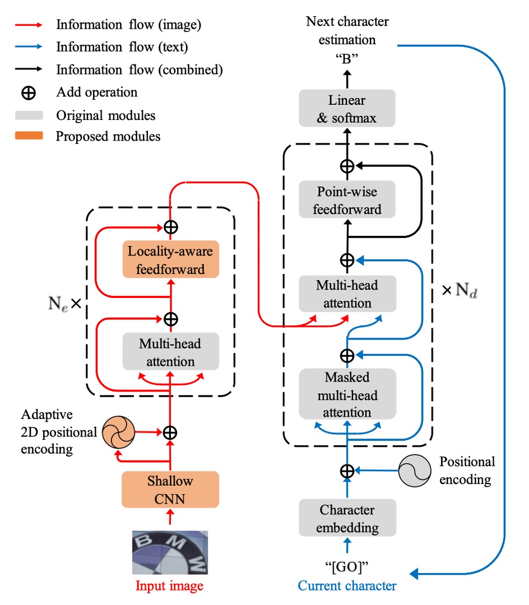
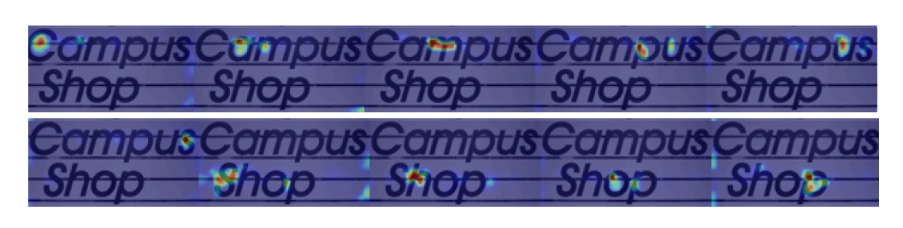

## Transformer 戦場へ到達

[**On Recognizing Texts of Arbitrary Shapes with 2D Self-Attention**](https://arxiv.org/abs/1910.04396)

---

Transformer は発表から数年が経ち、その影響はさまざまな分野に広がっています。この論文は Clova AI によって発表され、Transformer の利点を Scene Text Recognition (STR)分野に導入し、いくつかの問題を解決できるかもしれないという提案です。

## 問題定義

任意の形状の文字は依然として多くの研究者にとって大きな課題です。

過去数年にわたって、いくつかの解決策が提案されてきましたが、これらの方法は依然として十分に効果的ではありません。特に、多くの研究は文字が水平方向に並んでいるという仮定に基づいており、これがモデルの汎化能力を制限しています。

現在、Transformer は 2 年以上経ち、BERT は NLP 分野で大きな成功を収めています。著者は、「もしかすると、Transformer の注意機構がこの問題を解決する手助けになるかもしれない」と考えました。

:::tip
この論文が発表された時点では、ViT はまだ登場していませんでした！
:::

## 解決策

### モデルアーキテクチャ

<figure style={{"width": "70%"}}>

</figure>

著者は、STR タスク向けに改良を加えた標準的な Transformer アーキテクチャを提案しました。Transformer の基本構造については繰り返しませんが、詳しく知りたい場合は以下を参照してください：

- [**[17.06] Transformer: 新世界の起点**](../../transformers/1706-transformer/index.md)

エンコーダ部分では、入力画像はまず浅層の畳み込みニューラルネットワーク（CNN）で局所的な画像パターンやテクスチャを抽出し、自己注意機構の計算負荷を軽減します。この CNN は、$3 \times 3$の畳み込み層と$2 \times 2$の最大プーリング層で構成されており、プーリング層のストライドは 2 です。

自己注意機構は、Transformer の自己注意機構に基づいており、ランダムに配置された文字の問題を解決するために適応的な 2D 位置エンコーディングを使用します。

FFN 部分では、新しい局所感知前処理層（Locality-aware Feedforward Layer）が提案され、局所構造への注目を強化します。この変更点は、元々の点対点前処理層の$1 \times 1$畳み込み層を$3 \times 3$畳み込み層に変更したことです。

デコーダ部分では、エンコーダから抽出された 2D 特徴マップから文字列シーケンスを生成します。

デコーディングの過程では、画像入力と文字出力のクロスモーダルの関係が、2 番目のマルチヘッド注意機構で実現されます。デコーダの構造は Transformer デコーダにほぼ準じており、主にマルチヘッド注意機構と点対点前処理層が使用されます。

:::tip
**適応的 2D 位置エンコーディング**

原文：Adaptive 2D Positional Encoding (A2DPE)

著者は、文字のランダムな配置問題を解決するために、画像特徴に基づいて幅と高さの比率を動的に調整する方法を提案しています。A2DPE は以下の式で動的に位置エンコーディングを調整します：

$$
p_{hw} = \alpha(E) p_{\text{sinu}}^h + \beta(E) p_{\text{sinu}}^w
$$

ここで、$p_{\text{sinu}}^h$と$p_{\text{sinu}}^w$は正弦位置エンコーディング、$E$は画像特徴、$\alpha(E)$と$\beta(E)$は画像特徴$E$に基づいて 2 層のパーセプトロンで計算され、sigmoid 関数を使用して相対的な比率を制御します。
:::

## 討論

### 先行手法との比較

SATRN は、他の 2D 特徴マップを使用した手法と比較して、すべてのベンチマークテストで優れた性能を示し、特に不規則なテキストに対するベンチマークテストでは、SATRN は 2 位の手法と比較して平均で 4.7%向上しました。

このアーキテクチャは、任意の形状の文字認識において優位性を持ち、STN（空間変換ネットワーク）や 2D 特徴マップを使用した他の手法よりも優れた性能を示しました。

### SAR モデルとの比較

:::tip
以前に SAR モデルについて見た内容は、この論文で紹介されています。

- [**[18.11] SAR: 二次元注意マップ**](../1811-sar/index.md)
  :::

SATRN と SAR モデルは、エンコーダ（自己注意 vs 畳み込みネットワーク）およびデコーダ（自己注意 vs LSTM）の部分で顕著に異なります。SAR は ResNet エンコーダと LSTM デコーダを使用しているのに対し、SATRN は自己注意エンコーダとデコーダを使用しています。

SATRN は SAR と比較して、精度を向上させるとともに計算効率も改善しました。SAR の ResNet エンコーダを SATRN エンコーダにアップグレードした結果、精度は 1.0％および 0.9％向上し、1200 万のパラメータと 5.5B の FLOPs が削減されました。

### 複数行テキスト認識

モデルの形状や歪みの影響を具体的に評価するために、著者は IC13 データセットから新しいテストセットを合成しました。特に回転と複数行テキストに焦点を当てています。

回転文字部分では、著者は 0° から 360° まで均等に分布した回転を用いて訓練し、入力画像を 64×64 サイズに調整しました。複数行テキスト部分では、著者は合成文字データセット（SynthText と MJSynth）でモデル訓練を行い、IC13 から手動で複数行のテキスト画像を切り出してテストしました。

実験では、SATRN はすべての回転角度においてベースラインモデルの FAN および SAR を上回り、さまざまな回転角度で安定した性能を維持しました。複数行テキスト認識では、SATRN は推論中に現在の行から次の行に大きなジャンプを行い、その優れた性能を示しました。

下図は、SATRN デコーダが 2D 特徴を抽出する際の注意マップを示しています：

### 消融研究

- **適応的 2D 位置エンコーディング（A2DPE）**：位置エンコーディングを使用しない場合、1D 位置エンコーディングや 2D 結合エンコーディングと比較して、A2DPE は最も優れた精度を示し、テキストの配置の多様性に適応するために動的に幅と高さの比率を調整し、モデルの性能を大幅に向上させました。
- **特徴マップの高さの影響**：特徴マップのサイズが縮小すると、計算量と精度が共に低下し、特に高さのサンプリング率が 1/8 を超えると精度が急激に低下することが示されており、計算中に 2D 特徴マップを維持することの重要性が強調されました。

## 結論

SATRN は STR タスクにおける Transformer の有効性を確認し、複数のベンチマークテストで最先端の性能を達成し、平均で 5.7%の精度向上を実現しました。

SATRN は精度を向上させましたが、自己注意層の使用により、特にデコーダ部分でメモリと計算の要求が増加しました。特にデコーダ部分は顕著に FLOPs とパラメータ量が増加しましたが、これは明らかに問題ではありません！

今後の研究では、計算量を削減し、より多くの実際のアプリケーションシーンに適用できる方法についてさらに調査することが期待されます。
