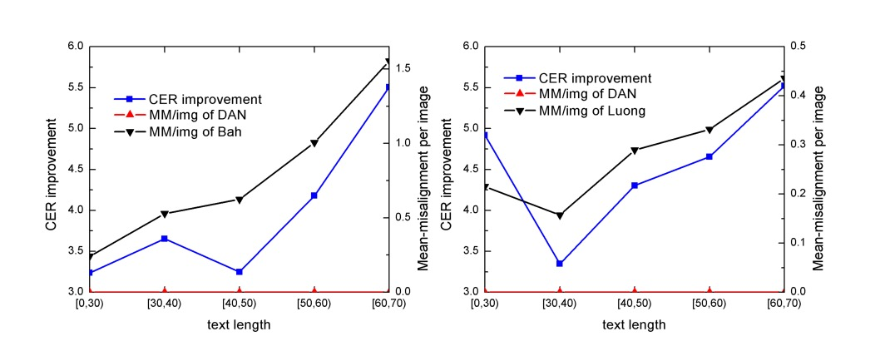
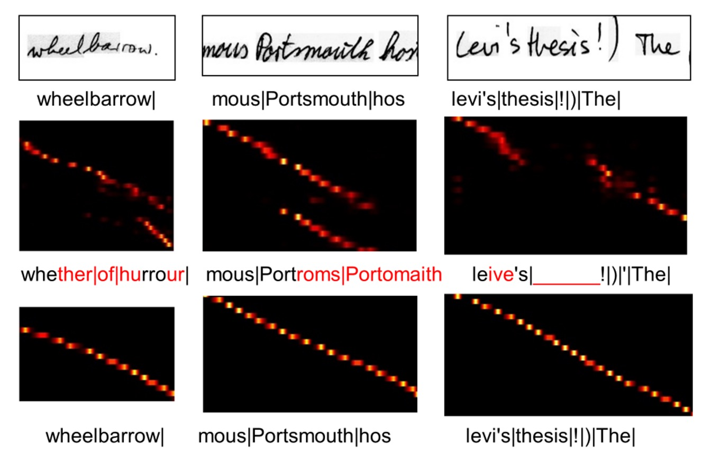

## 一緒にしないで

[**Decoupled Attention Network for Text Recognition**](https://arxiv.org/abs/1912.10205)

---

初期の研究では、多くの場合、最終出力のデコーダーとして CTC アルゴリズムが使用されていましたが、最近では注意機構を持つ構造が流行しています。その理由は単純です：通常、効果が良いためです！

したがって、モデルに注意機構を追加することは、現在の STR 分野における標準的な手法となっています。

## 問題の定義

しかし、注意機構のマップは、うまくいきません！

### 注意機構の欠陥

著者は過去の研究を整理し、注意機構の設計が特徴マップに基づいていることがわかりましたが、文字に基づいているわけではありません。

どういうことかというと、以下の図を見てください：

図では、上が元の入力画像、下が対応する注意機構のマップです。

注意機構のマップの読み方には少し特殊な点があります。これはシーケンス情報を持っており、最左上が最初の文字、最右下が最後の文字を表しています。良い注意機構の分布は、対角線のような明るい点の集合であるべきで、これにより各文字に対応する注意領域が示されます。

上記の図に戻ると、注意機構の分布が対角線ではなく、ある領域から突然別の領域にジャンプしているのがわかります。これは、モデルがその時点で正しい文字に対応していないことを示しています。

著者の分析によれば、これは注意機構の設計が特徴マップに基づいているためです。図に示された例では、「ly」という単語が異なるシーケンスの点で類似した特徴マップを持っているため、シーケンスモデルは「迷子」になってしまうのです。

### 出力の結びつき

私たちが注意機構のマップを必要とする理由は、モデルが文字と画像を整列させる手助けをするためです。

しかし、整列操作がデコーディング操作と結びついている場合、学習過程で整列結果がデコーダーの出力結果に影響されることになります。これにより、誤りが積み重なり、伝播していくことは避けられません。

---

したがって、整列操作とデコーディング操作は一緒にしてはいけません！

著者はこのように述べています。

## 問題の解決

### モデルアーキテクチャ

結びつきの問題を解決するために、著者は DAN アーキテクチャを提案しました。上図の通りです。

このアーキテクチャのアイデアは非常にシンプルで、注意機構のために専用の分岐を設計し、この分岐で文字の位置を予測することです。段階的にこのアーキテクチャを見ていきましょう。

### 特徴抽出

この部分は CNN ネットワークで、画像の特徴を抽出するために使用され、特に問題はありません。

著者は前の研究と似た CNN 特徴エンコーダーを使用しており、標準的な ResNet ではなく、以下のパラメータ設定を使用しています：

<figure style={{"width": "70%"}}>

</figure>

入力画像$x$（サイズ$H \times W$）を特徴マップ$F$にエンコードします：

$$
F = F(x), \quad F \in \mathbb{R}^{C \times H/r_h \times W/r_w}
$$

ここで、$C$は出力チャンネル数、$r_h$と$r_w$は高さと幅のダウンサンプリング比です。

### 整列モジュール

畳み込み整列モジュール（Convolutional Alignment Module、CAM）です。

CAM は特徴エンコーダーからマルチスケールの視覚特徴を取得し、階層的なダウンサンプリング畳み込み層を通じて処理します。FCN からインスパイアを受けて、CAM はチャンネルごとの注意計算を行い、各チャンネルはクラスごとのヒートマップを表します。

CAM の構造は$L$層を含み、アップサンプリング（著者は逆畳み込みを使用）段階で、各出力特徴は畳み込み段階の対応する特徴マップと加算され、最終的に sigmoid 関数とチャンネルごとの正規化を通じて注意機構マップが生成されます：

$$
A = \{ \alpha_1, \alpha_2, \dots, \alpha_{\text{maxT}} \}
$$

この$maxT$はデコーダーの最大タイムステップ数であり、各注意機構マップのサイズは$H/r_h \times W/r_w$です。

最後にデコーダーに入力されるとき、各タイムステップには対応する特徴マップがあり、この特徴マップは元の画像の文字領域に対応します。

:::tip
このステップが不明な場合は、FPN を使って理解すると良いでしょう。

- [**[16.12] FPN: ピラミッド構造**](../../feature-fusion/1612-fpn/index.md)
  :::

### 解耦型デコーダーモジュール

<figure style={{"width": "70%"}}>

</figure>

従来の注意機構デコーダーは整列と認識を同時に行いますが、DAN のデコーダーは認識のみを行います。

デコーダーはエンコードされた特徴マップと注意機構マップを入力として、タイムステップ$t$のコンテキストベクトル$c_t$を計算します：

$$
c_t = \sum_{x=1}^{W/r_w} \sum_{y=1}^{H/r_h} \alpha_{t, x, y} F_{x, y}
$$

分類器はタイムステップ$t$で出力$y_t$を生成します：

$$
y_t = w h_t + b
$$

ここで、$h_t$は GRU の隠れ状態です：

$$
h_t = \text{GRU}((e_{t-1}, c_t), h_{t-1})
$$

$e_t$は前のデコーダー結果$y_t$の埋め込みベクトルです。

DAN の損失関数は次の通りです：

$$
\text{Loss} = -\sum_{t=1}^{T} \log P(g_t | I, \theta)
$$

ここで、$\theta$は DAN のすべての訓練可能なパラメータ、$g_t$はタイムステップ$t$の実際のラベルです。

:::tip
**CAM の柔軟性と 1D/2D 認識モード**

ダウンサンプリング比$r_h$を制御し、CAM のストライドを変更することで、DAN は 1D モードと 2D モードを切り替えることができます：

- $H/r_h = 1$の場合、DAN は**1D 認識器**になり、長く規則的な文字認識に適しています。
- $H/r_h > 1$の場合、DAN は**2D 認識器**となり、不規則な文字を扱うシーン認識に適しています。
  :::

### 手書き文字認識の訓練戦略

2 つの検証用データセットを選択：

1. **IAM 手書きデータセット（IAM Dataset）**

   - LOB コーパスに基づく手書き英語の文字。
   - **訓練セット**：747 件の文書（6,482 行）
   - **検証セット**：116 件の文書（976 行）
   - **テストセット**：336 件の文書（2,915 行）

2. **RIMES 手書きデータセット（RIMES Dataset）**
   - 手書きフランス語の手紙を含む。
   - **訓練セット**：1,500 段落（11,333 行）
   - **テストセット**：100 段落（778 行）

両方のデータセットでは、整行の文字列を使った訓練セットを使用し、オープンソースのデータ拡張ツールを使用して訓練を行う。

入力画像の高さは 192 に正規化し、幅は元の比率に従って最大 2048 までスケーリング。特徴マップを 1D にするため、特徴エンコーダーの末尾にサイズ$3 \times 1$の畳み込み層を追加。

$maxT$は 150 に設定し、最長の文字行に対応。すべての CAM の畳み込み層（最後の層を除く）は、最長の文字列長に対応するために 128 チャンネルに設定。

テスト時は 6 つの予定された戦略で画像をクロップする。例えば、{10,10}は上部と下部をそれぞれ 10 行ずつクロップすることを意味する。すべてのクロップ結果を元の画像と一緒に認識し、平均出力確率を計算してスコアを算出し、最も高いスコアの結果を最終結果として選択。

性能指標には**文字誤認率（CER%）**と**単語誤認率（WER%）**を使用：

$$
\text{CER / WER} = \frac{\text{編集距離}}{\text{正解の文字数 / 単語数}}
$$

編集距離は認識結果と実際のラベルとの違いを計算します。

実験中は言語モデルや辞書は使用せず、モデルの性能を純粋に評価。

### シーン文字認識の訓練戦略

7 つの一般的なシーン文字データセットを選択：

1. **規則的なシーン文字データセット**：

   - **IIIT5K-Words**：インターネットから取得、3,000 枚の単語画像。
   - **Street View Text (SVT)**：Google Street View から、647 枚の単語画像。
   - **ICDAR 2003 (IC03)**：251 枚のテキストボックスがアノテーションされたシーン画像、合計 867 枚のクロップ画像。
   - **ICDAR 2013 (IC13)**：IC03 を基に拡張されたデータセット、1,015 枚のクロップ画像、辞書支援なし。

2. **不規則なシーン文字データセット**：
   - **SVT-Perspective (SVT-P)**：Google Street View からの側面視角の画像、639 枚のクロップ画像。
   - **CUTE80**：曲線文字に焦点を当てたデータセット、高解像度の自然シーン画像 80 枚、合計 288 枚のクロップ画像。
   - **ICDAR 2015 (IC15)**：2,077 枚のクロップ画像、大部分はぼやけた多方向画像。

---

訓練データは、2 つの合成テキストデータセット ModelSynth と SynthText を使用。入力画像の高さは 32 に設定し、幅は元の比率でスケーリング（最大 128 まで）。

その他のモデルパラメータ設定：

- $maxT = 25$、最大出力ステップは 25。
- CAM の深さ$L = 8$、最後の層を除いて、他の層のチャンネル数は 64 に設定。
- 最終予測には**双方向デコーダー**を使用。
- **ADADELTA**を用いて最適化、初期学習率は 1.0、3 回目のラウンド後に 0.1 に減衰。

## 討論

### 手書き文字認識性能

<figure style={{"width": "70%"}}>

</figure>

- **IAM データセット**：

  - **DAN は CER で**先行の SOTA モデルより**1.5%向上**。
  - **WER**：Bhunia et al.（2019）のモデルは WER で良い結果を出しているが、彼らのモデルはクロップされた単語画像が必要で、**DAN は行単位での認識が可能**で、より広い応用の柔軟性を示しています。

- **RIMES データセット**：
  - **CER**：SOTA と比べて 0.2%劣る。
  - **WER**：SOTA に対して**3.7%の誤差減少**（相対的誤差減少 29%）。
  - DAN の WER での顕著な改善は、その**強力な意味学習能力**を示し、特に長いテキストの認識に役立つことを示唆しています。

### 消融実験

<figure style={{"width": "70%"}}>

</figure>

実験結果によると、「出力長さの違い」は性能に大きな影響を与えず、追加チャンネルに必要な計算資源は無視できることが分かりました。出力長さが適切に設定されていれば（テキスト自体より長い）、DAN の性能は影響を受けません。

<figure style={{"width": "80%"}}>

</figure>

深さ$L$が減少すると、DAN の性能は「顕著に低下」し、CAM が良好な整列効果を達成するためには十分な深さが必要であることが示されました。文字を成功裏に整列させるためには、CAM の受容野（receptive field）がその文字と隣接する領域をカバーできる必要があります。

### 整列エラー分析

<figure style={{"width": "85%"}}>

</figure>

分析方法は、最大の注意スコアを持つ領域を「注意中心」として識別することです。

現在の注意中心が前回の中心の「左側」に位置している場合、それはエラー整列として記録されます。テストサンプルを文字列の長さで 5 つのグループに分けます：[0, 30)、[30, 40)、[40, 50)、[50, 60)、[60, 70)の各グループには 100 を超えるサンプルが含まれます。各グループのエラー整列データを合算し、各画像の平均エラー整列回数（MM/img）を計算します。

結果分析では、CER の改善とエラー整列の排除の傾向がほぼ一致し、DAN の性能向上が「エラー整列の削減」に起因していることを示しています。

下の図は、DAN がエラー整列を排除する例を示しています。最上層が入力画像、中央が従来の注意機構による整列結果、最下層が DAN による整列結果です。

<figure style={{"width": "80%"}}>

</figure>

### 認識エラー分析

<figure style={{"width": "80%"}}>

</figure>

著者は DAN の誤認識例を示しています、上図に示すように：

1. **(a)**：「e」が「p」と誤認識された原因は、手書きスタイルが両者を区別しにくくしているためです。文脈がなければ、人間でも判別が困難です。
2. **(b)**：2 つの単語間の距離が非常に近いため、認識器がスペースを無視してしまいました。
3. **(c)**：いくつかのノイズのようなテクスチャが DAN によって文字として誤認識されました。

DAN はこれらの誤認識例においても、従来の注意機構よりも強い堅牢性を示し、ノイズ干渉下でも安定した整列を保つことができました。従来の注意機構は、整列操作が干渉されると予測できないエラーが発生しやすいですが、DAN は余分な結果が出ても整列の安定性を保っています。

### シーン文字認識性能

- **規則的なシーン文字認識**：

  - **IIIT5K**と**IC03**で、DAN は**最新の SOTA 性能**に達しました。
  - **SVT**と**IC13**では、DAN は SOTA モデルとほぼ同等のパフォーマンスを示しましたが、わずかな差がありました。
  - **DAN-1D**は IC03 と IC13 でより良い結果を出しており、これらのデータセットは**クリーンで規則的**な画像だからです。

- **不規則なシーン文字認識**：
  - **DAN-2D**は**SVT-P**と**CUTE80**で SOTA 性能を達成し、2D モデルでは最良の結果を示しました。

### 堅牢性研究

著者は**IIIT5K**と**IC13**データセットを使って摂動テストを行い、DAN と**CA-FCN**を比較しました。

上表では、著者がいくつかの異なる摂動戦略を使用しています：

1. **IIIT-p**：画像の垂直と水平方向にそれぞれ 10%の高さと幅を填充。
2. **IIIT-r-p**：
   - 画像の四隅をランダムに拡大（最大 20%）。
   - 境界のピクセルで四辺形画像をフィルし、それを整列した矩形画像に戻す。
3. **IC13-ex**：クロップ前に文字ボックスを 10%拡張。
4. **IC13-r-ex**：文字ボックスをランダムに拡大（最大 20%）し、矩形画像にクロップ。

結果から、DAN はほとんどの状況で CA-FCN よりも安定しており、これが DAN の堅牢性を証明しています。

## 結論

著者は最初から注意機構の問題を明確に指摘し、解耦型の解決策を提案しました。

DAN は文字認識タスクにおいてその独自の価値を示しており、柔軟性、堅牢性、高性能を持ち、整列エラーの解決において効果的なツールとなっています。DAN は、似たようなテクスチャのノイズに対して改善の余地はありますが、そのシンプルなアーキテクチャと辞書不要な設計により、さまざまな文字認識タスクで優れた結果を出すことができます。

:::tip
もし非常に長いデコード長（$maxT$）が必要な場合、解耦型の注意機構は非常に多くのリソースを消費する可能性があるので、モデルの性能について考慮する必要があります。しかし、ほとんどのアプリケーションシーンでは、$maxT$は通常それほど長くないため、大きな問題にはならないでしょう。
:::
