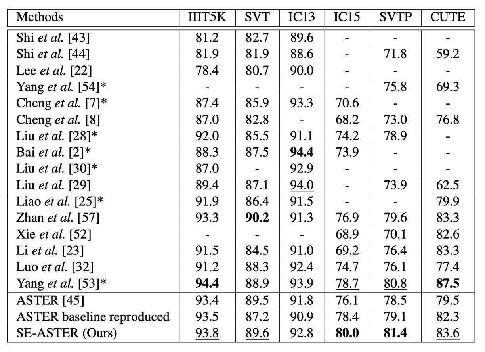

## 言語の種

[**SEED: Semantics Enhanced Encoder-Decoder Framework for Scene Text Recognition**](https://arxiv.org/abs/2005.10977)

---

視覚特徴に基づいたモデルは、すでに瓶頸に達しているようです。

では、もっと多くの言語情報を統合する可能性はあるのでしょうか？

## 問題の定義

NLP（自然言語処理）からのインスピレーションを受けて、多くの STR（Scene Text Recognition）の研究では、注意機構を使用して問題を解決し始めています。

規則的なテキストの場合、畳み込みニューラルネットワーク（CNN）と再帰的ニューラルネットワーク（RNN）に基づくエンコーダーを使用し、注意機構を組み合わせたデコーダーによって逐次的な文字予測を行います。一方、不規則なテキストには、双方向エンコーディングと 2D 注意方法を使用して処理します。

さて…

すでに NLP のアーキテクチャを模倣しているので、なぜもう少し模倣しないのでしょうか？

言語モデルの「言語」、それは良い手掛かりではないでしょうか？

本論文の著者は、追加の「意味情報」を全体的な参照として導入し、デコーディングプロセスを支援する方法を提案しています。これは STR 分野における、マルチモーダルの可能性を探索する非常に初期の研究の一つと言えます。

## 問題の解決

### モデルアーキテクチャ

<figure style={{"width": "70%"}}>

</figure>

著者は ASTER を基にして、「意味強化型 ASTER（SE-ASTER）」という方法を提案しています。上図のように。

- [**[18.06] ASTER: An Attentional Scene Text Recognizer with Flexible Rectification**](https://ieeexplore.ieee.org/document/8395027)

SE-ASTER には 4 つのモジュールがあります：

1. **補正モジュール**：不規則なテキスト画像を補正するために使用。
2. **エンコーダー**：視覚特徴を豊かに抽出するために使用。
3. **意味モジュール**：視覚特徴から意味情報を予測するために使用。
4. **デコーダー**：最終的な認識結果を出力する。

最初に、画像は補正モジュールに入力され、浅層 CNN で制御点を予測し、その後薄板スプライン（Thin-plate Splines、TPS）を使用して画像を補正します。

:::tip
TPS 補正部分については、以前の記事を参照できます：

- [**[16.03] RARE: 自動補正**](../1603-rare/index.md)
  :::

次に、補正後の画像はエンコーダーに入力され、視覚特徴を生成します。

エンコーダーは 45 層の ResNet CNN と、256 の隠れユニットを持つ BiLSTM ネットワークで構成され、出力は特徴のシーケンス$h = (h_1, \dots, h_L)$です。その形状は$L \times C$で、ここで$L$は CNN の最終層特徴マップの幅、$C$は特徴の次元です。

この出力特徴シーケンス$h$には 2 つの用途があります：

- 1 つ目：意味モジュールによる意味情報の予測
- 2 つ目：デコーダーの入力として使用

意味情報を予測するために、著者は特徴シーケンスを 1 次元の特徴ベクトル$I$に展開し、その次元は$K$です。

意味情報$S$は次の 2 つの線形関数で計算されます：

$$
S = W_2\sigma(W_1I + b_1) + b_2
$$

ここで$W_1, W_2, b_1, b_2$は訓練可能な重み、$\sigma$は ReLU 活性化関数です。意味情報は、事前に訓練された FastText モデルから提供される単語埋め込みを監督信号として使用します。

:::tip
著者は BiLSTM の最終隠れ状態$h_L$を使って意味情報を予測しようとしましたが、効果はあまり良くありませんでした。

その理由として、意味予測にはより広い特徴の文脈が必要であり、BiLSTM の出力はそれに適していないと推測されます。
:::

### 事前学習言語モデル

言語モデルの部分では、著者は FastText を事前学習された言語モデル（skip-gram ベース）として使用しています。

- [**[16.07] Enriching Word Vectors with Subword Information**](https://arxiv.org/abs/1607.04606)

$T = \{w_{i-l}, \dots, w_{i+l}\}$がテキストコーパスの文であり、ここで$l$は文の長さを示します。skip-gram モデルでは、単語$w_i$が埋め込みベクトル$v_i$で表され、単純なフィードフォワードニューラルネットワークに入力され、その目的は文脈を予測することです：

$$
C_i = \{w_{i-l}, \dots, w_{i-1}, w_{i+1}, \dots, w_{i+l}\}
$$

訓練中、埋め込みベクトル$v_i$は同期して最適化され、単語の最終的な埋め込みベクトルが意味的に類似した単語に近づくように調整されます。FastText はさらにサブワードを埋め込み、それらのサブワードを使用して単語$w_i$の最終的な埋め込みを生成します。

例えば、$l_{\text{min}} = 2$、$l_{\text{max}} = 4$、単語が「where」の場合、そのサブワード集合は$\{$wh, he, er, re, whe, her, ere, wher, here$\}$です。この単語の表現は、すべてのサブワード埋め込みベクトルとその単語埋め込みベクトルの組み合わせとして構成されます。

そのため、FastText モデルは「語彙外」（Out of Vocabulary）問題を解決することができます。

:::tip
2020 年の時点で、なぜ RoBERTa や BERT を使用しなかったのでしょうか？
:::

---

画像特徴は言語モデルによる監督の後、最終的なデコーダーの初期化入力として使用されます。このステップは非常に重要であり、アブレーション実験では、意味情報をデコーダーに組み込まない場合、モデルの性能が顕著に向上しないことが示されました。

### 損失関数

訓練中、著者は意味モジュールとデコーダーモジュールの両方に監督信号を追加し、SE-ASTER はエンドツーエンドで訓練されます。

損失関数は次のようになります：

$$
L = L_{\text{rec}} + \lambda L_{\text{sem}}
$$

ここで、$L_{\text{rec}}$は標準的な交差エントロピー損失（cross-entropy loss）で、予測確率と実際のラベルとの違いを測定します。

$L_{\text{sem}}$は意味情報のコサイン埋め込み損失（cosine embedding loss）です：

$$
L_{\text{sem}} = 1 - \cos(S, \text{em})
$$

ここで、$S$は予測された意味情報、$\text{em}$は事前学習された FastText モデルの単語埋め込みです。目的は、予測された意味情報と、事前学習された FastText モデルから得られる転写ラベル単語埋め込みとの類似度を比較することです。

$\lambda$は損失のバランスを取るためのハイパーパラメータで、ここでは 1 に設定されています。

:::tip
著者はここで単純なコサイン損失関数を使用し、対比損失は使用しなかった理由は、訓練速度を速めるためです。
:::

### 実装の詳細

事前学習された FastText モデルは公式提供のモデルを使用し、このモデルは Common Crawl と Wikipedia のデータセットで訓練されています。モデルは 97 種類のシンボルを識別でき、これには数字、大文字、小文字、32 の句読点、文の終わり符号、パディング符号、未知のシンボルが含まれます。

入力画像のサイズは 64 × 256 に調整され、アスペクト比は保持されません。最適化関数の更新には ADADELTA アルゴリズムが使用されます。

事前学習とデータ拡張なしで、モデルは SynthText と Synth90K データセットで 6 エポック訓練され、バッチサイズは 512 に設定され、学習率は初期値 1.0 から第 4 エポックで 0.1 に減衰し、第 5 エポックで 0.01 に減衰します。モデルは NVIDIA M40 GPU で訓練されました。

推論時、入力画像のサイズは訓練段階と一致させます。GRU デコーダーではビームサーチを使用し、累積スコアが最も高い$k$個の候補結果を保持し、すべての実験で$k$は 5 に設定されています。

## 討論

### 最新手法との比較

<figure style={{"width": "80%"}}>

</figure>

著者は提案した手法を以前の最先端の手法といくつかのベンチマークデータセットで比較し、その結果を上の表に示しています。

語彙なし、単語レベルのアノテーションのみの場合、SE-ASTER は 6 つのベンチマークデータセットで 2 つの最良結果と 3 つの次善結果を達成しました。他の手法と比較して、提案された方法は低品質のデータセット（IC15 や SVTP など）で優れたパフォーマンスを示しました。

SE-ASTER は IC15 で 3.9％向上（76.1％から 80.0％へ）、SVTP で 2.9％向上（78.5％から 81.4％へ）し、ASTER と比べて顕著な向上を示しました。また、SE-ASTER は比較的弱いバックボーンネットワークを使用し、文字レベルのアノテーションを使用していないにも関わらず、SVTP と IC15 で最先端の ScRN をそれぞれ 0.6％および 1.3％上回りました。

### 可視化結果

<figure style={{"width": "70%"}}>

</figure>

著者は低品質な画像を可視化しました。これにはぼやけや遮蔽などの状況が含まれ、いくつかの例を上の図に示しています。

SE-ASTER は低品質の画像に対して堅牢であることがわかります。著者は、意味情報がデコーダーに有効なグローバル特徴を提供し、画像中の干渉に対する抵抗力を高めると考えています。

:::tip
上の図にある SE-SAR は、同じアーキテクチャを SAR 論文のアーキテクチャに適用したもので、結果としても言語モデルの融合による利点が示されています。この論文は以前の記事を参照できます：

- [**[18.11] SAR: 二次元注意力マップ**](../1811-sar/index.md)
  :::

## 結論

言語モデルの導入により、STR（Scene Text Recognition）分野に新しい視点がもたらされました。SE-ASTER は複数のベンチマークデータセットで良好な結果を達成し、低品質な画像に対して堅牢性を持っています。

今後の STR 研究では、言語モデルの統合が主要なトレンドとなるでしょう。言語モデルの使用に伴う副作用は考慮する必要がありますが、現状では新興の有望な方向性であり、引き続き検討する価値があります。
