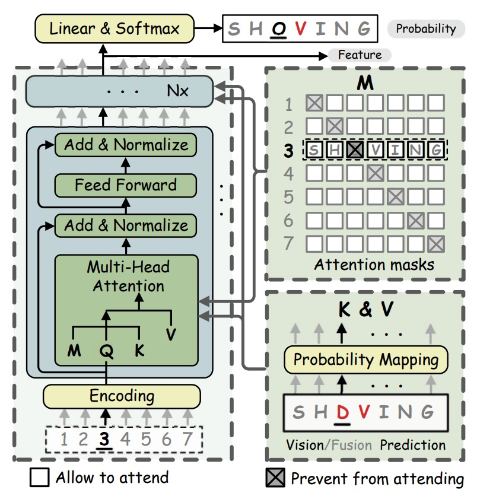
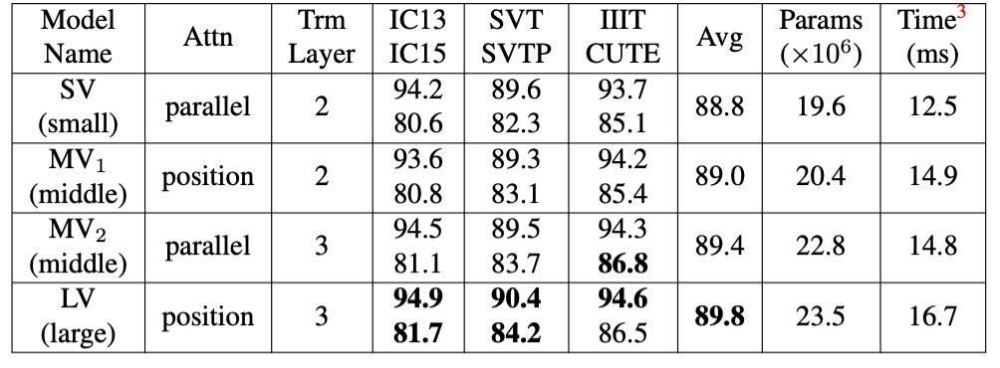
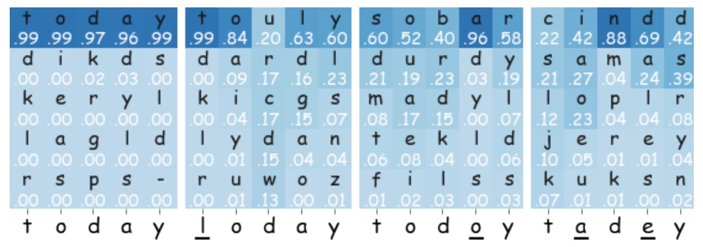

## もう一度考えてみて？

[**Read Like Humans: Autonomous, Bidirectional and Iterative Language Modeling for Scene Text Recognition**](https://arxiv.org/abs/2103.06495)

---

視覚による認識はすでに限界に達しているように見え、人々はモデルがどのように人間のように文字を理解し、読み取ることができるかを考え始めています。

## 問題の定義

これまでの多くの研究では、視覚的特徴を用いて文字認識を行っていましたが、ぼやけた文字、遮蔽された文字、または歪んだ文字に遭遇すると、モデルは困難を抱えることになります。視覚的特徴が破損してしまい、モデルは文字の特徴を見つけることができません。

この問題を解決するために、言語モデルを取り入れて、モデルが文字を理解する手助けをしようとする試みが始まっています。

例えば、ぼやけた文字「APP？E」を見た場合、私たちは言語モデルを使用して、この文字が「APPLE」であるべきだと理解することができます。

現在、人間の読書行動は次のように認識されています：

1. **自律性（Autonomous）**：視覚と言語は独立して学習でき、言語は視覚が文字を理解するのを助けることができます。
2. **双方向性（Bidirectional）**：不明確な文字は文脈から推測し、答えを見つけることができます。
3. **反復性（Iterative）**：人は何度も推論し、修正を繰り返して予測の精度を向上させます。

この論文の著者は、人間がこうしたことをできるなら、モデルもできるはずだと考えています！

1. **自律性（Autonomous）**：視覚モデルと語彙モデルを使用して、文字の視覚的特徴と語彙的特徴を独立してモデル化する。
2. **双方向性（Bidirectional）**：著者は「双方向フィルインネットワーク」タスクを提案し、文脈を通じて学習します。
3. **反復性（Iterative）**：反復的な方法で、文字予測を修正し続けます。

アイデアも、具体的な詳細も決まったので、残るは実験による有効性の証明です！

## 問題解決

著者は文字認識の問題を解決するために新しいモデルアーキテクチャである**ABINet**を提案しています。

まず、視覚モデルの部分を見てみましょう。

### 視覚モデル

<figure style={{"width": "70%"}}>

</figure>

視覚モデルは、以前よく見られたネットワークアーキテクチャのようなもので、ResNet を使って特徴抽出を行い、画像$x$を特徴表現に変換します：

$$
F_b = \tau(R(x)) \in \mathbb{R}^{\frac{H}{4} \times \frac{W}{4} \times C}
$$

ここで、$H$と$W$は画像のサイズ、$C$は特徴の次元です。

視覚的特徴$F_b$は文字の確率に変換され、並列的に転写が行われます：

$$
F_v = \text{softmax}\left(\frac{QK^T}{\sqrt{C}}\right)V
$$

**$Q \in \mathbb{R}^{T \times C}$**は、文字列の位置エンコーディング（positional encodings）を示しており、文字順序のエンコーディング行列です。これにより、モデルは文字列中の各文字の位置を理解します。具体的には、$T$は文字列の長さ、つまり処理する文字数を示し、$C$は特徴の次元であり、各位置の特徴空間を表します。

**$K = G(F_b) \in \mathbb{R}^{\frac{HW}{16} \times C}$**は、関数$G(\cdot)$を用いて$F_b$から得られる「キー」（key）であり、これを$Q$と合わせて使用します。

ここで、$F_b$は画像の特徴出力であり、$H$と$W$は画像の高さと幅です。$K$の計算を実現するために、$G(\cdot)$は小型の U-Net（mini U-Net）構造を採用しており、この構造は視覚的特徴を低次元に変換して、文字列の長さと一致するキー特徴を得ることができます。

処理後、$K$のサイズは$\frac{HW}{16} \times C$となり、これは文字順序位置エンコーディングと空間的に一致するようになっています。

**$V = H(F_b) \in \mathbb{R}^{\frac{HW}{16} \times C}$**は「値」（value）であり、$H(\cdot)$を使用して$F_b$から得られます。ここで、$H(\cdot)$は恒等写像（identity mapping）を採用しており、$F_b$の特徴をそのまま伝送します。これにより、$V$のサイズは$\frac{HW}{16} \times C$となり、$K$と同じ特徴空間および空間分解能を持ちます。

:::tip
簡単に言うと、位置クエリを通じて、画像特徴を対応する文字の予測確率に変換し、モデルは文字の順序位置情報と画像特徴を基に、正確な認識を行うことができるようになります。
:::

### 言語モデル

視覚モデルはすでに見終わりましたので、著者は次に言語モデルを接続しています。ここにはいくつかの重要な戦略があります：

1. **自律戦略（Autonomous Strategy）**：

   上図のように、言語モデルは独立したスペル修正モデルとして扱われ、文字の確率ベクトルを入力として、予想される文字の確率分布を出力します。この設計により、言語モデルは未ラベルのテキストから独立して学習でき、またモデルの解釈性と単位化が高まり、さらに他の事前訓練された言語モデルに置き換えて性能を向上させることも可能です。

   言語モデルの独立性を確保するために、著者は入力ベクトルの勾配フローを遮断する（BGF）手法を提案しました。これにより、視覚モデルから言語モデルへの勾配フローを防ぎ、言語モデルの独立性が保証されます。

   この戦略の利点は、自然言語処理（NLP）の技術を導入できることであり、ここでは他の事前訓練された言語モデルに自由に切り替えることで性能を向上させることができます。

2. **双方向戦略（Bidirectional Strategy）**：

    

    <figure style={{"width": "60%"}}>
    
    </figure>
    

   言語モデルの条件付き確率は、双方向と単方向の表現に分かれます。それぞれ、$P(y_i | y_n, \dots, y_{i+1}, y_{i-1}, \dots, y_1)$ と $P(y_i | y_{i-1}, \dots, y_1)$ です。したがって、双方向モデルはより豊かな意味情報を提供できます。

   例えば、BERT のマスク付き言語モデル（Masked Language Model, MLM）では、予測すべき文字$y_i$を`[MASK]`で置き換えます。しかし、MLM をそのまま使用すると効率が非常に低いため、各文字列に対して$ n $回のマスク操作を繰り返して逐次的に予測を行う必要があります。効率を高めるために、著者は双方向フィルインネットワーク（BCN）を提案し、何度もマスクを行う MLM の代わりに使用することで、より高い効率を実現しました。

   BCN は、従来の Transformer のデコーダ構造を採用していますが、いくつかの点が異なります。BCN は、文字ベクトルをネットワークの最初の層に入力するのではなく、直接多頭注意モジュールに入力します。文字が「自分自身を見ないようにする」ために、多頭注意モジュールの中で注意マスクが特別に設計され、文字間の情報漏洩を防ぎます。

   BCN の多頭注意ブロックにおけるマスク行列$M$の構成は以下のようになります：

   $$
   M_{ij} =
   \begin{cases}
     0, & i \neq j \\
     -\infty, & i = j
   \end{cases}
   $$

   $K_i = V_i = P(y_i) W_l$、ここで$P(y_i) \in \mathbb{R}^c$は文字$y_i$の確率分布を示し、$W_l \in \mathbb{R}^{c \times C}$は線形マッピング行列です。

   多頭注意の計算式は次のように表されます：

   $$
   F_{\text{mha}} = \text{softmax}\left(\frac{QK^T}{\sqrt{C}} + M\right)V
   $$

   ここで、$Q \in \mathbb{R}^{T \times C}$は最初の層の文字列位置エンコーディングを示し、その後の層では前の層の出力結果です。$K, V \in \mathbb{R}^{T \times C}$は文字の確率$P(y_i)$の線形変換から得られます。

   BCN はクロスワード（cloze）型の注意マスクを設定することで、単方向モデルよりも完全な意味情報を捉え、より強力な双方向表現を学習することができます。

   :::tip
   ここではいくつかの重要なポイントがあります：

   1. デコーダを使用していますが、因果マスク（causal mask）を使用せず、並列デコーディングを行います。
   2. `[MASK]`マスクを使用せず、代わりに対角線を$-\infty$に設定したマスク行列を使用して、モデルの効率を向上させています。
      :::

3. **反復戦略（Iterative Strategy）**：

   著者は、Transformer の並列予測において、視覚モデルからのノイズ入力が予測信頼度を低下させる問題に対処するため、反復的修正（Iterative Correction）の戦略を提案しています。最初のイテレーションでは、$y_{i_1}$は視覚モデルの確率予測です。その後のイテレーションでは、$y_{i \geq 2}$は前回の融合モデルの予測から来ます。

   :::tip
   これは、複数の Transformer 層を使うという意味であり、著者はこれを「反復的」修正と呼んでいます。
   :::

4. **融合（Fusion）**

   視覚モデルは画像データで訓練され、言語モデルはテキストデータで訓練されています。この 2 つは本質的に異なるモーダルの情報です。そのため、視覚特徴と言語特徴を相互に整合させるためには、これら 2 つのモーダル特徴を組み合わせるメカニズムが必要です。最終的な融合を実現するために、著者は「ゲートメカニズム（gated mechanism）」を使用し、これにより 2 つのモーダル特徴の影響を効果的にバランスし、最終的な出力特徴を決定します。

   まず、視覚特徴$F_v$と語彙特徴$F_l$を結合（concatenate）し、その後、線形変換行列$W_f \in \mathbb{R}^{2C \times C}$を使って結合後の特徴を$F_v$と$F_l$と同じ次元に圧縮します。

   ゲートベクトル$G$は次の式で計算されます：

   $$
   G = \sigma([F_v, F_l] W_f)
   $$

   ここで、$\sigma$は Sigmoid 関数を示し、ゲートベクトル$G$の値を$[0, 1]$の範囲に制限します。これにより、$G$は最終的な出力における視覚特徴と語彙特徴の重みを調整する役割を果たします。

   最終的な融合特徴$F_f$は、ゲートメカニズムを通じて、$F_v$と$F_l$を加重平均して得られます：

   $$
   F_f = G \odot F_v + (1 - G) \odot F_l
   $$

   ここで、$\odot$は要素ごとの積（element-wise multiplication）を示します。$G$は$F_v$と$F_l$の加重比率を制御します。例えば、$G$が 1 に近いと、視覚特徴$F_v$の影響が大きくなり、逆に$G$が 0 に近いと、語彙特徴$F_l$の影響が大きくなります。

5. **教師あり学習**

   ABINet の訓練はエンドツーエンドの多目的損失関数を採用しており、視覚特徴、語彙特徴、及び融合特徴の損失を組み合わせてモデルの最適化を行います。

   具体的な損失関数は次のように表されます：

   $$
   L = \lambda_v L_v + \frac{\lambda_l}{M} \sum_{i=1}^{M} L_l^i + \frac{1}{M} \sum_{i=1}^{M} L_f^i
   $$

   ここで：

   - **$L_v$**：視覚特徴$F_v$のクロスエントロピー損失。
   - **$L_l$**：語彙特徴$F_l$のクロスエントロピー損失。
   - **$L_f$**：融合特徴$F_f$のクロスエントロピー損失。
   - **$L_l^i$**と**$L_f^i$**：それぞれ、$i$回目のイテレーションでの語彙特徴損失と融合特徴損失。
   - **$\lambda_v$**と**$\lambda_l$**：重み付け係数で、それぞれの損失項の影響を調整し、視覚特徴と言語特徴が訓練においてバランスよく貢献するようにします。

### 実装の詳細

- **訓練データセット**：合成データセットの MJSynth (MJ)と SynthText (ST)を使用してモデルを訓練。
- **テストデータセット**：6 つの標準ベンチマークデータセット：ICDAR 2013 (IC13)、ICDAR 2015 (IC15)、IIIT 5K-Words (IIIT)、Street View Text (SVT)、Street View Text-Perspective (SVTP)、CUTE80 (CUTE)。
- **半教師あり学習の未ラベルデータ**：Uber-Text データセット（ラベルなし）を使用して半教師あり学習の効果を評価。
- **モデル設定**：モデルの次元$C$は 512、BCN は 4 層、各層には 8 個の注意頭が含まれます。重み付け係数$\lambda_v$と$\lambda_l$は 1 に設定。
- **画像前処理**：画像を 32×128 にリサイズし、データ拡張（幾何変換、画質の低下、色の揺れなど）を行う。
- **訓練環境**：4 つの NVIDIA 1080Ti GPU を使用、バッチサイズは 384。最適化器には ADAM を使用、初期学習率は 1e-4 で、6 エポック後に 1e-5 に減衰。

## 討論

### 他の手法との比較

<figure style={{"width": "85%"}}>

</figure>

厳密で公平な比較を行うために、著者は SOTA アルゴリズム SRN を再現し、ABINet と同じ実験設定を共有しました。再現した 2 つの SRN バージョンは、それぞれ異なる視覚モデル（VM）を使用し、VM の交換、マルチスケール訓練の副作用の除去、学習率の減衰適用などの改良が行われました。元の SRN の報告と比較して、性能が向上しました。

- **ABINet-SV と SRN-SV の比較**：ABINet-SV は、複数のデータセットで SRN-SV より優れた性能を示しました。
- **ABINet-LV の性能**：より強力な VM を組み合わせた ABINet-LV も優れた性能を発揮しました。

ABINet は、MJ および ST で訓練された場合、特に SVT、SVTP、IC15 などのデータセットで優れた性能を示しました。これらのデータセットには低品質な画像（ノイズやぼやけた画像）が多く含まれており、視覚モデルには認識が難しい場合が多いですが、ABINet は言語情報の補完により、認識精度が大幅に向上しました。

ABINet は不規則なフォントや非標準のレイアウトの文字を成功裏に認識でき、これは主に視覚的特徴に対する言語情報の重要な補完効果によるものです。画像補正がなくても、ABINet は CUTE データセットで次点の性能を示し、不規則なテキストに対して良好な認識能力を発揮しました。

### 消融実験 - 視覚モデル

<figure style={{"width": "80%"}}>

</figure>

ここでは、異なる特徴抽出とシーケンスモデリング手法を比較しています。

一般的な並列注意機構と比べ、著者が提案した「位置注意」は、キー・バリューのベクトル表現においてより表現力があります。

また、視覚モデルのアップグレードは精度を大幅に向上させることができますが、その代償としてパラメータと計算コストが増加します。視覚モデル（VM）をアップグレードするために、特徴抽出に位置注意を使用し、シーケンスモデリングにより深い Transformer 層を使用することができます。

### 消融実験 - 言語モデル

<figure style={{"width": "80%"}}>

</figure>

- **PVM**：MJ および ST データセット上で監督学習で視覚モデル（VM）を事前訓練した場合。
- **$\text{PLM}_{in}$**：MJ および ST データセット上で自己監督学習で言語モデル（LM）を事前訓練した場合。
- **$\text{PLM}_{out}$**：WikiText-103 データセット上で自己監督学習で言語モデルを事前訓練した場合。
- **AGF（許可された勾配フロー）**：視覚モデルと言語モデル間で勾配フローを許可する場合。

---

監督学習の文脈で VM（PVM）を事前訓練することで、平均して 0.6%-0.7%の精度向上が見られ、視覚モデルの事前訓練が視覚認識の性能を効果的に強化することが示されました。

$\text{PLM}_{in}$の効果は小さく、これはこれらのデータセットのテキストデータが多様性や言語構造に欠けており、十分な言語情報を提供できなかったためと考えられます。

$\text{PLM}_{out}$の効果はさらに優れており、この大規模なコーパスは LM が文字の文脈を理解する能力を大きく向上させ、精度の高いモデルでもさらに性能を向上させることができました。

AGF を有効にすると、平均精度が 0.9%低下し、訓練損失が急速に低い値に収束することが観察されました。これは、言語モデルが過学習している可能性を示しており、勾配フローを遮断することで言語モデルが独立して学習でき、モデルの一般化能力が向上することが確認されました。

### 消融実験 - 双方向戦略

<figure style={{"width": "80%"}}>

</figure>

BCN は Transformer に基づく変種であるため、類似の SRN と比較が行われました。

公平性を保つため、実験は同じ条件下で行われ、唯一の違いは使用されるネットワーク構造です。著者は SV と LV を視覚モデル（VM）として使用し、BCN が異なる精度レベルでの効果を検証しました。

- **BCN vs. SRN-U**：BCN は SRN の単方向バージョン（SRN-U）とパラメータ数および推論速度はほぼ同じですが、BCN は異なる視覚モデルで常に競争力があり、より高い精度を示しました。
- **BCN vs. 双方向 SRN**：双方向統合 SRN と比較して、BCN は IC15 や CUTE などの難易度の高いデータセットで優れたパフォーマンスを発揮しました。さらに、BCN を搭載した ABINet は SRN より 20%-25%速く、大規模なタスクにおいて実用的な価値があります。

### 可視化分析

<figure style={{"width": "80%"}}>

</figure>

ABINet における BCN の動作を理解するために、著者は「today」の予測確率上位 5 つを示す図を示しました。

- 入力が「-oday」や「tod-y」の場合、BCN は「t」と「a」を高い信頼度で予測し、最終的な融合予測に良い貢献をしました。
- 「l」と「o」の誤った文字に対して、BCN の信頼度は低く、最終予測への影響も小さいです。
- 複数の誤った文字がある場合、BCN は正しいテキストを復元することが難しく、十分な文脈サポートが欠けているためです。

## 結論

本論文は、文字認識モデルにおいて言語モデルの分岐を導入しました。自律性、双方向性、反復的設計を通じて、ABINet は文字認識の精度と一般化能力を効果的に向上させることができました。実験結果は、ABINet が複数のベンチマークデータセットで優れたパフォーマンスを示し、不規則なテキストや低品質な画像で顕著な優位性を持つことを示しています。

:::tip
これは実際には初期の文字認識モデルと似ており、過去の文字認識モデルでは、結果が「辞書」で最も近い文字にマッチングされていました。ただし、CRNN 以降、このような設計はほとんど使用されなくなりました。なぜなら、「辞書」はモデルと共に訓練できず、辞書の規模に制限があるため、文字出力の多様性が制限されていたからです。

今、再びこの設計に戻ってきたわけですが、今回は言語モデルを使って文字を理解する手助けをしています。

言語モデルは一緒に訓練できるという点が大きな利点ですが、過去の「辞書」方式と同様に、言語モデルの訓練データは限られており、車のナンバープレートや文書番号などの意味のない文字に関しては、言語モデルが役立たない場合があります。また、言語モデルの影響で二重の意味や語呂合わせの誤認識が起こる可能性もあります。

言語モデルの統合にはこのような欠点があるものの、それでも非常に重要な試みであり、今後数年間で文字認識分野における多くの研究が言語モデルに関わることでしょう。この分野の発展には今後も注目していきます。
:::
