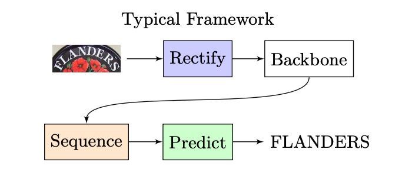
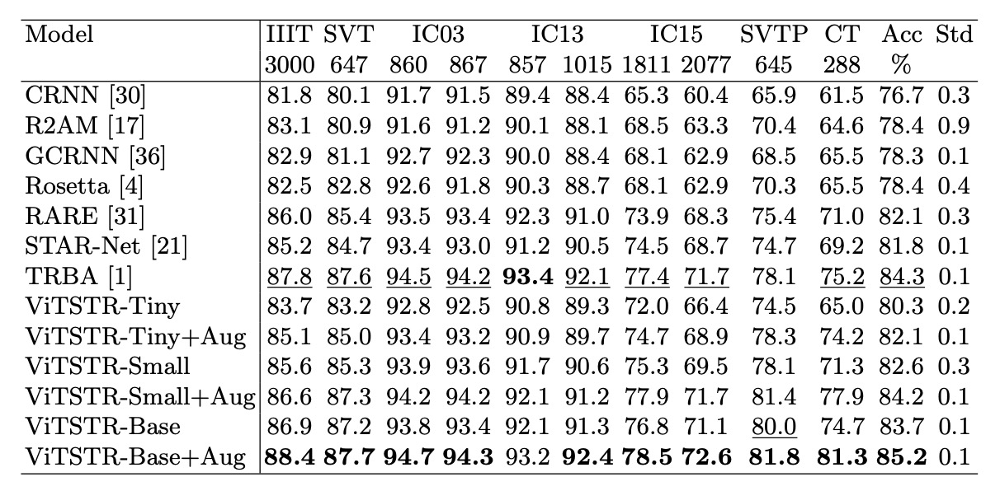

## エンコーダだけで十分

[**Vision Transformer for Fast and Efficient Scene Text Recognition**](https://arxiv.org/abs/2105.08582)

---

ViT アーキテクチャはすでに広く知られていますが、STR（シーンテキスト認識）の分野では、まだ標誌的な使用例が不足しているようです。

## 問題の定義

昔ながらの STR アーキテクチャを振り返ると、おおよそ以下のような構造になります：

<figure style={{"width": "60%"}}>

</figure>

入力画像が CNN で特徴抽出され、その後 LSTM に渡されてシーケンス解読が行われ、最終的に予測モジュールを通じて最終的な予測結果が得られます。

Transformer アーキテクチャが提案されると、研究者たちはこのアーキテクチャをこの分野にも適用し始め、全体的な構造は次のように進化しました：

<figure style={{"width": "60%"}}>

</figure>

エンコーダ部分は CNN や Transformer、あるいはその他のアルゴリズムでも構いませんが、デコーダ部分は一貫して Transformer デコーダに置き換えられました。

なぜなら、自己回帰的に推論を行うかどうかに関わらず、少なくとも訓練時には並列処理が可能で、前のタイムステップの結果を待つ必要がないため、効率を大幅に向上させることができます。

著者は、すでに Transformer を使用しているのであれば、なぜエンコーディング後に直接結果を出力しないのでしょうか？

隣の ViT を見てみましょう。ViT はまさにそのように設計されていますよね？

- [**[20.10] ViT: 新世界の開拓者**](../../vision-transformers/2010-vit/index.md)

私たちはアーキテクチャを次のように変更するだけです：

<figure style={{"width": "60%"}}>

</figure>

このように変更することで、デコーダを一つ減らし、パラメータ数を削減でき、自己回帰の問題も考慮する必要がありません。これにより、より速く、より効果的にできるのではないでしょうか？

その良さは実験で検証する必要があります。

## 問題の解決

### モデルアーキテクチャ

著者は ViTSTR という ViT ベースの STR モデルを提案しています。主な違いは予測ヘッドにあります。ViT は単一オブジェクトの分類に使用され、ViTSTR は複数の文字を認識するために使用され、正しい文字順序と長さを考慮する必要があります。

入力画像の次元は $x \in \mathbb{R}^{H \times W \times C}$ であり、$H$と$W$は画像の高さと幅、$C$はチャンネル数です。画像は、平坦化された 2D のカバレッジ領域で構成されたシーケンス $x_p \in \mathbb{R}^{N \times P^2C}$ に再整形され、カバレッジ領域のサイズは$P \times P$、シーケンスの長さは$N$です。

平坦化された画像領域は次元$D$の埋め込みに変換され、これは線形投影によって実現され、学習可能なクラス埋め込み（つまり$\text{[GO]}$トークン）と位置エンコーディングを加算して入力エンコーダのベクトルを形成します。

ViTSTR は学習可能な位置エンコーディングを使用し、出力時には文字列の長さに対応する特徴ベクトルを抽出し、2 つのトークン（テキストの開始を示す$\text{[GO]}$トークンと終了を示す$[s]$トークン）を加えます。

:::tip
これはまさに ViT です。

計算の詳細は、Transformer のアーキテクチャと同様で変更はなく、ここでは省略します。
:::

### モデル訓練設定

著者は 3 つの異なるモデル設定を使用しました。これらは ViTSTR-Tiny、ViTSTR-Small、ViTSTR-Base で、各モデルのエンコーダは同じですが、エンコーダの深さと次元が異なります。

訓練設定パラメータは以下の通りです：

著者は、ViTSTR と公平に比較するために、CRNN、R2AM、GCRNN、Rosetta、RARE、STAR-Net、TRBA など、いくつかの強力なベンチマークモデルを再作成しました。

各モデルは少なくとも 5 回訓練され、異なるランダムシードを使用して、テストデータセットで最良の結果を示す重みを保存し、平均評価スコアを得ました。

ViTSTR は DeiT の事前訓練された重みを使用し、入力画像のサイズは$224 \times 224$に調整されています。これは DeiT 事前訓練モデルの次元要求に合わせるためで、訓練中にはパラメータは凍結されていません。

:::tip
一般的に、テキスト認識の入力画像のサイズは$32 \times 100$であることが多いですが、ここで著者は$224 \times 224$の画像サイズを使用しており、少し無駄に感じます。
:::

## 討論

### 他のモデルとの比較

訓練時には RandAugment による画像強化技術が使用され、反転、曲げ、ぼかし、ノイズ、歪み、回転、引き伸ばし、圧縮、透視、縮小が適用されました。以下に示す通りです：

比較では、強化した場合と強化しなかった場合の効果も同時に比較しました：

ViTSTR-Tiny では精度が 1.8%向上し、ViTSTR-Small では 1.6%、ViTSTR-Base では 1.5%向上しました。

不規則なデータセットでは、精度の向上が最も顕著でした：

| データセット | ViTSTR-Tiny (%) | ViTSTR-Small (%) | ViTSTR-Base (%) |
| ------------ | --------------- | ---------------- | --------------- |
| CT           | +9.2            | +6.6             | +6.6            |
| SVTP         | +3.8            | +3.3             | +1.8            |
| IC15 1,811   | +2.7            | +2.6             | +1.7            |
| IC15 2,077   | +2.5            | +2.2             | +1.5            |

### パフォーマンス損失

シーンテキスト認識モデルでは、新しい段階を追加するたびに、精度は向上しますが、速度が遅くなり、計算要求が増加します。例えば、RARE モデルから TRBA にアップグレードすると、精度は 2.2%向上しましたが、3880 万個のパラメータが追加され、1 枚の画像の処理時間が 4 ミリ秒遅くなります。

CTC 段階を Attention に置き換える（STAR-Net から TRBA にアップグレードする）と、計算時間は 1 枚の画像あたり 8.8 ミリ秒から 22.8 ミリ秒に増加し、精度は 2.5%しか向上しません。実際、CTC を Attention に置き換えると、BiLSTM や TPS などの段階を追加するよりも顕著に速度が低下し、10 倍以上遅くなります。

ViTSTR モデルでは、tiny バージョンから small バージョンにアップグレードする際、埋め込みサイズと多頭数が増加しますが、追加の段階は必要ありません。このアップグレードにより精度が 2.3%向上し、1610 万個のパラメータが追加されました。

tiny バージョンから base バージョンにアップグレードすると、精度が 3.4%向上し、パラメータ数が 8040 万増加しました。

パラメータ数が増加しても、ViTSTR の処理速度はほとんど変わりません。これは、エンコーダ内の MLP と MSA 層が同じ並列計算操作（テンソル積、softmax、加算）を使用し、単にテンソルの次元が増加するだけであるため、1 枚の画像の処理時間が 0.2 から 0.3 ミリ秒しか増加しません。

複数段階の STR モデルと異なり、新しいモジュールを追加すると、通常、順序層が必要であり、前向き伝播で並列処理ができず、パフォーマンス損失が顕著になります。これに対して、ViTSTR のアップグレードは次元の増加のみを含み、パフォーマンス損失が少ないです。

## 結論

ViTSTR は、精度、速度、計算要求のバランスを強調するシンプルな単一段階のモデルアーキテクチャです。STR のデータ増強を通じて、ViTSTR は精度を大幅に向上させ、特に不規則なデータセットに対して優れた性能を示します。スケールアップ時には、ViTSTR は精度、速度、計算要求のバランスを保ちつつ優れたパフォーマンスを維持します。

:::tip
もし DeiT の事前訓練重みを使用せず、特徴マップのサイズを$32 \times 100$にして、ゼロから訓練した場合、どのような結果が得られるかはわかりません。

時間があれば試してみたいですね。
:::
