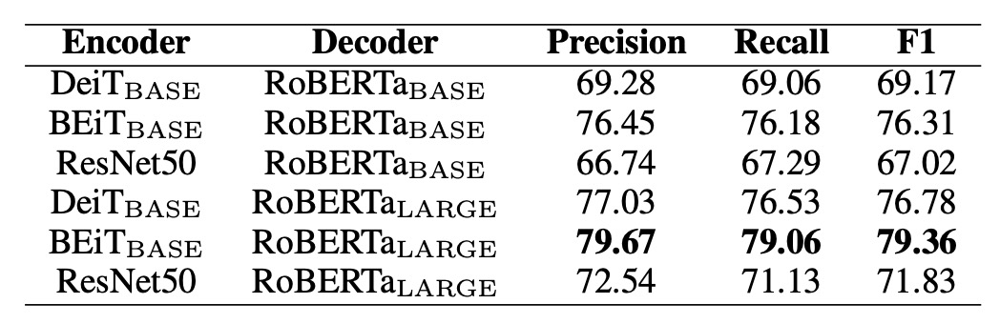

# [21.09] TrOCR

## 事前訓練が正義

[**TrOCR: Transformer-based Optical Character Recognition with Pre-trained Models**](https://arxiv.org/abs/2109.10282)

---

これはシンプルで分かりやすい論文です。この分野に初めて触れる開発者は、ぜひこの論文から始めてみてください。

## 問題の定義

現在のほとんどの方法は、依然として CNN を主幹としており、文字画像の理解能力を向上させるために Transformer の自己注意機構を追加しています。認識精度を向上させるために、通常はデコーダーに CTC（接続時系列分類）と外部の言語モデルを追加します。

これらの方法は一定の効果を上げていますが、既存のほとんどのモデルはネットワークパラメータを最初から訓練しており、大規模な事前訓練された CV（コンピュータビジョン）および NLP（自然言語処理）モデルを十分に活用していません。

そのため、この論文の著者は、OCR タスクを実行するためにどのように事前訓練されたモデルを活用すべきかを示しています。

:::tip
多くの実験結果は、最初から訓練したモデルの方が効果が良いことを示しており、OCR の分野で事前訓練モデルを使用しても顕著な改善はないと考える学者もいます。
:::

## 問題の解決

### モデルアーキテクチャ

<figure style={{"width": "85%"}}>

</figure>

TrOCR モデルは、画像とテキストの Transformer の 2 つの部分で構成されています。

:::tip
このアーキテクチャは非常に基本的なものであり、基本的な Transformer アーキテクチャの説明は行いません。もし Transformer アーキテクチャに不慣れな場合は、以前の記事を参照してください：

- [**[17.06] Transformer: 新世界の起点**](../../transformers/1706-transformer/index.md)
- [**[20.10] ViT: 新世界の開拓者**](../../vision-transformers/2010-vit/index.md)
  :::

従来の文字認識モデルとは異なり、著者はここで CNN のバックボーンを使用せず、ViT に従った方法で入力画像を$384 \times 384$に調整し、$16 \times 16$の小さなパッチに分割してから画像エンコーダに入力します。このエンコーダとデコーダは標準的な Transformer アーキテクチャに基づいており、出力は処理された wordpiece 単位として認識されたテキストになります。

訓練中、画像エンコーダは ViT スタイルの事前訓練モデルから初期化されます。これは ViT または DeiT である可能性があります。同様に、デコーダは BERT スタイルの事前訓練モデルで初期化することができ、BERT や RoBERTa が使用されます。

:::tip
ここでの重要なポイントをいくつか挙げておきます：

1. **どのアーキテクチャを使用すべきかを心配する必要はありません。ViT と BERT の事前訓練モデルを使えば十分です。**
2. **出力形式は通常の文字ではなく、wordpiece 単位として出力されます。**

もしこれらの事前訓練モデルについて詳しくない場合は、以前読んだ記事を参照してください：

- [**[18.10] BERT: 十二層エンコーダ**](../../transformers/1810-bert/index.md)
- [**[19.07] RoBERTa: BERT のトレーニングの説明書**](../../transformers/1907-roberta/index.md)
- [**[20.12] DeiT: 蒸留後はより芳香が増す**](../../vision-transformers/2012-deit/index.md)
- [**[21.06] BEiT: 離散エンコーディングによる事前学習**](../../vision-transformers/2106-beit/index.md)
  :::

### 訓練戦略

- **第一段階**

  事前訓練の第一段階では、公開されている PDF ファイルからランダムに 200 万ページを抽出し、これらの PDF をページ画像に変換し、各行のテキストから 684M の文字列画像を生成しました。これらの PDF は「デジタル生成」であるため、テキスト画像の鮮明さが保証されています。

- **第二段階**

  次に、オープンソースのテキスト生成器 TRDG と 5,427 種類の手書きフォントを使用して手書き文字列画像を合成し、テキスト内容はランダムに取得した Wikipedia ページから取られています。この段階で生成された手書きデータセットには、17.9M 行のテキストが含まれており、IIIT-HWS データセットも含まれています。

  さらに、著者は約 53K 枚の領収書画像を収集し、商用 OCR エンジンを使ってテキストを認識し、テキストの位置に基づいて画像をトリミングし正規化しました。

  最後に、TRDG を使用して約 100 万行の領収書フォントと組み込みフォントを持つ印刷テキスト画像を生成し、最終的な印刷データセットには 3.3M 行のテキストが含まれています。

  シーンテキストの場合、第二段階では MJSynth と SynthText データセットを使用し、合計で約 16M 枚のテキスト画像が作成されました。

  :::tip
  TRDG は、OCR モデルの訓練用に合成されたテキスト画像を作成するためのオープンソースのテキスト画像生成器です。

  こちらから関連リソースをご覧いただけます：[**TextRecognitionDataGenerator**](https://github.com/Belval/TextRecognitionDataGenerator)
  :::

### パラメータ設定

TrOCR の画像分岐は DeiT と BEiT モデルを使用し、テキスト分岐は RoBERTa モデルを使用しています。

DeiT モデルは`timm`パッケージからコードと事前訓練されたモデルが提供され、BEiT と MiniLM モデルは UniLM の公式ライブラリから、RoBERTa モデルは Fairseq の GitHub リソースページから取得されます。

:::tip
`timm`は非常に有名な PyTorch のモデルライブラリで、さまざまな事前訓練されたモデルの実装を提供しています。

関連リソースはこちら：[**pytorch-image-models**](https://github.com/huggingface/pytorch-image-models)
:::

訓練は 32 台の V100 GPU で事前訓練を行い、8 台の V100 GPU で微調整を行いました。すべてのモデルのバッチサイズは 2,048 に設定され、学習率は$5 \times 10^{-5}$に設定されました。

次に、いくつかの詳細なパラメータを示します：

- **解像度とパッチサイズ**：DeiT および BEiT エンコーダは$384 \times 384$の画像解像度を使用し、パッチサイズは$16 \times 16$です。
- **エンコーダ構造**：
  - $\text{DeiT}_{\text{SMALL}}$: 12 層、384 次元の隠れ層、6 つの注意ヘッド。
  - $\text{DeiT}_{\text{BASE}}$および$\text{BEiT}_{\text{BASE}}$: 12 層、768 次元の隠れ層、12 の注意ヘッド。
  - $\text{BEiT}_{\text{LARGE}}$: 24 層、1024 次元の隠れ層、16 の注意ヘッド。
- **デコーダ構造**：
  - 小型デコーダ：6 層、256 次元の隠れ層、8 つの注意ヘッド。
  - 基本デコーダ：512 次元の隠れ層。
  - 大型デコーダ：12 層、1024 次元の隠れ層、16 の注意ヘッド。

## 討論

### エンコーダとデコーダの組み合わせ

たくさんのエンコーダとデコーダの組み合わせから、どれが最適かという問題があります。

著者はここでいくつかの実験を行い、異なるエンコーダとデコーダの組み合わせを比較しました。実験は SROIE データセットを基に行われ、結果は以下の表に示されています：

<figure style={{"width": "80%"}}>

</figure>

エンコーダについては、DeiT、BEiT、および ResNet-50 がテストされ、デコーダについては RoBERTa が使用されました。

結果として、BEiT エンコーダは 3 種類のエンコーダの中で最も優れており、RoBERTa$_{\text{LARGE}}$デコーダも最良のパフォーマンスを示し、視覚タスクにおける事前訓練モデルが文字認識の性能向上に寄与することが分かりました。

この結果に基づき、著者は次の 3 つの主要設定を選んで後続の実験を行いました：

- **TrOCR$_{\text{SMALL}}$**：DeiT$_{\text{SMALL}}$エンコーダと MiniLM デコーダを使用（62M パラメータ）。
- **TrOCR$_{\text{BASE}}$**：BEiT$_{\text{BASE}}$エンコーダと RoBERTa$_{\text{LARGE}}$デコーダを使用（334M パラメータ）。
- **TrOCR$_{\text{LARGE}}$**：BEiT$_{\text{LARGE}}$エンコーダと RoBERTa$_{\text{LARGE}}$デコーダを使用（558M パラメータ）。

### SROIE の性能比較

<figure style={{"width": "70%"}}>

</figure>

上の表は、TrOCR モデルと SROIE データセット上の最先端(SOTA)モデルの比較結果を示しています。

言語モデルに関して、MSO Lab と CLOVA OCR は LSTM 層を使用し、H&H Lab は GRU 層を使用、TrOCR モデルは純粋な注意機構を使用した Transformer デコーダを採用しています。

TrOCR モデルはこのタスクで既存の SOTA モデルを上回り、複雑な前処理や後処理ステップなしで優れたパフォーマンスを発揮しました。

### IAM の性能比較

<figure style={{"width": "85%"}}>

</figure>

上の表は、TrOCR モデルと IAM 手書きデータベース上の既存方法との比較結果を示しています。

結果によると、CTC デコーダを使用したモデルはこのタスクで良好なパフォーマンスを示し、外部言語モデル（LM）が文字誤り率（CER）を大幅に削減しました。TrOCR と他の方法を比較すると、Transformer デコーダは CTC デコーダよりも競争力があり、外部 LM なしでの言語モデル化が可能であることがわかりました。

### STR の性能比較

<figure style={{"width": "85%"}}>

</figure>

TrOCR モデルは、合成データのみで微調整した場合、または合成データと基準データセット（IC13、IC15、IIIT5K、SVT 訓練セット）を使って微調整した場合のパフォーマンスを、既存の主流および最新の SOTA 手法と比較した結果です。

TrOCR モデルは 8 つの実験のうち 5 つで新しい SOTA 結果を達成し、残りの結果も優れたパフォーマンスを示しました。

:::info
IIIT5K データセットで TrOCR モデルのパフォーマンスが良くなかったことに関して、著者は分析を行い、いくつかのシーンテキストサンプル画像にシンボルが含まれているが、実際のアノテーションデータにはこれらのシンボルが含まれていないことを発見しました。このことが事前訓練データのアノテーション規約（シンボルを保持）と一致しないため、モデルがシンボルを処理する傾向があることが原因と考えられます。
:::

## 結論

TrOCR は過去の多くの研究と異なり、事前訓練されたモデルの使用が特徴です。

著者は事前訓練されたモデルの利点を十分に活用し、従来の CNN アーキテクチャへの依存を避け、モデルの複雑さを減らし、計算効率を向上させました。実験結果は、単純なエンコーダ-デコーダアーキテクチャのみで、TrOCR がさまざまな OCR タスクで最新技術レベルを達成できることを示しており、OCR アプリケーションにおける事前訓練された Transformer モデルの潜在能力と有効性を示しています。
