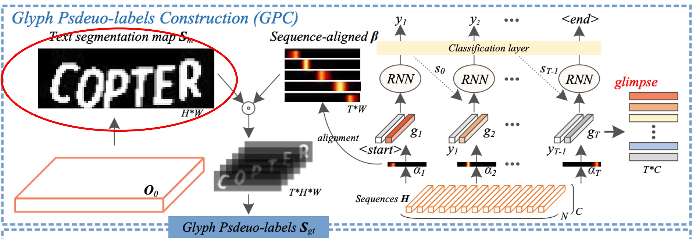
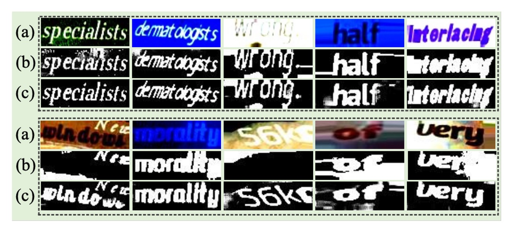
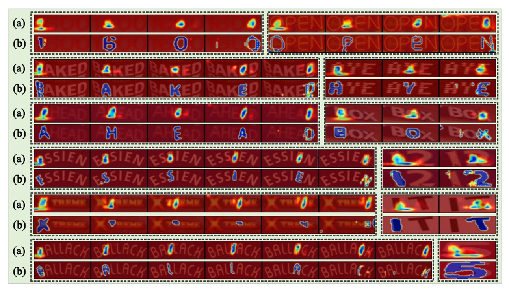

## グリフ アテンション メカニズム

[**Self-supervised Implicit Glyph Attention for Text Recognition**](https://arxiv.org/abs/2203.03382)

---

言語モデルの導入はこの分野で主流の手法となっていますが、それでも STR の問題を改善するために新たなアプローチを取ろうとする研究者もいます。

この論文では、著者が「字形」に関する一連の研究を試み、かなり良い結果を得たことを報告しています。

## 問題の定義

STR に関する論文は、私たちもいくつか見てきました。

過去の研究では、注意力を用いた方法は大きく分けて二つのカテゴリに分類されます：

1. **暗黙的注意力（Implicit Attention）**：これは、シーケンスレベルの文字ラベルを使用して、1 次元または 2 次元空間のすべての位置に対して注意重みの計算を行う方法です。この方法の欠点は、整列のずれ（アライメントドリフト）問題が発生する可能性があることです。
2. **教師あり注意力（Supervised Attention）**：文字の境界ボックスのラベルを利用して、文字分割マップを生成する方法です。この方法の欠点は、膨大な文字レベルのラベル付きデータが必要であり、また大量の文字クラスに直面した際にメモリを大量に消費することです。

どうやら、どちらの方法にも欠点があるようです。

そこで著者は、「字形」の観点からこの問題を考えることにしました。各文字には独自の字形があり、その字形同士の関係にも規則性が存在します。この規則を利用すれば、文字の特徴をより良く見つけることができるかもしれません。

このアイデアに基づいて、著者は「自己監督型暗黙的字形注意力（Self-Supervised Implicit Glyph Attention, SIGA）」を提案しました。この方法は、自己監督型のテキストセグメンテーションと暗黙的注意力の整列を通じて字形構造を生成し、訓練過程で注意力の精度を向上させることができます。

つまり、著者は上記の二つの解決策のうち、暗黙的注意力のアプローチを選び、それに自己監督型のメカニズムを組み合わせました。

具体的には、どのように実現されたのでしょうか？次に進んで詳しく見ていきましょう。

## 解決問題

### モデルアーキテクチャ

上図は SIGA のモデルアーキテクチャです。

全体のアーキテクチャは少し複雑ですが、いくつかの部分に分けて説明します。

### Backbone

ここはおそらく最も問題が少ない部分です。この部分では ResNet や ViT を特徴抽出器として使用できます。

入力画像は特徴抽出器を通過した後、特徴マップとして出力され、この特徴マップは後続の分岐に送られます。

### 字形仮ラベルの構築

<figure style={{"width": "80%"}}>

</figure>

原文では Glyph Pseudo-label Construction（GPC）と呼ばれる部分で、これが SIGA の中心部分です。

ここではまず、自己監督型の文字分割を行います。赤枠で示した部分です。

著者はテキスト画像の内部構造から直接 K-means クラスタリングを行い、文字マスクの仮ラベルを得ます。この方法の利点は、時間のかかるピクセルレベルのラベル付けをスキップできることです。

:::tip
**精度が不足する問題はないのか？**

著者は、字形の形態構造は微細な構造変化によって影響を受けないため、不正確でも問題ないと述べています。特に問題はないとのことです。
:::

クラスタリングアルゴリズムでは、前景と背景の 2 つのクラスに分けることができます。著者の実験によると、ほとんどのテキスト画像では字形の形態構造が良好にクラスタリングできることが確認されています。

その後、著者はテキスト分割ネットワークを通じて、自己監督型の分割結果から文字前景特徴を抽出します。

上図では明確に描かれていませんが、著者は論文中で直接記載しており、具体的には ResNet モデルの Conv 0、Block 0、Block 1 の出力をそれぞれ$P_0$、$P_1$、$P_2$として定義し、上から下へのピラミッド構造を使って特徴を統合します：

$$
\begin{cases}
O_2 = \phi(P_2), \\
O_1 = \phi([T(O_2, s_1), P_1]), \\
O_0 = \phi([T(O_1, s_0), P_0]),
\end{cases}
$$

ここで$\phi(\cdot)$はバッチ正規化（BatchNorm）と ReLU 活性化関数を含む 2 層の畳み込みを示し、$T(\cdot)$は$O_k$に対して 2 倍の上采样を行う操作です。$s_k$はその解像度（つまり$H_k \times W_k$）を示し、$[\cdot]$はチャネル軸に沿った連結操作を示します。

:::tip
この記述から推測すると、この構造は U-Net ライクであり、上采样と特徴の連結を通じて特徴を統合しています。
:::

最後に、二値分類の畳み込み層を使用して$O_0$から文字分割マスク$S_m$を生成します。

著者は二値交差エントロピー損失$L_{ins}$を用いて$S_m$と仮ラベル$S_{pl}$を一致させ、文字分割ネットワークを最適化します。これにより、挑戦的なテキスト画像において字形の形態構造を識別できるようになります。

この結果は次のようになります：

<figure style={{"width": "80%"}}>

</figure>

（a）は元の画像、（b）はクラスタリングによって得られた仮ラベル、（c）は文字分割ネットワークの予測結果です。

ここで、文字分割ネットワークの予測結果が仮ラベルよりも優れている部分があることが確認できます！

### 隱式注意力對齊

<figure style={{"width": "80%"}}>

</figure>

これは同じ図ですが、今回は別の部分、すなわち「注意力の整列」に焦点を当て、赤枠で示しています。

デコーダユニットでは、暗黙的な注意力重み $\alpha = \{\alpha_t\}_{t=1,...,T}$ が、エンコードされたシーケンスの中で重要な文字間の依存関係を捉えるために使用されます。

しかし、デコーダの時間情報は後続のデコーディングステップで「他の情報に干渉されやすく」、これが整列のずれ（アライメントドリフト）問題を引き起こします。

この問題を解決するために、著者は「直交制約」を課し、各暗黙的注意力の重みベクトルが対応する文字の位置に集中し、異なる文字の注意力重みが干渉しないようにして、文字位置の整列精度を向上させることを試みました。

この方法のステップは以下の通りです：

1. **関連係数 $S_{cor}$ の計算**：

   著者は各文字の注意力ベクトル $\alpha_t$ 同士の関連係数を計算しました。異なる文字の注意力ベクトルが直交（すなわちお互いに垂直、関連係数がゼロ）するようにして、各注意力ベクトル $\alpha_t$ がその対応する文字に集中し、他の文字の位置に影響されないようにします。

   例えば、3 つの文字を含む画像があると仮定すると、3 つの注意力ベクトル $\alpha_1, \alpha_2, \alpha_3$ が存在します。直交制約により、$\alpha_1$ は文字 1 にだけ集中し、$\alpha_2$ は文字 2 にだけ集中し、それらの関連係数はゼロに近づき、$\alpha_1$ と $\alpha_2$ の影響範囲が重ならないようにします。

2. **文字の顕著性マップ $S_{sal}$ の生成**：

   次に、著者は各注意力ベクトル $\alpha_t$ から対応する文字顕著性マップを生成します。1 次元線形補間（$\xi$関数）を使用して、各$\alpha_t$の分布を画像の幅$W$に適した形にマッピングし、$\beta_t$を得ます。さらに、非線形活性化関数$\sigma$を使用して、その範囲を$[0, 1]$に収めます。この処理により、$\beta_t$は文字位置に対応する、より精度の高い注意力分布に変換されます。

   例えば、幅 10 の画像があると仮定し、注意力ベクトル$\alpha_t$が補間されて$\beta_t$に変換された後、画像上の対応する文字位置に対する重みが生成されます。例えば、画像の幅の 3 から 5 ピクセルに対応する領域に重みが付けられ、モデルはその範囲内に文字が存在すると予測します。

3. **損失関数 $L_{seq}$ の最適化**：

   - **$L_{cor}$**：この損失は関連係数$S_{cor}$を反映しており、$L_{cor}$を最小化することで、異なる文字間の注意力ベクトルが直交し、アライメントドリフトを防ぎます。
   - **$L_{dif}$**：この損失は$S_m$（真実の文字マスク）と$S_{sal}$（生成された文字顕著性マップ）との間の差異を測定します。$L_{dif}$を最小化することで、モデルが生成した文字位置の顕著性が真実の文字位置に近づき、整列精度を高めます。

   例えば、2 番目の文字の真実のマスクが画像幅の 5〜8 ピクセルの間に位置している場合、$S_{sal}$の対応する位置もこの範囲に重なるべきです。$L_{dif}$を最小化することで、モデルは自動的に注意力を調整し、生成された文字位置が真実の位置により正確に対応するようになります。

### 字形虛擬標籤構建

<figure style={{"width": "80%"}}>

</figure>

上図のように、整列された注意力重み $\beta_t$ と文字分割マスク $S_m$ を内積計算して、対応する文字の字形特徴を生成します。この計算の目的は、各文字の注意力位置に基づいて、分割マスクの前景領域（つまり文字の形状）を字形仮ラベル $S_{gt}$ にマッピングすることです。

仮に $S_{gt}$ が字形仮ラベルであるとすると、次のような連結操作で $S_{gt}$ を構築します：

$$
S_{gt} = [1 - S_m, 1[\beta_1 > \delta] \cdot S_m, ..., 1[\beta_T > \delta] \cdot S_m]
$$

ここで：

- $1 - S_m$ は $S_m$ の背景領域を示します。
- $1[\beta_t > \delta] \cdot S_m$ は文字の前景領域を選択し、各注意力重み $\beta_t$ に基づいて（閾値 $\delta$ より大きい部分だけを保持）文字の位置を決定します。
- $[ \cdot ]$ はチャネル軸に沿った連結操作を示し、したがって $S_{gt}$ は複数のチャネルを含み、各チャネルはテキスト内の異なる文字位置に対応します。

:::tip
論文中では、この部分の数式は $\mathbb{1}$ と記載されていますが、このツールではサポートされていないため、$\mathbbm{1}$ に変更しても表示できません。そのため、最終的に `1` を使っています。

<figure style={{"width": "70%"}}>

</figure>

:::

実験では、閾値 $\delta$ は 0.05 に設定されています。これにより、$\beta_t$ の要素の値が 0.05 を超える場合、その文字位置は前景と見なされ、$S_{gt}$ に保持されます。この設計により、低信頼度のピクセルを除去し、高信頼度の文字領域を保持することができ、仮ラベルの精度が向上します。

テスト時には、字形仮ラベル構築モジュールは除外されます。つまり、テスト時にはモデルは字形仮ラベルの生成に依存せず、トレーニング済みの重みに基づいて直接予測を行います。

### 字形注意力ネットワーク

<figure style={{"width": "80%"}}>

</figure>

原文では Glyph Attention Network（GLAN）と呼ばれる部分です。

先ほどの数式の部分、覚えていますか？

もう一度復習しましょう：

:::info
ResNet モデルの Conv 0、Block 0、Block 1 の出力をそれぞれ $P_0$、$P_1$、$P_2$ と定義し、上から下へのピラミッド構造を使って特徴を統合します：

$$
\begin{cases}
O_2 = \phi(P_2), \\
O_1 = \phi([T(O_2, s_1), P_1]), \\
O_0 = \phi([T(O_1, s_0), P_0]),
\end{cases}
$$

:::

$O_0$ の部分は前のセクションで「字形仮ラベル」のために使用されました。

現在、$O_1$ と $O_2$ を使って「字形注意力ネットワーク（GLAN）」を実行します。

GLAN が生成する字形注意力マップは、固定長で文字クラスとは無関係なチャネルであり、各チャネルは特定の順序に対応する字形注意力を表します。

ここでのアプローチは、数層の畳み込み層を通じて、特徴 $O_k$ を使って字形注意力マップ $S_{gam}$ を予測することです。このマップのチャネル数は、文字クラス数ではなく $N_s = 1 + M$ に設定されます。ここで、1 は背景クラスを、$M$ はテキスト画像内の最大文字数（例えば、26）を表します。

:::tip
6763 文字を含む GB2312 中国語文字セットを認識する例を挙げると：

この場合、同じ畳み込み層を使用し、特徴チャネル数が 256 の場合、教師あり注意力方法のパラメータ数は 1.7M（256×6763）ですが、本論文の方法では 6.9K（256×27）に過ぎません。
:::

次に、構築した字形仮ラベル $S_{gt}$ を監督信号として使用し、ここでは多クラス Dice 損失（multi-class Dice loss）と交差エントロピー損失を組み合わせた損失関数を用いて字形注意力ネットワークのセグメンテーション性能を向上させます。

その数式は次の通りです：

$$
\begin{cases}
L_{dice} = \frac{1}{L} \sum_{j=2}^{L+1} \left( 1 - \frac{2 \sum_{i=1}^n (\omega_{j,i} \omega^*_{j,i})}{\sum_{i=1}^n \omega_{j,i} + \sum_{i=1}^n \omega^*_{j,i}} \right), \\
L_{cel} = -\frac{1}{n} \sum_{i=1}^n \left( \rho_i \log\left(\sum_{j=2}^{M+1} \omega^*_{j,i}\right) + (1 - \rho_i) \log\left(1 - \sum_{j=2}^{M+1} \omega^*_{j,i}\right) \right), \\
L_{seg} = L_{dice} + L_{cel},
\end{cases}
$$

ここで、$\omega_{j,i}$ と $\omega^*_{j,i}$ はそれぞれ字形仮ラベル $S_{gt}$ と字形注意力マップ $S_{gam}$ の第 $j$ チャネルに対応する第 $i$ ピクセル $p_i$ の信頼スコアを示し、$\rho_i$ は $S_m$ のピクセル $p_i$ の信頼スコアを示します。$L$ はテキスト画像内の文字数を表します。

### 基於注意力的字元融合模組

<figure style={{"width": "60%"}}>

</figure>

原文では「Attention-based Character Fusion Module」と記載されており、上図の赤枠で示されています。

前述のように、デコーディングステップ$t$において、視覚的な整列結果である「glimpse」$g_t$と字形特徴$I_{k,t}$は、2 つの異なる文字特徴表現を表しています。

これらが異なるテキスト画像で場面文字認識（STR）に与える影響が異なる可能性を考慮し、著者はここで動的にシーケンス特徴$I_{k,t}$と$g_t$を融合するモジュールを設計しました。この動的融合により、文字認識のセマンティック情報が豊かになります。現在の画像における異なる文字特徴の重みに基づいて、$I_{k,t}$と$g_t$の比率を適応的に調整し、モデルが 2 つの特徴源からより多くの有効な情報を抽出できるようにします。

この設計により、モデルは文字認識を行う際に、視覚的特徴と字形特徴をより柔軟に組み合わせ、より精度の高い認識結果を実現することができます。

## 討論

### 與其他方法的比較

<figure style={{"width": "100%"}}>

</figure>

言語に依存しない文字認識方法は、主に視覚情報に基づいてテキストを認識します。

:::info

- SIGAR: SIGA with ResNet backbone
- SIGAS: SIGA with SVTR backbone
- SIGAT: SIGA with ViT backbone
  :::

上表は、SIGAR と既存の言語に依存しないモデルとの比較結果を示しており、異なるバックボーンネットワークのタイプに基づいて、公正にその性能を標準的なコンテキストベンチマークデータセット上で評価しています。

- **CNN 方法**

  SIGAR は、7 つのコンテキストベンチマークデータセットで優れたパフォーマンスを示しました。

  教師あり注意力方法（例えば CAFCN や TextScanner）と比較して、SIGAR は追加の文字レベルラベルが不要であり、これらのベンチマークデータセットで 2.0%から 11.8%の性能向上を実現しました。

  隠式注意力方法と比較しても、SIGAR は優れた性能を示し、次のベンチマークデータセットで 2 番目に良い結果を上回りました：IIIT（0.3%）、IC03-860（0.7%）、IC03-867（0.8%）、IC13-857（0.6%）、IC13-1015（0.5%）、IC15-1811（1.1%）。

  著者は SVTR をバックボーンネットワークとして使用して STR を実現し、その結果、SIGAS は報告された 6 つの標準的なベンチマークデータセットのうち 4 つで精度が向上し、平均精度は 0.63%増加しました。

- **Transformer 方法**

  SIGAT は顕著な優位性を示し、IIIT、SVT、IC03-860、IC03-867、IC13-857、IC13-1015、CT ベンチマークデータセットで最新の最良結果を達成しました。

  これらの結果は、字形注意力を導入することによって SIGA がより識別的な視覚特徴を抽出し、コンテキストベンチマークデータセットで優れた性能を発揮したことを示しています。

---

言語モデルの意味推論タスクは、文脈に基づいて視覚出力を修正することができ、予測エラーを減少させ、コンテキストベンチマークデータセットでの全体的な認識精度を向上させることができます。

上表に示されるように、これらの言語に関連するモデルとさらに比較した結果、SIGAR はほとんどの標準ベンチマークデータセットで競争力のある結果を示しました。言語推論タスクを使用しなくても、SIGAT は 8 つのベンチマークデータセットのうち 6 つで最良の精度を達成しました。

SIGAT は SVT、IC13-857、SP、CT ベンチマークデータセットでそれぞれ 1.5%、0.4%、1.2%、0.9%の性能向上を示しました。これは、視覚モデルのみでもコンテキストベンチマークデータセットで良好な結果を示すことができることを意味します。

### 可視化分析

<figure style={{"width": "85%"}}>

</figure>

上図では、(a)と(b)の画像はそれぞれ代表的な隠式注意力方法である ABINet と SIGA によって生成されたものです。

SIGA の方法は、字形の細かな構造情報を認識することができます。特に、テキスト画像内の字形が非常にぼやけている場合（例えば、5 組目）、SIGA の方法は他の STR モデルと同じ注意力形式に退化することなく、うまく対応できます。

:::tip
ABINet については以前に取り上げたことがありますが、まだ読んでいない読者は以下の記事を参考にしてください：

- [**[21.03] ABINet: もう一度考えてみては？**](../2103-abinet/index.md)
  :::

## 結論

この論文は、STR 分野において初めて字形構造が文字認識に与える影響を深く探求し、注意力に基づいた文字認識モデルに新たな視点を提供しました。

自己監督型の文字分割と暗黙的注意力整列を組み合わせることによって、SIGA は字形仮ラベルを自動生成し、モデルの注意力監視に使用することで、従来のモデルが依存していた文字レベルのラベル付けの依存を克服し、字形構造の整列と焦点精度を顕著に向上させました。これにより、今後の研究はモデルの認識能力を向上させるために、文字の視覚的細部特性をさらに考慮するよう促されるでしょう。

:::tip
このアーキテクチャの制限は、ハイパーパラメータが多いことです！

論文では最適なハイパーパラメータを見つける方法について詳細に説明されていますが、私たちが考える最大の貢献は「字形の探求」というコンセプトにあります。したがって、実験的な部分についてはあまり詳述しませんでした。

興味がある読者は、原文を参照して、そこに多くの面白い実験結果があることを確認できます。
:::
