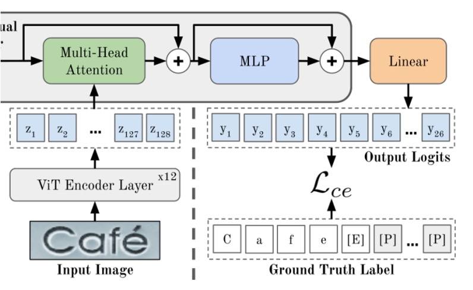
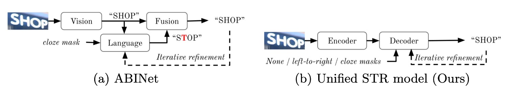
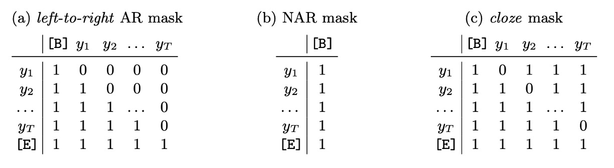

## 文字の順序は読み取りに影響しない

[**Scene Text Recognition with Permuted Autoregressive Sequence Models**](https://arxiv.org/abs/2207.06966)

---

副題の文字がずれていることに気づいたかもしれません。

え？もしかして、気づいていないかもしれませんね。

## 問題の定義

文字の並び順に関する研究は、ここ数年で多く行われています。

有名な研究の一つに XLNet があり、彼の双流注意機構は、文字の順序を乱すことでモデルを訓練します。

これは比較的初期の研究ですが、その後のいくつかの STR 論文でも似たような方法が採用されています。例えば、ABINet のデコーダは訓練過程で乱序されたマスクを使用して、言語モデルの分岐を訓練します。

:::tip
これらの論文をまだ読んでいない読者は、以前の記事を参照してください：

- [**[19.06] XLNet: 双流注意機構**](../../transformers/1906-xlnet/index.md)
- [**[21.03] ABINet: もう一度考えてみては？**](../2103-abinet/index.md)
  :::

もし面倒でなければ、簡単に復習しましょう：

双流注意機構とは、いくつかの核心概念を持っています。まず第一に「自分を隠す」ということです。この部分は MLM（Masked Language Model）と似ていて、自分を隠して、その隠れた部分を予測するというものです。違いは、MLM が「隠す」ために特別なトークンを使用するのに対し、双流注意機構では自分の位置情報を保持し、意味情報を隠すことで、モデルが最終的な結果を予測できるようにしています。

第二の概念は「乱序」です。これは文字を並べ替えることです。モデルが文字の位置を記憶してしまうと、意味ではなく位置を覚えてしまう可能性があるため、文字の順番を乱すことで、位置を記憶するのではなく意味を通じて予測させるようにします。

この論文の著者も、この概念に基づいて STR モデルを再設計しました。PAR（Permuted Autoregressive）は、言葉通り「乱序自回帰」の意味です。「乱序」の概念を導入することで、モデルの性能を向上させています。

もし上記の復習内容が理解できたのであれば、今すぐにこの論文を読み終えたことになります。

## 解決問題

### モデルアーキテクチャ

<figure style={{"width": "85%"}}>

</figure>

このアーキテクチャは少し複雑に見えますが、同様に分解してみましょう：

### エンコーダの設計

<figure style={{"width": "60%"}}>

</figure>

もし ViT の論文を読んだことがあるなら、ここで問題はないでしょう。

まず、上の図にある「ViT Encoder」を見てみましょう。この部分は、画像をトークンに変換し、Transformer のエンコーダを通じて特徴を抽出する部分です。

画像 $x \in \mathbb{R}^{W \times H \times C}$（幅 $W$、高さ $H$、チャネル数 $C$）は、$p_w \times p_h$ の小さなブロックに分割され、展開されて埋め込み行列を通じて、次元数 $d_{model}$ のトークンに変換されます。最後に、位置埋め込みがこれらのトークンに加算されます。

ViT のすべての出力はデコーダの入力として使われます。つまり、$\mathbf{z} = Enc(\mathbf{x}) \in \mathbb{R}^{\frac{WH}{p_w p_h} \times d_{model}}$ となります。

画像特徴はエンコーダを通過した後、次のステージ、つまり「クロスアテンション」デコーダに進みます。これが上図の緑色の部分です。

出力層 MLP を通した後、最終的な予測結果が得られます。

:::info
このアーキテクチャでは、エンコーダの層数は 12 層、デコーダの層数は 1 層です。

著者の実験によると、デコーダは 1 層で最適な効果が得られることがわかっています。
:::

:::tip
ViT を見たことがない？

こちらを参考にしてください：[**[20.10] ViT: 新世界の開拓者**](../../vision-transformers/2010-vit/index.md)
:::

### デコーダの設計

<figure style={{"width": "85%"}}>

</figure>

上図のように、一般的にはデコーダを通じて出力クエリを行います。最初に特別なトークンのセットがあり、これらのトークンは「位置」を表しており、デコーダの出力位置を示します。

いくつかの部分を隠すと、最も単純なデコーダ構造が見えてきます。ここまで見ると、このモデルのアーキテクチャは特に目新しい点はなく、以前見た STR モデルと全く同じです。

それでは、このアーキテクチャに言語モデルをどのように組み込むのでしょうか？

### 回顧

<figure style={{"width": "85%"}}>

</figure>

上図を参考にすると、ABINet では、視覚分岐から出力された結果が言語モデルに送られ、「校正」されて言語分岐の出力が得られます。最後に、両分岐の特徴を統合することで、最終結果を得ることができます。

この論文では、著者はこのアーキテクチャを変更し、PARSeq の方法では、言語モデル部分をデコーダの初期化段階に組み込みました。

### 順序付け言語モデリング

<figure style={{"width": "80%"}}>

</figure>

この部分が PARSeq の核心概念であり、「順序付け言語モデリング」です。

「Positional Tokens」が実際に画像情報を照会する前に、「順序付け言語モデリング」プロセスを経ます。このプロセスでは、文字の順序をランダムに並べ替え、Transformer のデコーダを通じて予測を行います。

PLM の核心概念は、すべての可能な順列を通じてモデルを訓練することにあります。$T$個の要素の順列組み合わせには$T!$通りの順列が存在するため、PLM の目的関数は次のようになります：

$$
\log p(\mathbf{y} | \mathbf{x}) = \mathbb{E}_{\mathbf{z} \sim \mathcal{Z}_T} \left [ \sum_{t=1}^T{\log p_{\theta} (y_{z_t} | \mathbf{y}_{\mathbf{z}_{<t}}, \mathbf{x})} \right ]
$$

Transformer で PLM を実装するには、実際にテキストラベル$y$の順序を変更する必要はなく、注意マスクを調整することで実現できます。以下の表に示します：

<figure style={{"width": "85%"}}>

</figure>

また、計算量が$T!$のように増加しないように、PLM では$K$個の順列のみを選択し、左から右への順列$[1, 2, \dots, T]$と$K/2 - 1$個のランダム順列を含みます。

:::tip
この設計では、標準の自回帰訓練が PLM の特例であることがわかります。すなわち、順列の順序は$[1, 2, \dots, T]$のみです。

これは典型的な「他人のアイデアを自分の特例に変えれば、もっと強くなる！」という設計思想です。
:::

### デコーディング方法

PLM の訓練は適切なパラメータ設定と組み合わせることで、PARSeq は多くのデコーディング方法をサポートします。

著者はここで主に、二つのデコーディング方式を比較しています：自回帰（AR）デコーディングと非自回帰（NAR）デコーディング、そして**反復的精緻化**（iterative refinement）という技術です。

<figure style={{"width": "85%"}}>

</figure>

1. **上表(a) 自回帰（Autoregressive, AR）デコーディング**

   - AR デコーディングは、各イテレーションで 1 つの新しいトークンを生成します。
   - 左から右への注意マスクを使用します。
   - 最初のイテレーションでは、コンテキストを開始トークン$[B]$に設定し、最初の位置クエリトークン$p_1$だけを使用します。
   - 次の$i$番目のイテレーションでは、位置クエリ$[p_1, \dots, p_i]$を使用し、前回の出力（argmax 値）に開始トークン$[B]$を加えてコンテキストを設定します。

2. **上表(b) 非自回帰（Non-autoregressive, NAR）デコーディング**

   - NAR デコーディングは、すべての出力トークンを一度に生成します。
   - すべての位置クエリ$[p_1, \dots, p_{T+1}]$を使用し、注意マスクは使用しません。
   - コンテキストは常に開始トークン$[B]$です。

3. **上表(c) 反復的精緻化（Iterative Refinement）**

   - 初期のデコーディング方法が AR でも NAR でも、反復的精緻化は実行できます。各イテレーションでは、前回の出力（終了トークン$[E]$まで切り取ったもの）を現在のイテレーションのコンテキストとして使用し、AR デコーディングのように動作します。
   - 常にすべての位置クエリ$[p_1, \dots, p_{T+1}]$を使用し、埋め込みマスクを適用します。
   - 埋め込みマスクは、最初に全ての位置を 1 でマスクし、その後、正しく生成されなかったトークンの位置をマスクして、次のイテレーションで未正しく生成されたトークンに集中させます。

### 損失関数

ここでは、最終的な出力結果に対してのみ損失計算を行います。すなわち、最終的な予測結果です。$K$個の順列を使用する場合、損失関数は各順列の交差エントロピー損失の平均値として計算されます：

$$
\mathcal{L} = \frac{1}{K} \sum_{k=1}^K{\mathcal{L}_{ce}(\mathbf{y}_k, \hat{\mathbf{y}})}
$$

監視中、埋め込みトークンは無視されます。順列が異なる文字列であっても、最終的には同じ予測結果を出力する必要があります。

### 実験設定

すべてのモデルは、PyTorch DDP 設定下の二重 GPU 混合精度環境で訓練され、169,680 回のイテレーションを行い、バッチサイズは 384 です。

学習率はモデルによって異なります。Adam オプティマイザと 1 サイクル学習率スケジューラを使用し、127,260 回目のイテレーション（総イテレーションの 75％）からランダムウェイト平均（SWA）を使用し、SWA スケジューラに置き換えます。1,000 ステップごとに検証を行い、最終的な重みは最後のチェックポイントで平均化されます。

- **モデル設定**：PARSeq では$K = 6$個の順列を使用しました。PARSeq と ViTSTR では、画像パッチサイズは 8×4 に設定されています。
- **ラベル前処理**：過去の研究方法に従い、ラベルの最大長さを$T = 25$に設定し、文字セットサイズ$S = 94$を使用します。これには、大文字、小文字、数字、句読点が含まれます。
- **画像前処理**：画像は最初に拡張、リサイズされ、その後$[-1, 1]$の範囲に正規化されます。拡張操作には主に RandAugment（シャープ化なし）を使用し、反転（Invert）を追加して住宅番号データの認識精度を向上させ、GaussianBlur と PoissonNoise を STR データの拡張に使用します。拡張戦略では 3 層の操作を使用し、強度は 5 に設定します。すべての画像は 128×32 ピクセルにリサイズされます。

## 討論

### 訓練順列數量影響分析

<figure style={{"width": "80%"}}>

</figure>

計算需要は順列の数が指数的に増加するため、実際にはすべての可能な順列で訓練を行うことはできません。

著者はすべての順列からランダムにいくつかの順列を選択する方法を採用しました。上表は、異なる訓練順列数$K$がさまざまなデコーディング方式のテスト精度に与える影響を示しています。

- **単一順列訓練（$K = 1$）**：

  $K = 1$の場合、左から右の順列順序を使用し、訓練プロセスは標準の自回帰（AR）モデルに簡略化されます。この設定では、非自回帰（NAR）デコーディングは全く動作せず、AR デコーディングは予想通り良好に機能します。

  この時、精緻化（または埋め込み）デコーディングの精度は 71.14%に過ぎず、非常に低い（実際のラベルを初期予測として使用したことを考慮すると）。

- **複数順列訓練（$K \geq 6$）**：

  $K \geq 6$の場合、さまざまなデコーディング方法で満足できる結果が得られ、この結果は PLM が統一的な STR モデルの実現に必須であることを示しています。

  直感的に、NAR デコーディングは単一または 2 つの順列（順方向および逆方向）で訓練した場合（$K \leq 2$）には正常に動作しません。これは、訓練コンテキストの多様性が不足しているためです。NAR デコーディングは各文字の事前知識に依存しており、文字集合内のすべての文字がシーケンスの先頭に自然に現れない場合、それらの事前知識を十分に学習できません。

- **最適なバランス（$K = 6$）**：

  $K = 6$の場合、デコーディング精度と訓練時間のバランスが最適となります。

  内部言語モデルの非常に高い埋め込み精度（約 94%）は、画像特徴と文脈情報を組み合わせて予測精緻化を行う利点を示しています。結局、STR の主要な入力信号は画像から来ており、言語コンテキストではありません。

### 現行の方法との比較

<figure style={{"width": "85%"}}>

</figure>

著者は PARSeq を既存の有名な SOTA 方法と比較し、一部の方法を再現してより公平な比較を行いました。

再現結果を見ると、ほとんどの再現方法は元の報告よりも高い精度を示しました。例外は ABINet で、再現結果の精度は約 1.4%低下しており、その理由は ABINet がより長い訓練計画（言語モデルと視覚モデルをそれぞれ 80 と 8 エポック事前訓練）と追加のデータセット（WikiText-103）を使用しているためです。

精度の比較部分では、合成データと実データで訓練した場合、PARSeqA は語句精度で最良の結果を出し、PARSeqN は安定して 2 位または 3 位に位置しています。実データを使用した場合、すべての再現モデルの精度は元の結果を大幅に上回り、PARSeqA は新たな SOTA 成果を達成しました。

---

文字セット精度は以下の表に示されています：

<figure style={{"width": "80%"}}>

</figure>

異なる文字セットにおける平均精度。合成データで訓練した場合、36 文字セットから 62 文字セットおよび 94 文字セットに変更すると、精度が急激に低下し、合成データセットに大小文字の多様性が欠けていることを示しています。PARSeqA はすべての文字セットサイズで最高の精度を達成しました。

## 結論

PARSeq は PLM の概念を導入することで、言語モデル部分を STR モデルに組み込み、複数順列訓練を通じてモデルの性能を向上させました。この試みは STR の主要な指標で SoTA の成果を上げ、文字セットサイズの変更にも最適な性能を示しました。

言語モデルの魅力は止められません。最新の NLP 技術を取り入れ、言語モデルの概念を他の分野にも組み込んでいくことで、さらなる驚きの成果が生まれるかもしれません。
