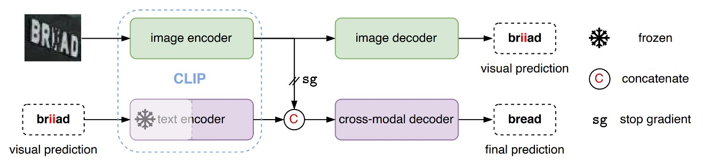
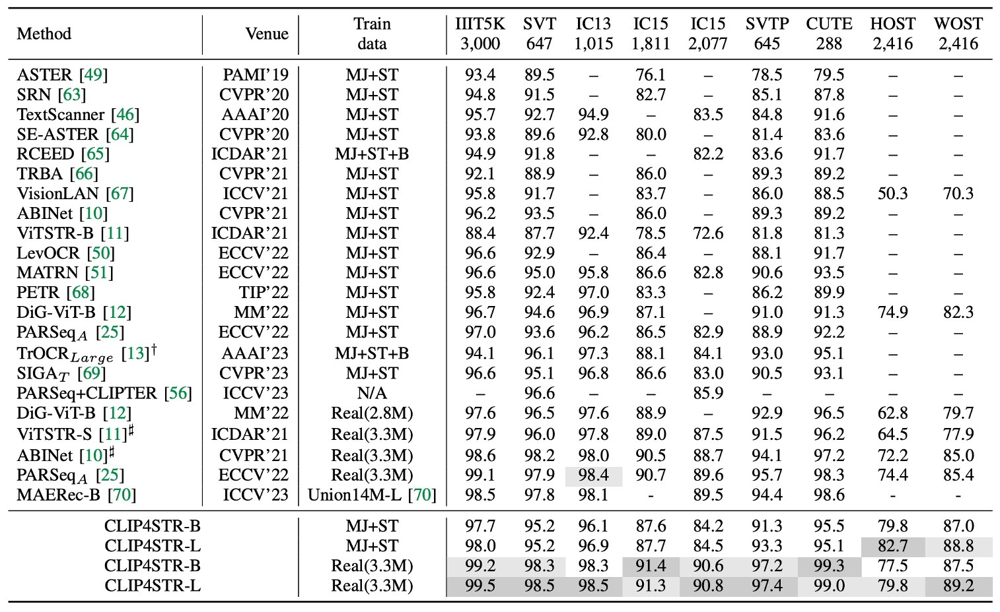
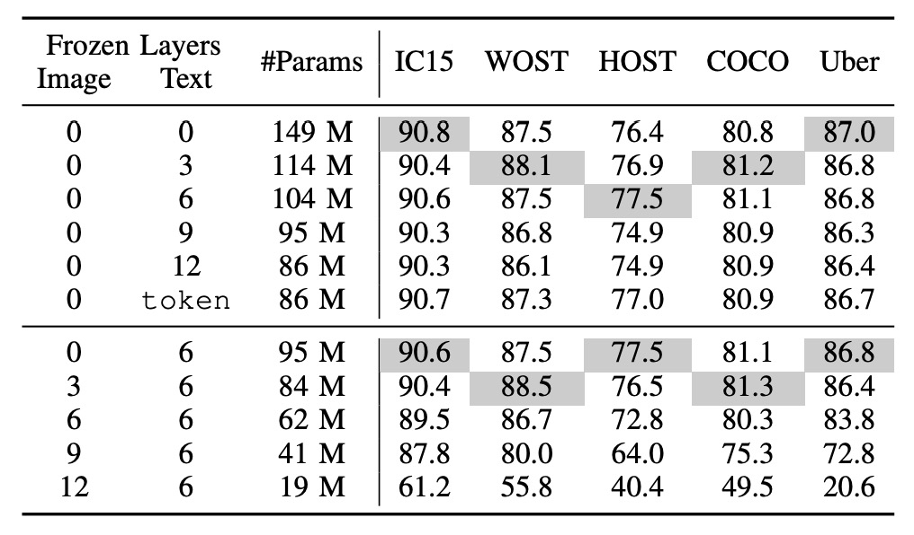
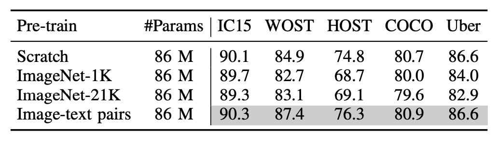

# [23.05] CLIP4STR

## 多モーダルな祝福

[**CLIP4STR: A Simple Baseline for Scene Text Recognition with Pre-trained Vision-Language Model**](https://arxiv.org/abs/2305.14014)

---

対比学習の風が、あちこちで吹いています。

対比学習の後の多モーダル学習は、近年のホットなトピックであり、そこから新しい用語が生まれました：

- **VLM、Vision-Language Models（視覚と言語のモデル）**。

業界では、誰でも「VLM！」と声を上げることができるほどの流行です。

それなら、文字認識の研究者たちも、何かしらの形でこの熱潮に乗らなければならないのではないでしょうか？

## 問題の定義

シーン文字認識（Scene Text Recognition, STR）は、回転、歪み、ぼやけ、または遮蔽された文字に直面すると、その性能が不十分であることが多いです。

同じ問題が、何十年も繰り返されてきました。今回は、新しいアプローチを試してみましょう。

CLIP は 2021 年に発表され、その強力なクロスモーダル学習能力により、話題となりました。CLIP は、自然な画像内のさまざまな文字のバリエーションを認識し、理解することができます。この能力は、STR にとって潜在的な解決策となる可能性があります。

ちょっと待って！CLIP とは何ですか？

こんなに話題が急展開しているとは…。

:::tip
CLIP についてはすでに読んだことがあるかもしれませんが、まだ接していない方のために、以前の記事を参考にしてください：

- [**[21.03] CLIP: 次元の壁を打破する**](../../multimodality/2103-clip/index.md)
  :::

## CLIP

あなたが面倒だと思うので、ここで簡単に CLIP について紹介します。

下の図が CLIP のアーキテクチャです：

仮に、画像とテキストのペアがあるとしましょう。例えば、1 枚の犬の画像と「かわいい小さな犬」というテキストがペアで与えられた場合です。

1 つの訓練バッチで、CLIP はそのようなペアを複数受け取ります。画像エンコーダーは、ResNet や ViT を使って画像を処理し、画像特徴を取得します。一方、テキストエンコーダーは Transformer を使ってテキストを処理し、テキスト特徴を取得します。

次に、モデルはこれらの特徴を比較して、正しくペアリングされた画像とテキスト（例えば、犬の画像と「かわいい小さな犬」というテキスト）のコサイン類似度を最大化し、間違ってペアリングされた画像とテキスト（例えば、犬の画像と「1 つのリンゴ」というテキスト）のコサイン類似度を最小化します。

非常にシンプルなアーキテクチャです！

最後に、4 億組の画像とテキストのペアを使って訓練を開始します！

### それで？

これは何を意味するのでしょうか？

訓練が完了すると、私たちは自然言語を使って画像検索を直接行うことができます。また、逆に、画像を与えれば、モデルはそれに対応する説明文を生成することができます。もしこの訓練過程で、STR タスクのような文字画像が存在すれば、その文字の形状は CLIP のアーキテクチャ内で文字の意味と関連付けられることになります。

- **文字画像と文字自体が関連している？これはまさに STR が解決すべき問題ではありませんか！**

さらに、CLIP の訓練データは、実際の世界に存在するさまざまなスタイルから来ており、その結果得られる特徴は、STR タスクの訓練データに限定されることなく、より高次元で世界を理解することができます。これにより、STR のパフォーマンスが向上する可能性があります。

最も顕著なのは、歪んだりぼやけたり、または厳しく遮蔽された文字です。CLIP の訓練データには私たちが「想像しにくい」ようなスタイルが存在するため、CLIP はこれらの文字の特徴を特定できる可能性があります。

:::tip
**「想像しにくい」とは？**

「4 億」組の画像とテキストのペアに対して、あなたはピンと来ないかもしれません。例を挙げると、以前の STR データセットで最も大きかったのは SynthText で、80 万組の画像とテキストのペアがあります。そして最近提案された Union14M は、近年最大の STR データセットで、1400 万組の画像とテキストのペアが含まれており、その規模は SynthText の 17 倍に相当します。

CLIP の訓練データは、Union14M の 30 倍、SynthText の 500 倍にあたります。

もしあなたが 1 秒間に 1 枚の画像を確認するとしたら、データセット全体を見るのに約 12 年かかる計算になります。
:::

### ゼロショットテスト

このアイデアを検証するために、著者はまず CLIP でゼロショットテストを行いました。

CLIP が「文字」をどれだけ理解できるかを見てみましょう。最も左には入力された文字があり、その中央にはアテンション可視化結果、右には文字出力があります：

<figure style={{"width": "60%"}}>

</figure>

私たちは驚きました：CLIP は文字を認識できるんです！

さらに、遮蔽された文字に出会ったとき、例えば上の図の`+occluded`のように、CLIP は文字と背景の関係を自動的に考慮し、最終的に「cat」と「horse」の両方の出力確率を均等に得ることができました！

## 解決方法

では、CLIP はすでに一部の文字理解能力を持っているので、私たちが今やるべきことは、「誘導」して、CLIP を STR というタスクに集中させることです。

:::tip
計算リソースが十分でない限り、またはデータ規模が十分でない限り、私たちは CLIP のパラメータを微調整しません。なぜなら、それが CLIP の多モーダル学習能力を損なうからです。

一般的には、CLIP のパラメータを凍結し、その上に小さなネットワークを追加して、私たちが解決したい問題を解決するために使います。
:::

### モデルアーキテクチャ

ここでは、あなたが CLIP に非常に精通していると仮定して、このアーキテクチャの説明に進みます。

---

CLIP には、文字分岐と画像分岐の 2 つの分岐があります。

CLIP4STR のアーキテクチャでは、まず画像を「CLIP 画像分岐」に入力し、画像特徴を取得します。次に、その特徴をカスタムの「画像デコーダー」に入力し、特徴を解析して予測される文字を出力します。

上図のように、画像を入力すると、モデルはまず「briiad」という出力を生成します。この出力は正しくない可能性があるため、次にこの出力された文字を「CLIP 文字分岐」に入力し、文字特徴を取得します。

最後に、文字特徴と画像特徴を結合し、カスタムの「クロスモデルデコーダー」に入力して最終的な文字予測を行います。

「CLIP 文字分岐」のパラメータは凍結され、訓練されません。また、文字と画像特徴を結合する際、逆伝播の勾配は画像分岐に伝播しないようにすることで、画像分岐が文字分岐の影響を受けないようにしています。

ここで「CLIP 文字分岐」の主な機能は「誤字修正」であり、文字の生成ではないことがわかります。

:::tip
この誤字修正の概念は、ABINet のアイデアを参考にしています。興味のある読者は次の記事を参照できます：

- [**[21.03] ABINet: もう一度考えてみますか？**](../2103-abinet/index.md)
  :::

### 文字デコーダー

前述の「クロスモデルデコーダー」モジュールを覚えていますか？

このモジュールの設計は、PARSeq のデコーダーアーキテクチャをそのまま採用しています。違いは、PARSeq では第二層のクロスアテンションの対象が画像の出力特徴であるのに対し、CLIP4STR ではこの対象が「CLIP 文字分岐」と「CLIP 画像分岐」の出力特徴の結合結果である点です。

:::tip
PARSeq を見たことがない場合、以前の記事を参照できます：

- [**[22.07] PARSeq: 文字の順序は読み取りに影響しない**](../2207-parseq/index.md)
  :::

## 討論

### 他の方法との比較

上の表は、CLIP4STR が 11 の STR ベンチマークデータセットでのパフォーマンスを示しており、他の SOTA（最先端）方法と比較して、CLIP4STR は 9 つのベンチマークデータセットで最新の SOTA パフォーマンスを達成しています。

### 基本的な消融実験

<figure style={{"width": "70%"}}>

</figure>

実験は、視覚分岐のみを含む ViT-S エンコーダーをベースラインとして開始しました。このエンコーダーは事前学習されていません。

1. PSM 技術を導入し、PARSeq の訓練手法を採用したところ、精度が 0.7%向上しました。
2. エンコーダーを CLIP の画像エンコーダー ViT-B/16 に置き換えましたが、顕著な向上は見られませんでした。さらなる適応が必要であることが示されました。
3. 訓練パラメータを変更し、パッチサイズを 16×16 に調整し、エンコーダーには小さな学習率を設定し、デコーダーには大きな学習率を使用し、訓練回数を 16 回に減らしました。

これらの調整後、モデルは以前の SOTA パフォーマンスを超えました。

4. クロスモーダル分岐を追加することで、平均精度が 9 つのベンチマークデータセットで 0.4%向上し、その有効性が示されました。
5. より大きなモデル ViT-L/14 を導入した後、精度はさらに 0.7%向上しました。

CLIP-ViT-L/14 は STR において CLIP-ViT-B/16 よりも早く収束し、10 回の訓練で収束しました。

### CLIP の凍結方法

<figure style={{"width": "80%"}}>

<figurecaption>#Paramsは訓練可能なパラメータを示し、`token`は事前学習されたトークン埋め込みのみを使用することを示します。 上半分は文字分岐を凍結、下半分は画像分岐を凍結しています。</figurecaption>
</figure>

---

一般的な凍結戦略は 2 種類です：

1. **CLIP 文字分岐を凍結**：層の半分を凍結することで、これは大規模な言語モデルを新しいタスクに移行させる際の一般的な手法です。
2. **CLIP 画像分岐を凍結**：これにより画像分岐が訓練できなくなり、最終的なパフォーマンスに影響を与える可能性があります。

著者は一連の実験を行い、その結果、言語モデルを凍結してもパフォーマンスに対する影響は少ない一方で、画像モデルを凍結するとパフォーマンスに顕著な影響があることが示されました。

CLIP 文字エンコーダーの事前学習されたトークン埋め込みが固定されていても、システムは良好なパフォーマンスを達成し、STR の意味理解が比較的簡単であり、文字内容は語彙やフレーズで構成されているため、一般的な言語理解に比べて難易度が低いことが示されています。

画像モデルの凍結はパフォーマンスに大きな影響を与える可能性があり、これは STR データと CLIP 画像エンコーダーの事前学習データ間のドメインギャップによるものかもしれません。

CLIP の事前学習は主に自然画像を使用しており、STR データは切り取られた単語画像であるため、CLIP4STR ではこのギャップを縮小するために「完全に訓練可能な」画像エンコーダーが必要です。

### 多モーダルは本当に有効か？

<figure style={{"width": "80%"}}>

</figure>

多モーダル事前学習が本当に有効かどうかを検証するために、著者は「画像分岐」を再訓練しました。

実験では 3 種類の異なる画像エンコーダーを試しました：

- **ランダム初期化された ViT**：事前学習なし。
- **ImageNet-1K で事前学習された ViT**：ImageNet-1K で事前学習。
- **ImageNet-21K で事前学習された ViT**：ImageNet-21K で事前学習。

上の表から、画像とテキストペアの事前学習モデルが最も効果的であり、次にゼロから訓練されたモデルが続くことがわかります。

:::tip
これは PARSeq の実験結果と一致しており、STR タスクでは事前学習されたモデルの効果があまり良くないことが示されています！
:::

### PEFT は使えるか？

<figure style={{"width": "40%"}}>

</figure>

完全な微調整の方法のほかに、大規模な事前学習モデルのためのパラメータ効率の良い微調整方法（Parameter-Efficient Fine-Tuning、PEFT）が徐々に注目されています。例えば、CoOp は学習可能なプレフィックスプロンプト（prefix prompts）のみを訓練し、CLIP-Adapter は凍結された VLM モデルの上に調整可能な線形層を追加します。

これらの PEFT 手法がいくつかのタスクで良いパフォーマンスを示していることを考慮し、著者は本研究でそれらを STR に適用し、2 つの PEFT 手法を設計しました：

1. **CLIP-Adapter**：凍結された CLIP の最上層に 2 つの線形層を追加し、残差の加算比率$\lambda = 0.2$を設定。
2. **LST**：凍結された CLIP 上に階層的なサイドネットワークを使用し、特徴をまずダウンサンプリングし、再アップサンプリングして元の特徴次元に合わせます。

実験結果では、CLIP-Adapter の性能は、単にモデルを凍結したバージョンよりも優れていましたが、完全に微調整されたモデルの性能には達していませんでした。一方、LST は相対的に優れたパフォーマンスを示し、モデルの精度を大幅に向上させましたが、それでも完全に微調整されたモデルには劣っていました。

訓練リソースが限られている場合、LST はより良い選択肢となるでしょう。

:::tip
LLM チューニングに関する部分は、以前いくつかの論文を読んだことがあります。興味のある読者は次の記事を参照できます：

- [**[19.02] Adapter: パラメータ節約 96%**](../../model-tuning/1902-adapter/index.md)
- [**[21.01] Prefix-Tuning: それは彼？それとも彼ではない？**](../../model-tuning/2101-prefix-tuning/index.md)
  :::

## 結論

多モーダルなモデルアーキテクチャは、近年のさまざまな分野でのタスクで大きな成功を収めており、この研究は CLIP が STR タスクにおいてどのように適用できるかを示し、SOTA の性能を達成しました。

道は終わりではなく、今こそ曲がり角に来た時です。
