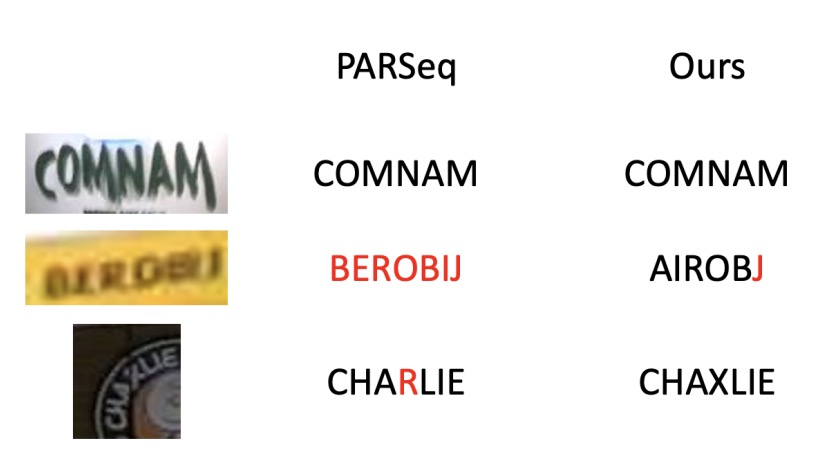

# [23.06] DiffusionSTR

## ノイズの中の文字信号

[**DiffusionSTR: Diffusion Model for Scene Text Recognition**](https://arxiv.org/abs/2306.16707)

---

研究の論理は時々非常にシンプルです：

他の分野で良いものを見つけたら、それを試してみる、そしてそれが論文になるかもしれません。

## 問題の定義

拡散モデルは数年間流行しており、主な応用は画像生成の分野に集中しています。

こんなに新しいものがあるなら…

文字認識に使ってみよう！

## 解決方法

### モデルアーキテクチャ

拡散モデルの概念は 3 日 3 晩話せるほどですが、ここでは詳しくは触れません。あなたがすでに拡散モデルの専門家であると仮定します。

著者はここで拡散モデルを導入し、文字認識の基盤として利用しています。

全体のアーキテクチャの設計は非常にシンプルです。まず、ViT を使用して画像をエンコードし、画像の特徴表現を得ます。

次に、ノイズで埋められたシーケンス$x_T$を入力として、Transformer を使い、視覚的特徴に基づいて段階的に洗練されたシーケンス$x_{T-1}$を生成します。この過程は$T$回繰り返され、最終的に$x_0$シーケンスが出力されます。

最後に、$x_0$は FFN を通じて認識される文字シーケンスに変換され、文字認識ヘッドは文字の位置を予測します。

拡散モデルは前向き過程と逆向き過程を含んでいます：

- **前向き過程**：データ点$x_0$にノイズを段階的に加えてガウスノイズ$x_T$を生成します。
- **逆向き過程**：段階的にデノイズして元のデータ$x_0$を再構築します。

著者は文字のような離散変数を処理するために複数の拡散モデルを使用し、[EOS]（文字終了）、[PAD]（パディング）、[MASK]（ノイズ）などの特別なトークンを導入しました。

訓練では、簡略化された損失関数$L_{\text{simple}}$を使用し、安定した訓練のために平均二乗誤差損失を採用しています。

それ以外に、言語モデルは使用していません。著者は、言語モデルの分岐がモデルアーキテクチャを複雑にし、拡散モデルの効果を直感的に理解するのが難しくなると考えています。

### Transformer アーキテクチャ

ここで著者は、時間的な位置エンコーディングを持つ Transformer デコーダーを使用して、拡散モデルのシーケンスを変換します。

従来の Transformer と比較して、いくつかの異なる点があります：

1. 文字シーケンスの条件処理のために視覚特徴$z$を導入し、クロスアテンションメカニズムを通じて実現しています。
2. 1 つの文字を予測するのではなく、すべての文字の確率を同時に出力します。（自己回帰メカニズムを使用しません）
3. 出力結果には 2 つの用途があります：一つは FFN を通じて文字シーケンスに変換すること、もう一つは文字認識ヘッドに入力して、文字の領域が実際の文字であるかどうかを予測することです。

訓練過程では、ランダムに時間ステップ$t$を選択し、ノイズスケジュール$\alpha_t, \alpha_{\bar{t}}$を使用して出力を計算した後、ノイズが加えられたシーケンス$x_t$を生成します。次に、$x_{t-1} = \text{Dec}(x_t, z, t)$を実行して損失を計算します。

推論過程では、ノイズで埋められた[MASK]トークンを含むシーケンス$x_T$から開始し、視覚エンコーダーによって生成された視覚特徴$z$の条件の下で$T$回のイテレーションを行い、最終的に$x_0$を得ます。最後に、$x_0$は FFN を通じて認識される文字シーケンスに変換されます。

最後に、著者は文字認識を行うための文字認識ヘッドを提案しており、主に固定長のシーケンス内での文字分類問題を解決します。予測ヘッドは二項分類を行い、位置が文字（1）または非文字（0）に対応するかどうかを判定します。損失関数には二項交差エントロピーを使用しています。

## 討論

### 他の方法との比較

上の表は、DiffusionSTR と他の最新の手法が MJ および ST データセットで比較された結果を示しています。

DiffusionSTR は複数のデータセットで優れたパフォーマンスを示しており、最新の強力な手法と比較して競争力があります。

ABINet と PARSeq は強力な言語モデルを使用し、TRBA は画像補正モジュールを前処理として採用しています。DiffusionSTR はこれらの技術を使用せず、構造がシンプルであるにもかかわらず、同様の精度を達成しています。

### 拡散モデルの利点

<figure style={{"width": "70%"}}>

</figure>

実験を通じて、著者は DiffusionSTR の利点を次のように発見しました：

1. **ノイズへの感度が低い**：ノイズの多い画像の処理に優れています。
2. **ぼやけた画像に対する堅牢性**：ぼやけた画像を解析するのに優れています。

### 文字認識ヘッドの影響

実験では、文字位置を予測しない場合、精度が大幅に低下することが示されました。

### 拡散ステップの影響

上の表は、総ステップ数が精度に与える影響を示しています。結果として、ステップ数が増加するにつれて精度も向上し、1000 ステップを超えると精度の向上は飽和します。

## 結論

本論文で提案された方法は、視覚情報に基づいてノイズを条件付きで細化し、既存の方法とは全く異なります。検証データセットで、DiffusionSTR は最先端の方法と比較しても遜色なく、方法の有効性を証明しました。

この新しいアプローチは、研究者たちに拡散モデルが文字認識で持つ可能性を示しました。

:::tip
この記事では、著者は推論時間について一言も触れていません。

拡散モデルは繰り返しのイテレーションを必要とするため、このモデルはかなり遅いだろうと予想されます。
:::
