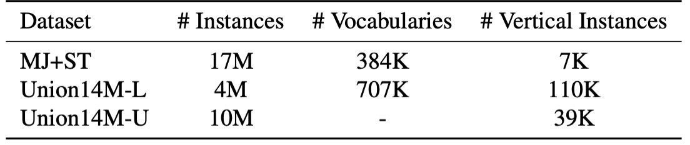
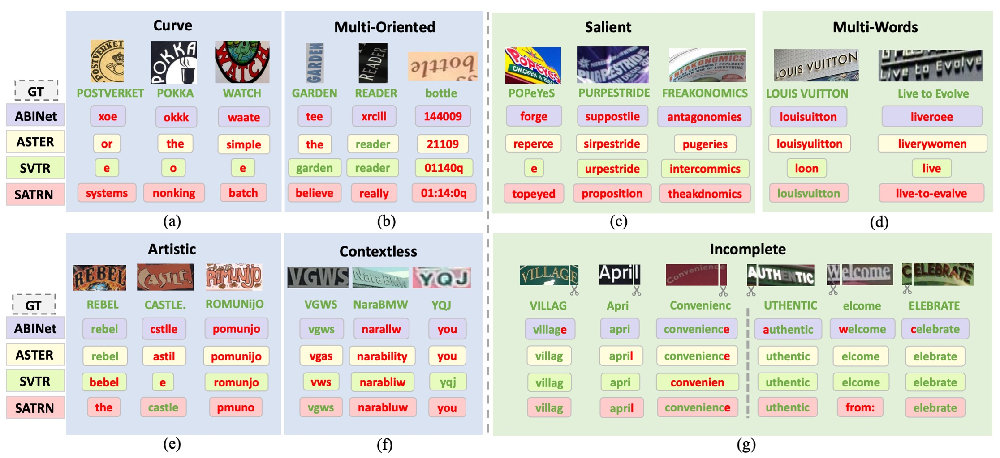
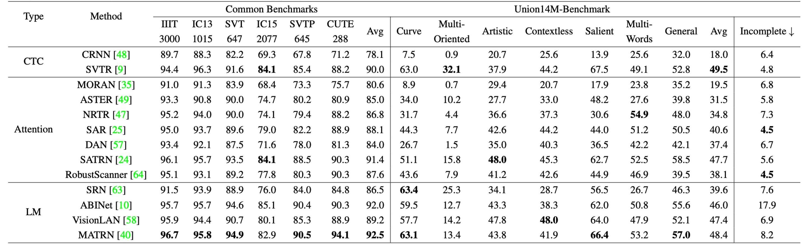

## チェスの駒が星のように落ちる

[**Revisiting Scene Text Recognition: A Data Perspective**](https://arxiv.org/abs/2307.08723)

---

私たちは何十篇もの文字認識の論文を読んできましたが、使用されている検証データセットは繰り返し使われているものがほとんどです：ICDAR、IIIT5K、SVT、SVTP、CUTE80 など。

正直なところ、これらのデータセットの性能もほぼ飽和状態です。

## 問題の定義

上図は、6 つの一般的なデータセットの平均パフォーマンスです。

私たちがよく知っている CRNN から、後の SAR、SATRN、ABINet まで。2022 年以降、全体のパフォーマンスは 92％を超えており、これ以上の向上の余地はほとんどないと言えます。

これは、STR（シーン文字認識）が「解決された問題」と見なせるのでしょうか？または、使用している検証データセットの表現力が不足しているために、さらに多くの可能性を見逃しているのではないかという可能性も考えられます。

もしそれが無理なら、どうすればいいのでしょう？

著者はそこで思い切って、現在の盤面をひっくり返し、再スタートを切ることにしました。

## 問題の解決

既存のデータセットでは、現実世界で直面するシーン文字認識（STR）の実際の課題を反映できないと考えた著者たちは、全く新しい大規模な実データセットを統合することに決めました。それが、**Union14M**です。

Union14M には、400 万枚のラベル付き画像（Union14M-L）と 1000 万枚のラベルなし画像（Union14M-U）が含まれており、17 の公開データセットから取得されています。以下にその一覧を示します：

<figure style={{"width": "80%"}}>

</figure>

このデータセットは、現在ほとんどのデータセットを統合し、異なるカテゴリの課題を要約し、現実世界における文字の分布をより包括的に表現することを目指しています。

この巨大なデータセットを通じて、著者たちは、より複雑で多様な実際のシーンでの STR モデルの性能を深く分析し、現存するモデルの不足点を明らかにし、その分野のさらなる発展を促進しようとしています。

### Union14M-L

合計 400 万枚のラベル付き画像で、著者は多様な実際のシーンをカバーすることを目指して、**14 の公開データセット**からラベル付き画像を収集して Union14M-L を構築しました。

これらのデータセットは多様な特徴を持っており、例えば：

- **ArT**：曲線文字を扱う画像。
- **ReCTS、RCTW、LSVT、KAIST、NEOCR、IIIT-ILST**：異なる国の街角シーンを含むデータ。
- **MTWI**：ウェブページから取得したシーン文字画像。
- **COCOTextV2**：低解像度や縦書きの文字を多く含む画像。
- **IntelOCR、TextOCR、HierText**：OpenImages から得られたデータ、約 900 万枚の画像が含まれ、さまざまな実際のシーンがカバーされています。

これらのデータセットを統合することで、著者はより広範な実際のシーンに対応することを目指しており、詳細な分析が可能になります。

ただし、これらのデータセットを単純に統合することは最適な解決策ではありません。なぜなら、ラベル付けの形式が一致しない、重複したサンプルがある、または非ラテン文字や損傷した画像が含まれているからです。これらの問題を解決するために、著者は以下の最適化戦略を採用しました：

- **文字インスタンスのトリミング**：多くのデータセットでは多角形ラベルで文字領域をマークしていますが、著者はここで「最小回転矩形」を使用してトリミングしました。この方法は、より多くの背景ノイズを導入する可能性があり、モデルが学習過程で直面する挑戦を増やし、背景ノイズに対する頑健性を強化します。また、検出器の精度に対するモデルの依存度を減らし、認識器の性能分析を助けます。

- **重複サンプルの排除**：まず、Union14M-L と一般的なベンチマーク間の重複サンプルを除外し、さらに 14 のデータセット間の重複データを削除します。例えば、**HierText、TextOCR、IntelOCR**の一部は OpenImages から来ているため重複しています。著者は HierText を主な参照とし、他の 2 つのデータセットの重複部分を削除しました。

- **非ラテン文字と無視サンプルの排除**：主要なラテンアルファベットに焦点を合わせるため、アルファベット、数字、記号を含むサンプルのみを保持し、「無視」とラベル付けされた画像は削除しました。

### Union14M-U

合計 1000 万枚のラベルなし画像。近年、自己教師あり学習はコンピュータビジョン分野で多くの進展を遂げ、STR 領域でも注目されています。しかし、手動で文字画像にラベルを付けるには膨大な時間と専門的な言語知識が必要です。そのため、著者はラベルなしデータを活用して STR モデルの性能を向上させる方法を模索しました。

そのため、著者は**Book32**、**OpenImages**、**Conceptual Captions (CC)**の 3 つの大規模データセットから**1000 万枚のラベルなし画像**を収集しました。

これまでの研究とは異なり、著者は 3 つの文字検出器を使用し、IoU 投票メカニズムを採用して高品質な文字インスタンスを選びました。さらに、OpenImages 内の重複データを除外し、Union14M-L のラベル付きデータとの重複を避けました。

### 多様な文字スタイル

<figure style={{"width": "80%"}}>

</figure>

上図のように、Union14M は多様な実世界のシーンから収集した文字画像をカバーしており、これらの文字はさまざまなレイアウトを示しています。例えば**曲線文字、傾斜文字、縦書き文字**など、そして**ぼやけ、複雑な背景、遮蔽**などの挑戦的な要素も含まれています。また、実際の応用シーンからの文字、例えば**街角の看板や商標**も含まれています。

さらに重要なのは、Union14M が大量の縦書き文字を含んでいる点です。これは実世界では非常に一般的ですが、合成データセットでは相対的に少ないです。

### 豊富な語彙量

<figure style={{"width": "80%"}}>

</figure>

合成データセットで使用される文字は主に一般的なコーパスから取得されていますが、実際のシーンでは文字が多様に変化し、コーパスに含まれない組み合わせ（例えば**ナンバープレート番号**や**中英混合のピンイン**）が含まれることがあります。上表に示されているように、Union14M-L の語彙量は合成データセットのほぼ 2 倍であり、実世界の多様な状況をより広範囲にカバーできることを示しています。

### モデルアーキテクチャ

<figure style={{"width": "80%"}}>

</figure>

Union14M データセットが完成した後、著者は自己教師あり学習に基づく解決策として**MAERec**を提案しました。

このモデルは、自己教師あり事前学習を通じて、Union14M-U の 1000 万枚のラベルなし画像を十分に活用します。

MAERec のコアは ViT に基づいており、その利点はマスクされた画像モデリングに簡単に適用できることです。

- [**[21.11] MAE: 四分之一の線索**](../../vision-transformers/2111-mae/index.md)

入力画像は最初に 4×4 の画像パッチに分割され、その後 ViT のバックボーンネットワークに送られます。モデルの出力シーケンスは自己回帰型デコーダを通して、最終的な文字予測結果を生成します。このデコーダは SATRN の Transformer デコーダを採用しています。

- [**[19.10] SATRN: Transformer 戦場へ到達**](../1910-satrn/index.md)

公平な比較を行うために、文字クラスの数を 91 クラス（数字、大文字と小文字のアルファベット、記号、空白）に統一し、その他の超パラメータは元のモデル設定に一致させました。

### 事前学習と微調整

<figure style={{"width": "85%"}}>

</figure>

Union14M-U の大量のラベルなし画像を活用するために、著者は MAE フレームワークを使って事前学習を行い、適度に調整を加えました。

上図に示すように、マスク率が 75％に達している場合でも、ViT バックボーンネットワークは高品質な再構築された文字画像を生成できます。これは、MAERec が文字の構造や意味の表現を効果的に学習できることを示しており、非常に不完全な画像でも有用な特徴を捉えることができることを示しています。

事前学習を完了した後、著者は事前学習済みの ViT の重みを使用して MAERec を初期化し、Union14M-L で微調整を行いました。

## 討論

### 殘酷的現實

<figure style={{"width": "80%"}}>

</figure>

著者は最初に 13 の代表的な STR モデルを選択し、これらのモデルはすべて合成データで訓練され、Union14M-L でテストされました。上表に示すように、これらのモデルは Union14M-L で明らかにパフォーマンスが低下し、平均精度が...

- **20.50%**も低下しました！

:::tip
誰が STR が解決された問題だと言えるでしょうか？
:::

### 挑戦挖掘

著者は 13 のモデルが共通して犯した誤りのタイプを特定するために、Union14M-L の各サンプルに難易度スコアを割り当て、ほとんどのモデルが正しく認識できない困難なサンプルに焦点を当てました。そこから、まだ十分に解決されていない 4 つの課題と、以前の研究ではあまり注目されてこなかった 3 つの現実世界で一般的な課題をまとめました。

- **曲線文字 (Curve Text)**

  上図 (a) のように、曲線文字の認識は近年注目を集めており、主に 2 つの主流の方法があります：

  1. **文字補正に基づくモデル**
  2. **2D アテンション機構を使用するモデル**

  これらの方法は CUTE ベンチマークデータセットでは良い性能を示しましたが、このデータセットにおける曲線文字の割合は限られており、曲率が低いです。高度に曲がった文字に遭遇した場合、既存のモデルの性能は依然として理想的ではありません。

  ***

- **多方向文字 (Multi-Oriented Text)**

  上図 (b) のように、文字は「垂直、傾斜、または鏡像」のような任意の方向で物体の表面に現れることがあります。例えば、広告看板の垂直文字やカメラ撮影の角度による傾斜文字です。しかし、ほとんどの STR モデルは文字がほぼ水平であると仮定しており、多方向文字の問題を無視しています。

  これらのモデルは通常、画像の高さを固定サイズ（例えば 32 ピクセル）に縮小し、アスペクト比を保持します。しかし、この縮小方式は「垂直または傾斜した画像の高さ圧縮」を引き起こし、認識能力を妨げる原因となります。

  ***

- **藝術文字 (Artistic Text)**

  上図 (e) のように、芸術的な文字はデザイナーによって様々なフォント、効果、レイアウトで作成され、背景が非常に複雑であることがあります。各芸術文字インスタンスは一意であり、「ゼロショットまたはワンショット認識問題」として特別に設計されたネットワークを必要とします。しかし、合成データセットには芸術文字のサンプルが欠如しているため、現在のモデルは芸術文字の認識において十分な頑健性を持っていません。

  ***

- **無上下文文字 (Contextless Text)**

  上図 (f) のように、無上下文文字とは「意味を持たない」または辞書に載っていない文字、例えば略語やランダムな文字、数字、記号の組み合わせです。背景が明確で変形が少ない場合でも、モデルはこれらの文字を正しく認識できないことがあります。これはモデルが語彙に過剰に依存し、意味情報を基に予測を行っているためです。

  例えば、モデルが「YQJ」を誤って「you」と認識することがあります。これは車両ナンバープレート認識、領収書認識、ID カード認識などで特に危険です。誤認識は重大なセキュリティリスクや財産損失を引き起こす可能性があります。

  ***

- **顯著文字 (Salient Text)**

  上図 (c) のように、顕著な文字は「余分な干渉文字」を含み、主要な文字と共存します。異なるサイズの文字が隣接したり重なったりする場合、これらの干渉文字が意図せず含まれ、認識性能に影響を与えることがあります。検出段階では、Liao らによって提案された**ROI マスク戦略**を使用してこれらの干渉文字を除去する方法があります。しかし、検出モデルが不十分で文字領域を正確に検出できない場合、認識モデルの重要な領域を迅速に認識する能力が重要になります。

  ***

- **多詞文字 (Multi-Words Text)**

  上図 (d) のように、場合によっては単一の単語では完全な意味を伝えることができず、複数の単語を同時に認識する必要があります。例えば「商標」や「フレーズ」などです。しかし、ほとんどの STR モデルは合成データセットで単語レベルで訓練されているため、「単語間の空白」を認識できないことがよくあります。

  著者は、モデルが複数の単語を一つの単語として結合してしまうことがあることに気付きました。例えば、「Live to Evolve」が「liveroee」と誤認識されることがあります。モデルはこれを単一の単語として解釈しがちです。

  ***

- **不完整文字 (Incomplete Text)**

  上図 (g) のように、文字画像は「遮蔽や検出ボックスの不正確さ」によって部分的な文字が欠けていることがあります。画像が文字の始まりや終わりを切り取った場合、モデルは自動的に補完を行い、欠けている文字が見えなくても完全な予測結果を生成することがあります。

  この挙動は言語モデルに依存するシステムで特に顕著で、モデルが言語の先行知識を大量に使用して予測を行うためです。しかし、この「自動補完」機能は、いくつかのアプリケーションでモデルの信頼性を低下させる可能性があります。例えば、「ight」とだけ表示されている場合、モデルはそれを「might」や「light」と補完することがありますが、理想的な場合は「ight」をそのまま出力し、異常検出システムで確認するべきです。

  したがって、補完機能の性能を全面的に評価し、その後のアプリケーションへの潜在的な影響を慎重に考慮する必要があります。

### 基準資料集の構築

<figure style={{"width": "80%"}}>

</figure>

STR モデルの実際のシーンでの性能をより包括的に評価し、前述の「七大挑戦」に関する研究をサポートするために、著者たちは挑戦指向の基準データセットを構築しました：

- **Union14M-Benchmark**。

この基準データセットには、8 つのサブセットが含まれており、合計**409,393 枚の画像**が収められており、異なる文字の複雑さと多様性をカバーしています。

### 実験結果

著者は各モデルを比較するため、最初に合成データセット（MJ+ST）での結果を示しました：

次に、すべてのモデルを Union14M で再訓練しました：

---

一般的な基準データセットと比較すると、合成データで訓練されたモデルは**Union14M-Benchmark**での平均精度が**48.5%**低下し、**Union14M-L**で訓練した場合は精度が**33.0%**低下しました。これにより、実際のシーンでの文字画像は 6 つの一般的な基準データセットよりもはるかに複雑であることが示されました。

もし**Union14M-L**で訓練すると、一般的な基準データセットと**Union14M-Benchmark**でそれぞれ**3.9%**と**19.6%**の精度向上が見られました。これは、合成データでの訓練が複雑な実世界の要求に対応するのが難しく、実データで訓練することでモデルの汎化能力が大幅に向上することを示しています。

:::tip
一般的な基準での比較的小さな向上幅も、既に飽和していることを示唆しています。
:::

**Union14M-L**でのみ訓練を行った場合、**Union14M-Benchmark**での最高平均精度は**74.6%**にとどまりました。これは、STR の問題はまだ解決されていないことを示しています。大規模な実データは一定の性能向上をもたらしますが、今後さらなる努力が必要です。

合成データで訓練された場合、すべてのモデルで「不完全文字」のサブセットでの性能が顕著に低下しました。特に、言語モデルの性能がより顕著に低下しています：

- **言語モデル**：10.2%低下
- **CTC モデル**：5.6%低下
- **アテンションモデル**：5.9%低下

著者は、言語モデルの性能低下が「誤って予測された文字の補完」に関連していると推測しています。これは、モデルが「欠けた文字を自動的に補完しようとする」問題です。この問題は**Union14M-L**で訓練した場合、語彙量が大きいためモデルが過剰適合しにくくなるため、ある程度軽減されました。しかし、この問題は依然として存在し、さらなる研究が必要です。

## 結論

この論文の内容は非常に豊富で、現在のモデルの問題やデータセットの課題など、多くの問題が議論されています。Union14M の構築は非常に大きなプロジェクトであり、実世界の文字認識のデータセットをより包括的に提供しており、モデルの性能をより良く、そしてより広範囲に評価することができます。

:::tip
このプロジェクトについて詳しく知りたい方は、元の論文を読むことをお勧めします。また、彼らの GitHub を覗いてみてください。

プロジェクトリンク：[**Union14M Github**](https://github.com/Mountchicken/Union14M)
:::
