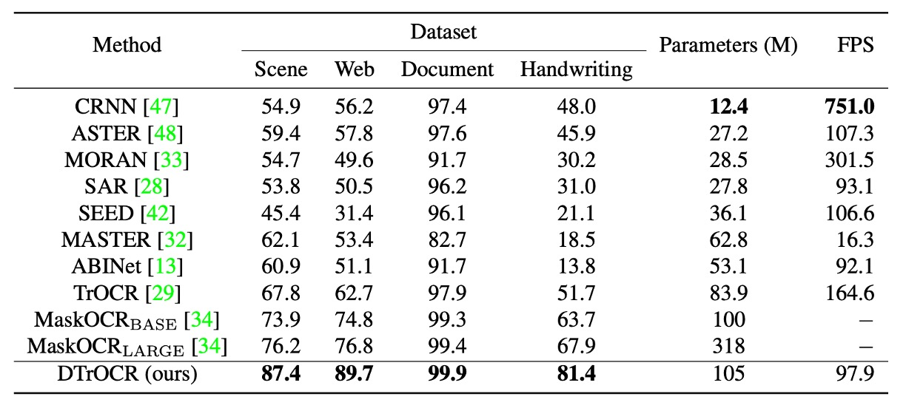

## デコーダーだけで十分

[**DTrOCR: Decoder-only Transformer for Optical Character Recognition**](https://arxiv.org/abs/2308.15996)

---

この論文を発表した機関は、日本の OCR 会社であり、少し珍しい著者グループです。

このモデルの読み方は D-TrOCR で、Decoder-only を意味します。

最初に見たとき、思わず「Doctor」と読んでしまいそうになりますね。（？）

## 問題の定義

以前に TrOCR を取り上げたことがあるので、少しは覚えているかもしれません。

:::tip
もし覚えていない場合は、以前の記事を参照してください：

- [**[21.09] TrOCR: 事前学習こそ正義**](../2109-trocr/index.md)
  :::

TrOCR は広く使われている事前学習アーキテクチャで、エンコーダモデルとデコーダモデルを組み合わせて文字認識の処理フローを構成しています。

しかし、この論文の著者たちは TrOCR のアーキテクチャに対していくつかの疑問を提起し、OCR タスクにおいてエンコーダモデルは必ずしも必要ではないと考えています：

- **おそらく、OCR タスクにはデコーダだけで十分ではないか？**

なんだか見覚えがあるような気がしませんか？

その通り！OpenAI が GPT を発表したときにも同じようなことを言っていました：デコーダだけで十分！

論文を書いていると、こうした先駆的なアイデアを異なる領域に応用することで、意外と良い論文が生まれることがあります。

## 問題解決

### モデルアーキテクチャ

<figure style={{"width": "80%"}}>

</figure>

簡単に言うと、エンコーダ部分を取り除き、画像入力を直接デコーダに渡すという構成です。

入力画像は Patch Embedding モジュールを通じて、小さなブロックに分割され、ベクトルに変換されます。入力ベクトルに位置エンコーディングを加えた後、デコーダに渡して文字生成を行います。この部分は ViT の方法と同様です。

デコーダはこれらのベクトルを受け取った後、最後に特殊なトークン「[SEP]」を追加し、「[SEP]」から文字を生成し始め、最終的に「[EOS]」トークンに達すると終了します。

予測段階では、Word Piece トークナイゼーションを使用し、Beam Search で最終的な文字出力を取得します。

デコーダのアーキテクチャは、事前学習済みの GPT-2 をそのまま使用しており、ゼロからのトレーニングは不要で、多くの時間を節約できます。

### 合成データの事前学習

元々の言語モデルは大量のテキストデータセットを使用して訓練されていましたが、このようなモデルは OCR タスクには適していません。なぜなら、モデルは画像特徴を理解せず、画像と文字を結びつけることができないからです。

そこで著者は、人工的に合成したデータセットを使用して、モデルの事前学習を行っています。このデータセットは、シーンテキスト、手書き文字、印刷文字など、さまざまな形式を含んでいます。

以前の TrOCR 論文で使用されたトレーニングデータは、PDF ファイルと商用 OCR を用いてデータアノテーションを行ったものでしたが、このようなデータ準備は時間がかかり、手間がかかります。著者はその方法を取らず、テキストコーパスを用いて人工的にデータを生成し、データの再現性を向上させることを目指しています。関連するコーパスには PILE、CC100、Chinese NLP Corpus があります。

合成データの生成プロセスは次のようになっています：

- 3 つのオープンソースライブラリを使って合成データを生成し、コーパスをランダムにシーン、印刷、手書き文字認識の 3 つのカテゴリに分け、割合を 60%、20%、20%に設定します。
- シーン文字認識用に、40 億枚の水平テキスト画像と 20 億枚の垂直テキスト画像を SynthTIGER を使って生成し、デフォルトのフォント（英語）と 64 種類の一般的なフォント（中国語）を使用します。
- MJSynth と SynthText を使用して、1 億枚の複数行の英単語画像を生成し、1 行あたり 5 単語に設定します。
- 印刷文字認識用に、20 億枚の画像を TextRender のデフォルト設定で生成します。
- 手書き文字認識用には TRDG を使用して、20 億枚の画像を生成し、5427 種類の英語および 4 種類の中国語手書きフォントを使用します。

:::tip
関連する合成ツールについて、別の場所でまとめています。興味があればこちらを参照してください：

- [**テキスト合成ツール関連リソース**](https://docsaid.org/docs/wordcanvas/tools)
  :::

### 実データの事前学習

モデルが実際の環境で適応できるようにするためには、実データを使用して微調整する必要があります。

論文で使用された実データセットは、COCO-Text、RCTW、Uber-Text、ArT、LSVT、MLT19、ReCTS です。

:::tip
この実験を行いたい場合、実データについては[**Union14M**](https://github.com/Mountchicken/Union14M)を使うことをお勧めします。これらのデータをダウンロードする時間を無駄にしないでください。
:::

### 実装の詳細

1. **モデル設定**

   - **デコーダモデル**：

     - 英語 GPT-2 と中国語 GPT-2 モデルを使用。
     - モデルの構成：
       - 12 層の Transformer
       - 各層 768 次元の隠れ層
       - マルチヘッドアテンション機構は 12 のヘッドを使用
     - Byte Pair Encoding (BPE)語彙を使用。

   - **画像 Patch Embedding**：
     - 先行研究に従い、8×4 の画像ブロックサイズを使用。
     - 相対位置エンコーディングを使用。
     - 最大トークン長さは 512 に設定。

---

2. **訓練設定**

   - **事前学習**：
     - 英語モデル：英語データセットを使用。
     - 中国語モデル：中英データセットを組み合わせて使用。
     - 訓練パラメータ：
       - 1 エポック、バッチサイズ 32。
       - AdamW オプティマイザを使用、学習率は$10^{-4}$に設定。
   - **微調整**：
     - 事前学習済みの重みで初期化。
     - ターゲットデータセットに微調整：
       - ほとんどのデータセットは 1 エポックで訓練し、学習率は$5 \times 10^{-6}$に設定。
       - SROIE データセットは 4 エポックで訓練。
     - 事前学習と同じオプティマイザとバッチサイズを使用。

---

3. **データ増強**

   - RandAugment を適用（Sharpness は除く）。
   - 以下の増強方法を追加：
     - 反転（Invert）
     - ガウシアンブラー（Gaussian Blur）
     - ポアソンノイズ（Poisson Noise）
   - RandAugment 設定：
     - 3 層戦略
     - 増強幅は 5
   - すべての画像を 128×32 ピクセルに調整。
   - 画像の元の方向を保持し、ランダムに以下の回転を適用：
     - 元の方向を保持（95%）
     - 時計回りに 90 度回転（2.5%）
     - 反時計回りに 90 度回転（2.5%）
   - 画像を範囲$[-1, 1]$に標準化。

## 討論

### STR 性能比較

<figure style={{"width": "85%"}}>

</figure>

訓練条件は合成データセットと実データセットの 2 種類に分かれ、すべてのベンチマークテストにおいて、合成データセットでも実データセットでも、DTrOCR は既存の方法を顕著に上回りました。

既存の方法（TrOCR、ABINet、PARSeq、MaskOCR など）はエンコーダを使用し、言語モデル（LM）を組み合わせて精度を向上させていますが、DTrOCR はエンコーダなしでさらに高い精度を達成しました。

以下の図に示すように、遮蔽や不規則なレイアウトに直面しても、DTrOCR は実データセット上で依然として効果的に文字認識を行い、複数行の文字を正確に認識できることが、他の多くの既存方法では達成できないことです。

<figure style={{"width": "80%"}}>

</figure>

### SROIE 性能比較

<figure style={{"width": "60%"}}>

</figure>

既存の方法は CNN 特徴抽出器または ViT ファミリの構造に依存していますが、DTrOCR はこれらの構造なしで既存の方法を上回っています。

### 手書き文字認識性能

<figure style={{"width": "60%"}}>

</figure>

ここで使用されたデータセットは IAM Handwriting Database で、この分野の研究は少ないです。過去の最良の方法は、Diaz の内部アノテーションデータセットを用いて、外部 LM および Transformer ベースの TrOCR を使用する方法でした。

しかし、DTrOCR は合成データとベンチマークデータセットのみを使用する条件下で、上記の方法を超える精度を達成しました。

### 中文認識性能

<figure style={{"width": "60%"}}>

</figure>

中文のベンチマークテストは 4 つのサブセット（シーン、ウェブページ、ドキュメント、手書き）を含みます。

:::tip
中文のベンチマークテスト部分は、過去の研究で定められた基準を参考にしています：

- [**[21.12] Benchmarking Chinese Text Recognition: Datasets, Baselines, and an Empirical Study**](https://arxiv.org/abs/2112.15093)
  :::

DTrOCR はすべてのサブセットで精度が大幅に既存の方法を上回りました。

その中で、TrOCR と MaskOCR はマスク言語モデル（MLM）に基づく事前学習方法を使用していますが、DTrOCR は生成的事前学習（次の文字トークンを生成）に基づいています。

実験結果は、生成型デコーダが中文の複雑なテキストシーケンスの処理において、より柔軟にシーケンスパターンをモデル化できることを示しています。

## 結論

著者はこの論文で非常にシンプルな文字認識モデルの構造を示し、デコーダモデルのみを使用して OCR タスクを実行できることを証明しました。

複数のベンチマークテストで、DTrOCR は精度において既存の最先端技術を上回り、また良好な汎化能力も示しました。今後はおそらく LLM の進化の道を歩み、モデルをさらに速く、より良くする方法を探ることになるでしょう。

:::tip
生成型モデルには共通の欠点があります。それは速度が遅いことです。

市販の LLM を使用しているとき、文字が 1 つ 1 つ順番に表示される様子を想像してみてください。画像内に数百個の文字がある場合、結果が出るまでどれくらい待つ必要があるでしょうか？

また、別の質問をしてみましょう：**どれくらいの待機時間を許容できますか？**

現在の OCR アプリケーションでは、ユーザーの忍耐力はおそらく 10 秒以内しか持たないでしょう。これを超えると、ユーザーは使用を諦めてしまいます。したがって、全体のパフォーマンスが非常に良好な状況下で、どのように速度を向上させるかが、次の課題となるでしょう。
:::
