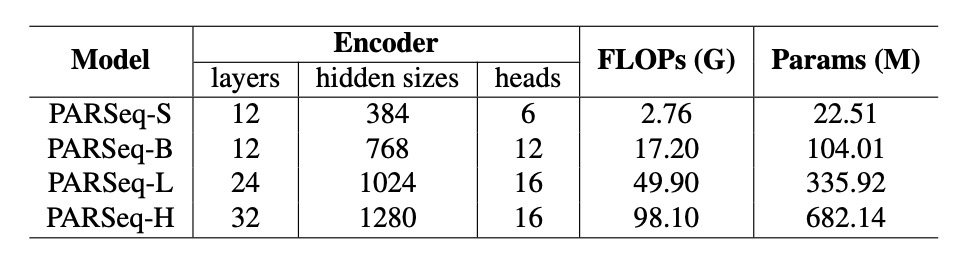
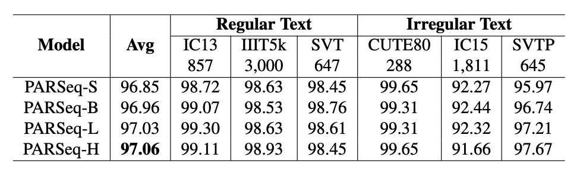
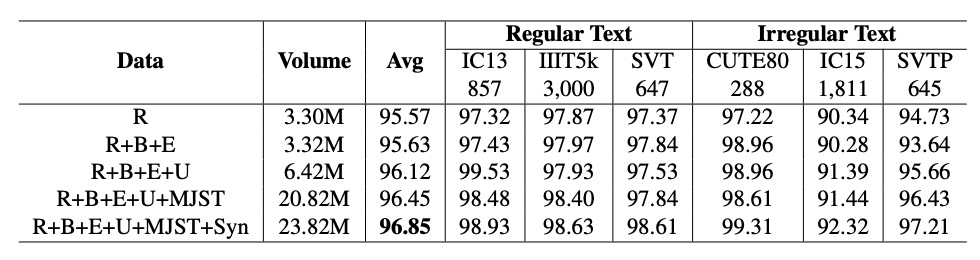
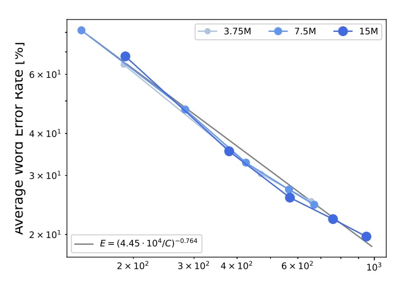
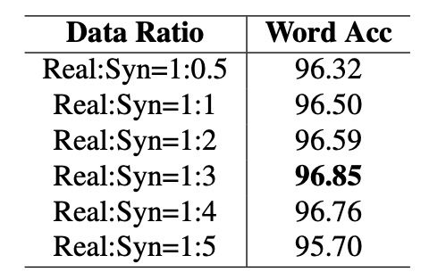
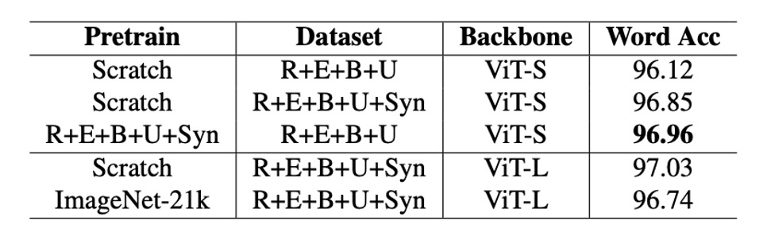

# [24.01] OCR Scaling Law

## OCR のモデルスケーリング法則

[**An Empirical Study of Scaling Law for OCR**](https://arxiv.org/abs/2401.00028)

---

数年前、NLP 分野では研究者たちがモデルのスケーリング率をまとめようと試み、いくつかの簡単な公式が整理されました。

現在、2024 年になった今でも、OCR 分野でこの問題に触れた論文はありません。

そこで、Huawei のノアの箱舟研究所がこの問題に取り組みました。

## 問題の定義

まず最初に確認すべきは、モデルが大きいほど良いということです。後続の投資が価値を持つためには、無駄なことに投資しても投資家の支持は得られません。

NLP 分野では数年前にこの問題の初歩的な探求が行われ、その後さらに深い研究が進められました。例えば、次のような研究があります：

- [**[20.01] Scaling Laws: モデルのスケーリング法則**](../../transformers/2001-scaling_laws/index.md)
- [**[22.03] Chinchilla’s Law**](https://arxiv.org/abs/2203.15556)

これらの研究は NLP 分野を基盤にしていますが、OCR 分野の研究者たちはこの問題にあまり注目していないようです。

人々はリソースを投入したいと思っていますが、投資リスクを心配しています。したがって、この問題を解決するための研究が必要です。

## 問題の解決

この論文では新しいモデルアーキテクチャは提案されていませんが、著者は実験フレームワークを設定し、モデルのスケーリング率を以下の観点から検討しています：

1. **モデルサイズ**：モデルのパラメータ数で、範囲は 5000 万から 10 億。
2. **データセットサイズ**：トレーニングデータセットのサイズで、範囲は 100 万から 10 億サンプル。
3. **計算時間**：モデルのトレーニングにかかる時間で、範囲は 100 時間から 1000 時間。

さらに、著者は新しいデータセットを導入しています：**REBU-Syn**。これは、本論文で提案されたデータセットで、実際のデータと合成データを組み合わせたもので、既存の公開データセットから整理された資料です。

### モデルの規模化

まず最初に、モデルのサイズの問題を考えます。

ここで著者は、過去の 2 つの有名な研究を引用しています：**TrOCR**と**PARSeq**。

:::tip
もしそれらを知らない場合は、以下の記事を参照してください：

- [**[21.09] TrOCR: 事前学習こそ正義**](../2109-trocr/index.md)
- [**[22.07] PARSeq: 文字の順序は読み取りに影響しない**](../2207-parseq/index.md)
  :::

TrOCR は純粋な Transformer アーキテクチャに基づく文字認識モデルで、初めて画像 Transformer とテキスト Transformer を組み合わせて OCR タスクに利用しました。

異なるモデルサイズが性能に与える影響を分析するために、著者は TrOCR のモデルサイズを拡張し、TrOCR-S から TrOCR-H まで、モデルパラメータの範囲は 4309 万から 10.37 億にしました。

- **TrOCR-S**：エンコーダは DeiT$_\text{SMALL}$、デコーダは MiniLM。
- **TrOCR-B**：エンコーダは BEIT$_\text{BASE}$、デコーダは RoBERTa$_\text{LARGE}$。
- **TrOCR-L と TrOCR-H**：エンコーダは BEIT$_\text{LARGE}$、デコーダは RoBERTa$_\text{LARGE}$。

<figure style={{"width": "80%"}}>

</figure>

---

PARSeq は、Transformer ベースのエンコーダ-デコーダアーキテクチャを使用します。

エンコーダは ViT モデルを使って画像特徴を抽出し、`[CLS]`トークンを削除して、すべての出力トークンをデコーダに入力します。デコーダは、preLayerNorm に似た Transformer デコーダを使用し、注意ヘッドの数$nhead = \frac{d_{model}}{32}$です。

OCR 分野における大規模モデルの法則を探るために、PARSeq モデルを 4 つのサイズに拡張しました：

- **PARSeq-S**：基本バージョン。
- **PARSeq-B、PARSeq-L、PARSeq-H**：モデルサイズを段階的に拡張し、モデルパラメータの範囲は 2251 万から 6.82 億、詳細な設定は以下の表に示されています。

<figure style={{"width": "80%"}}>

</figure>

### データ規模化

初期のモデル訓練は主に合成データに依存していましたが、実際のデータが増えるにつれて、実データを使用したモデル訓練の効率が高くなります。訓練データの規模を拡大するために、著者は新しいデータセットである**REBU-Syn**を作成しました。このデータセットには、約 600 万件の実データサンプルと 1800 万件の公開合成データサンプルが含まれ、その割合は 3:1 です。

:::tip
**3:1 の割合？**

これは単なる割合ではなく、後の章で著者が多くの実験を行い、この割合が最も最適であることを証明しています。
:::

実データセットは以下の部分から構成されています：

- **R グループ**：COCO-Text、RCTW17、UberText、ArT、LSVT、MLT19、ReCTS、TextOCR、OpenVINO など、一般的に使用される実データソースを含む。
- **E グループ**：文字検出タスクでよく使用される 2 つの実データセット、Total Text と CTW1500 から、実データの範囲を大幅に拡張。
- **B グループ**：IIIT 5k-word、Street View Text、ICDAR13、ICDAR15 など、ベンチマークデータソースからの訓練データ。
- **U グループ**：14 のデータセットからの 400 万枚のアノテーション付き画像を含む、Union14ML という名称のデータ。

---

公開合成データセットは以下の部分から構成されています：

- 一般的なデータセット：
  - **MJSynth (MJ)**：890 万件のデータ。
  - **SynthText (ST)**：550 万件のデータ。
- 追加の合成データ：
  - **Curved SyntheText (CST)**：曲線文字検出のためのデータ。
  - **SyntheAdd (SA)**：特殊な文字（句読点など）を含むデータを生成。

公開されている合成データセットに加えて、著者は 2 つのツール、**TextRecognitionDataGenerator**と**SynthText**を使用して、さらに多くの合成データを作成しました。

語料は、世界で最も広く使用されている英語のコーパスサイトから 70 万件のテキストを取得し、合成データの背景には SynthText が提供する自然なシーン画像が選ばれました。

:::tip
いくつかの関連する合成ツールについては、別の場所でまとめています。興味があれば参照できます：

- [**テキスト合成ツール関連リソース**](https://docsaid.org/docs/wordcanvas/tools)
  :::

### 実験設定

異なるモデルアーキテクチャに基づいて、著者は異なるハイパーパラメータを設定しました：

- **TrOCR**モデル：
  - **TrOCR-S**：バッチサイズ$1024$、学習率$4 \times 10^{-4}$。
  - **TrOCR-B**：バッチサイズ$256$、学習率$1 \times 10^{-4}$。
  - **TrOCR-L**：バッチサイズ$128$、学習率$4 \times 10^{-5}$。
- **PARSeq**モデル：
  - 一貫した学習率$7 \times 10^{-4}$、バッチサイズは可能な限り$1024$に設定。

テキストのトークン化ツールには**BPE (Byte Pair Encoding)** [68]と**SentencePiece** [37]を使用し、テキスト行をサブワード単位に分割します。

- [**[15.08] Neural Machine Translation of Rare Words with Subword Units**](https://arxiv.org/abs/1508.07909)
- [**[18.08] SentencePiece**](https://arxiv.org/abs/1808.06226)

主な評価指標は**単語精度**で、最終出力文字列は標準的な$36$文字セット（小文字のアルファベットと数字）に正規化され、異なるモデルとデータセット間の公平な比較を確保します。

## 討論

モデル性能$E$は主に以下の三つの変数に影響されます：

- **モデルパラメータ数$N$**：モデルの複雑さと容量。
- **訓練データ量$D$**：訓練に使用できるデータの規模。
- **モデル計算量$C$**：モデルの計算資源要求、FLOPs や GPU トレーニング時間を含む。

実験の目的は、モデル性能$E$と$N$、$D$、$C$のべき乗則の関係を記述し、リソースの投入によりモデル性能が効果的に向上するスムーズなスケーラブルなパターンが存在するかどうかを確認することです。

### モデルサイズのべき乗則の関係

- **TrOCR モデル**：

  

  <figure style={{"width": "80%"}}>
  
  </figure>
  

  パラメータ数$N$とモデル性能$E$はべき乗則の関係にあり、公式は次のようになります：

  $$
  E(N) = \frac{1.97 \times 10^4}{N^{0.223}}
  $$

  最初の三つのモデル（TrOCR-S、TrOCR-B、TrOCR-L）を基にべき乗則の式を当てはめた結果、最後のモデル（TrOCR-H）はフィッティング直線と高い一致を示し、べき乗則の有効性を証明しています。

- **PARSeq モデル**：

  

  <figure style={{"width": "80%"}}>
  
  </figure>
  

  TrOCR と同様に、PARSeq のパラメータ数$N$と性能$E$もべき乗則の関係にあります：

  $$
  E(N) = \frac{6.316 \times 10^{-74}}{N^{0.018}}
  $$

### データ量のべき乗則の関係

- **TrOCR モデル**：

  

  <figure style={{"width": "80%"}}>
  
  </figure>
  

  データ量$D$とモデル性能$E$はべき乗則の関係にあり、公式は次のようになります：

  $$
  E(D) = \frac{1.84 \times 10^5}{D^{-0.3271}}
  $$

  結果は、データ量の変化（青線）とべき乗則の式（灰色実線）が一致しており、データ量が性能に与える顕著な影響を確認しました。

- **PARSeq モデル**：

  

  <figure style={{"width": "80%"}}>
  
  </figure>
  

  データ量の増加に伴い、性能が顕著に向上しています。データは上表に示されています。

### 計算資源のべき乗則の関係

<figure style={{"width": "80%"}}>

</figure>

計算資源$C$とモデル性能$E$はべき乗則の関係にあり、公式は次のようになります：

$$
E(C) = \frac{4.45 \times 10^4}{C^{-0.3271}}
$$

結果は、誤差率と計算資源の関係がべき乗則によって説明できることを示しており、詳細なデータは上図の灰色実線に示されています。

### 合成データと実データの比率

<figure style={{"width": "50%"}}>

</figure>

実データは訓練効率において通常合成データよりも優れていますが、コストが高く、量も限られているため、合成データは依然として欠かせません。

そのため、著者は実データ量を固定し、合成データの比率を 0.5 倍から 5 倍まで段階的に増加させ、モデル精度の変化を観察しました。上表に示されています。

結果は、合成データと実データの比率が 1:3 の時にモデル精度が最高の 96.85%に達し、この比率を超えると精度が低下し始め、データの分布が合成データに偏りすぎることが性能に影響を与えている可能性があります。

### 事前学習の必要性

<figure style={{"width": "80%"}}>

</figure>

事前学習されたモデルが OCR 性能を向上させるかどうかについては、過去の研究結果が一致していません。

著者は論文内で、ImageNet-21k で事前学習されたモデルとゼロから訓練したモデルを OCR タスクで比較しました。

実験では、ImageNet-21k で事前学習されたモデルは PARSeq および CLIP4STR でのパフォーマンスがゼロから訓練したモデルに劣っていました。これは、OCR 特定のタスクでないモデルの事前学習が OCR 性能に有益でない、または有害である可能性があることを示しています。

OCR タスクに基づく事前学習モデルを使用すると、性能を効果的に向上させることができます。例えば、REBU-Syn データセットで訓練された PARSeq-S モデルは、実データ REBU で訓練した結果よりも精度 96.85%に達し、さらに実データ REBU で微調整した結果、精度は 97.01%に向上しました。

実験結果に基づき、著者は最適な実践方法として以下を推奨しています：

1. 合成データと実データを含む完全なデータセットで最初にモデルを訓練する
2. 実データで微調整して、さらに精度を向上させる。

### 他のモデルとの比較

<figure style={{"width": "85%"}}>

</figure>

最後に著者は CLIP4STR を再訓練し、**3:1 の合成データと実データの比率**でモデルを訓練し、タスク関連の事前学習モデルで微調整を行いました。

実験結果は、CLIP4STR-B の精度が**96.54%**から**97.25%**に向上し、増加幅は**0.65%**、テキスト認識タスクの新記録となったことを示しています。CLIP4STR-L モデルはさらに精度を向上させ、**6 つの一般的なテスト基準**で**97.42%**の Top-1 平均精度を達成しました。

:::tip
CLIP4STR の論文を再確認したところ、実験データがこの論文と一致しないことが判明しました。ここでのデータは著者自身の訓練結果であり、元の論文のデータではない可能性があります。

また、もし CLIP4STR をまだ見ていない場合、こちらの以前の記事をご参考ください：

- [**[23.05] CLIP4STR: 多モーダルの祝福**](../2305-clip4str/index.md)
  :::

## 結論

本研究では、「モデルの規模」、「データ量」、「計算資源」とモデル性能との間にべき乗則の関係があることを確認し、これら三つの要素が増加することで、モデル性能が予測可能に向上することが分かりました。

訓練段階では、著者は最適な性能を得るために、実データと合成データの比率を 3:1 にすることを推奨しています。また、「タスク関連」の事前学習モデルを使用することで、モデル性能が効果的に向上することが確認されました。

:::tip
最近流行している VLM の事前学習モデルは、OCR タスクに対して有用でしょうか？この論文の結論によると、これらの事前学習モデルが OCR タスクに特化していない限り、効果はないかもしれません。

しかし、CLIP のような一部の古典的な VLM は、この論文と比較して訓練量が 20 倍以上多いため、これらの大型 VLM に基づく結論が本当に正しいのか、もう少し議論が必要かもしれません。

結局、事前学習が OCR 性能を向上させるかどうか？私たちはまだ議論を続ける必要があると思います。
:::
