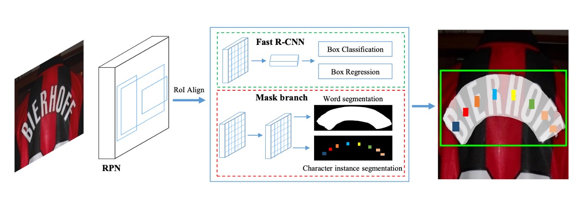
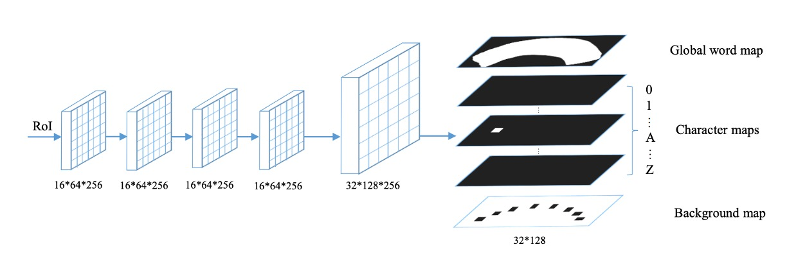
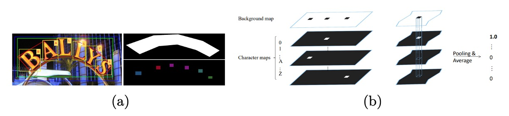
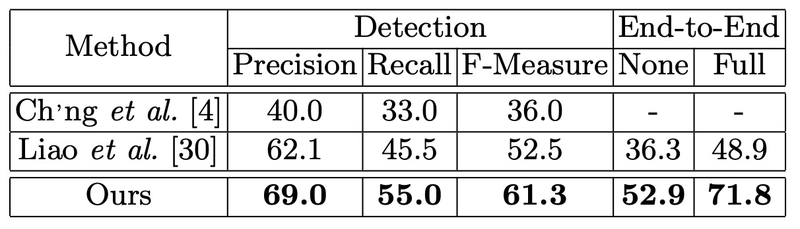

## 位置と認識

[**Mask TextSpotter: An End-to-End Trainable Neural Network for Spotting Text with Arbitrary Shapes**](https://arxiv.org/abs/1807.02242)

---

この論文を初めて見たとき、モデルの設計思想や図の作成方法がどこかで見たことがあるように感じました。そこで、著者のチームを調べてみると、Face++ に所属しており、CA-FCN と同じ著者グループであることが分かりました！

- [**[18.09] CA-FCN: 新しい次元の導入**](../../text-recognition/1809-cafcn/index.md)

彼らの多くの論文は CVPR に発表されており、この分野で非常に大きな影響力を持っています。

---

この論文に戻ると、著者は Mask R-CNN に触発され、ピクセル単位での予測方法を用いてテキストの位置とカテゴリを直接予測しています。

Mask R-CNN に敬意を表して、著者はこのモデルを Mask TextSpotter と呼んでいます。

## 問題の定義

現実のシーンでは、テキストの形状が大きく異なる可能性があります。水平方向、垂直方向、曲がったもの、斜めのもの...

あなたが考えつくことができる、あるいは考えつかないような形状が存在します。

---

テキスト検出方法は通常、物体検出の設計理念に基づいていますが、物体検出方法は変化するテキスト形状に適応しきれず、効果があまり良くありません。

また、テキスト認識方法では、まだこの時期は CTC を使う方法が一般的でしたが、この方法は水平方向のテキストには適していても、曲がったテキストの認識にはうまくいきません。

では、テキストの位置を同時に検出し、認識も行える方法はないのでしょうか？

魚と熊掌、どちらも欲しいです！

## 問題の解決

### モデルアーキテクチャ

このモデルのアーキテクチャは比較的簡略に描かれていますが、論文の内容と照らし合わせて確認しました。

このアーキテクチャには、上図に示すように、4 つの主要な部分が含まれています：

1. **特徴ピラミッドネットワーク (Feature Pyramid Network, FPN)** がバックボーンネットワークとして使用されています。
2. **領域提案ネットワーク (Region Proposal Network, RPN)** はテキストの提案を生成します。
3. **Fast R-CNN** は境界ボックス回帰を担当します。
4. **マスク分岐 (Mask Branch)** はテキストインスタンス分割と文字分割を担当します。

### バックボーン & ネック

異なるスケールの高階意味特徴マップを構築するために、著者は ResNet-50 をバックボーンとして使用し、特徴ピラミッド構造 (FPN) を組み合わせています。ピラミッド構造は、異なる解像度の特徴を上から下へと統合し、精度を向上させるとともに、計算コストをわずかに増加させます。

### 領域提案ネットワーク

領域提案ネットワーク（RPN）は、Fast R-CNN とマスク分岐にテキスト提案を生成します。

各段階で異なるサイズのアンカーを設定し、アンカーの面積は次の通りです：

- $32^2, 64^2, 128^2, 256^2, 512^2$ ピクセルで、これらは 5 つの段階：$\{P_2, P_3, P_4, P_5, P_6\}$ に対応します。

各段階では、3 種類のアスペクト比 $\{0.5, 1, 2\}$ で訓練が行われます。

領域特徴抽出には **RoI Align** が使用され、これは **RoI Pooling** よりも位置情報をより正確に保持し、マスク分岐の分割タスクに非常に役立ちます。

### Fast R-CNN 分岐

訓練段階では、RPN が最初に多くのテキスト提案を生成し、その後、提案された領域特徴（RoI features）を Fast R-CNN 分岐とマスク分岐に入力します。Fast R-CNN 分岐には **分類タスク** と **回帰タスク** が含まれています。

分類は、テキスト提案を **テキスト** または **非テキスト** と分類することを指し、回帰はテキスト提案の境界ボックスを調整することを指します。

この分岐の主な機能は、RPN によって生成された提案を **RoI Align** によって抽出し、$7 \times 7$ の解像度に調整することによって、より正確な境界ボックスを生成することです。

### マスク分岐

マスク分岐（Mask Branch）は、**テキストインスタンス分割** と **文字分割** の 2 つのタスクを含んでおり、上図に示されているように処理されます。

各入力 RoI（サイズは固定で $16 \times 64$）について、4 層の畳み込み層と 1 層の転置畳み込み層を経て、マスク分岐は 38 の出力マップを生成します。これらには以下が含まれます：

- **テキストインスタンスマップ**：上図の `Global word map` に示されているように、テキスト領域を定位することを目的としています。
- **36 の文字マップ**：上図の `Character map` に示されているように、26 の英文字と 10 のアラビア数字に対応します。
- **文字背景マップ**：上図の `Background map` に示されているように、非文字領域をマークし、後処理に使用されます。

:::tip
ここでの設計は大文字と小文字を区別しないため、英字は 26 字母のみです。
:::

### ラベル生成

- **RPN と Fast R-CNN の目標生成**

  まず、**多角形**のアノテーションデータを、該当する多角形をカバーする**最小の水平矩形**に変換します。その後、[8, 40, 32] の方式で **RPN** と **Fast R-CNN** の目標を生成します。

- **マスク分岐のラベル生成**

  RPN によって生成された提案とアノテーションデータ $P$ と $C$（存在する場合）に基づき、2 種類のマスク画像を生成する必要があります：

  1. **グローバルテキストインスタンス分割図**（Global Map）：テキスト領域の位置決め。
  2. **文字セマンティック分割図**（Character Map）：文字クラスのアノテーション。

- **グローバルインスタンス分割図の生成**

  初期値が 0 のマスク図に多角形を描き、その内部領域を 1 で塗りつぶします。

- **文字分割図の生成**

  

  上図のように、文字ボックスの**中心点を固定**し、各辺を元の長さの四分の一に縮小します。縮小された文字ボックス内で、ピクセル値を対応する文字クラスのインデックスに設定します。文字ボックス外の領域では、ピクセル値を 0 に設定し、文字ボックスのアノテーションデータがない場合、すべてのピクセル値を $-1$ に設定します。

### 損失関数

上記に示されたように、いくつかの分岐があります。

したがって、ここでは**マルチタスク損失関数**を使用して最適化を行います。式は次の通りです：

$$
L = L_{\text{rpn}} + \alpha_1 L_{\text{rcnn}} + \alpha_2 L_{\text{mask}}
$$

- $L_{\text{rpn}}$ と $L_{\text{rcnn}}$ はそれぞれ RPN と Fast R-CNN の損失関数です。
- $L_{\text{mask}}$ はマスク分岐の損失関数で、以下を含みます：

  - グローバルテキストインスタンス分割損失：$L_{\text{global}}$
  - 文字分割損失 $L_{\text{char}}$：

    $$
    L_{\text{mask}} = L_{\text{global}} + \beta L_{\text{char}}
    $$

この作業では、ハイパーパラメータ $\alpha_1, \alpha_2, \beta$ は実験により 1.0 に設定されています。

- **テキストインスタンス分割損失**

  テキストインスタンス分割の出力は、グローバルマスク図です。$N$ をマスク図のピクセル数、$y_n \in \{0, 1\}$ をピクセルラベル、$x_n$ をモデルの出力ピクセル値とした場合、$L_{\text{global}}$ は次のように定義されます：

  $$
  L_{\text{global}} = -\frac{1}{N} \sum_{n=1}^{N} \left[ y_n \cdot \log(S(x_n)) + (1 - y_n) \cdot \log(1 - S(x_n)) \right]
  $$

  ここで $S(x)$ は **シグモイド関数** で、出力を 0 と 1 の間の確率にマッピングします。

- **文字分割損失**

  文字分割の出力は 37 枚のマスク図（36 の文字クラスと 1 つの背景クラスに対応）を含みます。出力されたマスク図 $X$ は $N \times T$ の行列として扱われ、$T$ はクラス数、$N$ は各図内のピクセル数です。

  加重空間ソフトマックス損失は次のように定義されます：

  $$
  L_{\text{char}} = -\frac{1}{N} \sum_{n=1}^{N} W_n \sum_{t=0}^{T-1} Y_{n,t} \log\left( \frac{e^{X_{n,t}}}{\sum_{k=0}^{T-1} e^{X_{n,k}}} \right)
  $$

  ここで $Y$ は対応するアノテーションデータで、**$W$** は正のサンプルと背景クラスの損失を平衡させるための重みです。

  背景ピクセルの数を $N_{\text{neg}}$ とし、背景クラスのインデックスを 0 とします。

  重み $W_i$ は次のように計算されます：

  $$
  W_i =
  \begin{cases}
  1 & \text{if} \quad Y_{i,0} = 1, \\
  \frac{N_{\text{neg}}}{N - N_{\text{neg}}} & \text{otherwise}
  \end{cases}
  $$

### 推論段階

推論段階では、シグモイド関数がグローバルマスク図の生成に使用され、ソフトマックス関数が文字分割図の生成に使用されます。

訓練過程と異なり、マスク分岐の入力はもはや RPN からではなく、Fast R-CNN の出力を提案として使用します。なぜなら、Fast R-CNN の結果の方がより正確だからです。

推論過程の詳細な手順は次の通りです：

1. **テスト画像の入力**：最初に、テスト画像をモデルに入力し、Fast R-CNN で候補ボックスを取得します。
2. **冗長なボックスの除去**：非最大抑制 (NMS) を使用して、冗長な候補ボックスを除去します。
3. **マスク画像の生成**：残された候補ボックスをマスク分岐に入力し、**グローバルマスク画像**と**文字マスク画像**を生成します。
4. **テキスト輪郭の抽出**：グローバルマスク画像内のテキスト領域の輪郭を計算し、予測された多角形を生成します。
5. **文字列の生成**：提案された**ピクセル投票アルゴリズム**を使用して、文字マスク画像から文字列を生成します。

### ピクセル投票アルゴリズム

ピクセル投票アルゴリズム（Pixel Voting）は、予測された文字マスク画像をデコードして文字列に変換する方法で、具体的な手順は次の通りです：

1. **背景画像の二値化**：背景画像のピクセル値（0 から 255 の範囲）を閾値 192 で二値化処理します。
2. **連結領域の検出**：二値化された画像に基づき、すべての連結領域を抽出します。
3. **平均値の計算**：各文字マスク画像内の各領域について、すべてのピクセルの平均値を計算し、その領域がその文字クラスに属する確率として使用します。
4. **文字クラスの割り当て**：平均値が最も高い文字クラスをその領域に割り当てます。
5. **文字の並べ替え**：英語の書き順に従い、すべての文字を左から右に並べ、文字列を生成します。

## 討論

### 水平テキスト認識

著者は **ICDAR2013** データセットを使用して、水平テキスト検出と認識におけるモデルのパフォーマンスを評価しました。すべての入力画像の短辺を 1000 に調整し、オンラインで評価を行いました。

結果は、単一スケールで評価を行った場合でも、モデルは F-Measure で **91.7%** を達成し、複数スケールで評価された以前の方法を上回りました。単語検索（Word Spotting）タスクでは、モデルは以前の最良の方法と同等のパフォーマンスを示しました。エンドツーエンド認識（End-to-End Recognition）タスクでは、モデルは **1.1% − 1.9%** の改善を達成しました。

### 傾斜テキスト認識

**ICDAR2015** データセットで実験を行い、傾斜テキストの検出と認識におけるモデルの優位性を検証しました。ICDAR2015 データセットには多くの小型テキストが含まれているため、著者は三つの異なるスケールの入力画像でテストを実施しました：

- **元のサイズ**：720 × 1280
- **二つの拡大サイズ**：入力画像の短辺を 1000 と 1600 に調整

結果は、元のサイズでモデルの F-Measure は **84%** となり、複数スケールで評価された最良の方法を **3.0%** 上回りました。拡大サイズでは、F-Measure は **86.0%** に達し、他の競争者を少なくとも **5.0%** 上回りました。

単語検索およびエンドツーエンド認識の評価では、この論文の方法はどちらのタスクでも優れたパフォーマンスを示し、最先端の方法に比べて全体のパフォーマンスは **13.2% − 25.3%** 改善されました。

### 曲線テキスト認識

曲線テキストに対する堅牢性を確認するために、著者は **Total-Text** データセットでテストを行い、テスト画像の短辺を 1000 に調整しました。ここでは ICDAR2015 のプロトコルに従いつつ、四辺形のアノテーション方式を**任意の頂点数**をサポートするよう変更し、多角形テキスト領域を処理できるようにしました。

結果は、Mask TextSpotter が検出精度において過去の文献を **8.8** パーセントポイント上回り、エンドツーエンド認識では少なくとも **16.6%** 改善されました。

安定性の差異は以下の図に示されています。上段は TextBoxes の結果、下段は Mask TextSpotter の結果です。

- [**[16.11] TextBoxes: A Fast Text Detector with a Single Deep Neural Network**](https://arxiv.org/abs/1611.06779)

:::tip
著者は、モデルの検出パフォーマンスの顕著な向上が**より正確な位置出力**に起因していると分析しています。テキスト領域を水平矩形ではなく**多角形**で囲むことによって、さらに Mask TextSpotter の方法が**二次元空間内の文字列**（例えば曲線）を効率的に処理できることが示されています。一方、従来の系列認識ネットワークは**一次元系列**にしか適用できません。
:::

### 可視化結果

## 結論

Mask TextSpotter は、水平テキスト（ICDAR2013）、傾斜テキスト（ICDAR2015）、および曲線テキスト（Total-Text）の強力な処理能力を示しました。不規則なテキスト形状に対する処理において、従来の方法が曲線テキスト認識での欠点を補完しています。

そのエンドツーエンドのアーキテクチャは、効率を向上させるだけでなく、モデルが検出、単語検索、エンドツーエンド認識などの複数のタスクで優れたパフォーマンスを発揮することを可能にしました。今後の学術研究や実務応用において、非常に有用な参考になるでしょう。

:::tip
予測ヘッドの数は分類する文字の数に依存します。もし分類する文字数が非常に多い場合、例えば一般的な中国語の 8000 字を分類する場合、この設計方法ではモデルが非常に大きくなり、実際の応用には適さない可能性があります。

この問題には今後多くの後続研究があり、時間があればさらに深く議論したいと思います。
:::
