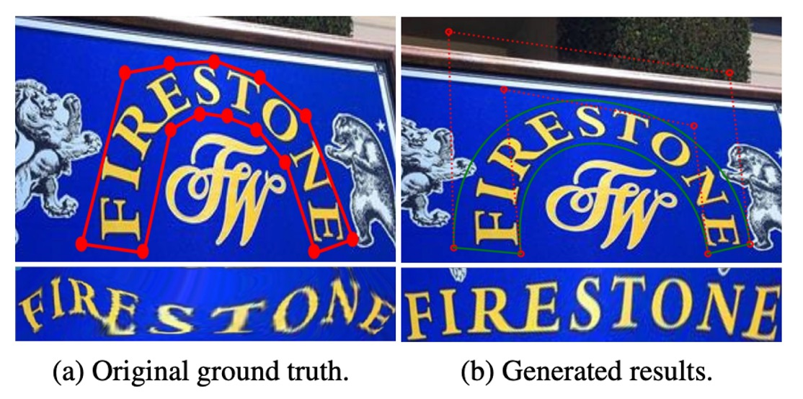

## ベジエ曲線の挨拶

[**ABCNet: Real-time Scene Text Spotting with Adaptive Bezier-Curve Network**](https://arxiv.org/abs/2002.10200)

---

OCR はすでに数年の歴史がありますが、テキスト検出と認識のタスクは依然として挑戦的な問題です。

## 問題の定義

テキスト検出と認識は OCR の二大タスクです。

テキスト検出は、画像内でテキストの位置を見つけるタスクで、これは多くの方法が「物体検出」や「物体セグメンテーション」の手法から派生しています。しかし、テキストはしばしば斜め、歪んだ、または曲線的に配置されていることが多く、これらの特性によりテキスト検出はさらに困難になります。

テキスト認識は、テキストの位置が特定された後、テキストを認識可能な文字に変換するタスクです。しかし、テキスト検出の誤差に制約され、テキスト認識の精度にも影響を与えます。そこで、テキストが不規則であることを前提に、入力テキストを不規則な形状と仮定して、直接不規則なテキストを認識する方法がいくつか提案されています。その中には、STN（空間変換ネットワーク）や二次元注意メカニズムを基にした方法もあります。

過去の手法を振り返ると、以下のようになります：

著者は、これらの複数段階の複雑な設計がシステムを複雑で遅くし、実際のアプリケーションではメンテナンスが難しく、実用的でないと考えています。そこで、テキストの変形問題を解決するために、著者は「ベジエ曲線」を導入し、テキストの形状をフィッティングすることで、テキスト検出と認識の両方を解決する「ベジエ補正ネットワーク」を提案しています。

え、ベジエ曲線？それは何ですか？

## ベジエ曲線

- [**Bézier curve-Wikipedia**](https://en.wikipedia.org/wiki/B%C3%A9zier_curve)

ベジエ曲線は、**滑らかな曲線**の形状を記述するための**数学的曲線**です。これは**コンピュータグラフィックス、フォント制作、アニメーション、UI デザイン**などの分野で非常に一般的に使用され、さまざまな曲線効果を作成するのに役立ちます。曲線は一組の**制御点**によって生成されます。曲線の始点と終点は制御点の端点であり、中間の制御点が曲線の曲がり方を決定します。これらの制御点は必ずしも曲線上に存在するわけではなく、曲線の形状に影響を与えます。

ベジエ曲線は、異なるサイズでスケーリングしても滑らかさを維持するため、さまざまな形状（直線から曲線、さらには複雑な幾何学的形状）を表現するのに使用できます。

最後に、さまざまな階数のベジエ曲線とその形状を見てみましょう：

- **一次（線形）ベジエ曲線**：2 つの制御点の間の直線。

  - $B(t) = (1 - t) P_0 + t P_1, \quad 0 \leq t \leq 1$

    

- **二次（放物線）ベジエ曲線**：3 つの制御点。

  - $B(t) = (1 - t)^2 P_0 + 2(1 - t)t P_1 + t^2 P_2, \quad 0 \leq t \leq 1$

    

- **三次ベジエ曲線**（最も一般的）：4 つの制御点、フォント、アニメーション、UI デザインなどで使用されます。

  - $B(t) = (1 - t)^3 P_0 + 3(1 - t)^2 t P_1 + 3(1 - t) t^2 P_2 + t^3 P_3$

    

- **四次ベジエ曲線**：5 つの制御点。

  - $B(t) = (1 - t)^4 P_0 + 4(1 - t)^3 t P_1 + 6(1 - t)^2 t^2 P_2 + 4(1 - t) t^3 P_3 + t^4 P_4$

    

- **五次ベジエ曲線**：6 つの制御点。

  - $B(t) = (1 - t)^5 P_0 + 5(1 - t)^4 t P_1 + 10(1 - t)^3 t^2 P_2 + 10(1 - t)^2 t^3 P_3 + 5(1 - t) t^4 P_4 + t^5 P_5$

    

:::info
上記の GIF 画像はすべて、Wikipedia のベジエ曲線紹介ページからのものです。
:::

## 問題の解決

ベジエ曲線を見た後、まるでこの論文を読み終わったかのように感じます。（~実際はそうではありませんが~）

### モデルアーキテクチャ

著者は過去の「アンカーボックス」や「多段階」の設計を排除し、ベジエ曲線を使ってテキストの形状を記述し、任意の形状のテキストを検出するための**エンドツーエンド**の訓練フレームワークを提案しています。

ベジエ曲線については上記で説明しましたが、著者の分析により、**三次ベジエ曲線**がほとんどの曲がったテキスト形状を効果的に表現できると考えています。したがって、**8 つの制御点**を使って、境界ボックス内のテキスト形状を記述しています。

<figure style={{"width": "80%"}}>

</figure>

制御点の回帰学習は**相対距離**によって行われ、これによりモデル設計が簡素化され、精度も向上します。数学的には次のように表されます：

$$
\Delta x = b_i^x - x_{\text{min}}, \quad \Delta y = b_i^y - y_{\text{min}}
$$

ここで、$x_{\text{min}}$ と $y_{\text{min}}$ は四つの頂点の最小の $x$ と $y$ 値です。

予測ヘッドは 1 層の畳み込み層のみで、出力は 16 チャンネルで $\Delta x$ と $\Delta y$ を学習します。これにより計算コストが非常に低く、結果は正確です。

:::tip
テキスト領域は上層曲線と下層曲線に分けて、テキスト領域を囲むため、1 つの三次ベジエ曲線には 4 つの制御点が必要です。2 つの曲線で合計 8 つの制御点が必要になります。

各点の座標は $(x, y)$ であり、8 つの制御点には 16 の座標があります。
:::

### ベジエ曲線のデータ生成

現在の訓練データセットには、ベジエ曲線のアノテーションデータは存在しません。

そのため、著者は既存のアノテーションデータを基に、ベジエ曲線の Ground Truth を生成する方法を提案しました。

この方法では、**Total-Text** や **CTW1500** といったデータセットにある多角形のアノテーション点を使い、**最小二乗法**を通じて、三次ベジエ曲線の最適なパラメータを求めます：

$$
\begin{bmatrix}
B_{0,3}(t_0) & \cdots & B_{3,3}(t_0) \\
B_{0,3}(t_1) & \cdots & B_{3,3}(t_1) \\
\vdots & \ddots & \vdots \\
B_{0,3}(t_m) & \cdots & B_{3,3}(t_m)
\end{bmatrix}
\begin{bmatrix}
b_{x0} & b_{y0} \\
b_{x1} & b_{y1}\\
b_{x2} & b_{y2}\\
b_{x3} & b_{y3}\\
\end{bmatrix}
=
\begin{bmatrix}
p_{x0} & p_{y0} \\
p_{x1} & p_{y1} \\
\vdots & \vdots \\
p_{xm} & p_{ym}
\end{bmatrix}
$$

ここで、$m$ は多角形のアノテーション点の数、$t$ は折れ線の累積長さと周囲の比率を基に計算されます。以下の図はその一例です：

### 訓練データ合成

エンドツーエンドのシーンテキスト検出モデルを訓練するためには、大量の合成された無料データが必要です。しかし、現在の**SynText**データセット（80 万枚の画像）は、主に直線的なテキストに四角形の境界ボックスが提供されているだけで、任意の形状のシーンテキストのニーズには対応していません。そこで、著者はデータセットを拡張し、15 万枚の多様な画像を合成して、モデルの曲線テキスト検出能力を向上させました。

新しいデータセットは次のように構成されています：

- **94,723 枚の画像**：主に**直線的なテキスト**を含む。
- **54,327 枚の画像**：主に**曲線的なテキスト**を含む。

データの出所は以下の通りです：

- **VGG 合成法**を用いてこれらの合成画像を生成。
- **COCO-Text**データセットから**4 万枚の無文字背景画像**を選択。

COCO-Text から取得した背景画像には、各背景に対するセグメンテーションマスクを準備し、各背景のシーン深度情報も用意して、テキストと背景の融合効果を高めています。さらに、文字形状の多様性を増やすために、VGG 合成法を改良し、異なるスタイルのアートフォントと豊富な文字データを追加し、生成した文字には曲線変形や多様な配置を施して、さまざまなシーンにおけるテキストスタイルをシミュレートしました。各文字インスタンスには、自動的に多角形のアノテーションが生成され、外形が記述されています。

さらに、著者は多角形アノテーションを三次ベジエ曲線の Ground Truth に変換し、モデルがさまざまな曲線的なテキストの形状を正確にフィットできるようにし、検出性能を向上させました。これにより、データ生成プロセスが簡素化され、モデルが任意の形状のシーンテキストを検出できる能力が強化され、実際のシーンアプリケーションのニーズに対応しています。

合成データの結果は以下の通りです：

### ベジエ補正法

従来のサンプリング方法は以下の通りです：

- [**RoI Pooling**](https://arxiv.org/abs/1707.03985)
- [**RoI Rotate**](https://arxiv.org/abs/1801.01671)
- [**Text-Align-Sampling**](https://arxiv.org/abs/1803.03474)
- [**RoI Transform**](https://arxiv.org/abs/1812.09900)

**BezierAlign** は RoIAlign を基にした拡張ですが、RoIAlign とは異なり、**非矩形のサンプリンググリッド**を使用して特徴を整列させます。特徴整列グリッドの各列は、ベジエ曲線の境界と垂直に一致するため、整列精度が保証されます。サンプリングポイントは幅と高さで均等に分布し、**バイリニア補間**を使用してサンプリング結果を計算します。

特徴マップとベジエ曲線の制御点が与えられた場合、矩形出力特徴マップの各ピクセル位置を計算できます。

出力特徴マップのサイズを $h_{\text{out}} \times w_{\text{out}}$ とした場合、計算プロセスは以下の通りです：

- 第 $i$ 番目のピクセル $g_i$ の水平位置を $(g_{iw}, g_{ih})$ として記録します。
- 次の式を使用してパラメータ $t$ を計算します：

  $$
  t = \frac{g_{iw}}{w_{\text{out}}}
  $$

- $t$ とベジエ曲線方程式を使用して、上辺の点 $t_p$ と下辺の点 $b_p$ を計算します。

- $t_p$ と $b_p$ を基に、次の式でサンプリング点 $o_p$ の位置を計算します：

  $$
  op = bp \cdot \frac{g_{ih}}{h_{\text{out}}} + tp \cdot \left(1 - \frac{g_{ih}}{h_{\text{out}}}\right)
  $$

- $o_p$ の位置が得られたら、**バイリニア補間**を用いて最終結果を計算します。

BezierAlign は任意の形状のテキスト領域を処理でき、矩形グリッドの制約を受けません。特に曲線的なテキストの検出と認識に適しており、高効率でセグメンテーション処理を必要とせず、計算過程が簡素化されます。従来の方法と比較して、BezierAlign は特徴整列の精度と効率において顕著な改善を見せます。詳細な比較は以下の通りです：

### テキスト予測ヘッド

<figure style={{"width": "80%"}}>

</figure>

検出分岐と共有するバックボーンネットワークの特徴および BezierAlign に基づいて、著者は**軽量なテキスト認識分岐**を設計しました。構成は以下の通りです：

- **畳み込み層**：6 層、最初の 4 層のストライドは 1、残りの 2 層は垂直ストライドが 2、水平ストライドが 1。
- **平均プーリング**：高さ方向に平均プーリングを行い、出力サイズを $(n, 256, 1, w)$ に圧縮。
- **チャンネル並べ替え**：テンソルの形状を調整し、**BLSTM**に入力。
- **BLSTM**：出力サイズは $(w, n, 512)$ で、文字の双方向シーケンス情報をキャプチャ。
- **全結合層**：最終出力は $(w, n, n_{\text{class}})$ で、$n_{\text{class}} = 97$（大文字、小文字、数字、記号、その他の特殊文字および終了符号 EOF をカバー）。

訓練段階では、認識分岐がベジエ曲線の GT から RoI 特徴を直接抽出し、検出分岐と認識分岐は相互に影響しません。テキストの整列には「CTC Loss」を使用して、出力分類結果とテキストを整列させ、モデルの訓練安定性を確保します。

推論段階では、RoI 領域は検出分岐から得られたベジエ曲線の結果で置き換えられ、テキストが曲線領域に正確に整列することを保証します。

### 訓練設定

- **ResNet-50** と特徴金字塔ネットワーク（FPN）を使用。
- 5 つの異なる解像度の特徴マップで **RoIAlign** を使用：
  - 特徴マップ解像度は入力画像の $1/8, 1/16, 1/32, 1/64, 1/128$。
- 3 つの異なるサイズの特徴マップで **BezierAlign** を適用：
  - 特徴マップサイズは入力画像の $1/4, 1/8, 1/16$。
- 公開されている**英単語レベルのデータセット**を使用して事前訓練：
  - 15 万枚の合成データ。
  - COCO-Text データセットから選ばれた 1.5 万枚の画像。
  - ICDAR-MLT データセットから 7,000 枚の画像。
- 事前訓練後、ターゲットデータセットの訓練セットでファインチューニングを行う。

---

データ拡張戦略は次の通りです：

- **ランダムスケーリング訓練**：
  - 短辺のサイズは 560〜800 の範囲でランダムに選択。
  - 長辺のサイズは最大 1333 に制限。
- **ランダムクロップ**：
  - クロップ後の領域は元画像の半分以上で、文字が切れないようにする。
  - 特殊な状況ではクロップを行わない。

---

ハードウェア環境は以下の通りです：

- **4 枚の Tesla V100 GPU** を使用して訓練。
- バッチサイズは 32。

---

訓練パラメータは以下の通りです：

- **最大イテレーション数**：150,000 回。
- **初期学習率**：0.01。
- 学習率調整：
  - 70,000 回目のイテレーションで 0.001 に減少。
  - 120,000 回目のイテレーションで 0.0001 に再度減少。

訓練は約 3 日で完了しました。

## 討論

著者は**Total-Text** データセットを用いて比較実験とアブレーション実験を行い、その結果は以下の通りです：

### BezierAlign 効能分析

<figure style={{"width": "80%"}}>

</figure>

BezierAlign の効果を検証するために、著者は **Total-Text** でアブレーション実験を実施し、サンプリングポイント数が結果に与える影響を調査しました。実験結果は以下の通りです：

サンプリングポイント数が **(7, 32)** の場合、F-measure と FPS（1 秒あたりのフレーム数）のバランスが最適であることが確認され、著者はこの設定を後続の実験で使用しました。また、BezierAlign と従来のサンプリング方法を比較した結果（以下の表）、BezierAlign はエンドツーエンドの検出精度を大幅に向上させることが示されました：

<figure style={{"width": "80%"}}>

</figure>

### ベジエ曲線効能分析

<figure style={{"width": "80%"}}>

</figure>

分析結果は上記の通りで、ベジエ曲線による検出は標準的な境界ボックス検出と比較して、追加の計算コストを導入していないことが確認されました。

### Total-Text での実験結果

著者は **ABCNet** と他の方法を比較しました。その結果は以下の通りです：

- **単一スケール推論**：ABCNet は高いパフォーマンスを維持しながら、ほぼリアルタイムの推論速度を実現し、速度と精度の最適なバランスを達成しました。
- **複数スケール推論**：精度がさらに向上し、ABCNet は複数スケール推論下で**最新技術のパフォーマンス**を達成しました。特に、実行時間において他の方法を大きく上回る結果を示しました。
- ABCNet の加速バージョンは、精度が同等であるにもかかわらず、推論速度が以前の最良方法より**11 倍以上速い**という結果となりました。

## 結論

ABCNet は過去の ROI Proposal の設計を継承し、最初にベジエ曲線を導入し、さらに**BezierAlign** 層を提案して、特徴マップとベジエ曲線の境界を整列させ、テキスト検出と認識の精度を向上させました。また、著者は新たなデータ合成方法を提案し、さまざまなテキスト画像を生成することで、モデルの汎化能力をさらに高めました。

本論文の設計思想は、今後のテキスト検出と認識タスクに新たな視点と発展方向を提供しており、今後の研究や探討において重要な意味を持つといえます。
