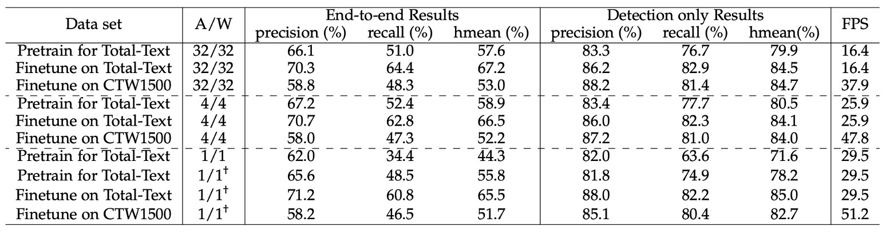

## 一ビットの攻防

[**ABCNet v2: Adaptive Bezier-Curve Network for Real-time End-to-end Text Spotting**](https://arxiv.org/abs/2105.03620)

---

第 1 版の論文投稿後、いくつかのレビューコメントが寄せられました。

著者は内容を部分的に修正し、いくつかの章を追加しました。このバージョンを第 1 版と区別するため、「ABCNet v2」と名付けられています。

内容の大部分やトレーニング方法は同じであるため、ここでは新たに追加された部分についてのみ議論します。ABCNet の基本的な概念について知りたい方は、以下の過去の記事をご参照ください。

- [**[20.02] ABCNet: ベジェ曲線の挨拶**](../2002-abcnet/index.md)

## 問題の定義

他の研究に触発され、著者は ABCNet をアップグレードすることを決定しました。

主な参考対象は以下の通りです。

1. [**[19.11] Efficientdet: Scalable and efficient object detection**](https://arxiv.org/abs/1911.09070)
   - この論文で提案された BiFPN は、FPN を最適化する方法であり、著者はこれを ABCNet に適用しました。
2. [**[18.07] An intriguing failing of convolutional neural networks and the coordconv solution**](https://arxiv.org/abs/1807.03247)
   - この論文では CoordConv が提案され、座標情報の CNN における重要性が議論されています。
3. [**[20.03] Solov2: Dynamic and fast instance segmentation**](https://arxiv.org/abs/2003.10152)
   - この論文では CoordConv がインスタンスセグメンテーションに適用されており、著者もこれを ABCNet に取り入れました。

---

改良後の ABCNet v2 の主な貢献点は以下の通りです。

- ベジェ曲線文字表現方法の提案。（これは第 1 版と同じです。）
- BezierAlign 特徴整列方法の提案。（これも第 1 版と同じです。）
- BiFPN を使用し、双方向多スケールピラミッドによる全体的なテキスト特徴。（新規追加部分。）
- 適応型エンドツーエンドトレーニング戦略の提案。（新規追加部分。）
- 中国語認識データセットの追加で、中国語認識をサポート。（新規追加部分。）
- モデルの量化による推論速度の向上。（新規追加部分。）

## 問題解決

ここでは新たに追加された部分について説明します。

### モデルアーキテクチャ

### 座標畳み込みモジュール

これは前述の CoordConv に該当します。過去の研究によれば、従来の畳み込みは(x, y)座標とピクセル空間座標の対応に制限があるとされています。

この問題を解決するため、本バージョンでは相対座標と特徴マップを結合し、座標情報を含む新たな特徴$f_{coord}$を形成しました。これをカーネルサイズ 3、ストライド 1、パディング 1 の 3 層畳み込み層に通し、後続のネットワークに入力することで、シーンテキスト検出の効果を向上させています。

### 注意機構に基づく認識ブランチ

認識ブランチは、6 層の畳み込み層、1 層の双方向 LSTM、1 つの注意機構モジュールで構成されています。認識過程では、過去の隠れ状態と加重和を利用して文字を逐次予測します。カテゴリ数は 96（英字のみ）または 5462（中英二言語）であり、注意重みの計算は以下のように表されます。

$$
e_{t,s} = K^\top \tanh(W h_{t-1} + U h_s + b)
$$

加重和：

$$
c_t = \sum_{s=1}^n a_{t,s} h_s
$$

隠れ状態の更新：

$$
h_t = \text{GRU}((\text{embed}_{t-1}, c_t), h_{t-1})
$$

### 適応型エンドツーエンドトレーニング

原文では Adaptive End-to-End Training、論文中では AET と略されています。

ABCNet 第 1 版では、トレーニング段階で真のアノテーションによるベジェ曲線整列のみが文字認識ブランチの入力として使用され、テスト段階では検出結果が特徴切り出しに使用されていました。

著者は、検出結果が真のアノテーションのベジェ曲線境界ほど正確でない場合、誤りが生じる可能性があることを観察しました。

:::tip
典型的なエラー伝播の問題です。トレーニング中の入力がすべて正確であるため、下流タスクで誤りに対応できなくなります。
:::

この問題を解決するため、著者は「適応型エンドツーエンドトレーニング（Adaptive End-to-End Training, AET）」というシンプルかつ効果的な戦略を提案しました。その主なプロセスは以下の通りです。

1. **検出結果のフィルタリング**：検出結果はまず信頼度の閾値によってフィルタリングされ、非極大値抑制（NMS）によって冗長な検出結果が除去されます。
2. **認識アノテーションの割り当て**：制御点座標の距離総和を最小化する基準で、各検出結果に対応する認識アノテーションが割り当てられます。以下の式で表されます。

   $$
   \text{rec} = \arg \min_{\text{rec}^* \in cp^*} \sum_{i=1}^n |cp^*_{x_i, y_i} - cp_{x_i, y_i}|
   $$

   ここで、$cp^*$は制御点の真のアノテーションを表し、$n$は制御点の数です。この方法により、各検出結果が最も近いアノテーションに一致することが保証されます。

3. **アノテーションセットの更新**：新たなターゲットを元の真のアノテーションセットと結合し、以降の認識トレーニングに使用します。

### モデル量化

著者はモデル量化の技術を用いて、異なる精度におけるモデルのパフォーマンスと推論速度を検討しました。これは現在のテキスト検出分野では比較的少ない研究です。

:::tip
モデル量化は大きなテーマであり、さらに動的量化、静的量化、混合量化などに細分化できます。本章では量化の理論全体が記載されていますが、「モデル量化理論の理解」部分は主題から逸れるため、興味のある読者はモデル量化理論を調べてみることをお勧めします。
:::

## 討論

### アブレーション実験

各コンポーネントの効果を評価するため、著者は Total-Text と SCUT-CTW1500 の 2 つのデータセット上でアブレーション研究を実施しました。

以下の表に基づき、主な実験結果は以下の通りです：

1. **注意認識モジュール**：注意認識モジュールを追加した結果、Total-Text データセットの精度が 2.7% 向上し、SCUT-CTW1500 では 7.9% 向上しました。
2. **BiFPN アーキテクチャ**：BiFPN アーキテクチャを使用すると、Total-Text で 1.9%、SCUT-CTW1500 で 1.6% の精度向上が得られ、推論速度はわずか 1 FPS 低下しただけで、速度と精度のバランスが取れました。
3. **座標畳み込み (CoordConv)**：座標畳み込みを導入した結果、両データセットでそれぞれ 2.8% と 2.9% の精度向上が見られ、ほとんど追加の計算コストはありませんでした。
4. **適応型エンドツーエンド学習 (AET)**：AET 戦略を採用した結果、両データセットでそれぞれ 1.2% と 1.7% 精度が向上しました。
5. **Bezier 曲線階数**：著者は Bezier 曲線の階数設定が結果に与える影響を検討し、4 階の Bezier 曲線で再生成されたラベルを用いて ABCNet v2 をトレーニングしたところ、特にテキスト行ラベルを使用する SCUT-CTW1500 データセットで効果が向上しました。しかし、Total-Text データセットでは 5 階の Bezier 曲線を使用すると、ベースラインモデルと比較して精度が 66.2% から 65.5% に低下しました。著者は、階数が高すぎると制御点が激しく変動し、回帰が困難になる可能性があると推測しています。

### テキスト検出手法の比較

検出タスクの実験は、任意形状データセット（Total-Text と SCUT-CTW1500）、多方向データセット（MSRA-TD500 と ICDAR 2015）、およびバイリンガルデータセット ReCTS を含む 4 つのデータセット上で実施されました。

実験結果は上表の通りで、ABCNet v2 の手法はすべてのデータセットで最新技術を上回る最高の性能を達成し、既存の最良手法を凌駕しました。

### テキスト認識手法の比較

エンドツーエンドのシーンテキスト検出タスクにおいて、ABCNet v2 は SCUT-CTW1500 および ICDAR 2015 データセットで最高のパフォーマンスを達成し、以前の手法を大きく上回りました。

### モデルの量化効果の評価

<figure>

<figurecaption>"A/W" はそれぞれアクティベーションと重みのビット幅構成を表し、"†" は漸進的な学習戦略を採用したことを示します。</figurecaption>
</figure>

---

著者は量化モデルについて多くの検討を行いました。

まず、低ビットモデルを合成データセット上で事前学習し、その後 TotalText と CTW1500 で微調整を行って性能を向上させました。

事前学習段階では、26 万回のイテレーションを行い、バッチサイズは 8、初期学習率を 0.01 に設定し、16 万回と 22 万回のイテレーションで学習率を 1/10 に減少させました。

TotalText 上で微調整する際には、バッチサイズを 8 のまま、初期学習率を 0.001 に設定し、5000 回のイテレーションを実施しました。CTW1500 の微調整設定は同様ですが、総イテレーション回数は 12 万回で、8 万回目で学習率を 1/10 に減少させました。入力層と出力層以外のすべての畳み込み層が量化されました。

実験結果は上表の通りで、以下の点が確認されました：

- **4 ビットモデル**：その性能はほぼフル精度モデルと同等でした。

  - 合成データセットで事前学習された 4 ビットモデルのエンドツーエンド Hmean スコア（57.6%）は、フル精度モデル（58.9%）よりも優れていました。
  - TotalText と CTW1500 で微調整した結果、4 ビットモデルのエンドツーエンド Hmean はフル精度モデルよりもそれぞれ 0.7% と 0.8% 低いだけでした。

  これらの結果は、シーンテキスト検出タスクにおいてフル精度モデルにかなりの冗長性が存在することを示し、画像分類や物体検出タスクでも同様の観察結果が得られています。

- **1 ビットモデル（バイナリネットワーク、BNN）**：

  エンドツーエンド Hmean はわずか 44.3% で、性能が大幅に低下しました。

  この問題を補うため、著者は漸進的な学習戦略（†で示される）を提案し、量化ビット数を徐々に減らす（例：4 ビット → 2 ビット → 1 ビット）ことで BNN の性能を大幅に向上させました。

  新たな学習戦略の後、合成データセットでトレーニングされた BNN のエンドツーエンド Hmean は、フル精度バージョンよりもわずか 1.8% 低い（57.6% 対 55.8%）だけでした。

## 結論

本論文では、注意認識モジュール、BiFPN 構造、座標畳み込み、新しい適応型エンドツーエンド学習戦略など、いくつかの新しいコンポーネントがテストされました。

著者は多くのトレーニング手法と戦略を示しており、本論文には学ぶべき点が多く、実務にも応用可能な要素が含まれています。
