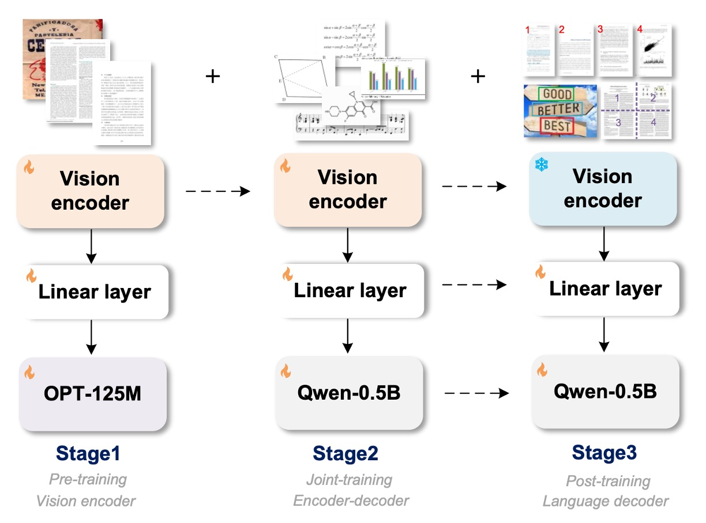
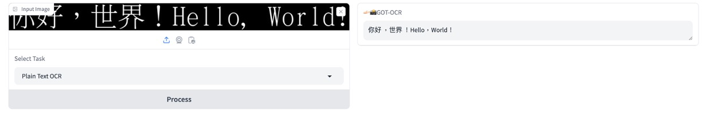

## OCR モデルを統一する

[**General OCR Theory: Towards OCR-2.0 via a Unified End-to-end Model**](https://arxiv.org/abs/2409.01704)

---

これは中国の旷视科技によって提案された End-to-End OCR に関する論文です。

## 問題の定義

OCR は広く使用されている技術で、典型的なシステムは主に複数のモジュールで構成されたパイプライン設計に基づいており、検出、切り出し、認識が含まれます。各モジュールはそれぞれの役割を担い、通常は特定のタスクに対して異なるモデルが開発されますが、全体として局所的最適解に陥りやすく、メンテナンスが不便です。

したがって、著者はこれまでのパイプライン型システム設計に基づくモデルは「OCR 1.0 モデル」であるとし、現在新たに提案するのは、すべてを 1 つのモデルに統合した「All-In-One」モデルです。このモデルにはいくつかの特徴があります：

1. 統一された端到端モデルであること
2. 従来の OCR モデルと LVLM モデルの OCR タスクにおけるボトルネックを解決できること
3. 広範な OCR タスクに対応可能であること

そして、このモデルは **GOT-OCR2.0** と名付けられました！

:::tip
論文からの直接的な引用：

---

`Typical OCR systems in the OCR-1.0 era are mainly designed based on a multi-modular pipeline style, commonly including element detection, region cropping, and character recognition parts.`

---

`Accordingly, we propose the general OCR theory, i.e., OCR-2.0, to break the bottlenecks of both traditional and LVLM manners on OCR tasks.`

---

これらの 2 つの段落で、著者はパイプライン型 OCR システム構造を基準に、OCR 1.0 時代と OCR 2.0 時代のモデルを区別しています。
:::

## 問題の解決

### モデルアーキテクチャ

上の図は、モデルアーキテクチャを示すとともに、訓練過程も示しています。

モデルアーキテクチャは 3 つの部分に分かれています：

- **Vision Encoder**：これは画像の特徴を抽出する画像エンコーダ層です。
- **Linear**：これは線形変換層で、エンコーダ層とデコーダ層の特徴次元を橋渡しします。
- **Text Decoder**：これはテキストデコーダ層で、入力された画像情報を元にテキストを生成します。

訓練過程も 3 段階に分かれています：

### 第 1 段階の訓練

著者は ViTDet のエンコーダ構造を採用しました。この構造は局所的な注意機構により、高解像度の画像における計算コストを大幅に削減でき、パラメータ数は約 80M です。訓練には 500 万の画像-テキストペアが使用されました。

- [**[22.03] Exploring Plain Vision Transformer Backbones for Object Detection**](https://arxiv.org/abs/2203.16527)

アーキテクチャ設計は**Vary**の設定に従ってエンコーダの最後の 2 層を設計し、1024×1024×3 の入力画像を 256×1024 の画像トークンに変換します。これらの画像トークンはその後、1024×768 の線形層を通じて、言語モデル（OPT-125M）の次元に射影されます。

- [**[23.12] Vary: Scaling up the vision vocabulary for large vision-language models**](https://arxiv.org/abs/2312.06109)

前処理の段階では、異なる形状の画像を直接 1024×1024 の正方形にリサイズし、異なるアスペクト比を持つ画像の要求をバランスよく調整します。

---

訓練データは 2 種類に分かれています：

- **自然シーンデータ**

  英語の画像は Laion-2B データセットからサンプリングされ、中文の画像は Wukong データセットから取得されました。これらのシーンでのテキストは PaddleOCR ツールを使用して擬似ラベルを取得します。このステップでは、200 万のデータが収集され、英語と中国語が半分ずつを占めています。

  :::tip
  PaddleOCR の出力結果をそのまま訓練ラベルとして使用しています。
  :::

- **ドキュメントレベルデータ**

  著者は Common Crawl からオープンソースの PDF ファイルを収集し、Fitz Python パッケージを使用して対応する密なテキストコンテンツを抽出しました。ここで合計 120 万対の PDF タイプの画像-テキスト対応データが得られ、解析した境界ボックスで PDF 画像を切り出し、80 万の行および段落レベルの画像片段データを得ました。

最後に、テキストアノテーション処理は 2 つの方法で行われました：

- 境界ボックスを削除し、上から下、左から右の順にテキスト内容を組み合わせます。
- 境界ボックスに基づいて元の画像からテキスト領域を切り出し、画像片段として保存します。この方法で、100 万の片段タイプの画像-テキスト対応データが得られました。

### 第二階段訓練

視覚エンコーダの事前訓練段階が終了した後、次は「マルチタスク共同訓練」を通じてモデルの知識を拡張します。

この段階では、第一段階で使用された OPT-125M モデルを放棄し、Qwen-0.5B モデルに切り替えます。このモデルは 500M のパラメータを持ち、複数言語の事前知識を備えています。線形埋め込み層の次元は 1024×1024 に調整され、Qwen-0.5B の入力チャンネルに適合させます。最終的に GOT はエンコーダ-デコーダ形式を採用し、総パラメータ数は約 580M です。

GOT のプロセスでは、入力画像は 1024×1024 ピクセルであり、その後 256 個のトークンに圧縮されます。デコーダはこれらのトークンを参照して OCR 結果を予測し、最大長さは 8K です。

---

訓練データは再考する必要があり、この段階では著者は OCR の知識をより多く注入できることを望んでいます。

そのため、著者はさまざまなデータ生成方法とエンジンを探索しました：

- **純粋な OCR データ**

  80％は 3.2.2 節で説明されたデータを OCR データとして使用し、手書き文字認識タスクを追加しました。これには、異なる言語のさまざまな手書きスタイルが含まれています。データセットには、中文 CASIA-HWDB2、英語 IAM、およびノルウェー語 NorHand-v3 が含まれています。

- **Mathpix-markdown 形式データ**

  特に数式や表の高い可読性を保つために、著者はさまざまな方法で大量のフォーマット済みデータを収集しました：

  - **数式**：Arxiv から.tex ソースファイルを取得し、約 100 万の数式フラグメントを抽出して Mathpix 形式に変換し、最終的に PNG 画像としてレンダリングしました。
  - **分子式**：ChEMBL_25 ファイルから 200 万の smiles ソースを取得し、Mathpix と rdkit.Chem ツールを使用して約 100 万の分子式画像-テキストペアデータを生成しました。
  - **表**：.tex ファイルから 30 万の表ソースを抽出し、LATEX で画像としてレンダリングしました。
  - **全ページデータ**：Nougat 方法を使用して、50 万の英語 Markdown PDF-テキストデータおよび 50 万の中文 Markdown データを取得しました。さらに、著者は Mathpix を使用して 20 万の内部データ（書籍、論文、財務報告書など）を直接マークアップしました。

- **より広範な OCR データ**

  GOT がより一般的な光学文字認識を処理できるように、著者は 3 つの関連する課題データを収集しました：

  - **楽譜**：GrandStaff データセットを使用してレンダリングし、約 50 万の単一システム楽譜データを取得しました。
  - **幾何図形**：TikZ を使用して円、矩形、三角形、および単純な関数曲線などの基本的な幾何図形を構築し、最終的に約 100 万の幾何 TikZ データを取得しました。
  - **グラフ**：OneChart を参考にして、Matplotlib および Pyecharts を使用してグラフデータをレンダリングし、最終的に 200 万のグラフデータを取得しました。その半分は Matplotlib から、もう半分は Pyecharts から取得されています。

### 第三段階訓練

第二段階が終了すると、実際にはモデルは多くの OCR タスクに対応できるようになっていますが、最後に著者はモデルにさらに多くの機能を提供できるようにしたいと考え、この段階では 3 つの新機能を提案しました：

- **細粒度インタラクティブ OCR のデータエンジン**

  細粒度 OCR は高いインタラクティブ性を持つ機能で、空間座標や色によって制御される領域レベルの視覚的認識です。ユーザーは、問題提示でフレーム座標（フレーム誘導 OCR）や色テキスト（色誘導 OCR）を追加することで、関心のある領域（RoI）内の文字を認識し、無関係な文字の出力を避けることができます。

  自然シーンの細粒度 OCR データはオープンソースデータセットから取得され、RCTW、ReCTS、ShopSign、COCO-Text が含まれています。これらのデータセットはテキストの境界ボックスを提供し、直接細粒度 OCR データを生成します。文書レベルの細粒度は、スキャン形式の PDF ファイルを除外し、Python ライブラリ Fitz/PDFminer を使用して残りの部分を解析することによって得られます。ページ画像、各行/段落の境界ボックス、および対応するテキストが記録され、フレーム誘導 OCR のアノテーションデータが生成されます。

- **超大画像 OCR の複数切り出しデータエンジン**

  GOT は 1024×1024 の入力解像度をサポートしており、これでほとんどの一般的な OCR タスク（シーン OCR や A4 ページ PDF OCR など）に対応できます。一部の非常に大きな画像を処理する必要があるシーン（例えば、2 ページの PDF の横向き結合）について、GOT は大きなスライディングウィンドウを使用して動的解像度を実現します。

- **複数ページ PDF ファイルのバッチ OCR データエンジン**

  一般的な OCR タスクでは、「for ループ」を使用してページ単位で処理できますが、いくつかの書式設定された PDF ファイル（例えば、Arxiv の.tex ファイル）のようにページごとに分解するのが困難な場合、これは適用できません。GOT の複数ページ OCR 機能は、PDF ファイルの複数ページをバッチ処理でき、「for ループ」を使用する必要がありません。これにより、PDF のページ分割によるアノテーションの断裂問題を心配する必要がなくなります。

  この機能を実現するために、著者は Mathpix 形式の PDF データから 2 ～ 8 ページをランダムに抽出し、単一の OCR タスクに結合しました。各ページには 650 トークン未満のテキストが選ばれ、全体の長さが 8K を超えないようにします。最終的に、約 20 万の複数ページ OCR データが生成され、その多くは英中ページが交互に含まれています。

### 訓練戦略

著者は 8×8 L40s GPU を使用して訓練を行い、前述の三段階の訓練に合わせて次のように進めました：

- **事前訓練段階**：全モデルパラメータは AdamW オプティマイザを使用し、バッチサイズは 128、訓練は 3 エポック、初期学習率は 1e-4、最大トークン長さは 4096 に設定されました。
- **共同訓練段階**：最大トークン長さは 6000 に増加し、事前訓練と同じオプティマイザ設定を使用し、訓練は 1 エポック行いました。
- **後訓練段階**：最大トークン長さは 8192 に拡張され、初期学習率は 2e-5、訓練は 1 エポック行い、複数ブロック/ページ OCR 機能をサポートしました。

## 討論

### 純文本文件 OCR 性能

上記の表から、主要な評価指標は編集距離、F1 スコア、精度、再現率、BLEU、METEOR であり、単語単位の分割で計算されています。GOT（580M）は、純粋な PDF テキスト OCR タスクにおいて卓越したパフォーマンスを発揮し、その優れた PDF テキスト認識能力を証明しました。

### 場景文本 OCR 性能

著者はここで、中文と英文から収集した 400 枚の自然画像を使用し、場景テキスト OCR のベンチマークテストを行いました。シーン画像におけるテキストは比較的短いため、文字単位での分割を使用して指標を計算しました。

GOT は自然画像においても非常に優れたパフォーマンスを発揮し、このモデルがほとんどの基本的な OCR タスクで優れたパフォーマンスを持つことを証明しました。

### フォーマットされたファイル OCR 性能

データは著者が準備した 90 ページのサンプルから取得し、Mathpix によって擬似ラベルを生成し、手動で誤りを修正しました。単一解像度（1024×1024）の GOT は満足のいく結果を提供し、動的解像度戦略は小さなテキストの数式や表でさらに優れたパフォーマンスを発揮しました。

### 細粒度 OCR 性能

GOT は細粒度 OCR（フレーム誘導とカラー誘導の OCR タスク）で卓越したパフォーマンスを発揮し、Fox を上回る結果を示し、このモデルが優れたインタラクティブ OCR 能力を持つことを証明しました。

## 結論

GOT はその構造が比較的シンプルであり、純粋な OCR タスクに特化しているため、複数のタスクで優れたパフォーマンスを示しています。その最大の強みは、さまざまな OCR タスクを統合できる能力にあります。これには、文書レベルのテキスト認識、シーンテキスト認識、細粒度のインタラクティブ OCR、フォーマットされたファイル認識、そしてより一般的な文字認識が含まれます。この能力により、従来の OCR タスクだけでなく、未来の発展に対応できる柔軟性も備えています。

関連モデルは Hugging Face で公開されています：[**GOT-OCR2.0**](https://huggingface.co/stepfun-ai/GOT-OCR2_0)

テスト機能は、ウェブのデモページから直接試すことができます：[**Online Demo**](https://huggingface.co/spaces/stepfun-ai/GOT_official_online_demo)

:::tip
私たち自身でテストを行った結果、PDF 論文を入力すると、GOT-OCR2.0 は文字内容を直接抽出でき、多言語に対応しており、非常に良い結果を示しました！

ただし、モデルが見たことのないフォーマットの場合、いくつかの問題が発生することがあります。例えば、MIDV-2020 のパスポート画像を入力すると、GOT-OCR2.0 はパスポートのフォーマットを理解できず、断片的な文字内容のみを抽出することができました。

微調整データを自分で準備するか、著者が提供するデータエンジンを使用して微調整を行う必要があります。

:::
