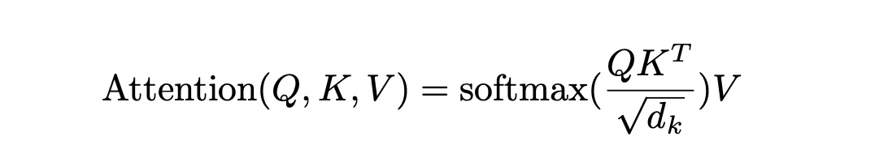
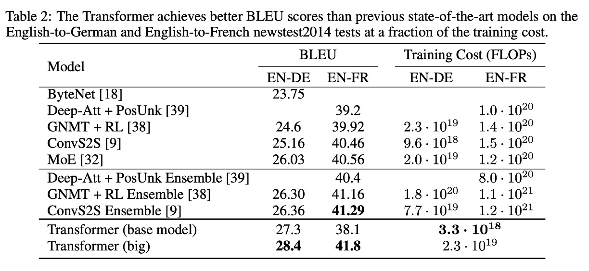

# [17.06] Transformer

## 新世界の起点

[**Attention Is All You Need**](https://arxiv.org/abs/1706.03762)

---

過去の時系列モデルとは異なり、Transformer モデルの提案は、自己注意力機構の新しい時代の幕開けとなりました。

このモデルは、シーケンスの再帰的な計算に依存することなく、注意機構を使用してシーケンスモデリングを実現し、モデルの訓練と推論のプロセスをより効率的にしました。

## 問題の定義

過去のシーケンスモデリングタスクでは、RNN および LSTM モデルが主流でした。

しかし、これらのモデルは訓練と推論のプロセスにおいていくつかの問題を抱えていました。

### 1. 再帰計算の制限

RNN および LSTM モデルは、訓練プロセスにおいてシーケンス内の各要素を逐次的に計算する必要があり、これが計算の直列化を引き起こし、モデルが効率的な並列計算を行うことを難しくしました。

### 2. 長距離依存問題

RNN および LSTM モデルの再帰計算方式により、モデルは長いシーケンスを処理する際、シーケンス内の遠い位置の依存関係を捉えるのが難しくなります。

## 問題の解決

### モデル設計


これは元の論文に提供された Transformer モデルのアーキテクチャ図です。

このアーキテクチャ図は非常にシンプルに描かれていますが（？？？）、ほとんどの人は最初にこれを見ても理解できないことが多いです。

信じてください、これは本当にシンプルです！

ここで、実際の動作を確認するために簡単なコードを書いてみましょう：

### 入力層

ここでの入力は時系列データで、テンソル（Tensor）として表現されます。

- 最初の次元：バッチサイズ（Batch Size）、以下 `B` と略します。
- 2 番目の次元：シーケンス長（Sequence Length）、以下 `T` と略します。
- 3 番目の次元：特徴次元（Feature Dimension）、以下 `D` と略します。

まずは簡単な例を見てみましょう：

```python
input_text = ['あなた', 'は', '元気', 'です', 'か', '。']
input_text_mapping = {
    'あなた': 0,
    'は': 1,
    '元気': 2,
    'です': 3,
    'か': 4,
    '。': 5
}
```

この例では、入力内容は「あなたは元気ですか。」で、6 つの単語があります。

:::info
ここでは訓練プロセスを大きく簡略化しており、理解を容易にするためのものです。
:::

次に、この入力をテンソルに変換します：

```python
import torch
import torch.nn as nn

input_tensor = torch.tensor([
    input_text_mapping[token]
    for token in input_text]
)
print(input_tensor)
# >>> tensor([0, 1, 2, 3, 4, 5])
```

次に、各要素を埋め込み（Embedding）します。

```python
embedding = nn.Embedding(num_embeddings=6, embedding_dim=512)
embedded_input = embedding(input_tensor)
print(embedded_input)
# >>> tensor([[ 0.1,  0.2,  0.3,  ...,  0.4],
#             [ 0.5,  0.6,  0.7,  ...,  0.8],
#             [ 0.9,  1.0,  1.1,  ...,  1.2],
#             [ 1.3,  1.4,  1.5,  ...,  1.6],
#             [ 1.7,  1.8,  1.9,  ...,  2.0],
#             [ 2.1,  2.2,  2.3,  ...,  2.4]])
print(embedded_input.shape)
# >>> torch.Size([6, 512])
```

:::tip
埋め込み（Embedding）は特別な技術ではなく、各要素をより高次元の空間に投影するだけで、実際には 1 つの線形変換層のみが含まれています。
:::

最後に、入力が 3D テンソルである必要があることを忘れないでください。そのため、バッチサイズの次元を追加する必要があります。この例ではバッチサイズは 1 です。

```python
embedded_input = embedded_input.unsqueeze(0)
print(embedded_input.shape)
# >>> torch.Size([1, 6, 512])
```

### 位置エンコーディング

元々の RNN および LSTM モデルでは、モデルはシーケンス内の要素の位置を通じてシーケンス内の依存関係を捉えることができました。

そのため、特別な位置エンコーディングを設計する必要はなく、モデルは各 For-Loop の反復ごとに暗黙的に位置情報を保持していました。

しかし、Transformer アーキテクチャではこのような暗黙の位置情報は存在せず、ここには線形変換層しかありません。線形変換層内では、各要素は独立しており、相関関係はなく、内部に何の関連情報も持っていません。そのため、モデルがシーケンス内の位置情報を捉えるためには、追加の位置エンコーディングが必要です。

本論文では、著者は単純な位置エンコーディング方法を提案しています。すなわち、正弦と余弦関数を使用して位置エンコーディングを生成する方法です：


上記の公式に基づいて、位置エンコーディングの関数を実装してみましょう：

```python
import math
import torch

def sinusoidal_positional_encoding(length, dim):
    """ 非再帰型ニューラルネットワーク用の正弦波位置エンコーディング
        参照文献: Attention Is All You Need
        URL: https://arxiv.org/abs/1706.03762
    """
    if dim % 2 != 0:
        raise ValueError(
            '正弦/余弦位置エンコーディングは '
            f'奇数次元（dim={dim}）では使用できません')

    # 位置エンコーディング
    pe = torch.zeros(length, dim)
    position = torch.arange(0, length).unsqueeze(1)
    div_term = torch.exp(
        (torch.arange(0, dim, 2, dtype=torch.float) * -(math.log(10000.0) / dim)))
    pe[:, 0::2] = torch.sin(position.float() * div_term)
    pe[:, 1::2] = torch.cos(position.float() * div_term)

    return pe
```

この関数は、シーケンスの長さと特徴次元を考慮して、各位置に固定の位置エンコーディングを割り当てます。

位置エンコーディングを可視化してみましょう。シーケンスの長さが 256、特徴次元が 512 の場合を仮定します：

```python
import cv2
import numpy as np

pos_mask = sinusoidal_positional_encoding(256, 512)
pos_mask = pos_mask.numpy()
pos_mask = (pos_mask-pos_mask.max()) / (pos_mask.max()-pos_mask.min())
pos_mask = np.array(pos_mask * 255).astype(np.uint8)
pos_mask = cv2.applyColorMap(pos_mask, cv2.COLORMAP_JET)
```


:::tip
**あの数式の中の 10000 は何ですか？**

この 10000 の物理的な意味は、位置エンコーディングのスケールとして解釈できます。位置エンコーディングのスケールを適切な範囲に制限することで、異なる位置間の関係を効果的に捉えつつ、非常に高いまたは低い周波数が引き起こす悪影響を避けることができます。

もし位置エンコーディング内の 10000 を 100 に変更すると、正弦および余弦関数の周波数が増加し、各位置の位置エンコーディングがより短い距離で周期的に繰り返されるようになります。これにより、モデルが遠くの位置間の関係を捉える能力が低下する可能性があります。なぜなら、それらの位置エンコーディングがより大きな類似性を示すからです。
:::

位置エンコーディングを得たら、それを入力の埋め込みテンソルに加算する必要があります：

```python
pos_emb = sinusoidal_positional_encoding(4, 512)
embedded_input = embedded_input + pos_emb
```

### 自注意力

入力エンコーディングを取得した後、Transformer モデルのコア部分である自注意力に進むことができます。

ここでは、3 つの変換行列を準備する必要があります：

1. **Query 行列 `W_q`**

   最初に重み行列 `W_q` を宣言し、入力の埋め込みテンソルに Query 行列を掛け合わせて、Query テンソルを得ます。

   ```python
   W_q = nn.Linear(512, 512)
   query = W_q(embedded_input)
   print(query.shape)
    # >>> torch.Size([1, 4, 512])
   ```

2. **Key 行列 `W_k`**

   同様に、重み行列 `W_k` を宣言し、入力の埋め込みテンソルに Key 行列を掛け合わせて、Key テンソルを得ます。

   ```python
   W_k = nn.Linear(512, 512)
   key = W_k(embedded_input)
   print(key.shape)
   # >>> torch.Size([1, 4, 512])
   ```

3. **Value 行列 `W_v`**

   最後に、重み行列 `W_v` を宣言し、入力の埋め込みテンソルに Value 行列を掛け合わせて、Value テンソルを得ます。

   ```python
   W_v = nn.Linear(512, 512)
   value = W_v(embedded_input)
   print(value.shape)
   # >>> torch.Size([1, 4, 512])
   ```

これで、QKV とは一体何なのか？

変換行列は「射影」と考えることができます。

射影とは、つまり「異なる視点から見る」ことです。

先に述べた QKV は、入力を 3 つの異なる視点で射影し、その後に自己注意力機構の計算を行うものです。

---

自己注意力機構の次のステップは：関連スコアの計算です。



このステップでは、Query テンソルと Key テンソルのドット積を計算します。

```python
attn_maps = torch.matmul(query, key.transpose(-2, -1))
print(attn_maps.shape)
# >>> torch.Size([1, 4, 4])
```

これで、注意スコア行列を得ることができ、サイズは 4x4 になります。

この例では、「あなた」「は」「元気」「ですか。」の 4 つの単語間の関連性を探っています。

数式には `1/sqrt(d_k)` も登場しますが、これは注意スコアをスケーリングするためで、スコアが大きすぎたり小さすぎたりしないようにするためです。

```python
attn_maps = attn_maps / math.sqrt(512)
```

次に Softmax 操作を行います：

```python
attn_maps = F.softmax(attn_maps, dim=-1)
```

:::tip
**なぜ Softmax を使うのか？Sigmoid でも良いのでは？**

これは、Softmax 関数がすべての注意スコアを確率分布に変換できるためです。このようにすることで、すべての注意スコアの合計が 1 になり、各位置に対する加重がより適切に行われます。また、Softmax 関数は競争メカニズムを含んでおり、モデルが異なる位置をより良く区別できるようになります。
:::

注意マップを計算した後、次は Value テンソルを加重和で求めます：

```python
attn_output = torch.matmul(attn_maps, value)
print(attn_output.shape)
# >>> torch.Size([1, 4, 512])
```

最後に残差接続を行います：

```python
attn_output = embedded_input + attn_output
```

### 多頭注意力機構

上記の章を読んだ後、次の疑問は「これで各位置の注意力は 1 つだけ計算されるけれど、もし複数の注意スコアが必要ならどうする？」ということだと思います。

この問題も著者は考慮しており、**多頭注意力機構**を提案しています。

多頭注意力機構では、複数の QKV 行列を準備し、それぞれの QKV 行列で自己注意機構を計算します。


多頭の概念はこのようになっていますが、実際の実装では、QKV 行列を複数準備するのではなく、元の QKV 行列を複数のサブ行列に分割し、それぞれのサブ行列で自己注意機構を計算します。このように：

```python
# 複数のヘッドに分割
Q = Q.view(Q.size(0), Q.size(1), self.num_heads, self.head_dim).transpose(1, 2)
K = K.view(K.size(0), K.size(1), self.num_heads, self.head_dim).transpose(1, 2)
V = V.view(V.size(0), V.size(1), self.num_heads, self.head_dim).transpose(1, 2)
```

ただし、この部分はあまり新しい概念ではないので、ここでは詳しくは触れません。

### クロス注意力機構

Transformer アーキテクチャでは、Encoder と Decoder 間の注意力機構は似ていますが、いくつかの違いがあります。

Encoder では、シーケンス内の各位置に自己注意機構を適用する必要があります。Decoder では、シーケンス内の各位置に自己注意機構を適用するだけでなく、Encoder の出力にも注意機構を適用する必要があります。これがいわゆる**クロス注意力機構**（Cross-Attention）です。

そのため、Decoder は 2 つの部分から構成されています。1 つは自己シーケンスに対する自己注意機構、もう 1 つは Encoder の出力に対するクロス注意機構です。自己注意は先に説明しましたので、ここではクロス注意機構の計算について説明します。

ここでも 3 つの変換行列を準備する必要があります：

1. **Query 行列 `W_q`**

   最初に重み行列 `W_q` を宣言し、Decoder の入力埋め込みテンソルに Query 行列を掛け合わせて、Query テンソルを得ます。ここで、`decoder_input` の長さは `encoder_output` の長さとは異なる場合があります。例えば、翻訳問題において、この長さは 10 かもしれません。

   ```python
    W_q = nn.Linear(512, 512)
    decoder_query = W_q(decoder_input)
    print(decoder_query.shape)
    # >>> torch.Size([1, 10, 512])
   ```

   :::tip
   ここでの入力は： `decoder_input` です。
   :::

2. **Key 行列 `W_k`**

   同様に、重み行列 `W_k` を宣言し、Encoder の出力埋め込みテンソルに Key 行列を掛け合わせて、Key テンソルを得ます。

   ```python
    W_k = nn.Linear(512, 512)
    encoder_key = W_k(encoder_output)
    print(encoder_key.shape)
    # >>> torch.Size([1, 4, 512])
   ```

   :::tip
   ここでの入力は： `encoder_input` です。
   :::

3. **Value 行列 `W_v`**

   最後に、重み行列 `W_v` を宣言し、Encoder の出力埋め込みテンソルに Value 行列を掛け合わせて、Value テンソルを得ます。

   ```python
    W_v = nn.Linear(512, 512)
    encoder_value = W_v(encoder_output)
    print(encoder_value.shape)
    # >>> torch.Size([1, 4, 512])
   ```

   :::tip
   ここでの入力は： `encoder_input` です。
   :::

その後のステップは自己注意機構と同様です。まず注意マップを計算します：

```python
attn_maps = torch.matmul(decoder_query, encoder_key.transpose(-2, -1))
print(attn_maps.shape)
# >>> torch.Size([1, 10, 4])
```

次にスケーリングと Softmax を行います：

```python
attn_maps = attn_maps / math.sqrt(512)
attn_maps = F.softmax(attn_maps, dim=-1)
```

最後に Value テンソルを加重和で求めます：

```python
attn_output = torch.matmul(attn_maps, encoder_value)
print(attn_maps.shape)
# >>> torch.Size([1, 10, 4])
print(encoder_value.shape)
# >>> torch.Size([1, 4, 512])
print(attn_output.shape)
# >>> torch.Size([1, 10, 512])
```

:::info
Decoder の自己注意段階では、通常、マスク操作を追加して、解読過程で未来の情報が見えないようにします。このマスクは通常、上三角行列であり、Decoder が解読の過程で、すでに生成された部分だけを見ることができるようにします。

```python
def _generate_square_subsequent_mask(
    sz: int,
    device: torch.device = torch.device(torch._C._get_default_device()),  # torch.device('cpu'),
    dtype: torch.dtype = torch.get_default_dtype(),
) -> Tensor:
    r"""シーケンスのための四角形の因果マスクを生成します。

    マスクされた位置は float('-inf') で埋められます。マスクされていない位置は float(0.0) で埋められます。
    """
    return torch.triu(
        torch.full((sz, sz), float('-inf'), dtype=dtype, device=device),
        diagonal=1,
    )
```

:::

### Feed-Forward ネットワーク

自己注意機構を経た後、特徴の抽出を行うためにシンプルな Feed-Forward ネットワークを通過させる必要があります。

```python
ffn = nn.Sequential(
    nn.Linear(512, 2048),
    nn.ReLU(),
    nn.Linear(2048, 512)
)
ffn_output = ffn(attn_output)
output = attn_output + ffn_output
print(output.shape)
# >>> torch.Size([1, 4, 512])
```

この Feed-Forward ネットワークは典型的な全結合ネットワークで、2 層の全結合層を使用し、その間に ReLU 活性化関数を挿入しています。

また、モジュール間に Expand-Dim 操作があり、この膨張係数は通常 4 です。この操作は、後の MobileNet-V2 で提案された Inverted Residual Bottleneck Block と似た概念で、膨張した次元を再圧縮することでモデルの非線形性を高めることが主な目的です。

### Layer Normalization

これまでのステップで`LayerNorm`については触れませんでしたが、この操作はそれほど難しいものではありません。上記の操作を理解した後、この部分は簡単に説明できます。

上記の各ステップで、出力に`LayerNorm`を適用するべきです。ここでは Norm-First と Norm-Last の違いもありますが、これはモデルアーキテクチャによるため、他の論文で出会った際に再度議論しましょう。

```python
norm1 = nn.LayerNorm(512)
attn_output = norm1(embedded_input + attn_output)

# ...

norm2 = nn.LayerNorm(512)
output = norm2(attn_output + ffn_output)
```

:::tip
**なぜ Batch Normalization を使わないのか？**

シーケンシャルデータはバッチデータの特徴よりも自身の特徴に依存することが多いため、LayerNorm の方が BatchNorm よりも適しています。
:::

## 討論

### なぜ自己注意機構を使うのか？


簡単に言えば、それが速いからです。

---

著者は RNN、CNN、および Self-Attention の計算複雑度をまとめています。上の図に示されている通りです。

1. **自己注意層（制限なし）**：

   - **各層の計算量： O(n^2·d)**：自己注意機構では、各入力トークン（シーケンス長が n）を他のすべてのトークンと注意計算を行う必要があり、(n \* n)の完全な注意行列が形成されます。各行列要素は d 次元の埋め込み計算を行うため、全体の計算量は O(n^2·d)です。
   - **順次計算：O(1)**：完全な注意行列は並列で計算でき、すべての比較を同時に行えます。
   - **最大パス長：O(1)**：各トークンは注意機構を通じて他の任意のトークンと直接接続できるため、最大のパス長は 1 ステップだけです。

2. **RNN**：

   - **各層の計算量：O(n·d^2)**：循環層は各トークンを順番に処理する必要があります。各トークンの計算は現在のトークンの埋め込み（d 次元）と隠れ状態（同じく d 次元）を組み合わせるため、操作コストは O(d^2)です。n 個のトークンを処理する必要があるため、全体の計算量は O(n·d^2)です。
   - **順次計算：O(n)**：RNN の順序特性により、各トークンは前のトークンの計算が完了するのを待ってから次のトークンを処理します。
   - **最大パス長：O(n)**：RNN では、2 つのトークン間のパス長はそれらの間にあるすべての中間トークンを経由する必要があります。

3. **CNN**：

   - **各層の計算量：O(k·n·d^2)**：畳み込み層では、幅 k の畳み込みカーネルがシーケンス全体をスライドして局所的な特徴を計算します。各 n 個のトークンが d 次元の埋め込みで計算され、各畳み込み操作のコストは d^2 に比例します。そのため、全体の計算量は O(k·n·d^2)です。
   - **順次計算：O(1)**：各畳み込みフィルタはシーケンス全体に並列で適用できます。
   - **最大パス長：O(log_k(n))**：膨張効果のある畳み込み層を積み重ねることによって、ネットワークは k の対数のように遠くのトークンを接続できます。

4. **制限付き自己注意層**：

   - **各層の計算量：O(r·n·d)**：この場合、各トークンは r の隣接領域にしか注意を向けません。注意行列のサイズは(n·r)となりますが、各行列要素は d 次元埋め込みに基づいて計算されるため、全体の計算量は O(r·n·d)です。
   - **順次計算：O(1)**：制限なしの自己注意層と同様に、すべての比較を並列で行えます。
   - **最大パス長：O(n/r)**：各トークンは小さな隣接領域にしか注意を向けられないため、距離が遠いトークン間のパス長は O(n/r)に増加します。

### 実験結果：機械翻訳



WMT 2014 英独翻訳タスクで、Transformer (big)は以前の最良のモデル（アンサンブルモデルを含む）と比べて BLEU スコアを 2.0 以上向上させ、28.4 という新しい BLEU スコア記録を樹立しました。このモデルは 3.5 日間で訓練され、8 つの P100 GPU を使用しました。ベースモデルでも、他の競合モデルに比べて訓練コストがはるかに低く、すべての以前の発表モデルとアンサンブルモデルを超えました。

WMT 2014 英仏翻訳タスクでは、Transformer (big)は 41.0 の BLEU スコアを達成し、訓練コストが以前の最良モデルの 4 分の 1 でありながら、すべての発表された単一モデルを超えました。

## 結論

Transformer は時代を超えたアーキテクチャで、RNN や LSTM モデルの問題を解決するだけでなく、モデルの訓練と推論の効率を向上させました。

このアーキテクチャは最初に提案された時、あまり大きな波を立てませんでした。

しかし、OpenAI の ChatGPT が登場した後、この世界は変わりました。

はい。

すべてが変わったのです。
