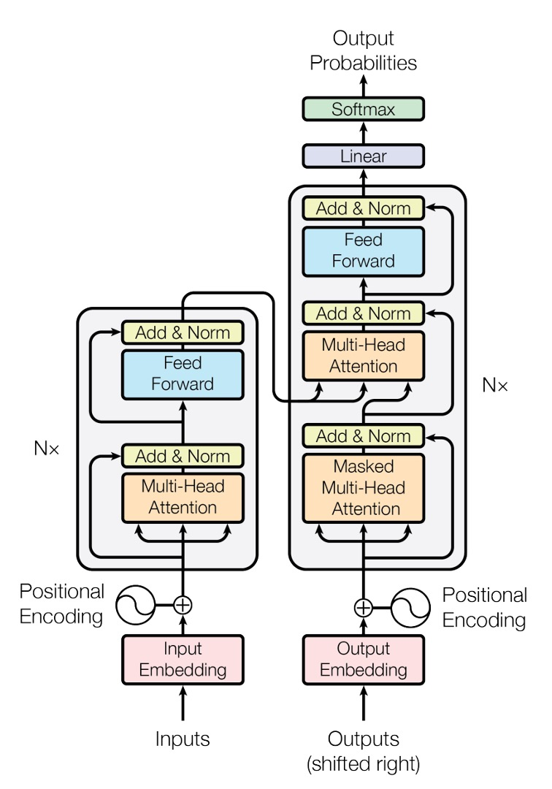
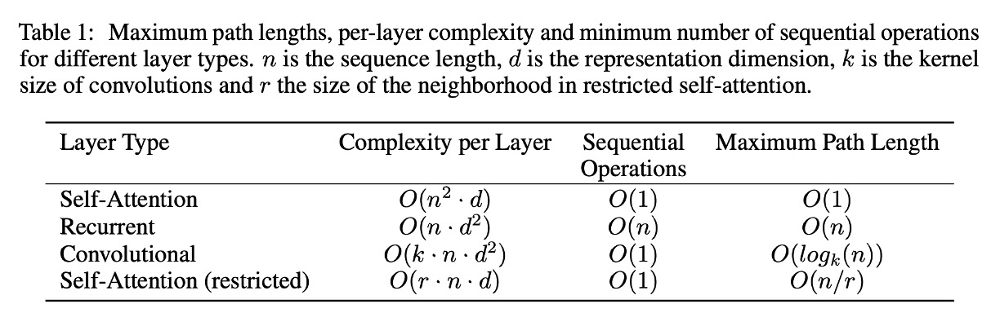

## 新世界の起点

[**Attention Is All You Need**](https://arxiv.org/abs/1706.03762)

---

従来の時系列モデルとは異なり、Transformer モデルの提案により、自己注意機構の新たな時代が開かれました。

このモデルは、シーケンスの再帰的計算に依存せず、注意機構を通じてシーケンスのモデリングを実現することで、モデルの訓練と推論の過程をより効率的にしました。

## 問題の定義

過去のシーケンスモデリングタスクにおいて、RNN と LSTM モデルは主流でした。

しかし、これらのモデルには訓練と推論過程においていくつかの問題が存在しました：

- **再帰計算の制約**：RNN と LSTM モデルは訓練過程でシーケンス内の各要素を逐次的に計算する必要があり、これが効率的な並列計算を難しくしていました。
- **長距離依存問題**：RNN と LSTM モデルの再帰的計算方式により、長いシーケンスを扱う際、シーケンス内の遠くの位置間の依存関係を捉えるのが難しくなっていました。

## 問題の解決

### モデル設計

<div align="center">
<figure style={{"width": "50%"}}>

</figure>
</div>

これは元論文で示された Transformer モデルのアーキテクチャ図です。

このアーキテクチャ図は非常に簡潔に描かれていますが、ほとんどの人は最初に見ただけでは理解しにくいです。

信じてください、これでもかなり簡潔に描かれています！

では、実際にこのモデルがどのように機能するのか、簡単なコードを書いてみましょう：

### 入力層

ここでの入力は時系列データであり、テンソル（Tensor）として表現されます。

- 第一の次元：バッチサイズ（Batch Size）、以下 `B`。
- 第二の次元：シーケンス長（Sequence Length）、以下 `T`。
- 第三の次元：特徴次元（Feature Dimension）、以下 `D`。

まずは簡単な例を見てみましょう：

```python
input_text = ['你', '好', '啊', '。']
input_text_mapping = {
    '你': 0,
    '好': 1,
    '啊': 2,
    '。': 3
}
```

この例では、入力内容は「你好啊。」で、合計 4 つのトークンがあります。

:::info
ここでは訓練プロセスを大幅に簡略化していますが、これは理解を助けるためのものであり、実際の訓練ではさらに多くの処理が行われます。
:::

次に、この入力をテンソルに変換します：

```python
import torch
import torch.nn as nn

input_tensor = torch.tensor([
    input_text_mapping[token]
    for token in input_text]
)
print(input_tensor)
# >>> tensor([0, 1, 2, 3])
```

次に、各要素に対して埋め込み（Embedding）を行います：

```python
embedding = nn.Embedding(num_embeddings=4, embedding_dim=512)
embedded_input = embedding(input_tensor)
print(embedded_input)
# >>> tensor([[ 0.1,  0.2,  0.3,  ...,  0.4],
#             [ 0.5,  0.6,  0.7,  ...,  0.8],
#             [ 0.9,  1.0,  1.1,  ...,  1.2],
#             [ 1.3,  1.4,  1.5,  ...,  1.6]])
print(embedded_input.shape)
# >>> torch.Size([4, 512])
```

:::tip
埋め込み（Embedding）は特に難しい技術ではなく、各要素をより高次元の空間に射影するもので、内部には単一の線形変換層のみが含まれています。
:::

最後に、必要な入力は 3D テンソルであるため、バッチ数の次元を追加します。この例ではバッチ数は 1 です。

```python
embedded_input = embedded_input.unsqueeze(0)
print(embedded_input.shape)
# >>> torch.Size([1, 4, 512])
```

### 位置エンコーディング

元々の RNN と LSTM モデルでは、モデルはシーケンス内の要素の位置を通じて、シーケンス内の依存関係を捉えることができます。

そのため、位置エンコーディングを特別に設計する必要はなく、モデルは各 For-Loop の反復処理内で位置情報を暗黙的に持っています。

しかし、Transformer のアーキテクチャでは、このような暗黙的な位置情報は存在しません。ここには線形変換層しかなく、各要素は独立しており、相関性がなく、内部には相関情報も含まれていません。したがって、シーケンス内の位置情報を捉えるために、追加の位置エンコーディングが必要です。

本論文では、位置エンコーディングの生成方法として、単純な正弦波と余弦波の関数を使用する方法が提案されています。与えられたシーケンス位置 $pos$ とエンコーディング次元 $i$ に対して、以下の式が使用されます：

$$
PE_{(pos, 2i)} = \sin\left(\frac{pos}{10000^{\frac{2i}{d_{model}}}}\right)
$$

$$
PE_{(pos, 2i+1)} = \cos\left(\frac{pos}{10000^{\frac{2i}{d_{model}}}}\right)
$$

ここで：

- $pos$ はシーケンス内の要素の位置（0 から始まる）。
- $i$ は特徴次元内のインデックス（0 から始まる）。
- $d_{model}$ は位置エンコーディングの次元（通常、モデル入力の特徴次元と同じ）。

上記の式に基づいて、位置エンコーディングを計算する関数を実装してみましょう：

```python
import math
import torch

def sinusoidal_positional_encoding(length, dim):
    """ 非再帰ニューラルネットワークのための正弦波位置エンコーディング。
        参考文献: Attention Is All You Need
        URL: https://arxiv.org/abs/1706.03762
    """
    if dim % 2 != 0:
        raise ValueError(
            '奇数の次元でsin/cos位置エンコーディングは使用できません '
            f'(dim={dim})')

    # 位置エンコーディング
    pe = torch.zeros(length, dim)
    position = torch.arange(0, length).unsqueeze(1)
    div_term = torch.exp(
        (torch.arange(0, dim, 2, dtype=torch.float) * -(math.log(10000.0) / dim)))
    pe[:, 0::2] = torch.sin(position.float() * div_term)
    pe[:, 1::2] = torch.cos(position.float() * div_term)

    return pe
```

この関数はシーケンスの長さと特徴次元を考慮して、各位置に対して固定の位置エンコーディングを提供します。

位置エンコーディングを視覚化してみましょう。シーケンス長さが 256、特徴次元が 512 の場合：

```python
import cv2
import numpy as np

pos_mask = sinusoidal_positional_encoding(256, 512)
pos_mask = pos_mask.numpy()
pos_mask = (pos_mask - pos_mask.max()) / (pos_mask.max() - pos_mask.min())
pos_mask = np.array(pos_mask * 255).astype(np.uint8)
pos_mask = cv2.applyColorMap(pos_mask, cv2.COLORMAP_JET)
```


:::tip
**あの数式に出てくる 10000 は何ですか？**

この 10000 は位置エンコーディングのスケールを表しており、適切な範囲で位置エンコーディングのスケールを制限することにより、異なる位置間の関係を効果的に捉えられるようにしています。同時に、あまりにも高いまたは低い周波数が悪影響を及ぼすことを避けています。

もし位置エンコーディングの 10000 を 100 に変更すると、正弦波と余弦波の周波数が高くなり、各位置の位置エンコーディングはより短い距離で周期的に繰り返されることになります。これにより、モデルが遠い位置間の関係を認識する能力が低下する可能性があります。なぜなら、それらの位置エンコーディングがより似通ってしまうからです。
:::

位置エンコーディングを得た後、それを入力の埋め込みテンソルに加算する必要があります：

```python
pos_emb = sinusoidal_positional_encoding(4, 512)
embedded_input = embedded_input + pos_emb
```

### 自己注意力機構

入力エンコーディングを取得した後、Transformer モデルのコア部分である自己注意力機構に進むことができます。

ここでは、3 つの変換行列を準備する必要があります：

1. **Query 行列 `W_q`**

   まず、重み `W_q` を宣言し、入力の埋め込みテンソルに Query 行列を掛け合わせて、Query テンソルを得ます。

   ```python
   W_q = nn.Linear(512, 512)
   query = W_q(embedded_input)
   print(query.shape)
   # >>> torch.Size([1, 4, 512])
   ```

2. **Key 行列 `W_k`**

   同様に、重み `W_k` を宣言し、入力の埋め込みテンソルに Key 行列を掛け合わせて、Key テンソルを得ます。

   ```python
   W_k = nn.Linear(512, 512)
   key = W_k(embedded_input)
   print(key.shape)
   # >>> torch.Size([1, 4, 512])
   ```

3. **Value 行列 `W_v`**

   最後に、重み `W_v` を宣言し、入力の埋め込みテンソルに Value 行列を掛け合わせて、Value テンソルを得ます。

   ```python
   W_v = nn.Linear(512, 512)
   value = W_v(embedded_input)
   print(value.shape)
   # >>> torch.Size([1, 4, 512])
   ```

さて、この QKV とは一体何でしょう？

変換行列を「投影」と考えることができます。

言い換えれば、「異なる視点から見る」という意味です。

先ほどの QKV とは、入力を 3 つの異なる投影にかけ、その後に自己注意力機構の計算を行うということです。

---

自己注意力機構の第二歩：関連スコアの計算。

$$
\text{Attention}(Q, K, V) = \text{softmax}\left(\frac{QK^\top}{\sqrt{d_k}}\right)V
$$

このステップでは、Query テンソルと Key テンソルを内積計算します。

```python
attn_maps = torch.matmul(query, key.transpose(-2, -1))
print(attn_maps.shape)
# >>> torch.Size([1, 4, 4])
```

これにより、4x4 の注意スコア行列が得られます。

この例では、[你, 好, 啊, 。] という 4 つのトークン間の関連性を探ることになります。

式の中に出てくる `1/\sqrt{d_k}` は、スコアが大きすぎたり小さすぎたりしないように、注意スコアをスケーリングするために使われます。

```python
attn_maps = attn_maps / math.sqrt(512)
```

次に、Softmax 操作を行います：

```python
attn_maps = F.softmax(attn_maps, dim=-1)
```

:::tip
**なぜ Softmax を使うのか？ Sigmoid を使っても良いのでは？**

それは、Softmax 関数がすべての注意スコアを確率分布に変換できるためです。このようにすることで、すべての注意スコアの合計が 1 になることが保証され、各位置に対して適切な重み付けが可能になります。さらに、Softmax 関数には競争メカニズムがあり、モデルが異なる位置をより良く識別できるようになります。
:::

注意マップを計算した後、Value テンソルを加重平均します：

```python
attn_output = torch.matmul(attn_maps, value)
print(attn_output.shape)
# >>> torch.Size([1, 4, 512])
```

最後に、残差接続を行います：

```python
attn_output = embedded_input + attn_output
```

### 多頭注意力機構

上記の章を読んだ後、次に思うかもしれない疑問は、「これで各位置の注意スコアは 1 つしか計算されないが、もし複数の注意スコアが欲しい場合はどうするのか？」というものです。

この問題についても、著者は既に考えており、**多頭注意力機構**を提案しています。

多頭注意力機構では、複数の QKV 行列を準備し、それぞれの QKV 行列に対して自己注意力機構の計算を行います。

<div align="center">
<figure style={{"width": "70%"}}>

</figure>
</div>

多頭注意力のコンセプトはこのようなものですが、実際の実装では、実際に複数の QKV 行列を準備するわけではなく、元の QKV 行列を複数のサブ行列に分割し、それぞれのサブ行列に対して自己注意力機構の計算を行います。例えば、このように行います：

```python
# 複数のヘッドに分割
Q = Q.view(Q.size(0), Q.size(1), self.num_heads, self.head_dim).transpose(1, 2)
K = K.view(K.size(0), K.size(1), self.num_heads, self.head_dim).transpose(1, 2)
V = V.view(V.size(0), V.size(1), self.num_heads, self.head_dim).transpose(1, 2)
```

しかし、この実装はかなり詳細で、特に新しい概念があるわけではないため、ここでは深く掘り下げません。

### クロスアテンション機構

Transformer アーキテクチャにおいて、Encoder と Decoder の間の注意機構は似ていますが、いくつか異なる点があります。

Encoder では、シーケンス内の各位置に対して自己注意機構を計算する必要があります。一方、Decoder では、シーケンス内の各位置に対する自己注意機構に加えて、Encoder の出力に対する注意機構も計算する必要があります。これが、いわゆる**クロスアテンション機構（Cross-Attention）**です。

そのため、Decoder には 2 つの部分があります：1 つ目は自己シーケンスに対する自己注意機構、2 つ目は Encoder の出力に対するクロスアテンション機構です。自己注意は既に説明しましたので、ここではクロスアテンション機構の計算について説明します。

ここでも、3 つの変換行列を準備する必要があります：

1. **Query 行列 `W_q`**

   まず、重み `W_q` を宣言し、Decoder の入力埋め込みテンソルに Query 行列を掛け合わせて、Query テンソルを得ます。ここで、`decoder_input` の長さは `encoder_output` の長さと異なる場合があります。例えば、翻訳のタスクではこの長さが 10 になることがあります。

   ```python
   W_q = nn.Linear(512, 512)
   decoder_query = W_q(decoder_input)
   print(decoder_query.shape)
   # >>> torch.Size([1, 10, 512])
   ```

   :::tip
   ここでの入力は `decoder_input` です。
   :::

2. **Key 行列 `W_k`**

   次に、重み `W_k` を宣言し、Encoder の出力埋め込みテンソルに Key 行列を掛け合わせて、Key テンソルを得ます。

   ```python
   W_k = nn.Linear(512, 512)
   encoder_key = W_k(encoder_output)
   print(encoder_key.shape)
   # >>> torch.Size([1, 4, 512])
   ```

   :::tip
   ここでの入力は `encoder_input` です。
   :::

3. **Value 行列 `W_v`**

   最後に、重み `W_v` を宣言し、Encoder の出力埋め込みテンソルに Value 行列を掛け合わせて、Value テンソルを得ます。

   ```python
   W_v = nn.Linear(512, 512)
   encoder_value = W_v(encoder_output)
   print(encoder_value.shape)
   # >>> torch.Size([1, 4, 512])
   ```

   :::tip
   ここでの入力は `encoder_input` です。
   :::

その後のステップは自己注意機構と同じで、まずは注意マップを計算します：

```python
attn_maps = torch.matmul(decoder_query, encoder_key.transpose(-2, -1))
print(attn_maps.shape)
# >>> torch.Size([1, 10, 4])
```

次に、スケーリングと Softmax を行います：

```python
attn_maps = attn_maps / math.sqrt(512)
attn_maps = F.softmax(attn_maps, dim=-1)
```

最後に、Value テンソルに対して加重平均を計算します：

```python
attn_output = torch.matmul(attn_maps, encoder_value)
print(attn_maps.shape)
# >>> torch.Size([1, 10, 4])
print(encoder_value.shape)
# >>> torch.Size([1, 4, 512])
print(attn_output.shape)
# >>> torch.Size([1, 10, 512])
```

:::info
Decoder の自己注意機構では、通常、マスク操作が追加され、デコード過程で未来の情報を見ることができないようにします。このマスクは通常、上三角行列の形を取ります。これにより、Decoder はデコード中に既に生成された部分しか見ることができません。

```python
def _generate_square_subsequent_mask(
    sz: int,
    device: torch.device = torch.device(torch._C._get_default_device()),  # torch.device('cpu'),
    dtype: torch.dtype = torch.get_default_dtype(),
) -> Tensor:
    r"""Generate a square causal mask for the sequence.

    The masked positions are filled with float('-inf'). Unmasked positions are filled with float(0.0).
    """
    return torch.triu(
        torch.full((sz, sz), float('-inf'), dtype=dtype, device=device),
        diagonal=1,
    )
```

:::

### フィードフォワードネットワーク

自己注意機構を通過した後、特徴の抽出を行うために、単純なフィードフォワードネットワークを通す必要があります。

```python
ffn = nn.Sequential(
    nn.Linear(512, 2048),
    nn.ReLU(),
    nn.Linear(2048, 512)
)
ffn_output = ffn(attn_output)
output = attn_output + ffn_output
print(output.shape)
# >>> torch.Size([1, 4, 512])
```

このフィードフォワードネットワークは典型的な全結合ネットワークで、2 層の全結合層を使用し、その間に ReLU 活性化関数を加えています。

さらに、モジュール内には Expand-Dim 操作があります。通常、この膨張係数は 4 で、この操作は後に MobileNet-V2 で提案された Inverted Residual Bottleneck Block と似たコンセプトです。主な目的は、膨張した次元を圧縮することで、モデルの非線形性表現能力を向上させることです。

### レイヤ正規化（Layer Normalization）

先ほど、`LayerNorm` については触れていませんでした。

この操作は難しいものではないので、上記のすべての操作を理解した後、ここは簡単に説明できます。

先ほどの各ステップでは、出力に対して `LayerNorm` を適用するべきです。ここでは、Norm-First と Norm-Last を区別することもできますが、これはモデルのアーキテクチャに依存します。後ほど他の論文で出会う際に、この問題について詳しく議論することにしましょう。

```python
norm1 = nn.LayerNorm(512)
attn_output = norm1(embedded_input + attn_output)

# ...

norm2 = nn.LayerNorm(512)
output = norm2(attn_output + ffn_output)
```

:::tip
**なぜ Batch Normalization を使わないのか？**

シーケンスデータは、バッチデータの特性よりも自身の特徴に依存することが多いため、ここでは BatchNorm よりも LayerNorm の方が適していると言えます。
:::

## 討論

### なぜ自己注意力機構を使うのか？

<div align="center">
<figure style={{"width": "80%"}}>

</figure>
</div>

簡単に言えば、それは「速い」からです。

---

著者は、RNN、CNN、そして自己注意（Self-Attention）の計算複雑度を以下の図のようにまとめています。

1. **自己注意層（制限なし）**：

   - **各層の計算量：** $\mathcal{O}(n^2 \cdot d)$：自己注意機構では、各入力トークン（シーケンス長が $n$）が他のすべてのトークンと注意計算を行い、$n \times n$ の完全な注意行列を形成します。各行列要素は $d$ 次元の埋め込みに基づく計算を必要とするため、全体の計算量は $\mathcal{O}(n^2 \cdot d)$ となります。
   - **順序計算：** $\mathcal{O}(1)$：完全な注意行列は並列で計算でき、すべての比較を同時に行うことができます。
   - **最大経路長：** $\mathcal{O}(1)$：各トークンは注意機構を通じて他の任意のトークンと直接接続できるため、最大経路長は 1 ステップです。

2. **RNN**：

   - **各層の計算量：** $\mathcal{O}(n \cdot d^2)$：リカレント層は各トークンを順番に処理します。各トークンの計算は現在のトークン埋め込み（$d$ 次元）と隠れ状態（同じく $d$ 次元）を組み合わせるため、操作コストは $\mathcal{O}(d^2)$ となります。$n$ 個のトークンを処理するため、全体の計算量は $\mathcal{O}(n \cdot d^2)$ となります。
   - **順序計算：** $\mathcal{O}(n)$：RNN の順番に依存する特性により、各トークンは前のトークンの計算が終わるのを待ってから処理されます。
   - **最大経路長：** $\mathcal{O}(n)$：RNN では、2 つのトークン間の経路長は、それらの間にあるすべての中間トークンを通る必要があります。

3. **CNN**：

   - **各層の計算量：** $\mathcal{O}(k \cdot n \cdot d^2)$：畳み込み層では、幅が $k$ の畳み込みフィルタがシーケンス全体をスライドして局所的な特徴を計算します。各 $n$ 個のトークンは $d$ 次元埋め込み上で計算され、各畳み込み操作のコストは $d^2$ に比例します。したがって、全体の計算量は $\mathcal{O}(k \cdot n \cdot d^2)$ となります。
   - **順序計算：** $\mathcal{O}(1)$：各畳み込みフィルタはシーケンス全体に同時に適用できます。
   - **最大経路長：** $\mathcal{O}(\log_k(n))$：膨張効果のある畳み込み層を積み重ねることで、ネットワークは $k$ の対数的な方法でより遠くのトークンと接続できます。

4. **制限付き自己注意層**：

   - **各層の計算量：** $\mathcal{O}(r \cdot n \cdot d)$：この場合、各トークンはサイズ $r$ の近隣トークンのみを注目します。注意行列のサイズは $n \times r$ となりますが、各行列要素は依然として $d$ 次元埋め込みに基づく計算が必要で、全体の計算量は $\mathcal{O}(r \cdot n \cdot d)$ となります。
   - **順序計算：** $\mathcal{O}(1)$：制限なしの自己注意層と同様に、すべての比較は並列に行うことができます。
   - **最大経路長：** $\mathcal{O}(\frac{n}{r})$：各トークンが小さな近隣にしか注目できないため、2 つの遠くにあるトークン間の経路長は $\mathcal{O}(\frac{n}{r})$ になります。

### 実験結果：機械翻訳

<div align="center">
<figure style={{"width": "80%"}}>

</figure>
</div>

WMT 2014 英独翻訳タスクでは、Transformer (big) は先行する最良のモデル（アンサンブルモデルを含む）と比較して、2.0 以上の BLEU スコアの向上を達成し、新しい 28.4 の BLEU 記録を達成しました。このモデルは、8 枚の P100 GPU を使用して 3.5 日で訓練されました。基本モデルでさえ、他の競合モデルに比べて訓練コストが大幅に低い状態で、すべての以前のモデルおよびアンサンブルモデルを超えました。

WMT 2014 英仏翻訳タスクでは、Transformer (big) は 41.0 の BLEU スコアを達成し、訓練コストが前回の最良モデルの 4 分の 1 に過ぎないにも関わらず、すべての公開された単一モデルを上回りました。

## 結論

Transformer は時代を超えたアーキテクチャであり、その提案は RNN と LSTM モデルのいくつかの問題を解決するだけでなく、モデルの訓練と推論の効率を向上させました。

このアーキテクチャは、最初に提案された時には大きな反響を呼びませんでした。

ただし、Transformer は学術界で継続的に活発に議論され、自然言語処理からコンピュータビジョンの分野に至るまで広く認知されていきました。工業界では、エンジニアや研究者以外はこの問題に関心を持つことは少なかったのです。

---

しかし、OpenAI の ChatGPT が登場した瞬間、この世界は変わりました。

はい。

すべてが変わったのです。
