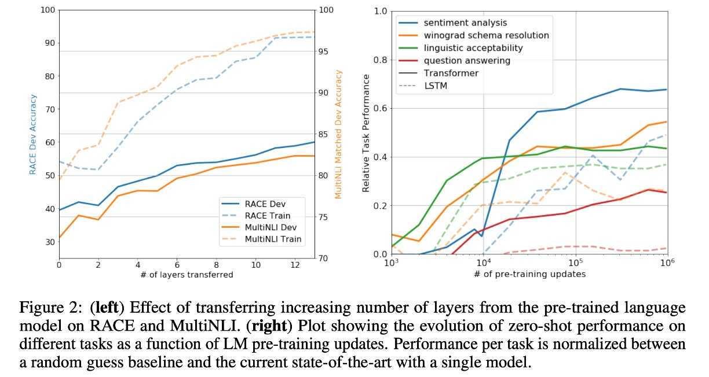

## 十二層デコーダ

[**Improving language understanding by generative pre-training**](https://cdn.openai.com/research-covers/language-unsupervised/language_understanding_paper.pdf)

---

元々の Transformer アーキテクチャは、エンコーダ（encoder）とデコーダ（decoder）の 2 つの部分で構成されています。

しかし、OpenAI はこのアーキテクチャを基に、異なる技術路線を選択しました：**完全デコーダ（decoder-only）**。

## 問題の定義

著者は現在の NLP モデルに対していくつかの問題を提起しています：

### 1. アノテーションデータの不足

NLP 領域では、データは豊富にありますが、アノテーションが不足しています。

特に特定のタスクを行いたい場合、例えば専門分野の質問応答（QA）や機械翻訳（MT）などでは、対応するアノテーションデータが不足しているため、実行が難しくなります。

この問題を解決するために、多くの方法が監督なし学習（unsupervised learning）を採用し、後に自己監督学習（self-supervised learning）と呼ばれる方法が出てきました。

最も一般的な方法は、「次の単語を予測する」というタスクを使うことです。これにより、アノテーションデータなしで大量のテキストデータを集めるだけで、モデルが自ら学習することができます。

しかし、この方法にも次の問題が生じます：**タスクの不一致**。

### 2. タスクの不一致

NLP モデルでは通常、2 つのフェーズがあります：事前学習（pre-training）と微調整（fine-tuning）です。

事前学習は大量のテキストデータでモデルが自分で学習することであり、微調整は特定のタスクに対してモデルをさらに訓練することです。しかし、この 2 つのフェーズ間に存在する不一致は無視できない問題です。

つまり、事前学習では「次の単語は何か」を学習しますが、微調整では「質問に答える」や「文を翻訳する」といったタスクを学習することになります。

過去の研究では、モデルが目標タスクに適応するために、多くのパラメータを導入してモデルの性能を向上させてきました。

異なるタスクには異なるパラメータが必要であり、このプロセスは面倒で管理が難しいものです。

そこで著者は、最小限のパラメータで異なるタスクに適応できるよう、完全デコーダアーキテクチャを提案しました。

## 解決策

### モデルアーキテクチャ

これは著者が提案したモデルアーキテクチャで、12 層のデコーダが使用されています。

関連する構成は以下の通りです：

- 12 層のデコーダで、各層は Transformer の基本構造。
- 各層のデコーダには 768 次元の特徴と 12 の注意ヘッドがある。
- FFN の隠れ層には 3072 のニューロンを使用。
- シーケンス長は 512。
- ドロップアウト確率は 0.1。
- L2 正則化を使用。
- Gelu 活性化関数を使用。
- 位置エンコーディングは学習可能な埋め込みを使用。
- 分割には[**spaCy tokenizer**](https://spacy.io/api/tokenizer)を使用。

訓練には次の設定を使用：

- Adam 最適化器。
- 最大学習率は 2.5e-4 で、最初の 2000 ステップで線形増加し、その後コサイン退火で 0 まで減少。

### 事前学習戦略

モデルの訓練は 2 つのフェーズで構成され、第一フェーズは大量のテキストデータで自己監督学習を行い、第二フェーズは目標タスクで微調整を行います。

使用したデータセットは次の通りです：

1. [**BooksCorpus**](https://arxiv.org/abs/1506.06724):

   7000 冊以上の未発表の本を含み、冒険、ファンタジー、ロマンなどのジャンルをカバーしています。長いテキストを含んでおり、生成モデルが遠くの情報を条件として学習するのに役立ちます。

2. [**1B Word Benchmark**](https://www.statmt.org/lm-benchmark/):

   [ELMo](https://arxiv.org/abs/1802.05365)と似た方法で使用され、そのサイズはほぼ同じですが、文レベルで再構成されています（遠くの構造を壊すことを目的としています）。

### 微調整戦略

著者は微調整に特別なことは行っておらず、標準的な微調整方法を使用しています。

特に記載がない限り、事前学習で使用したハイパーパラメータ設定をそのまま使用しています。分類器には 0.1 のドロップアウト確率を使用。ほとんどのタスクで、学習率 6.25e-5、バッチサイズ 32 を使用しています。

## 討論

全体的に、この記事で提案した方法は 12 個の評価データセットのうち 9 個で最先端（SOTA）の結果を達成しました。

これは、完全デコーダアーキテクチャが NLP タスクにおいて効果的であることを示しています。

著者は Zero-shot の課題についてさらに深掘りして議論しています。

### なぜ Transformer は効果的か？

図 2（左）では、モデルの深さが増すにつれて、タスク転送の過程でモデルの性能がどのように向上するかを調査しました。

実験結果によると、事前学習モデルでは、各層が目標タスクを解決するための有効な情報を含んでいることがわかります。

---

図 2（右）では、事前学習過程におけるモデルアーキテクチャの有効性を視覚化しています。

事前学習が進むにつれて、モデルの性能が向上していく様子が示されており、事前学習がさまざまなタスク関連機能を学習するために有効であることが分かります。

### どの部分が有効か？

どの部分が最も貢献しているかを確認するために、著者は 3 種類の消融実験を行いました。

結果は論文内の表 5 に示されています：

1. **補助言語モデル目標の影響：**

   - 微調整フェーズで補助言語モデル目標を削除した結果、自然言語推論（NLI）タスクと質問応答（QQP）タスクで効果が見られました。
   - 全体的な傾向として、より大きなデータセットは補助目標から多くの利益を得ており、より小さなデータセットではその効果が見られません。

2. **Transformer と LSTM の比較：**

   - Transformer と単層 2048 ユニットの LSTM を比較した結果、LSTM を使用した場合、同じフレームワークで平均スコアが 5.6 点低下しました。
   - LSTM は MRPC データセットでは Transformer を上回りました。

3. **事前学習の重要性：**

   - 目標タスクで直接訓練した Transformer と事前学習した Transformer を比較。
   - **結果として、事前学習がない場合、すべてのタスクでパフォーマンスが低下し、完全なモデルと比較して 14.8％の性能低下が見られました。**

## 結論

これは OpenAI が提案した最初の Transformer アーキテクチャに基づいた大規模事前学習モデルで、自然言語処理の分野における重要な進歩を示しています。大量の未ラベルテキストで事前学習し、特定のタスクで微調整することによって、顕著な性能向上を達成しました。

GPT-1 の成功は、事前学習と微調整の半教師あり学習パラダイムが多様な自然言語理解タスクにおいて潜在能力を持っていることを証明し、GPT-2 や GPT-3 などのより大規模で高性能なモデルの基盤を築きました。
