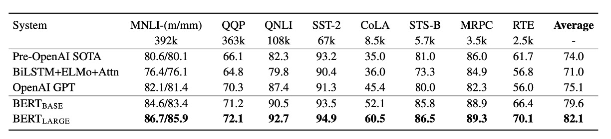

## 十二層エンコーダ

[**BERT: Pre-training of Deep Bidirectional Transformers for Language Understanding**](https://arxiv.org/abs/1810.04805)

---

Transformer が提案された後、多くの研究者がこのアーキテクチャをどのようにより良く活用できるかを探求し始めました。

以前の GPT-1 は**完全デコーダ（decoder-only）**のアーキテクチャを選択しましたが、BERT はその正反対の**完全エンコーダ（encoder-only）**のアーキテクチャを選びました。

:::tip
BERT モデルの前に、ELMo というモデルがありました。そして BERT という名前を取った後、研究者たちはモデルの名前を「セサミストリート」のキャラクターから取ることが流行り始めました。最初の論文では、タイトルで略語を真面目に考えていましたが、後には完全に自由になり、好きな名前をつけるようになりました...
:::

## 問題の定義

事前学習した言語モデルを下流タスクに適用する際、通常は 2 つの戦略があります：

- **1. 特徴ベースのアプローチ**

  この方法は、例えば ELMo（[Peters et al., 2018a](https://arxiv.org/abs/1802.05365)）のように、タスク特有のアーキテクチャを使用し、事前学習された表現を追加の特徴として使用します。

- **2. 微調整アプローチ**

  この方法は、例えば生成的事前学習を行った OpenAI GPT のように、最小限のタスク特有のパラメータを導入し、事前学習されたすべてのパラメータを微調整することによって下流タスクを訓練します。

---

これら 2 つのアプローチは、事前学習の間に同じ目的関数を共有し、単一の言語モデルを使用して汎用的な言語表現を学習します。

著者は「一方向性」の問題が特に深刻であると考えています。

### 一方向性

前回述べた OpenAI GPT では、左から右へのアーキテクチャを使用しており、各トークンは Transformer の自己注意層で前のトークンにのみ集中することができます。

この制限は、文レベルのタスクでは最適ではなく、ラベル付きタスク（例えば、質問応答）に基づく微調整アプローチを適用するときには非常に有害となる可能性があります。なぜなら、これらのタスクでは、文脈を両方向から統合することでパフォーマンスが大幅に向上するからです。

## 問題の解決

### モデルアーキテクチャ

これは著者が提案したモデルアーキテクチャで、合計 12 層のエンコーダが使用されています。

関連する設定は以下の通りです：

- **BERT-Base**

  - 合計 12 層のエンコーダで、各エンコーダは Transformer の基本構造。
  - 各エンコーダには 768 次元の特徴と 12 個の注意ヘッド。
  - 合計パラメータ数は 110M。

- **BERT-Large**

  - 合計 24 層のエンコーダで、各エンコーダは Transformer の基本構造。
  - 各エンコーダには 1024 次元の特徴と 16 個の注意ヘッド。
  - 合計パラメータ数は 340M。

入力データに関して、BERT は以下の戦略を採用しています：

1. **入力シーケンスの柔軟な定義**：BERT のコンテキストでは、「文」という概念は実際の言語学的な文に限らず、任意の連続したテキストの範囲を指します。「シーケンス」とは、BERT が処理する入力トークンシーケンスであり、1 文または 2 文を含むことができます。

2. **WordPiece 埋め込み**：30,000 のトークンを含む WordPiece 辞書を使用して埋め込みを行い（[**Wu et al., 2016**](https://arxiv.org/abs/1609.08144)）、これにより未知語や希少語を効率的に処理できます。

3. **特殊トークンの使用**：

   - **[CLS] トークン**：各シーケンスの最初のトークン。このトークンの最終的な隠れ状態は、分類タスクのためのシーケンス表現として使用されます。
   - **[SEP] トークン**：文対を区切るために使用され、BERT が異なる文からの情報を識別し処理できるようにします。
   - **[MASK] トークン**：事前学習中に一部のトークンをランダムにマスクし、モデルがこれらのマスクされたトークンを予測できるようにします。

4. **文分割の特徴標記**：BERT は、各トークンに学習可能なパラメータを追加して、そのトークンが文 A に属するのか文 B に属するのかを示します。

### 事前学習戦略

上の図のように、左側は BERT の事前学習戦略、右側は微調整戦略です。

BERT の事前学習戦略は非常に基本的で、後の多くのモデル設計に影響を与えました。

- **Masked Language Model（MLM）**

  BERT はマスクされた言語モデル（またはクロスワードタスク）を使用して、深い双方向の表現を学習します。このタスクでは、モデルは入力シーケンス内の一定割合のトークンをランダムにマスクし、これらのマスクされたトークンを予測することを目指します。

  - **ランダムマスク戦略**：BERT では、入力シーケンスの約 15%の WordPiece トークンがランダムに選ばれ、マスクされます。選ばれたトークンは、80%の場合に[ MASK ]トークンに置き換えられ、10%の場合にランダムなトークンに置き換えられ、残りの 10%は変更されません。

  - **マスクされたトークンの予測**：マスクされた各トークンに対して、BERT は最終的な隠れベクトルを使用し、ソフトマックス層を通じて元のトークンを予測します。このプロセスは従来の言語モデルと似ています。

  - **微調整段階での潜在的不一致問題**：事前学習中に[ MASK ]トークンが使用されたが、微調整時には実際に[ MASK ]トークンは出現しません。これにより、事前学習と微調整間に不一致が生じる可能性があります。BERT は、選ばれたトークンに対して[ MASK ]トークンを常に使用するのではなく、上記のランダム戦略を採用することでこの問題を緩和しています。

- **Next Sentence Prediction（NSP）**

  文間の関係を理解し、捉えるために、BERT は次文予測という事前学習タスクを導入しました。

  事前学習中、文 A と文 B が入力ペアとして選ばれる際、B が A の実際の後続文である確率は 50%（IsNext）、残りの 50%はランダムに選ばれた非連続的な文（NotNext）です。この設計により、モデルは論理的に関連する文や順序が続く文を識別する能力を学習します。

  NSP タスクにより、BERT は事前学習段階で文間の関係を理解し処理する方法を学びます。

### 微調整戦略

微調整段階では、BERT は追加の分類層を加えることで下流タスクに適用されます。

- **質問応答タスク（SQuAD）：**

  質問応答タスクでは、BERT は質問と回答を含む段落を単一のシーケンスとして処理し、質問部分と段落部分を識別するための異なる埋め込みを使用します。微調整中、BERT は特定の開始トークンと終了トークンを導入し、段落内での答えの位置を予測します。

- **自然言語推論（NLI）：**

  NLI タスクでは、BERT は 2 つの文を入力として受け取り、それらの文の表現を連結した後、分類層を通じて 2 つの文の関係を予測します。

この微調整方法は比較的低コストで、短期間で（例えば、Cloud TPU で 1 時間、GPU で数時間）完了できます。この効率性と汎用性により、BERT は様々な自然言語処理タスクの高性能な解決策として迅速に展開できるようになっています。

## 討論

GLUE タスクで、BERT は OpenAI GPT モデルを大幅に超える性能を発揮し、特に MNLI タスクでは BERT-LARGE バージョンが 80.5 点に達し、GPT の 72.8 点を大きく上回りました。研究はまた、データ量が少ないタスクにおいて、BERT-LARGE が BERT-BASE よりも優れた性能を発揮することを示しており、モデルサイズが性能向上に重要な影響を与えることがわかります。

さらに、BERT は合計 11 の自然言語処理タスクで新たな最良結果を達成し、BERT の汎用性と効果性を示しています。

### 消融実験

著者は BERT の異なる部分が性能に与える影響を調べるために一連の消融実験を行いました。

1. **NSP なし**

   - Masked LM（MLM）を使用して訓練された双方向モデルで、次文予測（NSP）タスクは実行していません。その結果、NSP がないと QNLI、MNLI、SQuAD 1.1 の性能が大きく損なわれることが示されました。

2. **LTR および NSP なし**

   - 左から右（LTR）の言語モデルのみで訓練し、MLM または NSP は使用していません。このモデルはすべてのタスクで MLM モデルよりも劣っており、特に MRPC や SQuAD タスクで顕著な性能低下が見られました。

3. **BiLSTM の追加**

   - LTR システムの改善を試みて、ランダムに初期化された BiLSTM を追加しました。BiLSTM は SQuAD での性能を向上させましたが、双方向モデルには遠く及びませんでした。

4. **ELMo の戦略との比較**

   - 独立した LTR および RTL モデルを訓練し、その出力を連結する戦略を採用しました。この方法は左右両方の文脈を利用できますが、単一の双方向モデルの 2 倍のコストがかかります。

## 結論

BERT の知名度はその高性能に起因しています。

その当時、BERT のような成績を収めるモデルは珍しく、BERT の登場は大きな注目を集めました。BERT が登場してから、学術界では LSTM が立つ場所はなくなり、世界中で Transformer が支配することとなりました。

BERT の成功は、「事前学習-微調整モデル」が多様な自然言語理解タスクにおいて潜在的な能力を持っていることを証明し、その後のより大規模で高性能なモデルの基盤を築きました。
