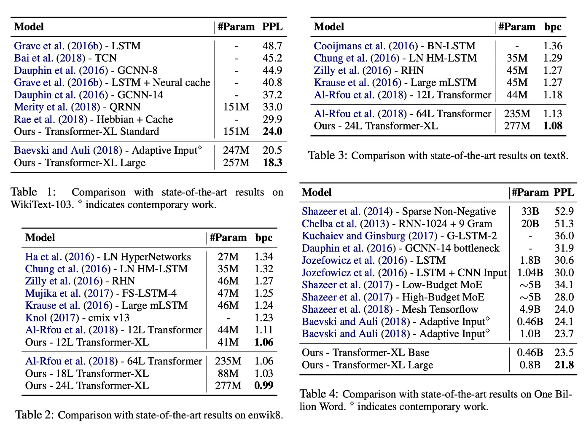

# [19.01] Transformer-XL

## より長い文脈

[**Transformer-XL: Attentive Language Models Beyond a Fixed-Length Context**](https://arxiv.org/abs/1901.02860)

---

[**BERT**](../1810-bert/index.md)が Transformer を使用する際、1 つのパラメータとして「シーケンス長」があります。

つまり、BERT は訓練と予測の際に、毎回入力されるデータは固定長であるということです。

では、テキストを入力して訓練する場合、最も理想的な方法とは何でしょうか？

- **もちろん、1 回で完全なテキストを入力することが理想的です。テキストがどれだけ長くても、そのまま一度に入力するのが最も完璧です！**

## 問題の定義

しかし、それは不可能です。

現実は厳しく、計算リソースやメモリに限りがあり、全てのテキストを一度に入力することはできません。

著者は以下の具体的な問題を引き出しました：

### 計算資源の制約

大型モデルの訓練には大量の計算リソースが必要で、高性能の GPU や TPU を使うことが一般的です。しかし、メモリ容量の制限により、一度に処理できるテキストの長さは限られています。テキストが長すぎると、メモリが溢れるか、計算時間が長くなりすぎてしまいます。特に、Transformer の注意機構は、文脈の長さに対してメモリ使用量が二次関数的に増加するため、長文の処理が非常に困難です。

### 文脈の断片化問題

上の図のように、計算リソースの制限に対応するために、テキストは通常、固定長の断片に分割して処理されます。しかし、固定長の断片で処理すると、文脈情報が失われ、予測時に必要な文脈のサポートが不足します。このような固定長の文脈はモデルの予測能力を制限し、性能が低下します。断片間の文脈情報が不足することで、モデルの最適化効率が低下し、テキスト内の長期的依存関係を十分に学習することができません。

:::info
例えば、BERT モデルでは文脈長が 512 トークンに制限されており、長いテキストを処理する際には、テキストを複数の断片に分割して処理します。
:::

## 問題の解決

### モデルアーキテクチャ

著者はまず、文脈の断片化問題を解決しようとしました。

この解決策として、過去の RNN モデルを参考にして、再帰機構を導入しました。簡単に言えば、モデルの訓練中に前の段落で計算した隠れ状態を保存し、次の段落を処理する際に再利用するというものです。これにより、モデルは新しい段落を処理するたびに、前の段落の情報を活用でき、長期的な依存関係をモデル化し、文脈の断片化を回避することができます。

例えば、2 つの連続した段落があるとしましょう：段落 A と段落 B。従来の方法では、段落 B を処理する際、モデルは段落 B の内容だけを考慮し、段落 A の情報は無視されます。しかし、再帰機構を使用すると、モデルは段落 B を処理する際に段落 A の隠れ状態を参照できるため、段落 B がより多くの文脈情報を得ることができます。また、計算リソースが十分にあれば、段落 B を処理する際にさらに多くの文脈（例えば、段落 C や段落 D）を取り入れることもできます。

再帰機構を利用することで、以前の段落の計算結果を再利用できるため、毎回最初から計算する必要がありません。評価段階では、著者は Transformer-XL が通常のモデルに比べて 1,800 倍速いことを確認しています。

### 新たな問題

標準の Transformer モデルでは、シーケンスの順序情報は位置エンコーディングによって提供され、これらの位置エンコーディングは単語の埋め込みとともにモデルに入力されます。

再帰機構で同じ位置エンコーディングを使用すると、モデルは異なる段落で同じ位置にいる単語を区別できなくなります。これにより、性能が低下します。

例えば、次の文を考えてみましょう：**"The cat sat on the mat."** この文を 2 つの段落に分けて処理する場合：

- 段落 A: "The cat sat"
- 段落 B: "on the mat."

標準の Transformer では、各単語の位置はその文内での絶対位置によって決まります。例えば：

- "The" の位置は 1
- "cat" の位置は 2
- "sat" の位置は 3
- "on" の位置は 4
- "the" の位置は 5
- "mat" の位置は 6

これらの位置エンコーディングは単語の埋め込みと一緒にモデルに入力されます。しかし、再帰機構で段落 B を処理する際、段落 A と同じ位置エンコーディングを使用すると、モデルはそれぞれの単語の相対位置を区別できません。例えば、「on」と「The」が同じ位置 1 にエンコードされ、「the」と「cat」が同じ位置 2 にエンコードされることになります。このようにすると、モデルはシーケンスの位置関係を正しく理解できません。

これに対して、相対位置エンコーディングは単語間の相対距離に注目します。例えば：

- "cat" は "The" から +1 の距離
- "sat" は "The" から +2 の距離
- "sat" は "cat" から +1 の距離
- "on" は "sat" から +1 の距離
- "on" は "The" から +3 の距離

相対位置エンコーディングでは、単語の絶対位置ではなく、単語間の相対的な距離を使ってエンコーディングを行います。これにより、異なる段落を処理する際でも、モデルは相対位置を基に単語間の関係を正しく理解できます。

### 相対位置エンコーディング

この論文では、自己注意機構の $QK^T$ を展開して次の式を得ます：

- $Q_i=(x_i+pos_i)W_Q$
- $K_j=(x_j+pos_j)W_K$
- $Q_iK_j^T=(x_i+pos_i)W_QW_K^T(x_j+pos_j)^T$

最終的に次のような式になります：

- $Q_iK_j^T=x_iW_QW_K^Tx_j^T+x_iW_QW_K^Tpos_j^T+pos_iW_QW_K^Tx_j^T+pos_iW_QW_K^Tpos_j^T$

次に、$pos_j$ を相対位置ベクトル $R_{i-j}$ に置き換え、$pos_i$ を学習可能なベクトル $u$, $v$ に置き換えます：

- $Q_iK_j^T=x_iW_QW_K^Tx_j^T+x_iW_QW_K^T{\color{red}{R_{i-j}^T}}+{\color{green}{u}}W_QW_K^Tx_j^T+{\color{green}{v}}W_QW_K^T{\color{red}{R_{i-j}^T}}$

ここで、$uW_Q$ と $vW_Q$ は学習可能なパラメータであり、それらを一つにまとめると次の式になります：

- $Q_iK_j^T=x_iW_QW_K^Tx_j^T+x_iW_QW_K^T{\color{red}{R_{i-j}^T}}+{\color{green}{u}}W_K^Tx_j^T+{\color{green}{v}}W_K^T{\color{red}{R_{i-j}^T}}$

最後に、${\color{red}{R_{i-j}^T}}$ のエンコーディング空間が元の $pos_j$ のエンコーディング空間とは異なるため、$W_K^T$ を $W_{K, R}^T$ に置き換えて次の式を得ます：

- $Q_iK_j^T=x_iW_QW_K^Tx_j^T+x_iW_QW_{K, R}^T{\color{red}{R_{i-j}^T}}+{\color{green}{u}}W_K^Tx_j^T+{\color{green}{v}}W_{K, R}^T{\color{red}{R_{i-j}^T}}$

最終的に、この論文では QKV の V 行列には位置エンコーディングを加えず、その後の研究でも位置エンコーディングは QK 行列（つまり注意行列）にのみ追加されています。

## 討論

### モデルの表現

Transformer-XL は単語単位と文字単位の言語モデルに応用されました。

データセットには、WikiText-103、enwik8、text8、Billion Word コーパス、Penn Treebank が含まれています。

- **Table 1: WikiText-103**：

  - これは最大の単語単位の言語モデルの基準です。
  - 1.03M の訓練トークンが 28,000 の記事から取得されています。
  - 訓練中の注意長さは 384、評価中の注意長さは 1600 です。
  - 自適応ソフトマックスと入力表現技術が採用されています。
  - Transformer-XL は、SoTA 困惑度（PPL）を 20.5 から 18.3 に減少させました。

3. **Table 2: enwik8**：

   - 100M バイトの未処理の Wikipedia テキストを含みます。
   - Transformer-XL は、RNN ベースのモデルに比べて顕著な優位性を示しました。
   - 12 層のアーキテクチャは、64 層のネットワークと同等の効果を達成し、わずか 17%のパラメータ予算で済みます。
   - モデルサイズを 18 層および 24 層に増やすと、新たな SoTA 結果を達成しました。

4. **Table 3: text8**：

   - 100M の処理済み Wikipedia 文字で、26 文字と空白のみを含みます。
   - enwik8 と同じモデルとハイパーパラメータを使用し、追加の調整は不要でした。

5. **Table 4: Billion Word**：

   - 短期依存性のモデリング能力をテストするために、文がシャッフルされています。
   - Transformer-XL は、標準の Transformer を使用した方法に比べて顕著に優れています。

:::tip
混乱度（Perplexity, PPL）は、自然言語処理（NLP）における言語モデルの性能を評価するための重要な指標です。モデルがテキストデータの予測をどれだけうまく行ったかを測定します。

PPL は、テストデータセットに対するモデルの予測の不確実性を測定するもので、モデルがテストデータに対してどれほど信頼できる予測を行ったかを示します。PPL の値が低いほど、モデルの予測精度が高いことを意味します。

- **計算式**：

  言語モデルがテストデータセット内の文$W = w_1, w_2, ..., w_N$の確率$P(W)$を予測した場合、混乱度の計算式は次の通りです：

  $\text{PPL}(W) = P(W)^{-\frac{1}{N}} = \left( \prod_{i=1}^N P(w_i | w_1, w_2, ..., w_{i-1}) \right)^{-\frac{1}{N}}$

  一般的に、テストセット全体$D$に対する PPL は次のように計算されます：

  $\text{PPL}(D) = 2^{-\frac{1}{N} \sum_{i=1}^N \log_2 P(w_i | w_1, w_2, ..., w_{i-1})}$

  ここで、$N$はテストセット内の単語の総数、$P(w_i | w_1, w_2, ..., w_{i-1})$はモデルが単語$w_i$に与える条件付き確率です。PPL が低いほど、モデルの予測精度が高いことを示します。
  :::

### 消融実験

著者は再帰機構と新しい位置エンコーディング方式の有効性について調査しました：

1. **相対位置エンコーディングの有効性**：

   

   WikiText-103 データセットを使用し、長期依存性のモデリングに関して実験が行われました。

   結果は上記の表に示されています。研究者は相対位置エンコーディングと絶対位置エンコーディングを比較し、「全損失」と「半損失」の場合を区別しました。これらの損失は交差エントロピー損失が適用された位置に関連しています。

   結果として、絶対位置エンコーディングは半損失に対してのみ適用可能で、これは訓練中に注意長さが非常に短い位置を排除することによって、より良い一般化能力を実現できるためです。

   実験の結果、再帰機構と新しい位置エンコーディング方式は、最良のパフォーマンスを実現するために必要であり、評価段階で長い注意シーケンスに適用できることがわかりました。訓練中のバックプロパゲーション長さが 128 に過ぎないにもかかわらず、これらの技術を使うことで、テスト時の注意長さは 640 に増加し、困惑度が低下しました。

   :::tip
   上記の段落で「全損失（Full losses）」と「半損失（half losses）」が言及されていますが、これはニューラルネットワークの訓練における損失計算方法の違いを指します。モデルが予測誤差をどのように計算するかを示しています。

   1. **全損失（Full losses）**：

      - モデルが損失を計算する際に、入力された全ての位置を考慮します。文全体のトークンの予測誤差がすべて計算に含まれます。
      - これにより、長期的な依存関係（例えば、文章の前半が後半の理解に影響を与える）が考慮されます。

   2. **半損失（Half losses）**：
      - モデルが損失を計算する際に、入力された段落の後半部分のみを考慮します。例えば、段落が 100 単語から成る場合、後半 50 単語の予測誤差のみを考慮します。
      - この方法は遠距離情報への依存を減らし、モデルが最近の内容に集中できるようにするため、特定の状況では一般化能力を向上させます。
        :::

2. **再帰機構の有効性**：

   

   著者は、文脈の断片化問題を解決する効果と、より長い文脈長を捕える利点を分けるために、長期的依存性が不要なデータセット（Billion Word データセット）を使用しました。この設定で得られた再帰的な改善は、文脈の断片化を解決したことに起因します。

   20 層の Transformer-XL（パラメータは約 0.3B）を訓練し、400K ステップで評価しました。結果は上記の表に示されています。長期的依存性が必要なくても、段階的再帰を使用することで、パフォーマンスが顕著に向上しました。これは、再帰機構が文脈の断片化問題を解決することを示しています。

## 結論

Transformer-XL は、言語モデリングの分野で強力な能力を示しました。困惑度（PPL）において優れた成果を達成しただけでなく、RNN や従来の Transformer よりも長期依存性の処理において効果的に機能しました。

さらに、Transformer-XL は評価段階で大幅に加速され、連続的なテキストを生成する能力を持っています。これらの利点により、Transformer-XL はテキスト生成、教師なし特徴学習、画像や音声モデリングなどの分野において広範な応用可能性を示しています。この技術は、既存技術の改善や新しい応用の開発において重要なツールとなる可能性があります。
