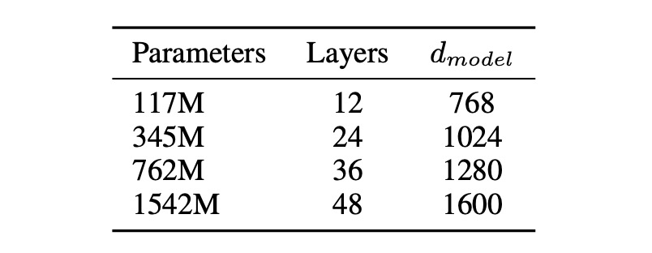
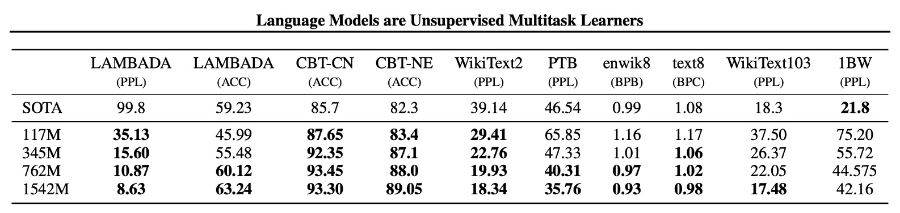

## 48 層デコーダ

[**Language models are unsupervised multitask learners**](https://d4mucfpksywv.cloudfront.net/better-language-models/language_models_are_unsupervised_multitask_learners.pdf)

---

初代 GPT は 12 層の Transformer デコーダを積み重ねていました。

OpenAI はこれでは不十分だと考え、48 層の Transformer デコーダを積み重ねました。これが GPT-2 です。

## 問題の定義

著者は、既存の機械学習システムが優れているように見えるが、実際には多くの問題を抱えていると考えています。

この記事では、いくつかの方向性について簡潔に説明しています：

### 脆弱性

- 機械学習システムは、データ分布やタスク仕様のわずかな変化に対して脆弱な性質を示します。
- これらのシステムは、異なる入力に対する多様性と変化に対して安定性を欠いており、不安定な動作を引き起こします。

### 狭隘な専門家の限界

- 現在の機械学習システムは、汎用システムではなく、むしろ狭隘な専門家のようなものであり、適用範囲が制限されています。
- これらのシステムは、各特定タスクのために手動でトレーニングデータセットを構築・ラベル付けすることに依存しており、手間がかかり、汎用性に欠けています。

### 一般化能力の不足

- 単一のドメインデータセットでの単一タスクトレーニングが一般的であり、これがシステムの一般化能力を欠如させています。
- 強靭なシステムを実現するためには、より広範なドメインやマルチタスクでのトレーニングとパフォーマンス測定が必要になる可能性があります。

## 解決問題

この論文では新しいモデルアーキテクチャを提案するのではなく、既存の GPT-1 モデルを拡張しました。

### モデル設計

まず、LayerNorm を各サブブロックの入力に移動しました。これは、事前にスタートした残差ネットワークに似ています。さらに、著者は最後の自己注意ブロック（self-attention block）の後に追加の層正規化を加えました。

著者は、モデルの深さが増加した際の残差パスでの累積を考慮して、修正された初期化方法を使用しました。初期化時に残差層の重みを 1/√N の係数でスケーリングします。ここで、N は残差層の数です。

モデルの能力を強化するために、著者は語彙を 50,257 に拡張しました。コンテキストのサイズも 512 から 1024 トークンに増加し、より大きなバッチサイズとして 512 を使用しました。

:::tip
もし経験があれば、この設計でバッチサイズ 512 が非常に大きな数であることがわかります。
:::

### マルチタスク学習

汎用システムは、多くの異なるタスクを実行できるべきです。これは、システムが単一のタスクの条件付き分布 P(出力|入力)だけでなく、P(出力|入力, タスク)をモデル化する必要があることを意味します。

ここで、著者が提案する実装方法は、入力と出力をすべてシンボル列として指定し、言語モデリングを使用してモデルをトレーニングすることです。例えば、翻訳トレーニング例は（フランス語に翻訳する、英語のテキスト、フランス語のテキスト）として表現され、読解トレーニング例は（質問に答える、文書、質問、答え）として表現されます。

要するに、異なるタスクを区別するために文字で説明を行うことです。

### 多様なデータ

以前のほとんどの言語モデルのトレーニングは、単一のテキストドメインに集中していました。例えば、ニュース記事、Wikipedia、または小説書籍などです。著者の提案する方法は、できるだけ大きく多様なデータセットを構築し、より多くの分野と文脈における自然言語の例をカバーすることを奨励します。

そのため、著者はウェブスクレイピングを選び、特に Common Crawl データセットを使用しました。

しかし、使用後に Common Crawl には深刻なデータ品質の問題があることがわかりました...

- **解決策**

  - **新しいウェブスクレイピング**：データ品質を向上させるため、著者は Reddit プラットフォームからのすべてのアウトバウンドリンクをスクレイピングしました。これらのリンクは、少なくとも「他の 3 人のユーザーに認められた」リンクのみがクリーンなデータとして使用されることになります。
  - **データセット WebText**：生成された WebText データセットは、これらの 4500 万のリンクのテキストサブセットを含みます。WebText の初期バージョンは、2017 年 12 月以降に作成されたリンクを含まないもので、重複データの削除とヒューリスティックなクリーニングを経て、約 800 万の文書を含み、合計 40GB のテキストになります。
  - **Wikipedia の文書除外**：WebText からはすべての Wikipedia 文書を削除し、トレーニングデータとテスト評価タスクが重複しないようにし、分析がより正確になるようにしました。

:::tip
これは 2017 年以前のデータが、言語モデルによって「汚染」されていない本物の人間の言語であることを意味します。その後、文章やテキストが人間によって書かれたのか、機械によって書かれたのかを判断するのは難しくなります。

これ以降、モデルのトレーニングには大きな挑戦が生じます。なぜなら、モデルが自分で生成したデータを学習すると、どんな誤りや偏りも増幅されていくからです。繰り返しが増えるにつれて、これらの誤りが累積し、最終的にはモデルのパフォーマンスが悪化し、崩壊してしまいます。
:::

### BPE エンコーディングの最適化

バイト単位の BPE の利点は、その柔軟性と汎用性にあります。なぜなら、任意の文字をバイト列に分解できるからです。しかし、BPE をバイト列に直接適用すると、BPE が貪欲な頻度アルゴリズムを使用して語彙を構築するため、最適でない統合結果を招く可能性があります。

この問題を解決するために、著者は改善された方法を提案しました。バイト列内で異なる文字クラス間の統合を防ぎ、空白のみを例外として扱います。これにより、圧縮効率が大幅に向上し、複数の語彙タグ間で最小限の単語の断片のみが追加されます。

:::tip
これはパズルを組み立てるようなものです。

通常の BPE は、頻繁に現れるパズルのピースを組み合わせるようなもので、例えば空の部分や草の部分を組み合わせて、それらをまとめて一緒に配置します。この方法の利点は、効率よく空や草の大きな部分を素早く作り出せることです。

しかし、このパズルの図柄が非常に複雑で、多くの異なるパターンの組み合わせ（Unicode 文字に相当）がある場合、すべてのパターンの組み合わせを覚える必要があり、パズルピースの管理が非常に面倒になります。

#### バイト単位の BPE（Byte-Level BPE）

バイト単位の BPE の方法は、これらのパターンに関係なく、パズルの各ピース自体に注目します。各ピースをより小さな単位に分け、色や形などで分割します。この方法の利点は、基本的な単位だけを覚えればよく、全体のパターンの組み合わせを覚える必要がないことです。パズルピースの数は大幅に減り、管理するべき基本的な単位は 256 種類で、数千の組み合わせパターンよりもはるかに簡単になります。

ただし、この方法にも問題があります。小さな単位を無秩序に組み合わせると、パズルがさらにバラバラになり、例えば空と草を混ぜてしまい、完全な図柄を作りにくくなることがあります。

この問題を解決するために、著者は改善された方法を提案しました。異なるタイプのパターンを組み合わせないようにし、空と草の単位を混ぜないようにします。これにより、各パターンがより簡単に組み立てられ、さらに隙間を開けてパターン間の整合性を保ちます。

こうして、二つの方法の利点を組み合わせることができ、効率的に大きなパズルを作成しながら、パターンの組み合わせ方法を覚える必要がなくなります。この方法により、パズルゲームをより効率的に進めることができ、完成したパターンがより明確に見えるようになります。
:::

## 討論

### モデルのサイズ

本論文では 4 つのモデルパラメータ設計が提案され、トレーニングとベンチマークテストが行われました。

### Zero-shot

著者はまず、モデルのゼロショット性能、すなわち未見のタスクに対するモデルのパフォーマンスを評価しました。

彼らは、GPT-2 がクロスドメインおよびクロスデータセットの移行能力において優れていることを発見しました。ゼロショット設定で、8 つのデータセットのうち 7 つで既存技術を超える結果を出しました。Penn Treebank や WikiText-2 といった小規模なデータセットでは、100 万から 200 万トークンのトレーニングデータで顕著な改善が見られました。

長期的な依存性を測定するデータセット（LAMBADA や子供の本テストなど）でも大きな進展がありました。

| 指標    | 意味                                                                            | 解釈方法                                                                     |
| ------- | ------------------------------------------------------------------------------- | ---------------------------------------------------------------------------- |
| **PPL** | **困惑度**：モデルがシーケンスを予測する精度を示し、値が低いほど優れている。    | 値が低いほど、モデルはシーケンスをより正確に予測でき、優れていることを示す。 |
| **ACC** | **正確度**：モデルが正しく予測した割合を示す。                                  | 値が高いほど、モデルが正しく予測した割合が高く、精度が高いことを示す。       |
| **BPB** | **ビットパー・バイト**：バイナリ表現で 1 バイトあたりに必要な平均ビット数。     | 値が低いほど、モデルの圧縮効率と予測効率が高く、優れていることを示す。       |
| **BPC** | **ビットパー・キャラクター**：バイナリ表現で 1 文字あたりに必要な平均ビット数。 | 値が低いほど、モデルの圧縮効率と予測効率が高く、優れていることを示す。       |

### 各種実験

著者は、言語モデリング、機械翻訳、質問応答、テキスト要約、テキスト生成など、さまざまなタスクにおいて実験を行いました。

以下は、GPT-2 が各タスクでどのようにパフォーマンスを発揮したかを簡単にまとめた表です：

| **テスト名**                   | **目的**                                                         | **テスト方法**                             | **結果**                                                                                                              |
| ------------------------------ | ---------------------------------------------------------------- | ------------------------------------------ | --------------------------------------------------------------------------------------------------------------------- |
| **子供の本テスト（CBT）**      | モデルが異なるカテゴリーの単語に対するパフォーマンスをチェック。 | 完形填空テストで省略された単語を予測。     | 普通名詞の正確度 93.3%、固有名詞の正確度 89.1%。                                                                      |
| **LAMBADA**                    | 遠距離依存関係をモデル化する能力をテスト。                       | 文の最後の単語を予測。                     | 困惑度が 99.8 から 8.6 に低下、正確度は 19%から 52.66%に向上。ストップワードフィルターを使用すると正確度は 63.24%に。 |
| **Winograd Schema チャレンジ** | テキストの曖昧さを解決する能力を測定。                           | 曖昧さの問題を解決。                       | 273 の例の小規模データセットで良好な結果。                                                                            |
| **読解理解（CoQA）**           | 会話の履歴に依存した質問への回答能力をテスト。                   | 会話形式の質問応答データセットを使用。     | 開発セットで F1 スコア 55 を達成し、基準システムの 3/4 に迫るか、それを超えるパフォーマンス。                         |
| **要約**                       | 要約能力をテスト。                                               | Top-k ランダムサンプリングによる要約生成。 | 要約生成の質は良好だが、詳細においては混乱することがあり、ROUGE 指標ではランダムに選んだ 3 文とほぼ同等の結果。       |
| **翻訳**                       | 翻訳能力をテスト。                                               | 英 → フランス語の文を使用して翻訳。        | 英 → フランス語のテストセットで 5 BLEU、フランス語 → 英語で 11.5 BLEU。最適な非教師あり手法の 33.5 BLEU には及ばず。  |
| **質問応答**                   | 事実に基づく質問に対する正しい回答を生成する頻度をテスト。       | 例題と回答ペアを埋め込んで評価。           | 4.1%の質問に正しく回答、基準より 5.3 倍多く正答；最も自信がある 1%の質問では正確度 63.1%。                            |

## 結論

本研究は、自然言語処理（NLP）における教師なし学習タスクの適用と潜在能力を探ることを目的とし、特に GPT-2 モデルを利用して、教師なしでの適応や修正なしで多様な NLP タスクを直接実行する能力を評価しました。

GPT-2 は、十分に大きく多様なデータセットでトレーニングされると、多くの分野とデータセットで優れたパフォーマンスを示し、明示的な教師なし学習なしで多くのタスクを実行できることを示しています。

これらの発見は、今後の NLP タスクにおける教師なし学習とモデル改良の新たな視点と可能性を提供します。
